# Internal Utilities and Customization Points

This reference page covers the internal utility headers and extensibility mechanisms provided by GoogleTest and GoogleMock. These include foundational internal utilities like custom ports, type traits, and low-level helpers, as well as support for building custom extensions such as new ports or matchers. It provides guidance on the officially supported extension points, best practices for stable integration, and precautions when using internal APIs.

GoogleTest and GoogleMock rely on these internal utilities to support their core functionality, while maintaining flexibility and portability across platforms and compilers. Although many internal APIs are subject to change without notice, some extension points are made available with recommended usage models to aid users integrating GoogleTest/GoogleMock into other tools or building custom utilities.

---

## Contents

- [Internal Utility Headers](#internal-utility-headers)
- [Supported Extension Points](#supported-extension-points)
- [Core Internal Utilities](#core-internal-utilities)
- [Type Traits and Metaprogramming Helpers](#type-traits-and-metaprogramming-helpers)
- [Matcher and Expectation Support](#matcher-and-expectation-support)
- [Safe Usage and Best Practices](#safe-usage-and-best-practices)
- [Troubleshooting and Common Pitfalls](#troubleshooting-and-common-pitfalls)
- [References and Further Reading](#references-and-further-reading)

---

## Internal Utility Headers

### Overview
The internal utility headers, such as `gtest/internal/gtest-internal.h` and `gmock/internal/gmock-internal-utils.h`, provide a wide range of facilities used internally by GoogleTest and GoogleMock:

- Type identification and unique IDs for fixture classes.
- Internal helper classes such as `FloatingPoint` for advanced floating-point comparisons.
- Utilities for string conversions, manipulation, and formatting, including UTF-8 and wide string support.
- Internal macros for token concatenation, stringification, and suppression of compiler warnings.
- Structures and functions for implementing parameterized tests, typed tests, and test registration.
- Low-level platform abstraction and porting utilities.

> **Note:** These internal headers are not intended for direct use by most users. They can change without warning between releases, so users should rely on the public APIs unless they are explicitly working on extensions.


## Supported Extension Points

To facilitate extensibility, GoogleTest and GoogleMock expose certain mechanisms and interfaces:

- **Porting Headers:** `gtest/internal/gtest-port.h` and `gmock/internal/gmock-port.h` provide platform abstraction layers that can be adapted or extended to support new environments.

- **Type Traits and Utilities:** Helper templates and traits assist in writing matchers, comparisons, and type-safe utilities.

- **Matcher Definition Macros:** GoogleMock’s `MATCHER` macros enable users to define custom matchers with custom logic and descriptive failure messages.

- **Failure Reporting and Logging:** Interfaces like `FailureReporterInterface` allow customizing failure reporting behavior.

- **Internal Test Registration APIs:** Facilities like `MakeAndRegisterTestInfo` permit programmatic creation and registration of tests.

Users extending GoogleTest/GoogleMock should use these documented areas and avoid relying on low-level internal details that may change.


## Core Internal Utilities

These utilities underpin many GoogleTest/GoogleMock internals:

### Token Concatenation and Stringification
Macros such as `GTEST_CONCAT_TOKEN_` and `GTEST_STRINGIFY_` manage preprocessing nuances, including token pasting involving `__LINE__`, to help generate unique symbols and messages.

### Floating Point Helper Class
The `FloatingPoint<RawType>` template class encapsulates IEEE floating-point data along with bit-level utilities to provide accurate comparisons using Units in the Last Place (ULP). It handles `NaN` checks and approximate equality, crucial for GoogleTest’s floating-point assertions.

### Code Location and Trace Info
`CodeLocation` structs capture file and line information, enabling detailed source reporting on assertion failures and test registration.

### Factory Interfaces for Test Creation
`TestFactoryBase` and its templated implementation `TestFactoryImpl` encapsulate construction of tests dynamically, facilitating test registration macros.

### Array and Container Utilities
Utilities for comparison and copy operations on native arrays, including multi-dimensional arrays, ensure support for complex data comparisons within tests.

### Random Number Generator
A simple Linear Congruential Generator class is provided internally for shuffling tests and other randomness needs without relying on global state.


## Type Traits and Metaprogramming Helpers

GoogleTest/internal includes sophisticated metaprogramming support:

- **Type Identification:** Assigns unique opaque IDs to fixture and test classes ensuring correct test suite isolation.

- **Container Detection:** Utilities like `IsContainerTest` and `IsRecursiveContainer` detect STL-style containers to provide correct matcher behavior.

- **Type Kind Enumerations:** Classifies basic types like boolean, integer, and floating-point to enable safe implicit conversions in matchers.

- **Lossless Arithmetic Conversion Checking:** Determines if arithmetic type conversion is lossless, used for safe matcher type casts.

- **Tuple Utilities and FlatTuple:** Provides mechanisms to apply operations on tuples and to unpack tuples for matchers and result formatting.


## Matcher and Expectation Support

GoogleMock extends GoogleTest with rich matcher support, enabled by internal helper classes and macros:

### MATCHER Macros
The `MATCHER`, `MATCHER_P`, and related macros allow defining custom matcher classes inline.

Example of a simple matcher:

```cpp
MATCHER(IsEven, "") {
  return (arg % 2) == 0;
}
```

This matcher can then be used in expectations:

```cpp
EXPECT_CALL(mock_obj, SomeMethod(IsEven()));
EXPECT_THAT(some_value, IsEven());
```

### Matcher Casting and Polymorphism
Internal helpers manage safe conversions between matcher types using `MatcherCast` and `SafeMatcherCast`. These facilities support polymorphic, monomorphic, and parameterized matchers while ensuring type safety.

### Built-In Matchers
A broad range of built-in polymorphic matchers are implemented internally, such as `Eq`, `Ne`, `StartsWith`, `EndsWith`, `Contains`, `AnyOf`, `AllOf`, and complex tuple or container matchers like `Pointwise`, `UnorderedElementsAre`, and more.

### Nested and Conditional Matchers
Complex matchers can be composed conditionally or combined logically using internal classes like `ConditionalMatcher` and the variadic matcher implementations.

### ResultOf and Property Matchers
Matchers that operate based on function results (`ResultOf`), field values (`Field`), and properties (`Property`) target use cases for matching object state or behavior.


## Safe Usage and Best Practices

- **Avoid Direct Use of Internal Headers:** While internal headers reveal implementation details, user code should prefer public APIs to avoid compatibility breaks.

- **Use Official Extension Points:** For custom matchers or integrations, rely on public macros like `MATCHER`, `EXPECT_CALL`, and the documented factory interfaces.

- **Handle Exceptions Carefully:** GoogleTest optionally supports exception-handling internally. Extending exception behavior should respect existing mechanisms to avoid test runner instability.

- **Leverage Built-in Utilities:** Use provided utilities for string manipulation, type conversion, and formatting rather than reimplementing these functions.

- **Consult Documentation for Updates:** Internal headers may evolve; ensure your code is aligned to the current library version.


## Troubleshooting and Common Pitfalls

- **Test Suite Fixture Consistency:** The internal utilities enforce that test suites use consistent fixture classes to prevent undefined behavior during test execution.

- **Macro Quoting and Parenthesizing:** When using macros like `MOCK_METHOD`, wrap types with commas in additional parentheses or use type aliases to avoid parsing issues.

- **Thread Safety:** Extending or customizing synchronization primitives should not break the internally enforced thread safety.

- **Stack Trace and Exception Reporting:** Failure messages include stack traces, but these require platform support. Modifications to stack trace behavior should integrate cleanly to preserve user diagnostics.


## References and Further Reading

- [Assertions Reference](../api-reference/core-test-apis/assertions) — for assertion macros powered by internal utilities.
- [Mocking Reference](../docs/reference/mocking.md) — detailed mocking and mock object APIs.
- [Matchers Reference](../api-reference/mocking-framework/matchers) — fuller matchers documentation and examples.
- [Core Testing Workflows](../guides/core-testing-workflows/writing-your-first-test) — practical test writing and organization.
- [Platform Compatibility and Porting](../api-reference/advanced-and-internal-apis/platform-compatibility) — platform and portability considerations.

---

### Mermaid Diagram: Internal Utilities Overview

```mermaid
flowchart TD
  InternalUtils["Internal Utilities"]
  MatcherSupport["Matcher & Expectation Support"]
  PortingHeaders["Platform & Porting Headers"]
  TypeTraits["Type Traits & Metaprogramming Helpers"]
  FloatingPoint["Floating Point Utilities"]
  TestRegistration["Test Registration & Factory Interfaces"]
  StringUtils["String Conversion & Formatting"]

  InternalUtils --> MatcherSupport
  InternalUtils --> PortingHeaders
  InternalUtils --> TypeTraits
  InternalUtils --> FloatingPoint
  InternalUtils --> TestRegistration
  InternalUtils --> StringUtils

  MatcherSupport -->|Defines| MATCHER_MACROS["MATCHER / MATCHER_P Macros"]
  MatcherSupport -->|Handles type conversions| MatcherCasting["MatcherCast / SafeMatcherCast"]

  PortingHeaders -->|Provide platform abstractions| OSAbstraction["OS and Compiler Abstractions"]
  PortingHeaders -->|Provide synchronization| ThreadingPrimitives["Mutex / ThreadLocal"]

  TypeTraits --> FixtureIDs["Test Fixture Type IDs"]
  TypeTraits --> ContainerDetection["STL Container & Hash Table Detection"]
  TypeTraits --> ArithmeticConversion["Lossless Arithmetic Convertible"]

  FloatingPoint --> ULPComparison["ULP-based Float Equality"]

  TestRegistration --> FactoryInterfaces["TestFactoryBase / TestFactoryImpl"]
  TestRegistration --> ParameterizedTests["Support for Typed / Parameterized Tests"]

  StringUtils --> UnicodeSupport["UTF8 & Wide String Utilities"]
  StringUtils --> Formatter["Message Formatting for Assertions"]
```



---

<Callout>
This documentation details GoogleTest and GoogleMock’s internal tools and supported extension points, which are primarily for advanced users building new matchers, custom ports, or integrations. Refer to public APIs and guides to ensure stable and maintainable test code.
</Callout>
