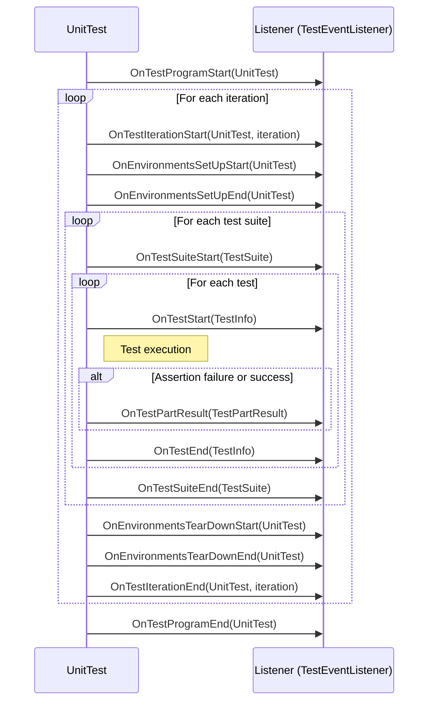

# Custom Event Listeners & Test Environment Hooks

Extend and customize your GoogleTest workflow by hooking into test lifecycle events at multiple levels—from the entire test program down to individual tests and suites. This page details how to write custom event listeners and manage global test environments, enabling enhanced test reporting, integration with CI systems, debugging aids, and resource management.

---

## Overview

GoogleTest provides a powerful event listener API that signals key points in the test execution lifecycle. You can implement your own event listeners by subclassing `testing::TestEventListener` or `testing::EmptyTestEventListener`. This allows you to customize behavior before or after tests or test suites run, react to assertion results, and integrate additional tooling such as custom reporting or resource tracking.

Additionally, GoogleTest supports global test environments via the `testing::Environment` class. Environment objects can perform global setup and teardown outside the scope of any particular test suite, useful for managing shared state or external resources.

Together, these hooks give you full control over the test lifecycle for enhanced flexibility and integration.

---

## Custom Event Listeners

### What Are Event Listeners?

Event listeners are user-defined hooks into the test framework's lifecycle events. The `TestEventListener` interface provides virtual callbacks corresponding to these events. Your listener receives these callbacks and can react accordingly.

Typical use cases include:

- Custom logging or output formatting
- Integrations with CI/CD or dashboard reporting
- Resource usage tracking
- Enforcing additional test policies
- Interactive debugging support

### Implementing an Event Listener

To create a listener, subclass `testing::TestEventListener` to override specific callbacks or inherit from `testing::EmptyTestEventListener` to implement only the methods you need.

#### Key Callbacks (in order they occur):

| Callback                           | Description                                                         |
| --------------------------------- | ------------------------------------------------------------------- |
| `OnTestProgramStart(const UnitTest&)` | Before any test activity begins                                     |
| `OnTestIterationStart(const UnitTest&, int)` | At start of each iteration if tests are repeated                    |
| `OnEnvironmentsSetUpStart(const UnitTest&)` | Before all global environments' SetUp() methods start               |
| `OnEnvironmentsSetUpEnd(const UnitTest&)` | After global environments' SetUp() methods finish                   |
| `OnTestSuiteStart(const TestSuite&)` | Before each test suite begins (Legacy `OnTestCaseStart` also exists) |
| `OnTestStart(const TestInfo&)`     | Before each individual test starts                                  |
| `OnTestPartResult(const TestPartResult&)` | After each assertion result (success/failure)                        |
| `OnTestEnd(const TestInfo&)`       | After each individual test ends                                     |
| `OnTestSuiteEnd(const TestSuite&)`   | After each test suite ends (Legacy `OnTestCaseEnd` also exists)       |
| `OnEnvironmentsTearDownStart(const UnitTest&)` | Before all global environments' TearDown() methods start            |
| `OnEnvironmentsTearDownEnd(const UnitTest&)` | After global environments' TearDown() methods finish                |
| `OnTestIterationEnd(const UnitTest&, int)` | After each iteration of repeated tests finishes                      |
| `OnTestProgramEnd(const UnitTest&)`   | After all test activity ends                                        |

### Practical Example: Minimal Custom Listener

```cpp
class MinimalistPrinter : public testing::EmptyTestEventListener {
 public:
  void OnTestStart(const testing::TestInfo& test_info) override {
    printf("*** Test %s.%s starting.\n", test_info.test_suite_name(), test_info.name());
  }
  void OnTestPartResult(const testing::TestPartResult& result) override {
    printf("%s in %s:%d\n%s\n",
           result.failed() ? "*** Failure" : "Success",
           result.file_name(), result.line_number(), result.summary());
  }
  void OnTestEnd(const testing::TestInfo& test_info) override {
    printf("*** Test %s.%s ending.\n", test_info.test_suite_name(), test_info.name());
  }
};

// In main():
int main(int argc, char** argv) {
  testing::InitGoogleTest(&argc, argv);

  testing::TestEventListeners& listeners = testing::UnitTest::GetInstance()->listeners();

  // Remove default console output if desired
  delete listeners.Release(listeners.default_result_printer());

  // Add your listener
  listeners.Append(new MinimalistPrinter);

  return RUN_ALL_TESTS();
}
```

### Listener Ordering and Behavior

- Multiple listeners can be appended to the listener list. Start events are sent in the order of registration, end events are dispatched in reverse order.
- The default console output and XML generator listeners are included by default. You can remove or replace them.
- If your listener processes `OnTestPartResult()`, it cannot generate new failures (to avoid recursive calls).

<Tip>
Be sure to append listeners after removing or releasing default listeners to avoid mixed outputs.
</Tip>

### Common Listener Usage Patterns

- **Custom output**: Replacing or augmenting console or XML test reporting.
- **Failure catching**: Throw an exception in `OnTestPartResult` to abort current test (see the `AssertionException` class).
- **Profiling and analytics**: Track timing, resource use, or advanced metrics.
- **Integration**: Tie test start/end events to CI status updates or database logs.

---

## Test Environment Hooks

### What Is a Test Environment?

A `testing::Environment` object represents setup and teardown logic that is global to your test program but outside individual test suites or tests.

Use cases include:

- Initializing shared databases
- Setting global configuration
- Starting external services

### Defining a Test Environment

To create a global test environment:

- Subclass `testing::Environment`.
- Override two methods:
  - `void SetUp()` — called before any tests run.
  - `void TearDown()` — called after all tests finish.

Example:

```cpp
class MyGlobalEnvironment : public testing::Environment {
 public:
  void SetUp() override {
    // Perform global initialization
  }
  void TearDown() override {
    // Perform global cleanup
  }
};

int main(int argc, char** argv) {
  testing::InitGoogleTest(&argc, argv);

  testing::AddGlobalTestEnvironment(new MyGlobalEnvironment);

  return RUN_ALL_TESTS();
}
```

### Environment Lifecycle

- Registered environments are set up in the order of registration before any tests run.
- Environments are torn down in reverse order after all tests finish.
- If tests are repeated (e.g., via `--gtest_repeat`), environment setup/teardown happens between iterations depending on the flag `gtest_recreate_environments_when_repeating`.

<Tip>
Always register global environments before `RUN_ALL_TESTS()`. Prefer registering in `main()` rather than global variables to avoid static initialization order issues.
</Tip>

---

## Using the GoogleTest Reflection API with Listeners and Environments

Listeners receive argument objects that expose detailed information about tests and suites:

- `testing::UnitTest` gives the high-level test program status, aggregate results, and configuration.
- `testing::TestSuite` exposes the suite name, type parameter (if any), and test counts.
- `testing::TestInfo` provides the suite name, test name, parameters, source location, and results.
- `testing::TestPartResult` reports each assertion outcome with source file, line, message, and failure type.

Listeners can query these to create highly customized reports or trigger complex behavior.

---

## Managing Listener Lifecycle and Ownership

- GoogleTest takes ownership of listeners added via `TestEventListeners::Append` and deletes them when the test program ends.
- To replace or remove existing listeners, use `Release()` to detach them and delete them yourself if needed.

---

## Best Practices and Troubleshooting

- Implement only the methods you need by inheriting from `EmptyTestEventListener` to reduce boilerplate.
- Use the `AssertionException` if you want to abort a test early inside `OnTestPartResult`.
- Keep your listeners lightweight to avoid slowing test runs.
- When disabling the default printer, remember to add at least one listener to get output.

<Tip>
The included samples, such as `googletest/samples/sample9_unittest.cc`, demonstrate practical listener usage cases.
</Tip>

---

## Summary of Key Classes and Interfaces

### `testing::TestEventListener`

Interface with callbacks for test lifecycle events:

- `OnTestProgramStart`
- `OnTestIterationStart`
- `OnEnvironmentsSetUpStart`
- `OnEnvironmentsSetUpEnd`
- `OnTestSuiteStart` (replaces deprecated `OnTestCaseStart`)
- `OnTestStart`
- `OnTestPartResult`
- `OnTestEnd`
- `OnTestSuiteEnd` (replaces deprecated `OnTestCaseEnd`)
- `OnEnvironmentsTearDownStart`
- `OnEnvironmentsTearDownEnd`
- `OnTestIterationEnd`
- `OnTestProgramEnd`

### `testing::EmptyTestEventListener`

Base class providing empty implementations to simplify listener creation.

### `testing::TestEventListeners`

Manages the collection of event listeners. Use to append or release listeners.

### `testing::Environment`

Base class for global test environments with overridable `SetUp()` and `TearDown()` for resource management.

---

## Additional Resources

- [GoogleTest Primer](../primer.md) — Understand basic test writing concepts.
- [Advanced Guide](../advanced.md#Extending GoogleTest by Handling Test Events) — Deeper exploration of listeners and environments.
- [Sample9_unittest.cc](https://github.com/google/googletest/blob/main/googletest/samples/sample9_unittest.cc) — Example of custom event listener.
- [Testing Reference](../reference/testing.md#TestEventListener) — API reference for event listener methods.

---

## Summary Diagram of Test Execution with Event Listeners



---

## Summary

Your journey to extending GoogleTest's capabilities through custom event listeners and global test environment hooks begins here. By leveraging the detailed callbacks provided, you can tailor test execution tracking, reporting, and integration to fit any project need.

Harness the full power of GoogleTest beyond simple assertions and tests by writing listeners that respond to test lifecycle events and defining global environments to manage complex initialization and cleanup scenarios.

---