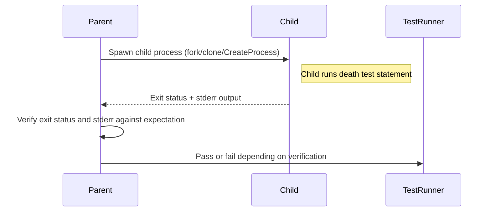

# Death Tests and Exception Handling

A comprehensive reference on configuring and asserting death tests—scenarios where code is expected to terminate abnormally—and exception checking capabilities. This page details the APIs and best practices for scripting and verifying process or thread death in a controlled, portable manner.

---

## Overview

Death tests are specialized tests that assert whether a piece of code terminates the process under specified conditions. They are essential when testing safeguards like assertions or fatal errors intended to crash or terminate an application.

GoogleTest supports death tests with macros and infrastructure that spawn child processes to execute specific test code, ensuring isolation and avoiding flakiness due to process termination.

Exception handling is integrated with death tests allowing for safe detection and reporting of escaped exceptions in the death test code.

This page explains how to write, configure, and control death tests, as well as how exceptions interact with them.

---

## What Are Death Tests?

Death tests verify that certain code snippets cause the program to die or exit abnormally. For example, if your code checks a precondition and terminates when the check fails, a death test can confirm this behavior.

They differ from ordinary tests where the process continues execution normally, as death tests allow you to assert that a crash or exit has happened as expected.

## Key Characteristics

- **Isolated Execution**: Death test code runs in a child process to isolate fatal termination from the parent process.
- **Flexible Styles**: GoogleTest offers "fast" and "threadsafe" death test styles to balance speed and thread safety.
- **Error Output Verification**: Matching of stderr output with user-specified regex or matchers to confirm the expected error message.
- **Exit Code Verification**: Verification of exit codes or signals that caused process termination.
- **Exception Detection**: Detects exceptions thrown from death test code and reports them as failures.

---

## Writing Death Tests

GoogleTest provides several macros to write death tests easily:

```cpp
ASSERT_DEATH(statement, matcher)
EXPECT_DEATH(statement, matcher)
ASSERT_EXIT(statement, predicate, matcher)
EXPECT_EXIT(statement, predicate, matcher)
EXPECT_DEBUG_DEATH(statement, matcher)
ASSERT_DEBUG_DEATH(statement, matcher)
ASSERT_DEATH_IF_SUPPORTED(statement, matcher)
EXPECT_DEATH_IF_SUPPORTED(statement, matcher)
```

### Examples

```cpp
TEST(MyDeathTest, AbortsOnInvalidInput) {
  ASSERT_DEATH(MyFunc(-1), "Invalid input detected");
}

TEST(MyDeathTest, ExitsWithZeroCode) {
  EXPECT_EXIT(ExitImmediately(), testing::ExitedWithCode(0), "Success");
}

bool KilledBySIGHUP(int exit_code) {
  return WIFSIGNALED(exit_code) && WTERMSIG(exit_code) == SIGHUP;
}

TEST(MyDeathTest, KillsWithSignal) {
  ASSERT_EXIT(KillMe(), KilledBySIGHUP, "Hang up");
}
```

The second parameter to `ASSERT_DEATH` and `EXPECT_DEATH` is a matcher or regular expression string that is matched against the stderr output of the death test child process.

The predicate in `ASSERT_EXIT` and `EXPECT_EXIT` allows precise checking of the exit status.

---

## Death Test Execution Styles

GoogleTest supports two major execution styles for death tests:

| Style     | Description                                                                                   | Use Case                          |
|-----------|-----------------------------------------------------------------------------------------------|-----------------------------------|
| Fast      | Child process runs death test code immediately after forking. Faster but less thread-safe.    | Single-threaded tests and speed. |
| Threadsafe| Child process re-executes the test binary from the beginning with flags to run only this test. | Safer in multithreaded environments. |

The default style is configurable via the flag `--gtest_death_test_style`, which can be set to either "fast" or "threadsafe".

```cpp
// Set death test style programmatically
GTEST_FLAG_SET(death_test_style, "threadsafe");
```

The "threadsafe" style is more robust when testing code bases that may have multiple threads active.

---

## Supported Platforms

- **POSIX Systems (Linux, Mac, QNX, etc.)** use `fork()`, `clone()`, or `spawn()` system calls for process creation and execution.
- **Windows** uses `CreateProcess()` to spawn a child process.
- **Fuchsia** uses specific platform APIs for process and thread management.

GoogleTest adapts its death test implementations internally based on the platform for correct behavior.

---

## Core API Components

### Macros

- **ASSERT_DEATH(statement, matcher)** - Fails fatally if the statement does not cause death or output mismatch.
- **EXPECT_DEATH(statement, matcher)** - Fails non-fatally.
- **ASSERT_EXIT(statement, predicate, matcher)** - Succeeds if the program exits with an exit status satisfying the predicate and stderr output matches.
- **EXPECT_EXIT(statement, predicate, matcher)** - As above, but non-fatal on failure.
- **EXPECT_DEBUG_DEATH / ASSERT_DEBUG_DEATH** - Works similarly but only in debug builds.

### Predicates

- `::testing::ExitedWithCode(int exit_code)` - Matches a process termination with a specific exit code.
- `::testing::KilledBySignal(int signal)` - Matches termination by a given signal (POSIX only).

---

## Exception Handling in Death Tests

Death tests not only expect the process to terminate but also detect if exceptions escape the death test code unexpectedly.

- If a C++ exception escapes the test statement, it is treated as a death test failure.
- On Windows, Structured Exception Handling (SEH) exceptions are similarly detected.
- GoogleTest optionally catches or propagates exceptions based on the `--gtest_catch_exceptions` flag.

### Example Exception Death Test

```cpp
class TestException : public std::exception {
 public:
  const char* what() const noexcept override { return "exceptional message"; }
};

TEST(CxxExceptionDeathTest, ExceptionIsFailure) {
  EXPECT_NONFATAL_FAILURE(
      EXPECT_DEATH(throw TestException(), ""),
      "threw an exception");
}
```

This ensures test failures are produced when exceptions escape death test code and prevents undefined behavior.

---

## Writing Robust Death Tests: Best Practices

- **Use Death-Test Safe Code**: Do not use code that may deadlock or improperly handle threading inside death tests.
- **Avoid Multiple Threads at Death Test Start**: Death tests fork() the process; multiple threads increase risk. GoogleTest warns you if multiple threads are active.
- **Test Output Carefully**: Ensure the expected stderr output regex/matcher matches precisely.
- **Avoid Side Effects Expectation**: Since death test code runs in a separate process, any side effects will not affect the parent process.
- **Stream Custom Failure Messages**: You can append `.<<` messages to death test macros for clearer output.
- **Use Proper Exit Code Predicates**: When testing exit code precisely, use `ASSERT_EXIT` or `EXPECT_EXIT` with predicates like `ExitedWithCode`.

---

## Internal Mechanisms (Overview)

GoogleTest internally manages death tests through a `DeathTest` interface and platform-specific implementations:

- The parent test process is the overseer.
- The child process executes the death test statement.
- Communication is performed via pipes or platform-specific handle inheritance to transmit test status.
- Results are verified by matching exit codes and stderr output.

---

## Troubleshooting

### Common Issues

- **Death Test Does Not Die**: The test statement completes without crashing. The test will fail.
- **Unexpected Exception**: If an exception escapes death test code unexpected by the user, a failure is reported.
- **Regex Matching Failures**: Stderr output does not match the expected pattern, causing failure.
- **Multiple Death Tests on Same Line**: This is disallowed and causes compilation errors.
- **Use of Non-Void Functions Returning (e.g., `return`) Within Death Test Statement**: Causes failure because returning is not expected.

### Tips

- Use SCOPED_TRACE to add context to failure messages inside death tests.
- For flaky death tests, try to isolate and switch to the "threadsafe" style.
- Make sure regex/matcher accounts for cross-platform stderr message variations.

---

## Code Examples

```cpp
// Basic death test asserting process dies and prints "invalid input".
TEST(BasicDeathTest, DiesOnInvalidInput) {
  ASSERT_DEATH(MyFunc(-1), "invalid input");
}

// Death test checking exit code is exactly 42
TEST(ExitCodeTest, Returns42) {
  EXPECT_EXIT(ExitNow(), testing::ExitedWithCode(42), "reason");
}

// Death test using a function to check that process was killed by SIGSEGV
bool KilledBySIGSEGV(int exit_code) {
  return WIFSIGNALED(exit_code) && WTERMSIG(exit_code) == SIGSEGV;
}

TEST(SignalDeathTest, KilledBySegmentationFault) {
  ASSERT_EXIT(CauseSegfault(), KilledBySIGSEGV, "segfault message");
}

// Death test verifying exception is reported as failure
#if GTEST_HAS_EXCEPTIONS
TEST(ExceptionDeathTest, CatchesThrownException) {
  EXPECT_NONFATAL_FAILURE(
      EXPECT_DEATH(throw std::runtime_error("fail"), ""),
      "threw an exception");
}
#endif
```

---

## Related Flags

| Flag                         | Description                                            | Default      |
|------------------------------|--------------------------------------------------------|--------------|
| `--gtest_death_test_style`    | Specifies death test style: `fast` or `threadsafe`     | `fast`       |
| `--gtest_death_test_use_fork` | Use `fork()` instead of `clone()` on Linux (for valgrind) | false        |
| `--gtest_catch_exceptions`    | Controls catching exceptions (C++ and SEH on Windows)   | enabled true |

---

## Further Reading

- [Assertions Reference](../reference/assertions.md#death)
- [Advanced GoogleTest Topics: Death Tests](../advanced.md#death-tests)
- [GoogleTest Primer](../primer.md)
- [Core Workflow Guide: Using Death Tests and Error Handling](../guides/core-workflows/death-tests-errors.md)
- [Mocking with Death Tests](../guides/core-workflows/mocking-scenarios.md)

---

## Summary

Death tests in GoogleTest validate that code segments terminate the process in a controlled way with expected diagnostics. They run test code in isolated child processes in either a fast or thread-safe manner, supporting stderr output matching and exit status verification. Exceptions thrown during death tests are detected and treated as failures. The provided macros `EXPECT_DEATH`, `ASSERT_DEATH`, `EXPECT_EXIT`, and `ASSERT_EXIT` allow expressive and granular death test assertions.

---

## Diagram: Death Test Workflow



---

## Tips and Warnings

<Tip>
Write death test statements such that they do not return or throw exceptions, as these are treated as test failures.
</Tip>

<Warning>
Avoid running death tests in environments with multiple active threads unless using "threadsafe" style due to risks with `fork()`.
</Warning>

<Note>
Use regular expressions supported by GoogleTest for matching stderr, adhering to "simplified" regex syntax on Windows.
</Note>

<Check>
Make sure to flush logs before the death test statement to avoid output loss.
</Check>

---

For advanced control, you can use predicates to match exit codes and custom matchers to verify output precisely.

---

## Conclusion

Death tests are powerful tools in GoogleTest enabling assertions about abnormal termination and ensuring your program fails safely. Understanding the usage patterns, controlling styles, and handling exceptions will empower you to write resilient, clear, and maintainable fail-fast testing scenarios.

---

<Source url="https://github.com/google/googletest" branch="main" paths={[{"path": "googletest/include/gtest/gtest-death-test.h", "range": "1-196"},{"path": "googletest/include/gtest/internal/gtest-death-test-internal.h", "range": "1-211"},{"path": "googletest/src/gtest-death-test.cc", "range": "1-460"}]} />
