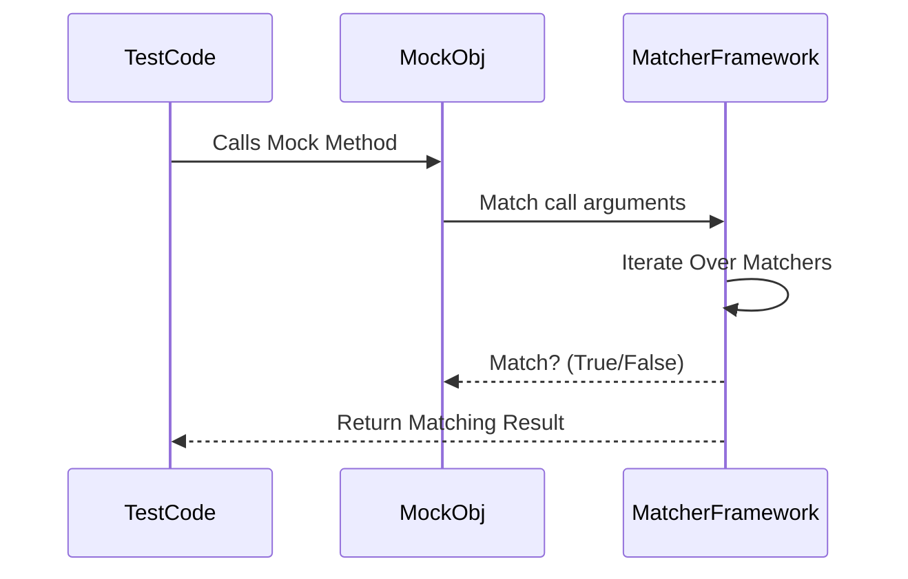

# Using Matchers

GoogleTest’s matcher framework stands at the heart of expressive and readable test assertions. It allows your test code to specify detailed expectations about values, function arguments, and return values while producing clear, informative messages upon failures. This page dives into the core built-in matchers, strategies to compose them, and their integration with assertions and mock expectations.

---

## What Is a Matcher?

A matcher is a predicate-like object that tests whether a value satisfies a condition. Matchers can check simple equality, ranges, patterns, or complex customized logic.

Matchers are used extensively with test assertions (e.g., `EXPECT_THAT`) and in mock definitions to precisely describe the expected inputs or outputs.

**Key points:**
- Matchers express *what* you expect rather than *how* to compute it.
- They support rich diagnostics, explaining why a match failed.
- Matchers can be built-in or custom-defined.

## Basic Usage

### Matching by Exact Value

You can match values or mock method arguments by exact equality:

```cpp
EXPECT_THAT(value, 5);                     // Integer equality matcher
EXPECT_THAT(str, ::testing::StrEq("hello"));  // String equality matcher
EXPECT_CALL(mock, Foo(42));                 // Method argument must be 42
```

Values convert implicitly to matchers using `Eq()`, so writing just `5` is often sufficient.

### Wildcard Matcher (`_`)

Use `_` to match *any* value when the particular value does not matter:

```cpp
EXPECT_CALL(mock, DoSomething(_));  // Any argument accepted
EXPECT_THAT(vec, ElementsAre(1, _, 3));  // Matches 3-element vector with 1 and 3 at ends
```

Wildcard is a polymorphic matcher matching any argument of any type.

## Common Built-in Matchers

GoogleTest provides an extensive library of built-in matchers. Here are the most commonly used:

### Comparison Matchers

Use these to describe numeric or comparable value constraints:

| Matcher        | Description                            |
|----------------|------------------------------------|
| `Eq(val)`      | Equal to `val`                      |
| `Ne(val)`      | Not equal to `val`                  |
| `Lt(val)`      | Less than `val`                    |
| `Le(val)`      | Less than or equal to `val`         |
| `Gt(val)`      | Greater than `val`                  |
| `Ge(val)`      | Greater than or equal to `val`      |

Example:

```cpp
EXPECT_CALL(mock, Compute(Ge(10))) // Accepts args >= 10
EXPECT_THAT(result, AllOf(Gt(0), Lt(100)));  // value in (0, 100)
```

### Logical Combinators

Build compound matchers using:

- `AllOf(m1, m2, ...)`: Matches if *all* matchers match
- `AnyOf(m1, m2, ...)`: Matches if *any* matcher matches
- `Not(m)`: Matches if `m` does not match

Example:

```cpp
EXPECT_THAT(val, AllOf(Gt(0), Lt(10)));   // Between 0 and 10
EXPECT_THAT(val, Not(Eq(5)));             // Anything except 5
EXPECT_THAT(val, AnyOf(Eq(1), Eq(2)));    // Either 1 or 2
```

### String Matchers

Matchers work with strings, including C strings and `std::string`.

| Matcher       | Description                             |
|---------------|---------------------------------------|
| `StrEq(str)`  | Equals `str` exactly                  |
| `StrNe(str)`  | Not equal to `str`                   |
| `StrCaseEq(str)` | Equals `str` ignoring case          |
| `StrCaseNe(str)` | Not equal ignoring case             |
| `Contains(substr)` | Contains substring                 |
| `StartsWith(prefix)` | Starts with prefix               |
| `EndsWith(suffix)` | Ends with suffix                   |

Example:

```cpp
EXPECT_THAT(name, StartsWith("John"));
EXPECT_THAT(text, Contains("error"));
EXPECT_CALL(mock, Print(StrCaseEq("hello")));
```

### Container Matchers

Matchers exist for containers such as vectors, lists, maps:

- `ElementsAre(...)`: Matches container elements in order with given matchers/values
- `UnorderedElementsAre(...)`: Matches container elements ignoring order
- `Contains(m)`: Matches container if any element matches `m`
- `SizeIs(m)`: Matches container size against matcher `m`
- `Pointwise(m, container)`: Matches elements pairwise with another container

Example:

```cpp
EXPECT_THAT(vector, ElementsAre(1, Gt(2), _));
EXPECT_THAT(set, UnorderedElementsAre(3, 5, 7));
EXPECT_THAT(map, Contains(Pair(42, "answer")));
EXPECT_THAT(vector, SizeIs(Ge(5)));
```

### Pointer Matchers

Common pointer-related matchers check pointer properties or the pointee:

- `IsNull()`: Matches null pointers
- `NotNull()`: Matches non-null pointers
- `Pointee(m)`: Matches pointer with the object pointed matching `m`
- `Ref(x)`: Matches references to variable `x`

Example:

```cpp
EXPECT_THAT(ptr, NotNull());
EXPECT_CALL(mock, Foo(Pointee(Eq(5))));
EXPECT_CALL(mock, Bar(Ref(my_var)));
```

## Using Matchers in Assertions

Matchers integrate tightly with the assertion macros:

- `EXPECT_THAT(value, matcher)`: Asserts the value matches the matcher
- `ASSERT_THAT(value, matcher)`: Same as above but aborts the test on failure

Matchers make assertions highly expressive and provide detailed failure diagnostics.

Example:

```cpp
std::vector<int> v = {1, 2, 3};
EXPECT_THAT(v, ElementsAre(1, 2, 3));
EXPECT_THAT("Hello world", HasSubstr("world"));
EXPECT_THAT(value, AllOf(Ge(10), Le(20)));
```

## Using Matchers with Mock Expectations

Matchers are extensively used when setting expectations on mock objects:

```cpp
EXPECT_CALL(mock_obj, Compute(Eq(42)))
    .WillOnce(Return(true));
EXPECT_CALL(mock_obj, Process(Ge(10), _))
    .Times(AtLeast(1));
```

They enable specifying what calls are expected and with what arguments.

## Combining Matchers

You can build complex constraints by combining matchers:

```cpp
EXPECT_CALL(mock, Foo(AllOf(Gt(0), Lt(100))));
EXPECT_THAT(value, AnyOf(StrEq("yes"), StrEq("no")));
```

The resulting matcher requires all or any of the component matchers to be satisfied.

## Custom Matchers

GoogleTest allows you to create your own matchers for specialized conditions. This is done using:

- The `MATCHER` family of macros
- The matcher interface classes

Example custom matcher using `MATCHER` macro:

```cpp
MATCHER(IsEven, "") {
  return (arg % 2) == 0;
}
...
EXPECT_THAT(num, IsEven());
```

You can parameterize matchers and provide detailed failure explanations.

## Tips and Best Practices

- Use simple matchers where possible, e.g., `Eq(value)` can often be replaced with just the value.
- Use `_` for arguments you don't care about, avoiding overly strict tests.
- Compose matchers with `AllOf`, `AnyOf`, and `Not` to clearly express complex constraints.
- Write custom matchers to encapsulate reusable logic with good failure messages.
- Match containers with `ElementsAre` or `UnorderedElementsAre` to check contents precisely.
- Use `EXPECT_THAT` to leverage powerful matchers in your tests.

## Troubleshooting Common Matcher Issues

- **Overloaded Functions**: Use explicit type specification or `Const()` helper for overloaded methods.
- **Type Mismatches**: Use `SafeMatcherCast<T>(m)` to cast matchers to expected argument types.
- **Unmatched Arguments**: Check your matcher expressions carefully; verbose gMock warnings can help.
- **Order Sensitivity**: When using sequences in mocks, order matters; out-of-order calls cause failures.

## Example: Using Matchers in a Test

```cpp
#include <gtest/gtest.h>
#include <gmock/gmock.h>
using ::testing::Eq;
using ::testing::Ge;
using ::testing::ElementsAre;

class MockCalculator {
 public:
  MOCK_METHOD(int, Add, (int a, int b), ());
};

TEST(CalculatorTest, AddsCorrectly) {
  MockCalculator mock_calc;

  // Expect Add called with any two arguments, return 42
  ON_CALL(mock_calc, Add(_, _)).WillByDefault(::testing::Return(42));

  // But expect Add called with 1 and 2 exactly once, to return 3
  EXPECT_CALL(mock_calc, Add(1, 2)).WillOnce(::testing::Return(3));

  EXPECT_EQ(mock_calc.Add(1, 2), 3);   // Matches specific expectation
  EXPECT_EQ(mock_calc.Add(5, 6), 42);  // Uses ON_CALL default
}
```

## Diagram: Matcher Flow in Expectation Matching



## Useful Matcher Functions Summary

| Function / Macro   | Use Case                               |
|--------------------|---------------------------------------|
| `EXPECT_THAT(val, matcher)` | General assertion with a matcher|
| `_` (underscore)             | Wildcard matcher                   |
| `Eq(v)`, `Ne(v)`, `Gt(v)`   | Comparison matchers                |
| `StrEq(s)`, `Contains(s)`   | String matchers                   |
| `ElementsAre(...)`           | Container element match           |
| `Not(m)`                    | Negating matcher                   |
| `AllOf(m1, m2, ...)`         | Combine matchers with AND          |
| `AnyOf(m1, m2, ...)`         | Combine matchers with OR           |
| `MATCHER(name, desc)`         | Define a new matcher macro         |

## Frequently Referenced Documentation

- [Matchers Reference](reference/matchers.md) – full list of built-in matchers and details.
- [Mocking Reference](docs/reference/mocking.md) – how matchers apply to mocks.
- [gMock Cookbook - New Matchers](docs/gmock_cook_book.md#NewMatchers) – detailed recipes.
- [Assertions Reference](docs/reference/assertions.md) – use of matchers with assertions.

## Next Steps

- Explore writing custom matchers for domain-specific validation.
- Combine matchers for complex test conditions.
- Use matchers in mock expectations through `EXPECT_CALL` for precise testing.
- Read up on `ON_CALL` to define default mock behaviors using matchers.

---

For a gentle introduction, see [gMock for Dummies](gmock_for_dummies.md) and the [Mocking Reference](docs/reference/mocking.md).