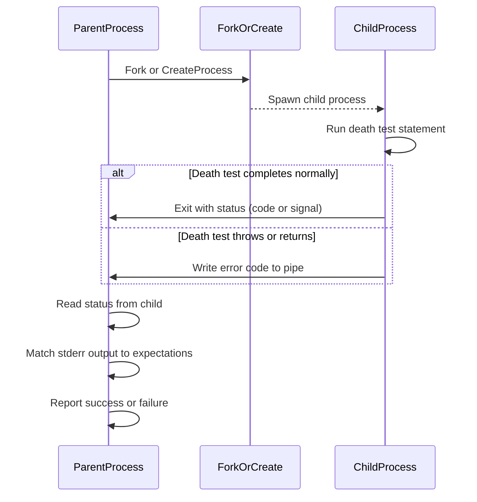

# Death Test and Error Handling APIs

GoogleTest provides robust support for death tests, enabling you to verify that your code terminates as expected under error conditions, crashes, or explicit aborts. These APIs, alongside error handling utilities, empower you to write assertions that confirm your program fails safely and predictably, capturing relevant diagnostics and guarding against unintended continuation.

---

## Overview

Death tests are critical for testing code paths that are supposed to fail fatally — whether by aborting, dying due to fatal signals, or exiting with error codes. GoogleTest's death test framework runs the tested statement in a separate subprocess to isolate crashes and failures, enabling your test binary to detect and assert on the process termination behavior and output.

The Death Test API encapsulates this behavior and handles cross-platform complexities, leveraging either `fork`-based, `clone`-based, or `CreateProcess`-based subprocess management depending on the operating system and selected death test style.

### Key Features

- Supports both **fast** and **threadsafe** death test styles:
  - `fast`: child process runs the death test immediately after forking.
  - `threadsafe`: child re-executes the test binary for safer isolation.
- Integrates with GoogleTest's assertion framework through macros like `EXPECT_DEATH`, `ASSERT_DEATH`, `EXPECT_EXIT`, and `ASSERT_EXIT`.
- Provides detailed diagnostics if the death test fails due to unexpected survival, exceptions, or output mismatch.
- Supports predicates for exit status verification, including predicates to test for specific exit codes or termination signals.

---

## Death Test API Usage

GoogleTest exposes a set of user-facing macros and predicates for death tests. This section explains how to write death tests using these APIs, what to expect from them, and best practices to achieve reliable coverage and informative failure reporting.

### Core Macros

| Macro                          | Description                                           |
|-------------------------------|-------------------------------------------------------|
| `ASSERT_DEATH(statement, regex_or_matcher)` | Succeeds if `statement` causes the process to die and stderr output matches the matcher/regex. Aborts current function on failure. |
| `EXPECT_DEATH(statement, regex_or_matcher)` | Similar to ASSERT_DEATH but does not abort current function on failure. |
| `ASSERT_EXIT(statement, predicate, regex_or_matcher)` | Succeeds if `statement` exits with status verifying `predicate` and stderr matches. Aborts current function on failure. |
| `EXPECT_EXIT(statement, predicate, regex_or_matcher)` | Similar to ASSERT_EXIT but non-fatal on failure.
| `EXPECT_DEATH_IF_SUPPORTED(statement, regex_or_matcher)` | Runs `EXPECT_DEATH` if death tests are supported on the platform; otherwise, does nothing but warns.

#### Example Usage

```cpp
// Expects the process to die with an error message matching "Invalid input"
EXPECT_DEATH({ ValidateInput(-1); }, "Invalid input");

// Expects the process to exit with code 0 and produce "Success" on stderr
EXPECT_EXIT({ RunProcess(); }, ::testing::ExitedWithCode(0), "Success");

// Testing signal-based termination
EXPECT_EXIT({ raise(SIGKILL); }, ::testing::KilledBySignal(SIGKILL), "");
```

### Exit Status Predicates

GoogleTest supplies useful predicates to check exit statuses safely:

- `::testing::ExitedWithCode(int exit_code)`: Returns true if the process exited normally with the specified code.
- `::testing::KilledBySignal(int signal_number)`: Returns true if the process was killed by the given signal (POSIX only).

These predicates allow precise control over which exit scenarios result in test success.

### Writing Death Tests in Practice

Death tests run the test statement in a separate process; side effects produced in the child process do not propagate to the parent. This isolation ensures safety but requires careful test design:

- Avoid relying on state changes outside the death test statement.
- Avoid freeing heap memory inside death test statements to prevent heap corruption detection from failing.
- Multiple death tests should be named sensibly, ideally with test suite names ending in `DeathTest` for prioritized execution.

### Supported Syntax for Matchers

Death test output matchers support either GoogleTest matchers (e.g., `ContainsRegex`) or raw regex strings:

- Raw string literals are interpreted as simplified regular expressions with a subset of POSIX and PCRE features.
- Unsupported patterns (e.g., capturing groups, unions) will cause runtime failures.

---

## DeathTest Class and Internal API

Behind the scenes, the abstract `DeathTest` class and its concrete subclasses encapsulate the mechanics of managing the death test child process.

### Running Death Tests

1. The `DeathTest::Create()` factory creates a concrete death test object depending on:
   - The platform (Windows, POSIX-family, Fuchsia).
   - The death test style (`fast` or `threadsafe`).

2. `AssumeRole()` of the death test object determines if the current process is a parent overseeing the child or the child executing the test.

3. The child process executes the death test statement.

4. The parent process waits on the child process to exit and collects its status.

5. The parent verifies that:
   - The child died (or exited appropriately).
   - The exit code or signal matches expectations.
   - The child's stderr output matches the user-provided matcher.

6. If the above fails, failure messages indicate the reason.

### DeathTestOutcome

Death tests can end in the following states:

- **DIED**: Process died as expected.
- **LIVED**: Process lived beyond the death test statement — failure.
- **RETURNED**: Process executed a `return` statement inside the death test statement — failure.
- **THREW**: Process threw an exception escaping the death test — failure.

### DeathTestAbort

If any unexpected behavior occurs in the child, a special abort function communicates the failure back to the parent, ensuring that error messages are preserved and displayed.

---

## Platform-Specific Details

GoogleTest handles the intrinsic platform heterogeneity in death test implementations:

- **POSIX Platforms (Linux, Mac, QNX):**
  - Use `fork` or `clone` to create child processes.
  - In `threadsafe` mode, children `exec` the test binary with arguments to run only one death test.
  - Pipes carry status and output information.

- **Windows:**
  - Use `CreateProcess` to spawn child processes.
  - Child processes re-execute the test binary with flags to run one death test.
  - Anonymous pipes and Windows events synchronize status transmission.

- **Fuchsia:**
  - Use `fdio_spawn` with special handling of debug sockets.
  - Use channels and sockets for communication.

GoogleTest offers the `death_test_use_fork` flag on POSIX systems to force using `fork` instead of `clone`, which helps under tools like Valgrind.

---

## Error Reporting and Failure Handling

If a death test fails, GoogleTest generates detailed diagnostic messages to explain why the test failed, including:

- Whether the process lived unexpectedly.
- If it returned instead of dying.
- If the process died but the stderr output did not match the expected pattern.
- If the exit code or signal did not match the expectation.

The output includes indented child stderr logs to aid in debugging.

### Exception Handling in Death Tests

- If C++ exceptions escape the death test statement, the test reports failure and prints the exception's message if available.
- Exception throwing is considered a failed death test.

### Threading and Safety

Death tests should ideally run with only one thread. If multiple threads are detected at test start, GoogleTest emits warnings about the risks.

---

## Best Practices and Common Pitfalls

- Use test suites named with the `DeathTest` suffix for death tests to ensure early execution and to minimize threading issues.
- Avoid multiple death test assertions on the same line - it causes compilation errors.
- Avoid side effects in death tests that require observation outside the death test statement.
- Free heap memory with caution to avoid interfering with parent process heap checks.
- Handle exceptions within the death test to ensure the test fails correctly.

---

## Advanced Configurations

- Set the `--gtest_death_test_style` flag to choose between `fast` or `threadsafe` death test modes.
- Use `--gtest_death_test_use_fork` flag on POSIX to prefer `fork` over `clone`.
- Customize exit predicate logic by passing functor or lambda to `EXPECT_EXIT`.
- Use `GTEST_SKIP()` to skip tests dynamically even in death tests.

---

## Example

```cpp
// Expects MyFunction to terminate the process with an error message containing "Fatal error"
TEST(MyDeathTestSuite, MyFunctionDiesAsExpected) {
  ASSERT_DEATH(MyFunction(), "Fatal error");
}

// Expects a process exit with code 2 and specific stderr output
TEST(ExitCodeExitTest, ExitsWithCode2) {
  EXPECT_EXIT(SomeProcess(), ::testing::ExitedWithCode(2), "Error code 2");
}

// Checks that the process dies from signal SIGSEGV
TEST(SignalDeathTest, DiesFromSegmentationFault) {
  EXPECT_EXIT([]() { raise(SIGSEGV); }, testing::KilledBySignal(SIGSEGV), "");
}
```

---

## Troubleshooting

| Symptom                              | Cause & Solution                                                                                                              |
|------------------------------------|-------------------------------------------------------------------------------------------------------------------------------|
| Death test does not detect death    | Verify that the statement actually terminates the process. Avoid silent returns or exceptions escaping the death test code.     |
| Test fails with unexpected output  | Check that the matcher expression matches the stderr output exactly. Adjust or relax regex as needed.                          |
| Tests hang or deadlock occurs       | Ensure single-threaded environment or use `threadsafe` death test style. Avoid background threads before death tests run.      |
| Compilation errors on multiple death tests on the same line | Place each death test macro on its own line.                                                    |
| Failures related to heap corruption| Avoid freeing memory inside death tests or disable heap checker for these tests.                                                |

---

## Related APIs and Documentation

- **Assertions Reference**: Covers `EXPECT_DEATH`, `ASSERT_DEATH`, `EXPECT_EXIT`, and `ASSERT_EXIT` signatures and usage.
- **Advanced Topics**: Contains explanations on death tests and threading implications.
- **Testing Reference**: Provides details on predicates and matchers.
- **Core Testing APIs**: Test registration and suite structure related to organizing death tests.

---

## Diagram: Death Test Execution Flow



---

For the detailed implementation, platform-specific adaptations, and internal utilities, please refer to the GoogleTest source code files:

- [gtest-death-test.h](https://github.com/google/googletest/blob/main/googletest/include/gtest/gtest-death-test.h)
- [gtest-death-test.cc](https://github.com/google/googletest/blob/main/googletest/src/gtest-death-test.cc)
- [gtest-death-test-internal.h](https://github.com/google/googletest/blob/main/googletest/include/gtest/internal/gtest-death-test-internal.h)

---