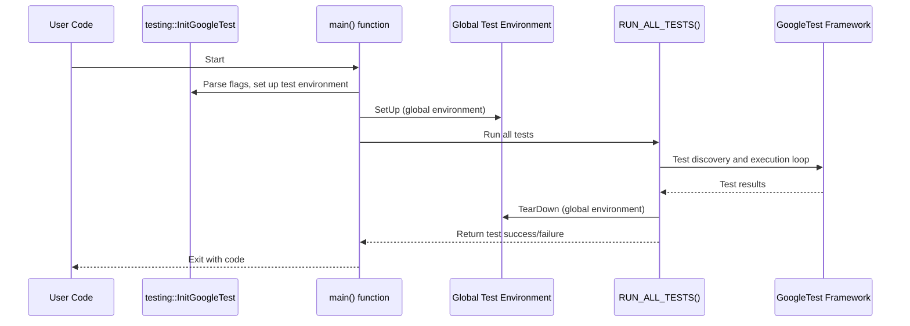

# Framework Initialization and Main Entry Points

This page guides you through the process of setting up and initializing test environments in GoogleTest, focusing on the entry points provided and how to customize them, especially for embedded or specialized platforms. It explains the roles of main functions, environment setup, and includes examples of writing custom entry points where appropriate.

---

## Initialization Essentials

Before any tests can run, GoogleTest requires initialization to parse and handle its command-line flags and internal setup. This is done by calling `testing::InitGoogleTest()` typically in your test program's main function.

### `InitGoogleTest` Usage

GoogleTest offers overloaded `InitGoogleTest` functions:

- **Standard platforms (Linux, Windows, Mac):**

  ```cpp
  int main(int argc, char** argv) {
    testing::InitGoogleTest(&argc, argv);
    return RUN_ALL_TESTS();
  }
  ```

- **Windows UNICODE mode:**

  ```cpp
  int main(int argc, wchar_t** argv) {
    testing::InitGoogleTest(&argc, argv);
    return RUN_ALL_TESTS();
  }
  ```

- **Embedded / Arduino-like platforms (no argc/argv):**

  ```cpp
  void setup() { 
    testing::InitGoogleTest();
  }

  void loop() {
    RUN_ALL_TESTS();
  }
  ```

#### Key Notes

- `InitGoogleTest()` parses and consumes GoogleTest-specific command line flags.
- It **must** be called before `RUN_ALL_TESTS()` is invoked.
- Calling it multiple times has no user-visible effect.
- On embedded platforms where `argc` and `argv` aren’t available, the no-argument overload is provided.

<Tip>
If you are using an embedded system such as ESP8266, ESP32, or NRF52 with Arduino, your test entry points will be the `setup()` and `loop()` functions instead of a `main()`, as these platforms don’t use traditional `argc`/`argv` program arguments.
</Tip>

---

## Main Entry Points in GoogleTest

GoogleTest provides default main functions that simplify getting started quickly. There are two common main entry points available as compiled library components:

- **`gtest_main`**: A minimal main function that simply initializes GoogleTest and runs all tests.
- **`gmock_main`**: Similar to `gtest_main` but also initializes GoogleMock, which depends on GoogleTest.

### When to Use Provided `main()` Functions

Most users do **not** need to write their own `main()`. Just linking against `gtest_main` or `gmock_main` provides a suitable main.

This reduces boilerplate and enforces best practices.

### Custom `main()` Function

If you need to customize pre-test setup or other initialization logic (e.g., custom logging, test registration), write your `main()` yourself:

```cpp
#include <iostream>
#include <gtest/gtest.h>

int main(int argc, char** argv) {
  std::cout << "Running custom main()" << std::endl;
  testing::InitGoogleTest(&argc, argv);
  return RUN_ALL_TESTS();
}
```

<Tip>
Be sure to call `InitGoogleTest()` **before** `RUN_ALL_TESTS()`. The exit code of `main()` should always be the return value of `RUN_ALL_TESTS()` to correctly reflect test success or failure.
</Tip>

---

## Handling specialized or embedded platforms

For platforms such as Arduino, ESP8266, ESP32, or NRF52 where traditional program entry points are not available, GoogleTest provides adapted entry point functions that integrate with platform-specific boot processes.

### Example for Arduino-like platforms

```cpp
void setup() {
  testing::InitGoogleTest();
}

void loop() {
  RUN_ALL_TESTS();
}
```

This adapts GoogleTest to the Arduino event loop model by running tests each loop iteration.

### GoogleMock Integration

GoogleMock includes a similar adapted entry point file `gmock_main.cc` which calls `testing::InitGoogleMock()` (that initializes both GoogleMock and GoogleTest). It provides equivalent platform-specific entry points, so tests use the same pattern.

---

## Global Test Environments Setup

When needing global setup or teardown across multiple test suites, GoogleTest offers the `testing::Environment` class.

### Using `testing::Environment`

Derive from `testing::Environment` and override `SetUp()` and `TearDown()`:

```cpp
class MyGlobalEnv : public testing::Environment {
 public:
   void SetUp() override {
       // Global initialization code
   }

   void TearDown() override {
       // Global cleanup code
   }
};
```

Register it before tests run:

```cpp
int main(int argc, char** argv) {
  testing::InitGoogleTest(&argc, argv);
  testing::AddGlobalTestEnvironment(new MyGlobalEnv());
  return RUN_ALL_TESTS();
}
```

<Tip>
Global environments run `SetUp()` once before any test case runs, and `TearDown()` once after all tests finish. This is ideal for expensive or shared resource management.
</Tip>

### Behavior on SetUp Failures

- Non-fatal failures in environment setup/run do not abort all tests immediately.
- Fatal failures abort subsequent tests as early as possible.
- TearDown always runs even if SetUp failed.

---

## User Flow: Setting up your GoogleTest executable

### Step 1: Define your tests using `TEST()`, `TEST_F()`, or other macros

Example:

```cpp
TEST(MyTestSuite, SimpleTest) {
  EXPECT_EQ(1, 1);
}
```

### Step 2: Write `main()` or link with `gtest_main`

If you want control:

```cpp
int main(int argc, char** argv) {
  testing::InitGoogleTest(&argc, argv);
  return RUN_ALL_TESTS();
}
```

Or link with `gtest_main` to skip this step.

### Step 3: Optionally define global test environments

```cpp
class MyEnv : public testing::Environment {
  void SetUp() override { /* setup */ }
  void TearDown() override { /* teardown */ }
};
```

Register before `RUN_ALL_TESTS()`:

```cpp
testing::AddGlobalTestEnvironment(new MyEnv());
```

### Step 4: Build and run your program

Run the executable. `RUN_ALL_TESTS()` will run all registered tests and produce results.

<Tip>
Check the return code of the executable for success (`0`) or failure (`1`). This is essential for automated CI integration.
</Tip>

---

## Troubleshooting & Best Practices

- **For embedded platforms:** use the no-argument `InitGoogleTest()` in your `setup()` function.
- **Multiple initializations:** Avoid calling `InitGoogleTest()` multiple times; it is designed to be safe but unnecessary invocations serve no purpose.
- **Custom main() logs:** Any pre-test logging or setup should precede `InitGoogleTest()`.
- **Fatal failures:** A fatal failure aborts current test function, but the entire test run continues.
- **Global env failures:** If your global environment's `SetUp()` fails fatally, tests will not run, but `TearDown()` executes.

<Warning>
Do not assume your tests run in parallel simply by writing a custom `main()`. GoogleTest serially runs tests unless advanced thread-safe death tests are configured.
</Warning>

---

## Summary Diagram: GoogleTest Initialization & Main Flow


---

## References
- [GoogleTest Primer](../primer.md) for foundational concepts.
- [Testing Reference](./testing.md) for API details.
- [Installation & Setup](../getting-started/setup-requirements-installation/prerequisites.md) for environment preparation.
- [First Test User Guide](../getting-started/first-test-usage/write-first-test.md) for quick starting.

---

For detailed build instructions and customization, see the [googletest README on GitHub](https://github.com/google/googletest).

---

## Additional Tips

- Prefer linking to `gtest_main` or `gmock_main` when you do not need custom init logic.
- Use `testing::AddGlobalTestEnvironment` to manage global shared states instead of singletons or global variables.
- For embedded platforms, follow the platform-specific entry points carefully to integrate with their native runtime.

---

This page ensures you can start your GoogleTest programs reliably and adapt to any platform requirements with confidence and clarity.

<Note>
This documentation focuses solely on initialization and main entry points. For writing tests, assertions, and fixtures, please consult other API guides.
</Note>
