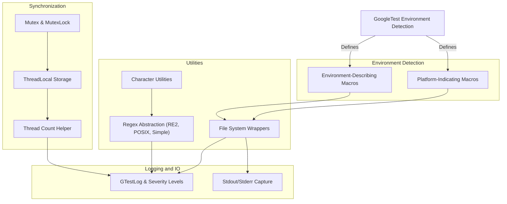

# Portability and Internal Utilities

This page documents the utility APIs, porting layers, and internal helper functions that GoogleTest provides. These components enable advanced customization, platform-specific enhancements, and low-level environment detection crucial for maintaining GoogleTest's cross-platform robustness and flexibility.

---

## Overview

GoogleTest is designed to work reliably across diverse compiler and operating system environments. The `Portability and Internal Utilities` page exposes essential low-level tools that facilitate this adaptability. These utilities encompass environment-describing macros, synchronization primitives, file system wrappers, regular expression abstractions, logging helpers, and thread-local storage mechanisms.

While most users will interact mainly with GoogleTest's higher-level testing APIs, these internal utilities empower advanced users to extend or tweak GoogleTest's behavior when integrating with specialized environments, embedding GoogleTest, or solving platform-specific challenges.

---

## Environment Detection and Platform Macros

GoogleTest automatically detects the compilation environment and the target platform, defining a set of macros accordingly. These macros enable environment-specific code paths within GoogleTest and can be leveraged to write portable tests.

- **Environment Describing Macros:** These flags indicate the availability or absence of features like exceptions (`GTEST_HAS_EXCEPTIONS`), RTTI (`GTEST_HAS_RTTI`), pthreads (`GTEST_HAS_PTHREAD`), POSIX regex (`GTEST_HAS_POSIX_RE`), file system support (`GTEST_HAS_FILE_SYSTEM`), and structured exception handling (`GTEST_HAS_SEH`).
- **Platform Macros:** Indicate the compilation target platform, such as `GTEST_OS_WINDOWS`, `GTEST_OS_LINUX`, `GTEST_OS_MAC`, and many BSD variants. These are automatically defined and never set to 0.

<Check>
GoogleTest macros are defined as either 1 or 0 after including core headers, guaranteeing deterministic preprocessor conditions for platform-specific customization.
</Check>

---

## Portability Utilities

### File System Wrappers

GoogleTest abstracts file system interactions to smooth over differences across platforms.

- Functions like `ChDir()`, `FOpen()`, `FReopen()`, `FDOpen()`, `FClose()`, `Read()`, `Write()`, and `Close()` provide cross-platform file system operations.
- File descriptor utilities such as `FileNo()` and terminal detection via `IsATTY()`.
- Directory manipulation wrappers like `RmDir()` and directory status checks (`IsDir()` on stat structures).

These abstractions ensure that GoogleTest tests and internals interact reliably with files regardless of the underlying platform.

### Character Utilities

Helper functions define portable ways to check and transform characters, mitigating differences in locale and compiler behavior:

- `IsAlpha()`, `IsDigit()`, `IsSpace()`, `IsUpper()`, `IsXDigit()`, `ToLower()`, `ToUpper()`

They safely cast input characters and support various character types including `char16_t`, `wchar_t`, and optionally `char8_t`.

### Regular Expressions

GoogleTest supports multiple regex implementations based on the build configuration and platform capabilities:

- **RE2 (via Abseil) if available:** High-performance regex engine.
- **POSIX Extended Regex on UNIX-like systems.**
- **Simple regex implementation as fallback.**

The internal `RE` class encapsulates the regex and exposes API like `FullMatch` and `PartialMatch` to test string matches. This flexibility guarantees test support for portable string pattern matching.

---

## Synchronization and Threading Primitives

To ensure thread-safety and correct concurrent behavior, GoogleTest defines synchronization types considering platform capabilities:

- **Mutex & MutexLock:** A mutex lock abstraction has platform-specific implementations — Windows critical sections, pthread mutexes, or no-ops where threading is not supported.
- **ThreadLocal Storage:** Provides per-thread data storage through the `ThreadLocal<T>` template class, implemented via native TLS on Windows, pthread keys on POSIX, or a fallback for non-threadsafe builds.

These synchronization utilities are internal yet critical for multithreaded test execution, especially on platforms supporting death tests and parallelism.

<Info>
You generally do not interact with these classes directly unless customizing GoogleTest internals or embedding it deeply.
</Info>

---

## Command Line and Environment Variable Utilities

GoogleTest provides helpers to parse and manage command-line arguments and environment variables relevant to the test framework:

- `GetArgvs()` returns all command-line arguments.
- Environment variable parsing facilities include `GetEnv()` (with embedded platform awareness), and helpers to read typed flags such as `BoolFromGTestEnv()` and `Int32FromGTestEnv()`.

These utilities underpin command-line flag processing and customized configuration.

---

## Logging and Stream Capture

GoogleTest internal logging is provided with configurable verbosity levels:

- `GTestLog` class supports streaming messages at severity levels: INFO, WARNING, ERROR, and FATAL.
- Macros like `GTEST_LOG_(severity)` encapsulate message formatting and output.
- For tests that verify output, stream capturing functions `CaptureStdout()`, `GetCapturedStdout()`, `CaptureStderr()`, and `GetCapturedStderr()` allow temporarily redirecting and inspecting stdout and stderr.

These facilities empower detailed diagnostics and validation of code generating output.

---

## Usage Example: Custom ThreadLocal

While GoogleTest abstracts thread-local storage internally, here is a conceptual example illustrating how one might instantiate and use `ThreadLocal<T>`:

```cpp
// Declare a thread-local integer with default value 100.
testing::internal::ThreadLocal<int> thread_local_int(100);

void ThreadFunc() {
  // Modify the value local to the current thread.
  thread_local_int.set(thread_local_int.get() + 1);
  int val = thread_local_int.get();
  std::cout << "Thread-local int is " << val << std::endl;
}
```

This usage shows how GoogleTest manages separate thread states internally to support thread-safe assertions and test execution.

---

## Practical Tips and Best Practices

- **Avoid Using Internal APIs Directly:** The internal utilities exposed here are intended primarily for GoogleTest developers or advanced use cases involving porting and embedding.
- **Respect ABI Stability:** Internal headers, especially those defining macros with trailing underscores or internal namespaces, are subject to change.
- **Customization via Custom Headers:** Override or extend environment-detecting macros by providing custom headers as noted in `custom/gtest-port.h` or `custom/gmock-port.h` for GoogleMock.
- **Thread Safety:** Ensure threading support if GoogleTest's multithreading features are to be used; disable threading via `-DGTEST_HAS_PTHREAD=0` if necessary.

<Warning>
Misusing platform-specific or internal helpers can lead to fragile or non-portable tests.
</Warning>

---

## Troubleshooting Common Issues

- **Compilation Failures Related to Features:** Verify that required compiler flags enable exceptions and RTTI if your tests depend on those features.
- **Threading Not Working as Expected:** Check platform macros and thread count helpers; some embedded or mobile OS targets do not support threads.
- **File System Operations Failing:** Ensure your environment provides file system support (`GTEST_HAS_FILE_SYSTEM`), especially in sandboxed or embedded platforms.

---

## Related Documentation

- [GoogleTest Primer](https://google.github.io/googletest/primer.html) — Fundamentals of writing and running tests.
- [Core Testing API: Test Macros and Fixtures](/api-reference/core-testing-api/test-macros-fixtures) — How to structure tests.
- [Integration & Ecosystem](/overview/architecture-features-integration/integration-with-other-systems) — How GoogleTest works with build systems and CI.
- [Mocking API: Creating and Using Mock Objects](/api-reference/mocking-api/creating-mock-objects) — For mocking support which depends on GoogleMock's portability utilities.
- [Advanced & Extensibility API: Custom Actions, Matchers, and Assertions](/api-reference/advanced-extensibility/custom-actions-matchers) — Extend GoogleMock with custom components.

---

_For more details and source code, see [the googletest repository on GitHub](https://github.com/google/googletest), especially the `include/gtest/internal/gtest-port.h` header._

---

<Accordion title="Technical Diagram: Overview of Core Internal Utilities">

</Accordion>
