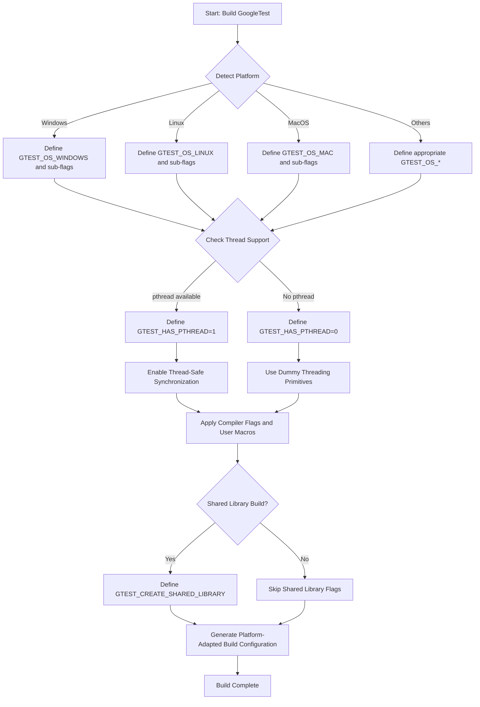

# Platform Support and Portability

GoogleTest is engineered to deliver consistent testing behavior across a broad spectrum of platforms and compilers. This page guides you through the API constructs, macros, configuration headers, and command-line flags that empower you to customize and ensure portability of GoogleTest in diverse environments.

---

## Understanding Platform Detection

GoogleTest uses a set of platform identification macros defined in the internal header `gtest-port-arch.h` to automatically detect the operating system and environment where tests are compiled and run. These macros enable GoogleTest to adapt its behavior based on the platform's capabilities and peculiarities.

### Key Platform Macros

Below are some of the primary `GTEST_OS_*` macros you may encounter:

| Macro                      | Description                         | Example Value |
|----------------------------|-----------------------------------|---------------|
| `GTEST_OS_CYGWIN`           | Cygwin environment                 | 1 if on Cygwin|
| `GTEST_OS_WINDOWS`          | Windows platform                  | 1 if on any Windows variant
| `GTEST_OS_WINDOWS_DESKTOP`  | Windows Desktop                   | 1 if standard Windows desktop
| `GTEST_OS_WINDOWS_MOBILE`   | Windows Mobile                    | 1 for Windows Mobile / Embedded
| `GTEST_OS_LINUX`            | Linux                            | 1 if compiling on Linux
| `GTEST_OS_LINUX_ANDROID`    | Android (Linux-based)             | 1 if Android
| `GTEST_OS_MAC`              | Mac OS X (macOS)                  | 1 if macOS
| `GTEST_OS_IOS`              | iOS devices                      | 1 if iOS
| `GTEST_OS_FREEBSD`          | FreeBSD OS                      | 1 if FreeBSD
| `GTEST_OS_SOLARIS`          | Solaris OS                      | 1 if Solaris

For a complete list of supported platforms, see the internal header `gtest-port-arch.h`.

#### How to Use Platform Macros

These macros are automatically defined by GoogleTest and meant to be used in your own tests or extensions to conditionally compile platform-specific code:

```cpp
#ifdef GTEST_OS_WINDOWS
  // Execute Windows-specific test setup or code
#endif

#if defined(GTEST_OS_LINUX) || defined(GTEST_OS_LINUX_ANDROID)
  // Linux/Android specific code
#endif
```


## Configuration Macros for Environment Features

GoogleTest provides additional macros to indicate specific environment features or compiler capabilities that influence how the framework behaves. These are usually defined inside the internal header `gtest-port.h`.

### Common Feature Macros

| Macro                        | Purpose                                               |
|------------------------------|-----------------------------------------------------|
| `GTEST_HAS_PTHREAD`           | Indicates availability of pthread threading support |
| `GTEST_IS_THREADSAFE`         | Flags that GoogleTest is compiled with thread safety|
| `GTEST_HAS_EXCEPTIONS`        | Whether exception handling is enabled                |
| `GTEST_HAS_RTTI`              | Runtime type information support                      |
| `GTEST_HAS_STD_WSTRING`       | Availability of `std::wstring`                        |
| `GTEST_HAS_FILE_SYSTEM`       | Indicates file system API availability                |
| `GTEST_HAS_STREAM_REDIRECTION`| Support for redirecting stdout/stderr streams         |
| `GTEST_HAS_DEATH_TEST`        | Enables support for death tests                        |

### Example: Forcing pthread Usage

If GoogleTest misdetects thread support, you can force it with compiler defines:

```bash
-DGTEST_HAS_PTHREAD=1
```

### Thread-Safety

GoogleTest is thread-safe on platforms where pthread or Windows threading models are available:

- On supported platforms, `GTEST_IS_THREADSAFE` is defined to 1.
- On unsupported ones, it's 0 and multi-threaded tests are not reliable.

Use this macro to ensure your tests are portable and behave as expected:

```cpp
#if GTEST_IS_THREADSAFE
  // Multi-threaded test support
#else
  // Skip or use single-threaded test approach
#endif
```

## Portability Macros for Fine-Tuning GoogleTest Behavior

GoogleTest allows you to customize its compilation and runtime behavior through preprocessor macros. You define these as compiler flags or in your build system. Some commonly used macros:

| Macro                          | Description                                                |
|--------------------------------|------------------------------------------------------------|
| `GTEST_CREATE_SHARED_LIBRARY`  | Compile GoogleTest as a shared library (DLL) if 1          |
| `GTEST_LINKED_AS_SHARED_LIBRARY`| Compile tests that link against gtest DLL if 1           |
| `GTEST_HAS_PTHREAD`            | Force-enable or disable pthread support                     |
| `GTEST_DONT_DEFINE_TEST`       | Rename the `TEST` macro to `GTEST_TEST` to avoid macro clashes |

### Avoiding Macro Name Clashes

In environments where GoogleTest macros conflict with other libraries, prevent name clashes by disabling the default macro names:

```bash
-DGTEST_DONT_DEFINE_TEST=1
```

Then, instead of `TEST(...)`, use the prefixed macro `GTEST_TEST(...)`.

### Shared Library Usage

If you want to compile GoogleTest as a shared library (e.g. Windows DLL), add the following compiler flags:

- When building GoogleTest itself:

  ```bash
  -DGTEST_CREATE_SHARED_LIBRARY=1
  ```

- When compiling tests that link to that DLL:

  ```bash
  -DGTEST_LINKED_AS_SHARED_LIBRARY=1
  ```

This ensures proper export and import of symbols.

## Command-Line Flags for Portable Test Execution and Environment Customization

GoogleTest recognizes a variety of command-line flags that impact how tests execute across platforms. Key flags that help with advanced portability or debugging include:

- `--gtest_death_test_style`
  - Controls behavior of death tests.
  - Defaults to "fast" for legacy, but "threadsafe" is recommended.

- `--gtest_filter`
  - Run only tests matching specified patterns.
  - Portable across all platforms.

- `--gtest_repeat`
  - Repeat tests multiple times to detect flaky behavior.

- `--gtest_catch_exceptions`
  - Enable or disable catching of exceptions during tests.

- `--gtest_stack_trace_depth`
  - Control amount of stack trace logged on failure for debugging.

You can pass these flags when invoking your test binaries:

```bash
./my_tests --gtest_filter=FooTest.* --gtest_repeat=10
```

This flexible flag system ensures that you can tune test binaries behavior regardless of the underlying platform.

## Configuration Headers and Customization Injection

### `gtest-port-arch.h`

This header is dedicated to platform detection macros (`GTEST_OS_*`). It is included early to establish the compilation environment.

- You can indirectly condition your tests based on these macros.
- It is separated from `gtest-port.h` to allow custom overrides while preserving core detection.

### `gtest-port.h`

Contains environment feature macros and core configuration for threading, exception, regular expressions, file system, and platform-specific utilities. It also offers synchronization primitives and utilities exposed internally and for users.

### `custom/gtest-port.h`

This path is a user customization injection point allowing overrides or extensions to the default configuration. Defining flags or macros here lets you tweak GoogleTest's behavior globally.

> **Note:** Modifying or injecting macros here requires understanding of the GoogleTest build process.

## Threading and Synchronization

GoogleTest ensures thread safety where supported (pthreads on UNIX-like OSes and Windows threads on Windows).

- The framework uses mutexes, thread-local storage, and notifications where available.
- Thread-local storage and mutex abstractions adapt transparently to the platform.

If pthreads are not detected, a dummy implementation that allows compilation but no real thread safety is used.

## Regular Expression Backends

GoogleTest supports multiple regex implementations to offer portability:

- RE2 with Abseil, if compiled with Abseil support.
- POSIX Extended Regular Expressions on UNIX-like platforms.
- A simple internal regex implementation as fallback.

You can check which is in use with macros like `GTEST_USES_RE2`, `GTEST_USES_POSIX_RE`, and `GTEST_USES_SIMPLE_RE`.

## Platform-Specific Implementation Considerations

GoogleTest handles subtle differences among platforms:

- Windows uses special APIs for file I/O and environment variables.
- Real-time features like death tests are only enabled on supported platforms.
- Stream redirection support is disabled on platforms lacking file system or console semantics.

These adaptations help ensure consistent behavior even if platform features differ.

## Tips and Best Practices for Portability

- Prefer using GoogleTest command-line flags to adjust behavior rather than patching tests with conditional platform code.
- When cross-compiling or customizing environments, explicitly set feature macros (`GTEST_HAS_PTHREAD`, etc.) if automatic detection is incorrect.
- Use `GTEST_DONT_DEFINE_*` macros to avoid macro collisions when integrating in complex codebases.
- Test multi-threaded code only on platforms where `GTEST_IS_THREADSAFE` is defined.
- When building on Windows with Visual Studio, consider the `gtest_force_shared_crt` CMake option for consistent runtime linkage.

## Example: Platform-Specific Test Adaptation

```cpp
#include <gtest/gtest.h>

TEST(PlatformSpecificTest, RunsOnlyOnLinux) {
#ifdef GTEST_OS_LINUX
  // Linux-specific test code
  EXPECT_TRUE(SomeLinuxFunction());
#else
  GTEST_SKIP() << "Test skipped: Not running on Linux";
#endif
}
```

## Troubleshooting Common Portability Issues

- **Unexpected build errors related to threads:** Ensure `-DGTEST_HAS_PTHREAD` is correctly set or unset to match your platform.
- **Symbol resolution issues with shared library builds:** Verify that you have `GTEST_CREATE_SHARED_LIBRARY` and `GTEST_LINKED_AS_SHARED_LIBRARY` flags properly set for compiling GoogleTest and test binaries respectively.
- **Macro clashes in large projects:** Use `GTEST_DONT_DEFINE_*` macros to rename conflicting GoogleTest macros.
- **Death tests failing or hanging:** Confirm that the platform supports death tests (`GTEST_HAS_DEATH_TEST` defined) and that a file system is present.

## Additional Resources & Related Documentation

- [Supported Platforms & Compatibility](/overview/integration-ecosystem/supported-platforms)
- [GoogleTest Build and Installation Guide](https://github.com/google/googletest/blob/main/README.md#generic-build-instructions)
- [Using GoogleTest with CMake](https://github.com/google/googletest/blob/main/README.md#build-with-cmake)
- [GoogleTest Primer](docs/primer.md) for getting started with test writing
- [GoogleTest Flags and Command-Line Options](advanced.md) for detailed runtime customization
- [Troubleshooting Common Issues](/guides/best-practices-and-troubleshooting/troubleshooting-common-issues)

## In-Depth Diagram: Platform and Build Configuration Flow



---

# Summary of Implementation

GoogleTest autonomously detects the platform and environment in which it is compiled through dedicated macros, ensuring its portability and consistent behavior across operating systems and compilers. It exposes macros you can use to fine-tune threading support, exception handling, and runtime features. The framework provides mechanisms for safely building shared or static libraries and offers several compiler flags and command-line options specially designed to customize behavior in cross-platform scenarios. This foundation protects your tests from platform quirks and facilitates maintainable, robust test suites regardless of the target environment.

---