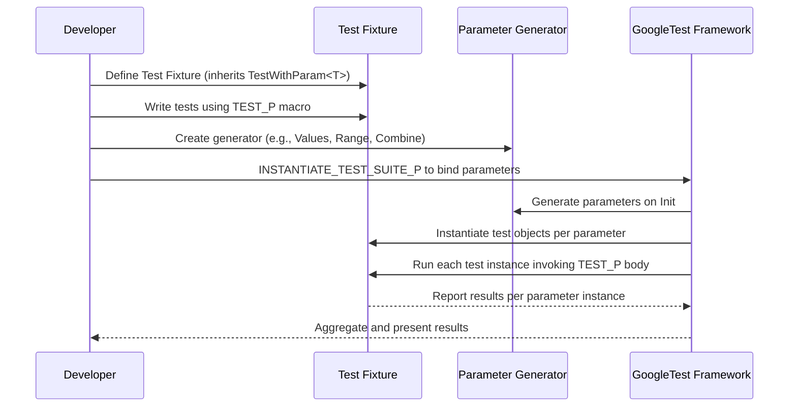

# Parameterized and Typed Tests

GoogleTest offers powerful APIs for writing *value-parameterized* and *type-parameterized* test suites. These APIs let you maximize code reuse by running the same test patterns with different data values or types, reducing duplication and improving test maintainability and coverage.

This documentation explains the following essential concepts and APIs:

- How to define *value-parameterized test fixtures* and write *value-parameterized tests* with `TEST_P`.
- How to use built-in *parameter generators* like `Range()`, `Values()`, and `Combine()` to produce test parameters.
- How to instantiate parameterized tests with `INSTANTIATE_TEST_SUITE_P` and customize test instance naming.
- How to create *typed tests* and *type-parameterized tests* to run the same test logic across multiple C++ types.

Through clear user flows, practical examples, and advanced tips, this page empowers you to write expressive, reusable test suites that scale elegantly as your test scenarios multiply.

---

## Value-Parameterized Tests Overview

Rather than duplicating test logic for each input, *value-parameterized tests* let you write one test pattern and run it with many parameter values.

### Defining a Parameterized Test Fixture

Create a test fixture class that derives from `testing::TestWithParam<T>`, where `T` is the type of the parameter you want to test with:

```cpp
class FooTest : public ::testing::TestWithParam<const char*> {
  // Optional: define SetUp, TearDown, or member variables.
};
```

### Writing Parameterized Test Patterns

Use the `TEST_P` macro with your fixture to define tests that run once per parameter value:

```cpp
TEST_P(FooTest, DoesBlah) {
  EXPECT_TRUE(foo.Blah(GetParam()));  // Access parameter via GetParam().
}

TEST_P(FooTest, HasBlahBlah) {
  // Additional parameterized tests.
}
```

### Supplying Parameter Values

Instantiate your test pattern by supplying parameters using `INSTANTIATE_TEST_SUITE_P`:

```cpp
INSTANTIATE_TEST_SUITE_P(
    InstantiationName,
    FooTest,
    testing::Values("meeny", "miny", "moe")
);
```

This creates multiple test instances, each with one parameter value. The test names incorporate the instantiation prefix and parameter index:

```
InstantiationName/FooTest.DoesBlah/0  // Param: "meeny"
InstantiationName/FooTest.DoesBlah/1  // Param: "miny"
InstantiationName/FooTest.DoesBlah/2  // Param: "moe"
```

### Parameter Generators

GoogleTest provides built-in functions to produce sequences of test parameters:

| Generator               | Description                                           |
|------------------------|-------------------------------------------------------|
| `Range(begin, end [, step])` | Sequence of values from `begin` up to, but excluding, `end` in increments of `step` (default 1). |
| `Values(v1, v2, ..., vN)`    | Sequence containing explicitly listed parameter values. |
| `ValuesIn(container)` or `ValuesIn(begin,end)` | Sequence of parameter values from a container or iterator range. |
| `Bool()`                     | Yields boolean values `false` and `true`.            |
| `Combine(g1, g2, ..., gN)`   | Produces the Cartesian product of sequences produced by generators `g1` through `gN`. Generates tuples. |

#### Example using multiple generators and combining:

```cpp
INSTANTIATE_TEST_SUITE_P(
  AnimalVariations, AnimalTest,
  testing::Combine(
      testing::Values("cat", "dog"),
      testing::Values(BLACK, WHITE)));
```

This creates test instances for each combination of animal and color.

### Advanced: Using `ConvertGenerator` for Custom Parameter Types

If your parameter type is not directly constructible from generator output, `ConvertGenerator` casts or converts generated values:

```cpp
INSTANTIATE_TEST_SUITE_P(
    MyInstantiation, MyTestSuite,
    testing::ConvertGenerator<std::tuple<int, bool>>(
        testing::Combine(testing::Values(1, 2), testing::Bool())));
```

You can also provide a callable to customize conversion logic.

### Tips & Best Practices for Value-Parameterized Tests

- Each instantiation must have a unique prefix in `INSTANTIATE_TEST_SUITE_P` to distinguish test cases.
- Test names generated with parameters will include an index number unless you provide a custom name generator function.
- Parameter generators are lazy-evaluated during test initialization, allowing dynamic parameter selection.
- If a `TEST_P` is defined but not instantiated, GoogleTest raises an error unless you use `GTEST_ALLOW_UNINSTANTIATED_PARAMETERIZED_TEST`.

---

## Typed Tests Overview

Typed tests run the **same test code** over a fixed set of types to verify behavior consistently across type variations.

### Defining a Typed Test Fixture

Write a class template deriving from `testing::Test`:

```cpp
template <typename T>
class FooTest : public testing::Test {
 public:
  // Members depending on T
};
```

Associate the list of types using `TYPED_TEST_SUITE` macro:

```cpp
using MyTypes = ::testing::Types<char, int, unsigned int>;
TYPED_TEST_SUITE(FooTest, MyTypes);
```

### Writing Typed Tests

Define typed test functions with `TYPED_TEST`, referring to the current type as `TypeParam`:

```cpp
TYPED_TEST(FooTest, DoesBlah) {
  TypeParam value = this->value_;
  // Test logic using value
}

TYPED_TEST(FooTest, HasPropertyA) {
  // More tests
}
```

The tests are compiled and run once per type specified.

### Custom Test Name Generation

You may customize the generated test names with a class exposing a static template method `GetName(int)` that returns the type name string.

---

## Type-Parameterized Tests Overview

Like typed tests but more flexible: define the test pattern first without knowing types — instantiate the pattern later with different type lists.

### Defining a Type-Parameterized Test Suite

Create a class template derived from `testing::Test`:

```cpp
template <typename T>
class FooTest : public testing::Test {
  // Test utilities
};
```

Declare the test suite:

```cpp
TYPED_TEST_SUITE_P(FooTest);
```

Define tests with `TYPED_TEST_P`:

```cpp
TYPED_TEST_P(FooTest, DoesBlah) {
  TypeParam n = 0;
  // Test code
}

TYPED_TEST_P(FooTest, HasPropertyA) { ... }
```

Register test names:

```cpp
REGISTER_TYPED_TEST_SUITE_P(FooTest, DoesBlah, HasPropertyA);
```

### Instantiating

Use `INSTANTIATE_TYPED_TEST_SUITE_P` with a list of types:

```cpp
using MyTypes = ::testing::Types<char, int, unsigned int>;
INSTANTIATE_TYPED_TEST_SUITE_P(My, FooTest, MyTypes);
```

This can be done in multiple translation units and repeatedly if desired.

---

## Summary and Troubleshooting

### Common User Flows

- Define one parameterized test fixture per parameter set.
- Write one or more test patterns (`TEST_P`) inside the fixture.
- Use parameter generators (`Values`, `Range`, `Combine`, etc.) to prepare values.
- Instantiate the tests with `INSTANTIATE_TEST_SUITE_P` to run them.
- For typed tests, define a class template and register types with `TYPED_TEST_SUITE`.
- For type-parameterized tests, define a pattern (`TYPED_TEST_SUITE_P`), register tests, then instantiate with type lists.

### Common Pitfalls

- Forgetting to instantiate parameterized tests causes no tests run or failure.
- Using underscores `_` in test or suite names breaks naming conventions.
- Parameter names generated by the default printer can be uninformative for complex types — customize with a name generator function.
- When using raw pointers as parameters, manage their lifetimes responsibly.

### Helpful Macros

- `GTEST_ALLOW_UNINSTANTIATED_PARAMETERIZED_TEST(FooTest);` to allow test suites without instantiations.

---

## Example: Value-Parameterized Test

```cpp
#include <gtest/gtest.h>

class FooTest : public testing::TestWithParam<int> {};

TEST_P(FooTest, IsEven) {
  int n = GetParam();
  EXPECT_EQ(n % 2, 0);
}

INSTANTIATE_TEST_SUITE_P(EvenNumbers, FooTest, testing::Values(2, 4, 6, 8));
```

## Example: Typed Test

```cpp
#include <gtest/gtest.h>

template <typename T>
class MathTest : public testing::Test {
 protected:
  T value_ = 10;
};

using NumericTypes = ::testing::Types<int, float, double>;
TYPED_TEST_SUITE(MathTest, NumericTypes);

TYPED_TEST(MathTest, MultipliesByTwo) {
  TypeParam val = this->value_;
  EXPECT_EQ(val * 2, val + val);
}
```

## Example: Type-Parameterized Test

```cpp
#include <gtest/gtest.h>

template <typename T>
class ContainerTest : public testing::Test {};

TYPED_TEST_SUITE_P(ContainerTest);

TYPED_TEST_P(ContainerTest, IsEmptyInitially) {
  TypeParam container;
  EXPECT_TRUE(container.empty());
}

REGISTER_TYPED_TEST_SUITE_P(ContainerTest, IsEmptyInitially);

using ContainerTypes = ::testing::Types<std::vector<int>, std::list<int>>;
INSTANTIATE_TYPED_TEST_SUITE_P(MyContainers, ContainerTest, ContainerTypes);
```

---

## References

- [Value-Parameterized Tests Guide](../advanced.md#value-parameterized-tests)
- [Typed Tests Guide](../advanced.md#typed-tests)
- [Type-Parameterized Tests Guide](../advanced.md#type-parameterized-tests)
- [Testing Reference: Parameterized Macros](reference/testing.md#TEST_P)
- [GoogleTest Primer](primer.md)
- [FAQ on Parameterized and Typed Tests](faq.md)
- Sample Tests demonstrating Parameterized Tests in the GoogleTest repo

---

## Visualizing the Workflow


