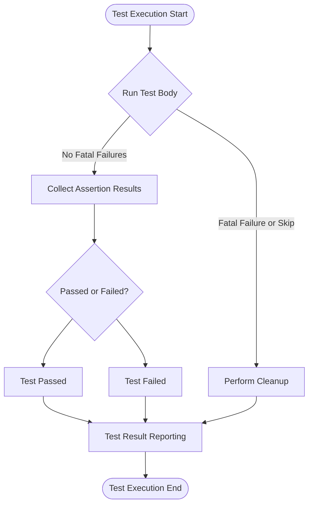

# Error Handling and Status Codes

How assertion results, test failures, and diagnostic messages are reported and handled in GoogleTest. Learn how to interpret and act on test execution status for robust error tracking and debugging.

---

## Overview of Test Result Reporting

When you run tests using GoogleTest, each test produces a detailed report indicating whether it passed, failed, or was skipped. The framework collects results from assertion macros and test execution flows to generate actionable diagnostics.

This page explains:
- How assertion results and failures are recorded
- How test execution status propagates
- How diagnostic messages inform debugging
- Common error types and how to handle them

Understanding this will help you write resilient tests and interpret GoogleTest outputs effectively.

---

## Assertion Results and Their Handling

Assertions are the core of verifying expectations in GoogleTest. Depending on their nature, they can generate the following results:

| Assertion Type       | Result Generated                         | Effect on Test Execution                     |
|---------------------|----------------------------------------|---------------------------------------------|
| Success (`SUCCEED`)  | Explicit success                        | Continues running, test considered passed   |
| Nonfatal Failure     | Failure (`EXPECT_*` macros)             | Logs failure but continues test function    |
| Fatal Failure       | Failure (`ASSERT_*`, `FAIL()`)          | Aborts current function but continues test  |
| Skip                 | Skips test (`GTEST_SKIP()`)             | Aborts current test but marks as skipped    |

### Behavior Details
- **Fatal failures** stop the current function but not the entire test suite. Use `ASSERT_*` macros when a failure should prevent further execution.
- **Nonfatal failures** allow the test function to continue but will fail the test overall.
- **Skip** (`GTEST_SKIP()`) allows you to conditionally skip tests during runtime with an optional message.

### Example

```cpp
TEST(MyTest, Example) {
  EXPECT_EQ(1, Foo());      // Nonfatal failure, continue
  ASSERT_TRUE(Bar()) << "Bar failed";  // Fatal failure, abort TestBody
  EXPECT_TRUE(Baz());      // Skipped if previous fatal failure
}
```

---

## Test Execution Status and Outcome

The result object associated with each test aggregates the outcomes of all assertions executed within the test. Key conditions include:

- **Passed:** No assertions failed.
- **Failed:** At least one fatal or nonfatal failure occurred.
- **Skipped:** Test was skipped explicitly or via test environment conditions.

You can programmatically check these states during or after test execution for custom logging or decision-making using:

```cpp
bool failed = testing::Test::HasFailure();
bool fatal = testing::Test::HasFatalFailure();
bool skipped = testing::Test::IsSkipped();
```

The test framework automatically manages these statuses.

---

## Diagnostic Messages and Value Printing

GoogleTest provides detailed messages for failed assertions to aid debugging. When an assertion fails, it prints:

- The expression tested
- The actual value(s) involved
- Expected conditions
- Optional user message

Example failure message:
```
Value of: Foo()
  Actual: 3
Expected: 5
```

### Customizing Value Printing

GoogleTest can print user-defined types by:

- Overloading `operator<<` for streaming to `std::ostream`
- Providing a `PrintTo(const T&, std::ostream*)` function in the same namespace
- Defining `AbslStringify()` with Abseil for advanced formatting

This allows failures involving custom types to produce understandable output.

### Adding Trace Context

Use `SCOPED_TRACE()` to annotate nested assertions and clarify failure location in complex test flows.

---

## Common Failure Scenarios and Their Meaning

### Uninteresting vs Unexpected Calls (GoogleMock Context)

- **Uninteresting Call:** A mock method is called without any `EXPECT_CALL` expectations set. By default, this generates a warning but test continues.
- **Unexpected Call:** Mock method is called with arguments that do not match any expectation. This is always a test failure.

### Excessive Calls
If a mock method is called more often than expected (`Times()` violated), GoogleMock reports an excessive call failure.

### Unsatisfied Expectations
If a mock expectation is not satisfied by the end of test execution, GoogleMock reports an unsatisfied expectation failure.

### Retired Expectations
Some expectations can retire after being saturated (`RetiresOnSaturation()`), and calls matching retired expectations appear as unexpected.

---

## How GoogleTest Reports Failures

Failures are reported through **TestPartResult** objects, signaling individual assertion results. These include:

- Failure type (fatal or nonfatal)
- Source file and line number
- Summary and detailed message
- Optional stack trace if enabled

The test listener infrastructure reports these results in real time to console output or generates XML/JSON reports as configured.

### Console Output

GoogleTest prints results in color-coded messages for passing, failing, and skipped tests. It also shows details for each failure.

Example:
```
[ RUN      ] FooTest.Bar
foo_test.cc:25: Failure
Expected equality of these values:
  Foo()
    Which is: 3
  5
[  FAILED  ] FooTest.Bar (0 ms)
```

### XML/JSON Output

GoogleTest can generate machine-readable test reports in XML or JSON formats for CI systems using `--gtest_output`.

---

## Debugging Tips and Best Practices

- Use **explicit failure messages** with `<<` in assertions to clarify reasons.

- Enable `--gmock_verbose=info` for detailed insights into mock call matches and sequences.

- Use **`SCOPED_TRACE()`** in helper functions to associate failures with caller contexts.

- Avoid mixing `EXPECT_CALL` and `ON_CALL` improperly. Use `EXPECT_CALL` for calls you want to verify and `ON_CALL` for default behavior.

- Properly manage **mock object lifetimes** to avoid leaks and missed verifications. Use `Mock::VerifyAndClearExpectations()` if ownership is unclear.

- When tests fail due to premature program exits, use the `TEST_PREMATURE_EXIT_FILE` environment variable to detect such failures.

- For debugging, set `--gtest_break_on_failure` to break at failed assertions under a debugger.

---

## Handling Exceptions and Death Tests

GoogleTest can catch exceptions thrown in tests and report them as failures, as well as support death tests that check for program termination.

- Use `EXPECT_THROW`, `EXPECT_NO_THROW`, and related macros for exception verification.

- Use death tests (`EXPECT_DEATH`, etc.) to verify code aborts under certain conditions.

- GoogleTest handles exceptions differently depending on platform capabilities and flags like `--gtest_catch_exceptions`.

---

## Setting Additional Test Properties

You can associate key-value pairs to tests using `RecordProperty("key", value)`. These are included in XML or JSON test reports for further analysis.

---

## Summary

This page gives a thorough explanation of how GoogleTest handles assertion results, test failures, and diagnostic messages, equipping you with the knowledge to:
- Write robust tests that correctly report errors
- Interpret test outputs and debugging information
- Manage mocked objects expectations and behaviors correctly
- Use advanced features like skipping tests and exception handling to gain full control over test flow

---

### Code Example: Checking for Fatal Failure in a Test

```cpp
TEST(MyTestSuite, ExampleTest) {
  // Run some code
  int result = ComputeSomething();

  EXPECT_EQ(result, 10);

  // Check if fatal failure occurred earlier
  if (testing::Test::HasFatalFailure()) {
    // Handle early abort logic or cleanup
    return;
  }

  // Continue with test
  EXPECT_TRUE(DoAnotherThing());
}
```

### Common Command Line Flags for Error Handling

- `--gtest_break_on_failure`: Triggers a debugger break on failure.
- `--gtest_throw_on_failure`: Throws exceptions on failure, useful for integrations.
- `--gtest_repeat`: Repeat tests multiple times for flaky tests.
- `--gtest_shuffle`: Shuffle test order to detect inter-test dependencies.
- `--gtest_fail_fast`: Stop on first failure to speed iterative debugging.

---

### Additional Resources

- [Assertions Reference](../reference/assertions.md)
- [Mocking Reference](../reference/mocking.md)
- [Advanced GoogleTest Topics](docs/advanced.md)
- [gMock Cookbook](docs/gmock_cook_book.md)
- Command Line Flags Help: Run your tests with `--help`

---

## Troubleshooting and Diagnostics

### Common Issues
- **Unrecognized flags:** Use `--help` to list all supported flags.
- **Unexpected mock calls:** Verify `EXPECT_CALL` is set correctly and matches argument patterns.
- **Premature termination:** Use environment variable `TEST_PREMATURE_EXIT_FILE` to detect early exit.
- **Leaked mocks:** Use `Mock::AllowLeak(mock_obj)` if intentional; otherwise check ownership.

### Tips
- Integrate verbose mock output with `--gmock_verbose=info` for deep diagnostics.
- Use `ScopedFakeTestPartResultReporter` to capture and verify failures programmatically.
- Write custom `PrintTo()` or `AbslStringify()` for custom types for clearer failure output.

---

## Diagram: Test Result Lifecycle and Reporting in GoogleTest



This flow outlines how GoogleTest executes tests, handles assertions, and reports final outcomes.

---

# End of Error Handling and Status Codes Documentation
