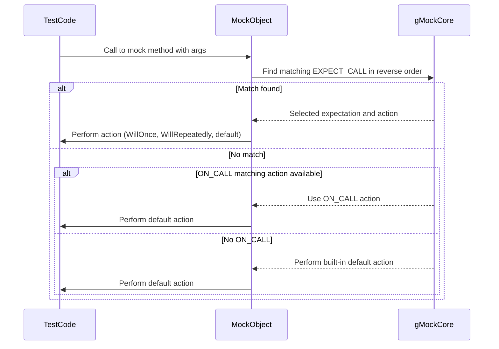

# Actions and Expectations

This document details how you specify mock object behavior in GoogleMock, including setting call expectations with `EXPECT_CALL`, default actions with `ON_CALL`, cardinalities (call counts), handling sequences and orders of invocations, and managing complex call interactions.

---

## 1. Overview of ON_CALL and EXPECT_CALL

GoogleMock provides two main macros for specifying the behavior of mock methods:

- **`ON_CALL(mock_object, Method(args))`**: Sets the *default action* for calls to a method without adding an expectation that the call must occur.
- **`EXPECT_CALL(mock_object, Method(args))`**: Sets an expectation on a mock method, specifying the calls you expect to occur including their arguments, number of times, and behavior.

Both macros accept argument matchers and chainable clauses to refine specifications.

<Check>
Always use `ON_CALL` to define typical default behaviors for your mocks when you don't need to verify a call happened, and use `EXPECT_CALL` where you want to assert a call is *expected* with certain constraints.
</Check>

---

## 2. Using `ON_CALL` to Specify Default Mock Behavior

The `ON_CALL` macro configures how a mock method responds *by default* when called, but does *not* imply any expected calls.

### Syntax

```cpp
ON_CALL(mock_object, Method(arg_matchers...))
    .With(multi_arg_matcher)  // Optional
    .WillByDefault(action);   // Required
```

- `.With(m)` applies a matcher on the entire argument tuple to further restrict when this default applies.
- `.WillByDefault(a)` specifies what the mock does (e.g., `Return(value)`, `Invoke(lambda)`, etc).

### Best Practices

- The `.WillByDefault()` clause **must** appear exactly once.
- The `.With()` clause can appear once at most, and must precede `.WillByDefault()`.
- If multiple `ON_CALL`s match, the *latest* matching one determines the behavior.

### Example

```cpp
ON_CALL(foo, Bar(_))
    .WillByDefault(Return(true));

ON_CALL(foo, Bar(5))
    .WillByDefault(Return(false));
```

Calling `foo.Bar(5)` executes the second action (returns false), while `foo.Bar(10)` returns true.

---

## 3. Using `EXPECT_CALL` to Set Call Expectations

The `EXPECT_CALL` macro defines an expectation on a mock method, verifying if and how it is called during test execution.

### General Syntax

```cpp
EXPECT_CALL(mock_object, Method(arg_matchers...))
    .With(multi_arg_matcher)       // Optional, must be first clause
    .Times(cardinality)            // Optional, at most once
    .InSequence(seq1, seq2, ...)   // Optional, multiple times
    .After(exp1, exp2, ...)        // Optional, multiple times
    .WillOnce(action1)             // Optional, multiple times
    .WillRepeatedly(action)        // Optional, at most once
    .RetiresOnSaturation()         // Optional, at most once, last clause
```

### Clause Details

#### `.With()`
Restricts the expectation to calls whose entire argument tuple matches the given matcher.

#### `.Times(cardinality)`
Specifies the number of expected calls, using cardinalities such as:

- `Exactly(n)` or simply `n` — exactly `n` calls.
- `AtLeast(n)` — at least `n` calls.
- `AtMost(n)` — at most `n` calls.
- `Between(m, n)` — between *m* and *n* calls inclusive.
- `AnyNumber()` — any number of calls.

If omitted, GoogleMock infers the call count based on the presence of `.WillOnce()` and/or `.WillRepeatedly()` clauses:

- No `.WillOnce()` or `.WillRepeatedly()`: `Times(1)` is implied.
- *n* `.WillOnce()` clauses and no `.WillRepeatedly()`: `Times(n)` is implied.
- *n* `.WillOnce()` clauses and one `.WillRepeatedly()`: `Times(AtLeast(n))` is implied.

#### `.InSequence(sequences...)`
Requires calls matching the expectation to occur in the order specified by the sequences. Use this to enforce strict call ordering across multiple mock expectations.

#### `.After(expectations...)`
Requires the expectation to be matched *only after* all specified expectations have been satisfied. Supports chaining and multiple prerequisites.

#### `.WillOnce(action)` and `.WillRepeatedly(action)`
Defines the actions to perform upon matching calls.

- `.WillOnce()` actions execute sequentially per invocation.
- `.WillRepeatedly()` defines the action once the `.WillOnce()` actions are exhausted.

#### `.RetiresOnSaturation()`
Indicates that the expectation will be retired (made inactive) as soon as it is saturated (i.e., its upper call count limit is reached). Otherwise, expectations are “sticky” and remain active to catch excessive calls.

---

## 4. Cardinalities: Controlling Call Counts

Use the `.Times()` clause in `EXPECT_CALL` to specify how many calls to expect. GoogleMock provides rich cardinality options:

| Cardinality       | Meaning                                   |
|-------------------|-------------------------------------------|
| `AnyNumber()`     | Any number of calls allowed.               |
| `AtLeast(n)`      | At least *n* calls.                        |
| `AtMost(n)`       | At most *n* calls.                         |
| `Between(m, n)`   | Between *m* and *n* calls inclusive.      |
| `Exactly(n)` or `n` | Exactly *n* calls, zero means never called. |

By default, if no `.Times()` is provided, GoogleMock infers the value based on `.WillOnce()` and `.WillRepeatedly()` usage (see section 3).

<Note>
Omitting `.Times()` when using `.WillOnce` clauses may lead to unexpected inferred call counts. Always verify your tests verify exactly what you expect.
</Note>

---

## 5. Ordering Calls: Sequences and Partial Order

By default, calls can match `EXPECT_CALL`s in any order. To control invocation order, use these mechanisms:

### Using `InSequence`

Wrap your expected calls inside an `InSequence` scope or add `.InSequence(s)` with a shared `Sequence` object.

Example enforcing linear order:

```cpp
{
  InSequence s;
  EXPECT_CALL(mock, Foo(1));
  EXPECT_CALL(mock, Bar(2));
}
```

The call to `Bar(2)` must occur after `Foo(1)`.

### Using `.After()` Clause

Specifies that an expectation happens after one or more other expectations.

Example:

```cpp
Expectation e1 = EXPECT_CALL(mock, Initialize());
EXPECT_CALL(mock, Execute()).After(e1);
```

Here `Execute()` can only be called after `Initialize()` has been called.

### Using Multiple Sequences

Multiple sequences allow expressing partial orders (DAGs) of calls. Assign expectations to one or more sequences to define complex orderings.

Example:

```cpp
Sequence s1, s2;
EXPECT_CALL(mock, A()).InSequence(s1, s2);
EXPECT_CALL(mock, B()).InSequence(s1);
EXPECT_CALL(mock, C()).InSequence(s2);
```

Specifies that `A()` precedes both `B()` and `C()`, with no order constraint between `B()` and `C()`.

---

## 6. Actions: Defining Behavior on Matching Calls

Once a call matches an expectation, GoogleMock performs an *action* (or behavior) defined by `.WillOnce()` and `.WillRepeatedly()` clauses.

### Sequence of Actions

- `.WillOnce(action)` executes the specified action on the next matching call.
- Multiple `.WillOnce()` statements chain actions for consecutive calls.
- `.WillRepeatedly(action)` defines the action for all subsequent calls after `.WillOnce()`s are used up.

Example:

```cpp
EXPECT_CALL(mock, GetValue())
    .WillOnce(Return(1))
    .WillOnce(Return(2))
    .WillRepeatedly(Return(3));
```

### Allowed Actions

You can use built-in actions like `Return(value)`, `Invoke(lambda)`, `SetArgPointee<N>(value)`, or combine multiple actions with `DoAll()`.

Refer to the full [Actions Reference](../api-reference/advanced-mocking-apis/actions-and-expectations) for built-in action details.

### Default Actions

If no action is specified explicitly, GoogleMock performs the default action:

- For functions returning `void`, it returns immediately.
- For functions returning built-in types or pointers, it returns zero/null.
- For types with default constructors (in C++11+), it returns a default-constructed value.

You can override this default using `ON_CALL`.

---

## 7. Special Clauses

### `.RetiresOnSaturation()`
Makes an expectation retire (become inactive) once it has reached its call count limit. Useful when multiple expectations can match a call but should only match one.

### `.Description(string)`
Optionally, add a human-readable name to an expectation for clearer failure messages.

### Evaluating Arguments Exactly Once

GoogleMock guarantees that matcher expressions and the arguments to `EXPECT_CALL` and `ON_CALL` are evaluated exactly once, preventing unexpected side effects.

---

## 8. Handling Uninteresting and Unexpected Calls

- **Uninteresting calls:** Calls to mock methods with no `EXPECT_CALL` expectations are allowed by default but generate warnings unless suppressed with `NiceMock` or `EXPECT_CALL(...).Times(AnyNumber())`.
- **Unexpected calls:** Calls that do not match any existing `EXPECT_CALL` are errors.

You can control warnings verbosity with the `--gmock_verbose` flag.

---

## 9. Common Usage Examples

### Setting Default Behavior with ON_CALL

```cpp
ON_CALL(mock_obj, Foo(_))
    .WillByDefault(Return(true));
```

This configures the default return value of `Foo()` to be `true`.

### Expecting Calls with EXPECT_CALL

```cpp
EXPECT_CALL(mock_obj, Foo(5))
    .Times(Exactly(1))
    .WillOnce(Return(42));
```

Expects exactly one call to `Foo(5)` and returns `42` on that call.

### Enforcing Call Order

```cpp
Sequence seq;
EXPECT_CALL(mock_obj, Init()).InSequence(seq);
EXPECT_CALL(mock_obj, Run()).InSequence(seq);
```

Ensures `Init()` is called before `Run()`.

### Allowing Multiple Calls

```cpp
EXPECT_CALL(mock_obj, Update(_))
    .Times(AnyNumber())
    .WillRepeatedly(Return());
```

Allows any number of calls to `Update()`.

---

## 10. Best Practices and Tips

- Prefer using `ON_CALL` to set default behaviors, and `EXPECT_CALL` only for calls you want to verify.
- Use `.RetiresOnSaturation()` for sequential or multiple expectations to avoid sticky expectations causing false failures.
- When matching complex argument sets, use `.With()` with tuple matchers for concise specifications.
- Use sequences and `.After()` to model call order dependencies clearly and avoid brittle tests.
- Use `NiceMock` or add catch-all `EXPECT_CALL(...).Times(AnyNumber())` clauses to suppress uninteresting call warnings.
- Always specify expectations *before* exercising the mock.

---

## 11. Troubleshooting

### Common Errors

- **Failing due to too few calls:** Verify that the number of `.WillOnce()` actions and `.Times()` cardinality correctly match.
- **Failing due to unexpected calls:** Ensure your `EXPECT_CALL` clauses cover all expected calls or add catch-all expectations.
- **Upper-bound violation:** Calls exceeding the allowed call count result in error messages showing argument values and call counts.

### Verbosity Control

Use `--gmock_verbose=info` to get detailed mock call traces and stack traces to debug mismatched expectations.

### Allowing Mock Object Leak for Testing

If a mock object must outlive the test or is managed externally, use `Mock::AllowLeak(mock_ptr);` to suppress error messages about leaked mocks.

---

## 12. Summary Diagram of Call Matching and Action Execution



---

## 13. Related APIs and Further Reading

- [Mock Creation and Basics](api-reference/advanced-mocking-apis/mock-creation-and-basics) for creating mocks.
- [Matchers and Predicates](api-reference/advanced-mocking-apis/matchers-and-predicates) to specify argument expectations.
- [Strictness and Mock Behavior](api-reference/advanced-mocking-apis/strictness-and-mock-behavior) for managing warnings and failure modes.
- [Best Practices for Mocking](guides/mocking-with-gmock/best-mocking-practices) for designing maintainable mocks.
- [gMock Cookbook](docs/gmock_cook_book.md) for practical recipes and examples.

---

By mastering the `ON_CALL` and `EXPECT_CALL` macros along with cardinalities, sequences, and actions, you gain full control over mock object behavior and verification in your tests, ensuring robust and expressive interaction-based testing with GoogleMock.
