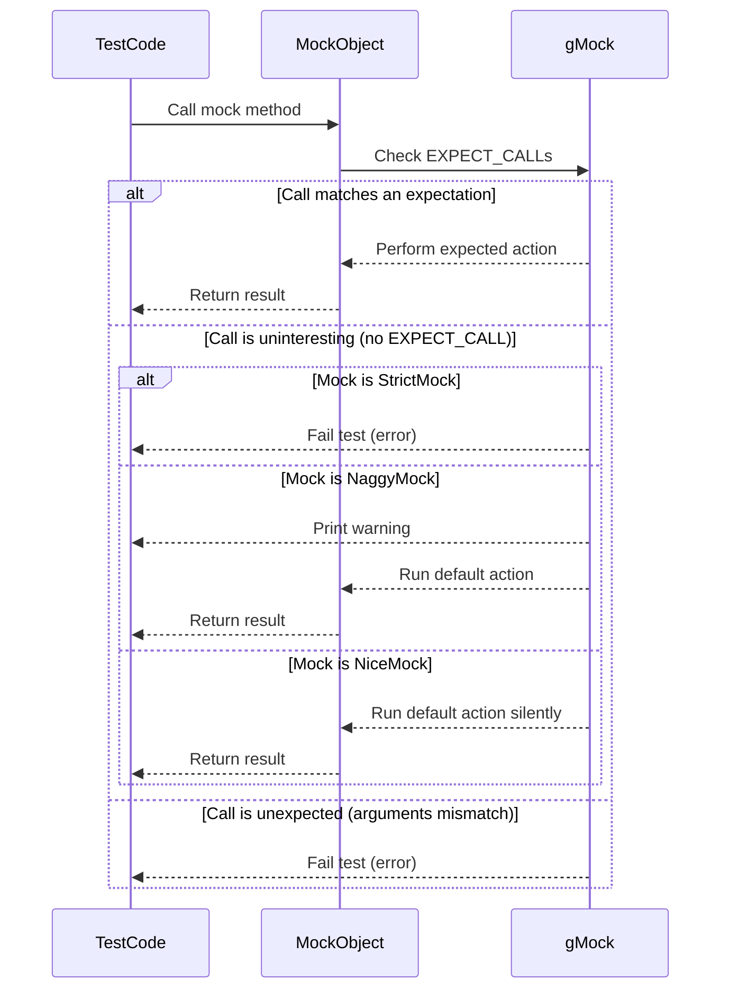

# Strictness and Mock Behavior

GoogleMock offers flexible control over how mock objects respond to calls that are not explicitly expected or interesting in your tests. This page explains how to manage the strictness level of mocks using the three main categories: **NiceMock**, **NaggyMock**, and **StrictMock**. It guides you through selecting the right strictness level for various testing scenarios to balance test robustness, maintainability, and developer productivity.

---

## Overview

When you write tests using GoogleMock, your mocks may receive calls that are not explicitly expected via `EXPECT_CALL`. Such calls are termed **uninteresting calls**. By default, GoogleMock prints warnings for these uninteresting calls but does not fail the test.

You can tune the behavior around uninteresting calls by choosing between three mock flavors:

| Mock Type       | Behavior on Uninteresting Calls             | Use Case                                                         |
|-----------------|---------------------------------------------|------------------------------------------------------------------|
| **NiceMock**    | Ignores uninteresting calls silently        | When uninteresting calls are expected or irrelevant              |
| **NaggyMock**   | Prints warnings on uninteresting calls      | Default mock behavior for detecting unexpected calls during test development |
| **StrictMock**  | Treats uninteresting calls as test failures | When full control is needed to catch any unexpected interactions  |

These wrappers inherit from your mock class and override uninteresting call handling.

-----------

## Why Control Strictness?

Choosing the right strictness level improves your test quality and maintainability:

- **NiceMock** keeps tests clean by suppressing noise from irrelevant or expected calls.
- **NaggyMock** helps discover unexpected calls by alerting you via warnings.
- **StrictMock** enforces the most rigorous tests, failing whenever a call is made without an explicit expectation.

Using overly strict mocks can lead to brittle tests that frequently break due to harmless internal changes. Overly lenient mocks reduce test effectiveness by silently ignoring potentially important calls.

-----------

## How to Use Strictness Wrappers

Given a mock class, e.g.,

```cpp
class MockFoo : public Foo {
 public:
  MOCK_METHOD(int, GetSize, (), (const, override));
  MOCK_METHOD(std::string, Describe, (int type), (override));
};
```

You can instantiate mocks with different strictness levels:

```cpp
using ::testing::NiceMock;
using ::testing::NaggyMock;
using ::testing::StrictMock;

NiceMock<MockFoo> nice_foo;    // Ignores uninteresting calls
NaggyMock<MockFoo> naggy_foo;  // Warns on uninteresting calls (Default behavior)
StrictMock<MockFoo> strict_foo; // Fails on uninteresting calls
```

These types behave as subclasses of your mock type, so you can use them wherever the original mock type is accepted.

You can also forward constructor arguments:

```cpp
NiceMock<MockBar> nice_bar(42, "hello");
StrictMock<MockBar> strict_bar('a', 'b', "str", ...);
```

-----------

## Detailed Behavior

| Strictness  | Uninteresting Call Behavior           | Warning Printed | Test Failure Generated |
|-------------|-------------------------------------|-----------------|-----------------------|
| NiceMock    | Silently accepts and returns default | No              | No                    |
| NaggyMock   | Runs default action but prints warning| Yes             | No                    |
| StrictMock  | Treats as failure and fails test      | Yes             | Yes                   |

**Uninteresting calls** are calls to mock methods with no `EXPECT_CALL` on them.

**Unexpected calls** occur when a method has expectations, but the call arguments don't match any.

> Important: Strictness wrappers only affect **uninteresting** calls, not unexpected calls, which always cause failure.

-----------

## Guidelines for Choosing Strictness

- Use **NiceMock** for mocks where you want to minimize noise and ignore irrelevant method calls. This is effective for mocks with many methods, where only a few calls matter.

- Use **NaggyMock** during initial test development or debugging to detect unexpected calls without failing the entire test suite abruptly.

- Use **StrictMock** when you want to enforce the strictest verification, preventing any calls without explicit expectations. This is suitable for critical interfaces or highly controlled components.

### Example Scenario

Suppose you mock a network client. Some tests only verify a particular method call, ignoring others. Using `NiceMock` keeps those tests clean. If you want to find unintended calls, switch to `NaggyMock`. During final verification or regression tests, use `StrictMock` to ensure no unexpected interaction occurs.

-----------

## Code Examples

### Creating and Using a NiceMock

```cpp
using ::testing::NiceMock;

class MockDatabase {
 public:
  MOCK_METHOD(bool, Connect, (), (override));
  MOCK_METHOD(void, Disconnect, (), (override));
  MOCK_METHOD(int, Query, (const std::string& sql), (override));
};

TEST(DatabaseTest, BasicUse) {
  NiceMock<MockDatabase> db;
  EXPECT_CALL(db, Connect()).Times(1).WillOnce(Return(true));

  // Other calls (e.g., Disconnect, Query) will be ignored without warnings.
  db.Connect();
  db.Disconnect();  // Uninteresting call: no warning
}
```

### Creating and Using a NaggyMock (Default Behavior)

```cpp
using ::testing::NaggyMock;

NaggyMock<MockDatabase> mock_db;
EXPECT_CALL(mock_db, Connect())
    .WillOnce(Return(true));

mock_db.Connect();
mock_db.Query("SELECT * FROM users");  // Will issue warning as uninteresting call
```

### Creating and Using a StrictMock

```cpp
using ::testing::StrictMock;

StrictMock<MockDatabase> strict_db;
EXPECT_CALL(strict_db, Connect())
    .WillOnce(Return(true));

strict_db.Connect();
strict_db.Query("SELECT * FROM users");  // Fails test as uninteresting call
```

-----------

## Caveats and Best Practices

- The strictness wrappers only affect uninteresting calls on mock methods defined **directly** in your mock class using the `MOCK_METHOD` macro. Inherited mock methods from base classes might not be affected consistently.

- The destructors of your mock classes **must be virtual** for the wrappers to behave correctly.

- Do **not** nest strictness wrappers, e.g., `NiceMock<StrictMock<MockFoo>>` is **not supported**.

- Avoid overusing `StrictMock` in large or complex tests, as it can lead to fragile tests that fail on innocuous changes.

- Use `NaggyMock` in iterative development phases when discovering unexpected calls.

- Shift to `NiceMock` when stable, to reduce noise.

- Reserve `StrictMock` for critical points where behavior must be tightly enforced.

-----------

## Troubleshooting

### Scenario: Unexpected warnings or failures for uninteresting calls

- Ensure your mock methods are correctly listed with `EXPECT_CALL` where needed.
- Use `NiceMock` if warnings become overwhelming and calls are truly unimportant.
- Confirm virtual destructors for your mocks.

### Scenario: Unexpected calls do not cause failure

- Remember, uninteresting calls are different from unexpected calls (calls with a mismatch in arguments for existing expectations).
- Unexpected calls always fail, regardless of mock strictness wrappers.

-----------

## Additional Resources

- [GoogleMock Cheat Sheet](https://google.github.io/googletest/gmock_cheat_sheet.html)
- [Mocking Reference](https://google.github.io/googletest/reference/mocking.html#NiceStrictNaggy)
- [gMock Cookbook](https://google.github.io/googletest/gmock_cook_book.html#NiceStrictNaggy)
- [gMock for Dummies](https://google.github.io/googletest/gmock_for_dummies.html)

-----------

## Summary

This page outlined the concept of uninteresting calls in GoogleMock and presented how to control mock reaction via `NiceMock`, `NaggyMock`, and `StrictMock`. It explained the behavior and use cases of each strictness level, how to instantiate corresponding mock objects, and best practices for selecting the appropriate strictness during the testing lifecycle.

---

## Mermaid Diagram: Interaction Flow for Mock Call Strictness


