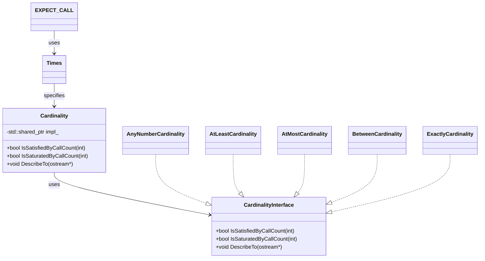

# Call Expectations & Cardinalities

This page explains how to declare expectations on mock method calls' frequency and patterns using GoogleMock's Cardinality API. Through `EXPECT_CALL()`, users specify how many times a method is expected to be invoked, enabling precise and flexible verification of interactions.

---

## Understanding Call Expectations in GoogleMock

When you mock a method, defining *call expectations* controls how many times the mocked method is allowed or required to be called during a test. This is crucial for validating that your system interacts with dependencies exactly as intended—no more, no less.

GoogleMock offers a powerful API inside the `::testing` namespace to declare these expectations with expressive and readable syntax.

### Declaring Expectations with `EXPECT_CALL`

The core way to declare call expectations is through the `EXPECT_CALL()` macro:

```cpp
EXPECT_CALL(mock_object, MethodName(matchers...))
    .Times(cardinality)
    .WillOnce(action)
    .WillRepeatedly(action);
```

- `mock_object`: The mock instance.
- `MethodName(matchers...)`: The mocked method and optional argument matchers to filter calls.
- `.Times(cardinality)`: How many calls to expect (optional; inferred if omitted).
- `.WillOnce()` / `.WillRepeatedly()`: Define what happens when calls occur.

**Important:** You must set `EXPECT_CALL` before exercising the code that uses the mock.

### Cardinality: Specifying "How Many" Times

The `.Times()` clause accepts a **cardinality**, an object that describes the expected call count. GoogleMock supports several built-in cardinalities:

| Cardinality          | Meaning                                  |
|----------------------|------------------------------------------|
| `AnyNumber()`        | Any number of calls (including zero).
| `AtLeast(n)`         | Called at least `n` times.
| `AtMost(n)`          | Called at most `n` times.
| `Between(m, n)`      | Called between `m` and `n` times (inclusive).
| `Exactly(n)` or `n`  | Called exactly `n` times. If `n` is zero, the call should never happen.

If `.Times()` is omitted, GoogleMock infers the cardinality based on the presence of `.WillOnce()` and `.WillRepeatedly()` clauses (see [Times Inference](#times-inference)).

<Tip>
Always choose the cardinality that best matches your intent to avoid brittle tests. For example, use `AtLeast(1)` if the call must occur at least once, but any additional calls are allowed, or `Exactly(1)` if the method must be called only once.
</Tip>

### Times Inference Rules

If `.Times()` is not specified in an `EXPECT_CALL`, GoogleMock applies the following rules:

1. If neither `.WillOnce()` nor `.WillRepeatedly()` are specified, the call is expected exactly once (`Times(1)`).
2. If *n* `.WillOnce()` clauses exist, but no `.WillRepeatedly()`, the call count is expected to be exactly *n* (`Times(n)`).
3. If *n* `.WillOnce()` clauses and one `.WillRepeatedly()` clause are specified, the call is expected at least *n* times (`Times(AtLeast(n))`).

### Examples of Cardinalities

```cpp
using ::testing::AtLeast;
using ::testing::Exactly;
using ::testing::AnyNumber;

// Expect GetValue() to be called any number of times.
EXPECT_CALL(mock, GetValue())
    .Times(AnyNumber());

// Expect SetValue(x) to be called at least 3 times.
EXPECT_CALL(mock, SetValue(_))
    .Times(AtLeast(3));

// Expect DoSomething() to be called exactly once.
EXPECT_CALL(mock, DoSomething())
    .Times(Exactly(1));
  
// Equivalent: EXPECT_CALL(mock, DoSomething()).Times(1);

// Expect ProcessData() to be called between 2 and 4 times inclusive.
EXPECT_CALL(mock, ProcessData())
    .Times(Between(2, 4));

// Expect Reset() to never be called.
EXPECT_CALL(mock, Reset())
    .Times(0);
```

### Behavioral Impact

- If the actual call count exceeds the upper bound, GoogleMock raises a failure immediately.
- If the actual call count is below the lower bound when the mock object is destroyed (or explicitly verified), GoogleMock reports an error.

### Call Cardinality Interface Internals (Advanced)

Cardinalities implement the `CardinalityInterface`:
- `IsSatisfiedByCallCount(int call_count)`: Returns whether the number of calls matches the expectation.
- `IsSaturatedByCallCount(int call_count)`: Returns whether the cardinality has reached its upper bound.
- `DescribeTo(std::ostream*)`: Prints a human-readable description of the expectation.

This allows extensibility should you need custom cardinalities.

---

## Practical Use and Best Practices

### Default Cardinality

If you do not specify `.Times()`, understand the inferred behavior to prevent surprises:

```cpp
EXPECT_CALL(mock, Foo())
    .WillOnce(Return(42));  // Inferred Times(1)
```

Data shows this call is expected once. If Foo() is called twice, it will report an error.

### Multiple `.WillOnce()` and `.WillRepeatedly()` with Cardinality

When specifying multiple `.WillOnce()` clauses, GoogleMock expects the mock method to be called as many times as `.WillOnce()` clauses. Adding a `.WillRepeatedly()` means calls beyond `.WillOnce()` counts will invoke the repeated action.

### Use of `.RetiresOnSaturation()` with Cardinalities

To prevent expectations from remaining "sticky" and matching calls beyond their intended count, use `.RetiresOnSaturation()`. This retires the expectation when the upper bound is reached.

```cpp
EXPECT_CALL(mock, Foo())
    .Times(2)
    .RetiresOnSaturation();
```

This means after two calls, this expectation will no longer match.

### Combining Multiple Expectations

GoogleMock matches calls against expectations in reverse order of declaration. More specific expectations should come after general ones.

```cpp
EXPECT_CALL(mock, Process(_)).Times(AnyNumber()); // General catch-all
EXPECT_CALL(mock, Process(42)).Times(Exactly(1)); // Specific
```

Calls with argument `42` match the specific expectation, others the catch-all.

### Avoid Over-Specifying

Use only the necessary cardinality and argument matchers. Over-specification leads to fragile tests.

### Common Pitfalls

- Forgetting to specify `.Times(0)` for methods you want to prohibit.
- Using conflicting or multiple `.Times()` clauses on one expectation (illegal).

---

## Summary of Cardinalities Provided

| Cardinality       | Description                                        |
|-------------------|--------------------------------------------------|
| `AnyNumber()`     | Zero or more calls allowed.                       |
| `AtLeast(n)`      | Calls expected at least `n` times.               |
| `AtMost(n)`       | Calls expected at most `n` times.                 |
| `Between(m, n)`   | Calls expected at least `m` and at most `n` times. |
| `Exactly(n)`      | Calls expected exactly `n` times.                 |

---

## Troubleshooting Call Expectations

- **Unexpected call count errors:** Verify the cardinality aligns with actual calls.
- **Sticky expectations causing failures:** Use `.RetiresOnSaturation()` or sequences (`InSequence`).
- **Conflicting expectations:** Ensure specific expectations come after general catch-alls.
- **Omitted `.Times()` clause confusion:** Remember inference rules and ensure they match test intent.

---

## References and Related Pages

- [Mocking Basics and `EXPECT_CALL()` Reference](../core-apis/mocking-basics.md#EXPECT_CALL)
- [Cardinality API Source and Built-in Cardinalities](googlemock/include/gmock/gmock-cardinalities.h)
- [gMock Cookbook on Setting Expectations](docs/gmock_cook_book.md#setting-expectations)
- [Matchers and Actions Reference](../core-apis/matchers.md) and (../advanced-mocking-features/actions.md)

---

## Example Usage

```cpp
#include <gmock/gmock.h>
using ::testing::AtLeast;
using ::testing::Exactly;
using ::testing::Return;

class MockFoo {
 public:
  MOCK_METHOD(int, GetValue, (), ());
  MOCK_METHOD(void, SetValue, (int v), ());
};

TEST(FooTest, CallExpectations) {
  MockFoo mock;

  // Expect GetValue to be called exactly 3 times
  EXPECT_CALL(mock, GetValue())
      .Times(Exactly(3))
      .WillRepeatedly(Return(10));

  // SetValue should be called at least once
  EXPECT_CALL(mock, SetValue(_)).Times(AtLeast(1));

  // Exercise code that uses mock
  mock.SetValue(5);
  for (int i = 0; i < 3; i++) {
    int v = mock.GetValue();
    EXPECT_EQ(v, 10);
  }
}
```

This test validates that `GetValue()` is called exactly three times and returns 10 each time, while `SetValue()` is called at least once.

---

## Diagram: Cardinality Relationships Concept



---