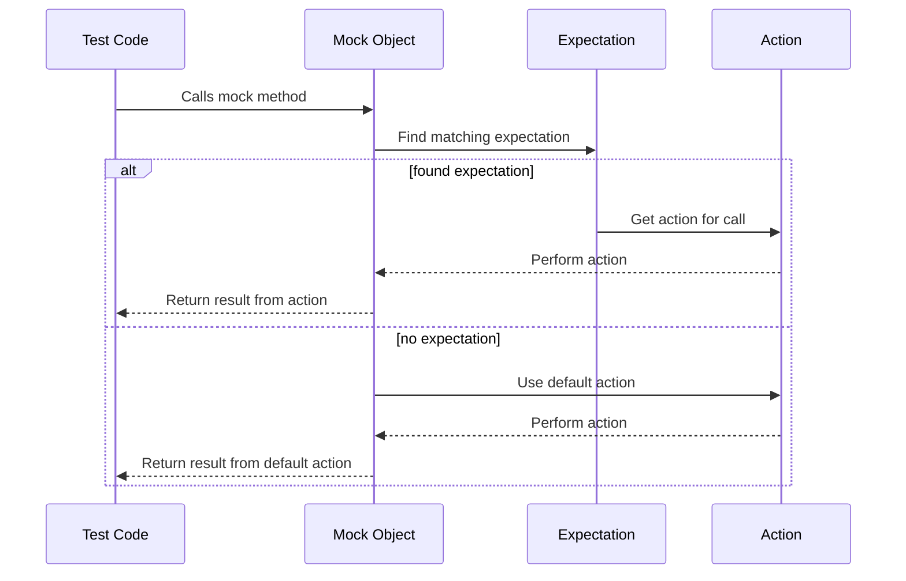

# Actions API

This reference guide provides a comprehensive overview of GoogleMock's built-in and custom actions, which define the behavior of mock methods when called. It covers predefined actions for common patterns, action composition utilities, and flexible extension mechanisms for tailoring behavior to test-specific needs.

---

## 1. Understanding Actions in GoogleMock

Actions specify what a mocked function should do when invoked. Unlike expectations that specify if and how often a function should be called, actions define the side effects and return values resulting from these calls.

When you create mock method expectations via `EXPECT_CALL` or define default behaviors with `ON_CALL`, you associate one or more actions to those expectations.

### Why Use Actions?

- **Control mock behavior:** Customize return values, modify output parameters, simulate side effects.
- **Test complex interactions:** Chain multiple actions, call real functions or lambdas.
- **Customize for your tests:** Implement domain-specific behaviors efficiently.

Actions form the core of interaction-based testing, enabling precise simulation of collaborators.

---

## 2. Built-in Actions

The most common use cases for actions are covered by built-in functions in the `::testing` namespace.

### Returning Values

| Action                 | Description                                                                                |
|------------------------|--------------------------------------------------------------------------------------------|
| `Return()`             | Returns from a `void` mock method (i.e., doesn’t return anything).                          |
| `Return(value)`        | Return a copy of `value`. The copy is made when the expectation is set, not at call time. |
| `ReturnArg<N>()`       | Return the `N`-th argument passed to the mock method (zero-indexed).                       |
| `ReturnNew<T>(...)`    | Return a new dynamically allocated `T` object, constructed from the arguments.            |
| `ReturnNull()`         | Return a null pointer.                                                                    |
| `ReturnPointee(ptr)`   | Return the value pointed to by `ptr` at the time of the call (not construction time).      |
| `ReturnRef(variable)`  | Return a reference to `variable`. Useful when a reference return type is expected.        |
| `ReturnRefOfCopy(val)` | Return a reference to a copy of `val`. The copy lifetime is managed automatically.       |
| `ReturnRoundRobin({})` | Cycle through values in the initializer list, returning one per call in round-robin.      |

### Side Effects

Actions to modify arguments or perform side effects:

| Action                          | Description                                                                                   |
|--------------------------------|-----------------------------------------------------------------------------------------------|
| `Assign(&var, value)`           | Assign `value` to the variable pointed to by `var`.                                          |
| `DeleteArg<N>()`                | Delete the `N`-th argument, must be a pointer.                                               |
| `SaveArg<N>(ptr)`               | Copy the `N`-th argument into `*ptr`.                                                        |
| `SaveArgByMove<N>(ptr)`         | Move the `N`-th argument into `*ptr`.                                                       |
| `SaveArgPointee<N>(ptr)`         | Copy the value pointed to by the `N`-th argument into `*ptr`.                                |
| `SetArgReferee<N>(value)`       | Assign `value` to the variable referenced by the `N`-th argument.                            |
| `SetArgPointee<N>(value)`       | Assign `value` to the object pointed to by the `N`-th argument.                              |
| `SetArrayArgument<N>(first,last)` | Copy elements from range `[first, last)` into array pointed to by the `N`-th argument.      |
| `SetErrnoAndReturn(error, val)` | Set `errno` to `error` and return `val`.
|
| `Throw(exception)`             | Throw the supplied exception object (must be copyable). Available since v1.1.0.              |

### Function, Functor, or Lambda as Actions

You can specify arbitrary callable objects as actions, using these:

| Action                                  | Description                                                       |
|----------------------------------------|-------------------------------------------------------------------|
| `f`                                    | Call `f` with the same arguments as the mock method.              |
| `Invoke(f)`                            | Call the global/static function or functor `f` with arguments.    |
| `Invoke(object, &class::method)`      | Call `object->method()` with the same args as the mock function.  |
| `InvokeWithoutArgs(f)`                 | Call `f` with no arguments.                                        |
| `InvokeWithoutArgs(object, &method)`  | Call `object->method()` which takes no arguments.                  |
| `InvokeArgument<N>(...)`               | Call the `N`-th argument (assumed callable) with specified args.  |

Using callables gives you full control of mock behavior, with flexible integration of existing code.

### Default and Composite Actions

- `DoDefault()` — Executes the default action set by `ON_CALL`. Cannot be used inside composite actions.
- `DoAll(a1, a2, ..., an)` — Do all actions in sequence; return the result of the last.
- `IgnoreResult(a)` — Perform action `a` but discard its return value.
- `WithArg<N>(a)`, `WithArgs<N1,N2,...>(a)` — Pass selected mock args to inner action.
- `WithoutArgs(a)` — Perform action `a` without arguments.

---

## 3. Defining Custom Actions

You can extend the framework with your own actions for test-specific behaviors, increasing test expressiveness.

### Easy Way: Using Lambdas or Functors

Simply provide a callable object compatible with the mocked method’s signature.

```cpp
MockFunction<int(int)> mock;
EXPECT_CALL(mock, Call)
    .WillOnce([](int x) { return x * 2; });
EXPECT_EQ(mock.AsStdFunction()(4), 8);
```

You can also define move-only actions (called only once using `WillOnce`):

```cpp
struct MoveOnlyAction {
  std::unique_ptr<int> ptr;
  std::unique_ptr<int> operator()() && { return std::move(ptr); }
};

MockFunction<std::unique_ptr<int>()> mock;
EXPECT_CALL(mock, Call).WillOnce(MoveOnlyAction{std::make_unique<int>(42)});
```

### Using ACTION Macros (Legacy)

For compatibility, macros like `ACTION(name) { ... }` and parameterized versions `ACTION_P`, `ACTION_P2`, etc. allow concise definitions. However, these macros cannot be used inside functions or classes and are less type-safe than lambdas/functors.

Example:

```cpp
ACTION(IncrementArg1) { return ++(*arg1); }
EXPECT_CALL(mock, Foo(_)).WillOnce(IncrementArg1());
```

### Advanced: Implementing `ActionInterface`

For fine control, implement the interface `::testing::ActionInterface<F>` where `F` is the mocked function type:

```cpp
template <typename F>
class ActionInterface {
 public:
   virtual ~ActionInterface();
   template <typename Result, typename ArgumentTuple>
   Result Perform(const ArgumentTuple& args) = 0;
};
```

Wrap your implementation in an `Action<F>` using `MakeAction`.

### For Polymorphic Actions

Use `MakePolymorphicAction` with implementation classes that define a template `Perform` method compatible with multiple mock function signatures.

---

## 4. Using Actions in Tests

### Basic Usage

Assign actions to mock expectations or default behaviors:

```cpp
EXPECT_CALL(mock, Func(_)).WillOnce(Return(42));
ON_CALL(mock, Func(_)).WillByDefault(Return(0));
```

### Sequencing Actions

You can specify multiple actions executed in order with `WillOnce()` chained calls or combined in `DoAll()`:

```cpp
EXPECT_CALL(mock, Foo())
    .WillOnce(Return(1))
    .WillOnce(Return(2))
    .WillRepeatedly(Return(3));
```

Or:

```cpp
EXPECT_CALL(mock, Foo())
    .WillOnce(DoAll(SetArgPointee<0>(5), Return(true)));
```

### Chaining and Ordering

- `WillOnce` actions are consumed one per call.
- After all `WillOnce` actions, if `WillRepeatedly` is set, it is used for all subsequent calls.
- If no explicit actions, the default action (or default value) applies.
- Careful: `Return(value)` copies `value` on expectation setup time, so use a callable for dynamic behavior.

### Ignoring Return Values

Use `IgnoreResult(action)` when your action returns a value but the mock method returns void or when composing actions in `DoAll()`.

### Selecting Arguments for Inner Actions

- Use `WithArg<N>(action)` or `WithArgs<N1, N2, ...>(action)` when your action expects fewer or reordered arguments.
- Use `WithoutArgs(action)` for actions that take no argument.

### Invoking Callable Arguments

Use `InvokeArgument<N>(args...)` to invoke the N-th argument (assumed callable) passed to the mock method with specified arguments.

Example:

```cpp
EXPECT_CALL(mock, Func(_, _))
    .WillOnce(InvokeArgument<1>(5));
```

---

## 5. Best Practices and Tips

- Prefer concise and readable lambdas or functors for new actions.
- Use built-in actions whenever possible to minimize boilerplate.
- Use `DoAll()` to combine multiple side effects followed by a return value.
- Be cautious of evaluating parameters of `Return()` — they are evaluated once at expectation creation.
- Use `RetiresOnSaturation()` in expectations to deactivate them after invocation limits.
- Avoid over-specifying expectations that can lead to brittle tests.
- Use `ON_CALL` for default behaviors; reserve `EXPECT_CALL` for specifying call expectations.

---

## 6. Troubleshooting Common Issues

- **Uninteresting calls warning:** Happens when a method is called without an `EXPECT_CALL`—use `ON_CALL` or `NiceMock` to suppress warnings properly.
- **Actions run out warning:** Make sure to provide `WillRepeatedly()` to cover calls exceeding `WillOnce()`.
- **Conflicting return types error with `SetArgPointee()`:** Chain `SetArgPointee()` with `Return()` using `DoAll()`.
- **Mock function called more times than expected:** Use `Times()` with correct cardinality and `RetiresOnSaturation()` if needed.

---

## 7. Example: Typical Action Usage

```cpp
#include <gmock/gmock.h>
using ::testing::Return;
using ::testing::DoAll;
using ::testing::SetArgPointee;
using ::testing::_;

class MockFoo {
 public:
  MOCK_METHOD(bool, Foo, (int* output), ());
};

TEST(ExampleTest, MockActions) {
  MockFoo mock;

  EXPECT_CALL(mock, Foo(_))
      .WillOnce(DoAll(SetArgPointee<0>(42), Return(true)))
      .WillRepeatedly(Return(false));

  int val = 0;
  EXPECT_TRUE(mock.Foo(&val));  // Sets val=42, returns true
  EXPECT_EQ(val, 42);

  EXPECT_FALSE(mock.Foo(&val));  // Returns false
}
```

---

# See Also

- [Mocking Core API](/api-reference/core-apis/mocking-core-api)
- [Matchers API](/api-reference/advanced-mocking-matchers-actions/matchers-reference)
- [Configuring Expectations and Actions](guides/mocking-advanced-testing/configuring-expectations-actions.md)
- [gMock Cookbook](https://google.github.io/googletest/gmock_cook_book.html)

---

<Callout>
**Pro Tip:**
Use `WillOnce()` for specifying behavior for exact calls in sequence, and `WillRepeatedly()` for catch-all behavior after `WillOnce()`s are consumed.
</Callout>

---

## 8. Diagram Illustrating Actions Flow


