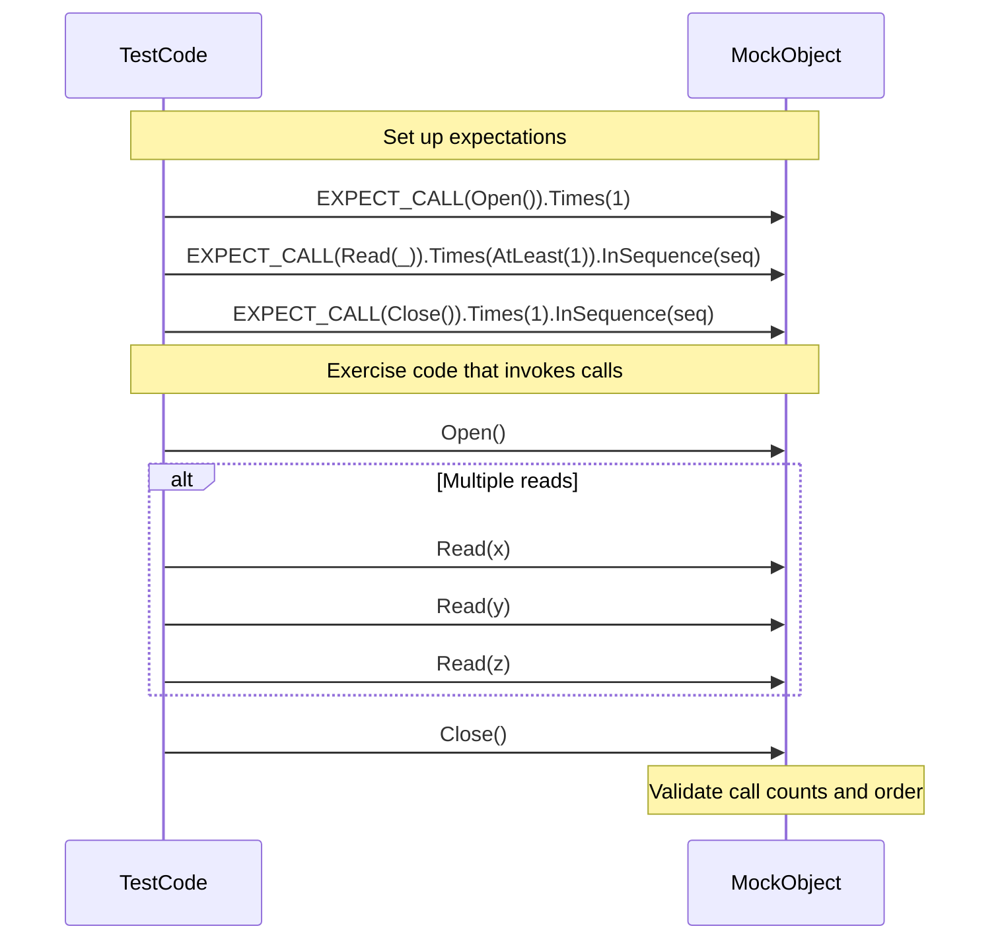

# Cardinalities & Call Expectations

This documentation explains how to express expected call counts and call order constraints in GoogleMock using cardinalities and call expectations. It provides concrete examples to help you enforce correct test logic and achieve precise control over mock method invocations in your tests.

---

## 1. Overview of Cardinalities and Call Expectations

GoogleMock lets you define expectations for how many times a mock method is called through **cardinalities**. Cardinalities are flexible constructs that allow specifying exact or range-based call counts. Combined with call expectations in `EXPECT_CALL`, they enable you to verify interactions precisely and control test flow.

Cardinalities are passed to the `.Times()` clause of `EXPECT_CALL` to specify these constraints.


### Why Use Cardinalities?

- **Verify correct call counts**: Ensure functions are called the expected number of times.
- **Support flexible ranges**: Allow calls between a minimum and maximum number of times.
- **Prevent unintended calls**: Guard against calls happening more or less often than intended.
- **Express test intent clearly**: Tests become documents of interaction contracts.

### Default Behavior

If `.Times()` is omitted in an `EXPECT_CALL`, GoogleMock infers the cardinality:
- If no `WillOnce` or `WillRepeatedly` is specified, cardinality defaults to exactly one call.
- If *n* `WillOnce()` clauses exist and no `WillRepeatedly()`, cardinality infers exactly *n* calls.
- If *n* `WillOnce()` clauses and one `WillRepeatedly()`, cardinality infers at least *n* calls.


## 2. Built-in Cardinalities

GoogleMock provides these common cardinalities in the `::testing` namespace:

| Cardinality         | Meaning                                                             |
| ------------------- | ------------------------------------------------------------------- |
| `AnyNumber()`       | The call may happen zero or more times (no upper limit).            |
| `AtLeast(n)`        | The call happens at least *n* times.                                |
| `AtMost(n)`         | The call happens at most *n* times.                                 |
| `Between(m, n)`     | The call happens between *m* and *n* times inclusive.               |
| `Exactly(n)`        | The call happens exactly *n* times.                                 |


### Examples

```cpp
using ::testing::AtLeast;
using ::testing::AnyNumber;
using ::testing::Exactly;
using ::testing::Between;

EXPECT_CALL(mock_obj, Foo())
    .Times(Exactly(3));  // Expect exactly 3 calls

EXPECT_CALL(mock_obj, Bar(_))
    .Times(AtLeast(2));  // Expect 2 or more calls

EXPECT_CALL(mock_obj, Baz(10))
    .Times(Between(1, 4));  // Expect between 1 and 4 calls

EXPECT_CALL(mock_obj, Quux())
    .Times(AnyNumber());  // Call can happen any number of times
```


## 3. Controlling Call Order and Expectations

Cardinality defines how many times a call happens, but sometimes the order of calls matters too. GoogleMock provides mechanisms to specify call order constraints.

### Using `InSequence` to enforce strict call order

The `InSequence` helper creates an anonymous sequence for all expectations within its scope, expecting calls to occur exactly in the order declared:

```cpp
{
  ::testing::InSequence s;

  EXPECT_CALL(mock_obj, Initialize());
  EXPECT_CALL(mock_obj, Process(_));
  EXPECT_CALL(mock_obj, Cleanup());
}
```

The above expects `Initialize()` first, then one or more `Process()` calls as specified, and finally `Cleanup()`.

### Using `Sequence` objects for flexible partial ordering

You can specify sequences explicitly and assign expectations to one or multiple `Sequence` objects to declare partial orders:

```cpp
::testing::Sequence s1, s2;

EXPECT_CALL(mock_obj, Start())
    .InSequence(s1);
EXPECT_CALL(mock_obj, Step1())
    .InSequence(s1, s2);
EXPECT_CALL(mock_obj, Step2())
    .InSequence(s2);
```

This means `Start()` must happen before `Step1()`, which must precede `Step2()`, but calls in different sequences may interleave.

### Using `.After()` for arbitrary ordering

You can specify that one expectation occurs only after others using `.After()` with `Expectation` or `ExpectationSet` objects:

```cpp
using ::testing::Expectation;

Expectation init = EXPECT_CALL(mock_obj, Init());
EXPECT_CALL(mock_obj, Run()).After(init);
```

Here `Run()` must be called strictly after `Init()`. You can chain `.After()` calls for more complex dependencies.

### Retiring Expectations

By default, expectations remain *sticky* - they stay active even after reaching their upper bound limits, which may cause failures if calls continue. Use `.RetiresOnSaturation()` to retire expectations as soon as their cardinality is met, allowing subsequent matching expectations to handle calls.

Example:

```cpp
EXPECT_CALL(mock_obj, Foo())
    .Times(2)
    .RetiresOnSaturation();
```

Here, after two calls to `Foo()`, the expectation retires and will not match further calls.


## 4. Applying Cardinalities in `EXPECT_CALL`

The `.Times()` clause in `EXPECT_CALL` accepts cardinalities:

```cpp
EXPECT_CALL(mock_obj, DoAction(_))
    .Times(::testing::AtLeast(1));
```

You can combine `.Times()` with `.WillOnce()`, `.WillRepeatedly()`, and other clauses:

```cpp
EXPECT_CALL(mock_obj, GetValue())
    .Times(3)
    .WillOnce(Return(10))
    .WillOnce(Return(20))
    .WillRepeatedly(Return(30));
```

This means `GetValue()` should be called exactly 3 times, returning 10 and 20 for the first two calls, and 30 for any remaining calls.


## 5. Specifying That a Mock Method Is Never Called

To assert that a function **should never be called**, use:

```cpp
EXPECT_CALL(mock_obj, Foo(_)).Times(0);
```

If the function is called, the test fails immediately.


## 6. Sticky Expectations and Common Pitfalls

### Sticky Expectations
Expectations remain active after their call counts are met, potentially causing "too many calls" errors if the method is called again. Use `.RetiresOnSaturation()` to retire them when saturated.

### Common Mistakes
- Specifying multiple `.Times()` clauses on the same expectation is disallowed.
- Calls to mocked methods before the corresponding `EXPECT_CALL` are undefined behavior.
- Forgetting to retire expectations may cause upper bound violations.


## 7. Practical Examples

### Example 1: Enforcing Exact Number of Calls

```cpp
EXPECT_CALL(mock, Compute())
    .Times(Exactly(2));

mock.Compute();  // OK
mock.Compute();  // OK
mock.Compute();  // Error: called more than expected
```

### Example 2: Allowing Multiple Calls with Upper Bound

```cpp
EXPECT_CALL(mock, SendData(_))
    .Times(AtMost(3));

mock.SendData(1);
mock.SendData(2);

// The following fourth call causes failure
mock.SendData(3);
mock.SendData(4);  // Error
```

### Example 3: Expect Call Order Using Sequence

```cpp
using ::testing::Sequence;
Sequence seq;

EXPECT_CALL(mock, Start())
    .InSequence(seq);
EXPECT_CALL(mock, Process())
    .InSequence(seq);
EXPECT_CALL(mock, Stop())
    .InSequence(seq);
```

Calls must happen in the order: `Start()` → `Process()` → `Stop()`.

### Example 4: Combining WillOnce with Retiring Expectations

```cpp
EXPECT_CALL(mock, GetNext())
    .WillOnce(Return(1))
    .WillOnce(Return(2))
    .RetiresOnSaturation();

EXPECT_CALL(mock, GetNext())
    .WillRepeatedly(Return(3));
```

Once the first two calls are made, this expectation is retired; subsequent calls return 3.


## 8. Troubleshooting Common Issues

### Calls outside expectations
If a mock method is called without an `EXPECT_CALL`, GoogleMock treats it as an *uninteresting call*:

- By default, it issues a warning but returns a default value.
- To suppress warnings, use `NiceMock`.
- To treat such calls as errors, use `StrictMock`.

### Too few or too many calls
GoogleMock compares actual call counts against the specified cardinality and fails the test if expectations are unsatisfied or exceeded.

Use the `--gmock_verbose=info` flag to trace mock calls and understand why expectations fail.

### Sticky expectations causing failures
If you get errors about calls exceeding limits unexpectedly, consider adding `.RetiresOnSaturation()` to retire old expectations once saturated.

### Verifying mocks explicitly
You can manually verify expectations on a mock using:

```cpp
bool success = ::testing::Mock::VerifyAndClearExpectations(&mock_obj);
```


## 9. Summary

GoogleMock's cardinality API allows precise control over how many times mock methods are expected to be called and in what order. Using built-in cardinalities with `EXPECT_CALL` and call sequencing clauses like `InSequence` and `After`, you can write clear, robust tests that enforce interaction contracts. Understanding sticky expectations and proper retirement of expectations is key to avoiding common pitfalls.


---

## References and Further Reading

- [Expect Call Clause (`EXPECT_CALL`)](/api-reference/advanced-mocking-matchers-actions/mocking)
- [Cardinalities and their meaning (`Times` clause)](/api-reference/advanced-mocking-matchers-actions/mocking#times)
- [Sequences and Ordering](https://github.com/google/googletest/blob/main/docs/gmock_cook_book.md#OrderedCalls)
- [Retiring Expectations (`RetiresOnSaturation`)](/api-reference/advanced-mocking-matchers-actions/mocking#retirement)
- [NiceMock, NaggyMock, StrictMock](docs/reference/mocking.md#NiceStrictNaggy)
- [Troubleshooting expectations](getting-started/first-steps/troubleshooting.md)


---

## Example: Typical Use with Cardinalities

```cpp
using ::testing::Sequence;
using ::testing::Exactly;
using ::testing::AtLeast;

Sequence seq;

EXPECT_CALL(mock, Open()).Times(Exactly(1));
EXPECT_CALL(mock, Read(_)).Times(AtLeast(1)).InSequence(seq);
EXPECT_CALL(mock, Close()).Times(Exactly(1)).InSequence(seq);

// Your code under test calls Open(), then Read() multiple times, then Close().
```


## Mermaid Diagram: Call Expectations and Sequences




## Practical Tips

- Always specify `.Times()` explicitly to avoid ambiguity.
- Use `.RetiresOnSaturation()` for expectations with multiple `WillOnce()` clauses used sequentially.
- For unordered calls, avoid using `InSequence`.
- Use `AnyNumber()` cautiously—only when you truly don't care about the call count.
- Leverage `.After()` and `Sequence` to specify partial or full call order requirements.
- When dealing with overloaded methods, make sure to specify the correct overload to avoid confusion.


## Related Topics

- [Matchers API](/api-reference/advanced-mocking-matchers-actions/matchers-reference)
- [Actions API](/api-reference/advanced-mocking-matchers-actions/actions-reference)
- [Mocking Fundamentals](/api-reference/core-apis/mocking-core-api)
- [Configuring Expectations and Actions](/guides/mocking-advanced-testing/configuring-expectations-actions)


---

<Note>
Be mindful that expectations in GoogleMock must be set before exercising the code under test. Setting expectations afterwards results in undefined behavior.
</Note>

<Warning>
Over-specifying your tests by requiring exact call order or call counts can lead to brittle tests. Use sequences and cardinalities judiciously to balance strictness and test maintainability.
</Warning>

<Tip>
Use `--gmock_verbose=info` during test development to view detailed mock call matching and diagnose failed expectations effectively.
</Tip>

---

## Source and Additional Resources

<Source url="https://github.com/google/googletest" paths='[{"path":"googlemock/include/gmock/gmock-cardinalities.h","range":"1-110"},{"path":"googlemock/src/gmock-cardinalities.cc","range":"1-102"},{"path":"docs/reference/mocking.md","range":"120-450"}]' branch="main" />