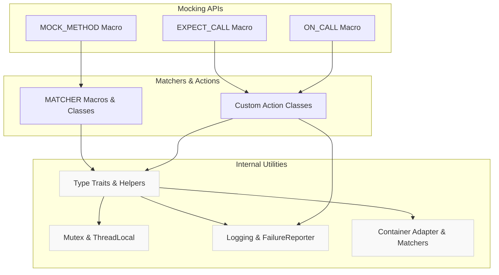

# Internal Utilities and Extension Hooks

This documentation details the helper templates, type traits, and advanced hooks provided by the framework to enable deep customizations and troubleshooting. These internals serve advanced users who want to extend or integrate GoogleTest and GoogleMock beyond the common usage scenarios.

---

## Overview

This page focuses on the internal utilities, helper templates, and extension points used by GoogleTest and GoogleMock to perform complex behaviors such as advanced type introspection, matcher and action composition, and fine control over the testing and mocking framework.

These utilities are primarily leveraged internally but understanding them allows power users to write custom extensions, diagnose complex issues, or augment GoogleTest’s capabilities.

---

## Key Utilities and Concepts

### 1. Helper Templates and Type Traits

GoogleTest provides a suite of compile-time helper templates for type analysis and manipulation:

- **`TypeId` Management**: Provides unique type identifiers used internally for fixture uniqueness and test registration.

- **`KindOf` Enumeration**: Categorizes types into `kBool`, `kInteger`, `kFloatingPoint`, or `kOther`. This is fundamental for safe type conversions in matchers.

- **LosslessArithmeticConvertible**: A compile-time predicate ensuring safe and non-lossy conversion between arithmetic types, used in matcher casting to prevent unsafe assumptions.

- **Reference and Const Removal**: Utilities for normalizing types by removing const and references to enforce correct matcher usage and template specialization.

Example usage:

```cpp
static_assert(internal::LosslessArithmeticConvertible<int, long>::value, 
              "int should be safely convertible to long");
```

### 2. Matcher and Action Type Wrappers

Matchers and actions are implemented as templated classes providing polymorphic and monomorphic interfaces:

- The **`Matcher`** abstraction uses templated classes to allow polymorphic matching across multiple types while providing precise failure messages.

- Matcher helper classes implement methods like `MatchAndExplain()`, `DescribeTo()`, and `DescribeNegationTo()` for expressive diagnostics.

- GoogleTest offers macros like `MATCHER` and `MATCHER_P` to simplify creation of custom matchers by wrapping these internal interfaces.

- Actions use similar design patterns, storing callable objects that implement `Perform()` for integrating behaviors into mocks.

### 3. Container Adapters and Comparisons

Native C++ arrays and STL containers are supported uniformly via adapter views:

- `StlContainerView` provides a unified interface to both native arrays and STL containers, enabling matchers to operate generically.

- Container equality and element-wise matchers (`ElementsAre`, `UnorderedElementsAre`, `Contains`, `Each`, etc.) leverage these abstractions for high usability.

### 4. Synchronization Primitives

For thread safety, GoogleTest provides internal mutex and thread-local storage implementations adaptable to multiple platforms:

- `Mutex`, `MutexLock` classes provide mutex acquisition and release.

- `ThreadLocal` template facilitates per-thread storage of values used in tests.

- Thread-related utilities coordinate concurrent test execution support.

### 5. Logging and Failure Reporting

Internal logging facilities coordinate printing informational messages, warnings, and failures:

- The `Log()` function respects the `--gmock_verbose` flag for verbosity control.

- The `FailureReporterInterface` abstracts failure reporting, with a default implementation integrating into GoogleTest's assertion framework.

### 6. Miscellaneous Utilities

- String manipulation helpers such as `ConvertIdentifierNameToWords` convert camel-case or underscored identifiers to human-readable phrases for better diagnostics.

- Compile-time utilities handle type-safe casting, deprecation annotations, and conditional compilation to support wide platform compatibility.

---

## Using the Extension Hooks

These internals are typically used by:

- **Custom Matchers**: Using provided templates to create matchers compatible with GoogleTest’s framework.

- **Custom Actions**: Implementing polymorphic or monomorphic actions with stateful behavior, compatible with `EXPECT_CALL` and `ON_CALL`.

- **Advanced Mock Behavior**: Interfacing with internal synchronization, logging, and matchers to extend mocking beyond the basics.

- **Troubleshooting**: Understanding internal assertions, failure reporting, and type traits to diagnose complex issues.

---

## Best Practices and Pitfalls

- **Do not use internal utilities in typical test code** unless you have a specific advanced customization need.

- **Custom matchers should prefer the provided `MATCHER` macros** where possible over implementing internal interfaces manually.

- **Exercise caution with multi-threading and synchronization hooks**; improper use can cause random failures.

- Avoid depending on implementation details that might change; these APIs are *not* stable public interfaces.

---

## Related Diagrams



This illustrates how the internal utilities underlie the mocking and matcher components.

---

## Code Example: Defining a Custom Matcher Using Internal APIs

```cpp
#include <gmock/gmock.h>

// Custom matcher to check if an integer is divisible by a parameter.
MATCHER_P(IsDivisibleBy, divisor, "checks divisibility") {
  if (divisor == 0) return false;
  return (arg % divisor) == 0;
}

// Usage:
// EXPECT_CALL(mock_obj, Foo(IsDivisibleBy(5)));
```

This makes use of internal polymorphic matcher interfaces but stands as a simple public extension.

---

## Troubleshooting Common Issues

- **Type Conversion Failures**: When creating matchers or actions, mismatched argument types often manifest as compiler errors. Verify use of `SafeMatcherCast` or proper template parameters.

- **Unintended Template Instantiations**: Compiler bloat may result when the internal templates are overused with many types. Try to reuse matchers or define polymorphic ones.

- **Thread-Safety Violations**: When working directly with internal synchronization, ensure correct locking discipline.

- **Logging Verbosity**: Adjust the `--gmock_verbose` and `--gtest_stack_trace_depth` flags to control output during debugging.

---

## Further Reading

- [Defining and Using Mock Classes](../mocking-apis/mock-classes-methods.md)
- [Setting Expectations and Actions](../mocking-apis/mock-expectations-actions.md)
- [Matchers for Arguments and Outcomes](../matchers-actions/argument-matchers.md)
- [Actions for Controlling Mock Behavior](../matchers-actions/mock-actions.md)
- [System Architecture Overview](../../overview/architecture-concepts/system-architecture-diagram.md)

---

Explore these to deepen your mastery of GoogleTest's architecture and customizable capabilities.


<Info>
Because these utilities are internal, their APIs may change; use with caution.
</Info>
