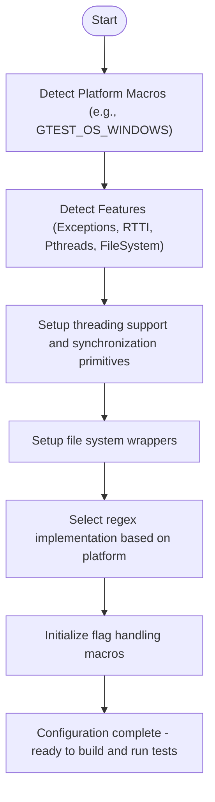

# Portability and Configuration Options

GoogleTest and GoogleMock are designed to be highly portable and configurable across a wide range of platforms, compilers, and environments. This page details the low-level APIs, macros, and mechanisms involved in enabling cross-platform support, handling environment detection, compiler options, thread safety, and interoperability between GoogleTest and GoogleMock.

Understanding and leveraging these configuration options helps users tune the framework to fit platform-specific requirements and overcome environment-related challenges.

---

## 1. Environment and Platform Detection

GoogleTest automatically detects platform and environment characteristics via predefined macros. This detection powers conditional compilation and feature availability. However, users can override these defaults when necessary.

### Key Environment Macros
- **Platform Indicators:** Macros such as `GTEST_OS_WINDOWS`, `GTEST_OS_LINUX`, `GTEST_OS_MAC`, and others indicate the compiling platform. They are always defined to `1` on the target platform or undefined otherwise.
- **Environment Capabilities:**
  - `GTEST_HAS_EXCEPTIONS` indicates if C++ exceptions are enabled.
  - `GTEST_HAS_RTTI` identifies if Runtime Type Identification is available.
  - `GTEST_HAS_PTHREAD` signals pthread support.
  - `GTEST_HAS_STD_WSTRING` indicates availability of `std::wstring`.
  - `GTEST_HAS_FILE_SYSTEM` states if a filesystem is available.
  - `GTEST_HAS_SEH` denotes support for Structured Exception Handling (Windows).
  - `GTEST_HAS_CLONE` reflects the presence of clone(2) system call.
  - `GTEST_HAS_STREAM_REDIRECTION` indicates ability to redirect standard I/O streams.
  - `GTEST_HAS_DEATH_TEST` determines if death tests are supported.

### Practical Usage
You rarely need to manually define these macros as GoogleTest tries to automatically detect them. However, to force specific behaviors or fix detection problems, override them in your build system using compiler flags, e.g., `-DGTEST_HAS_PTHREAD=1`.

<Check>
If your platform has pthread but GoogleTest does not detect it correctly, add `-DGTEST_HAS_PTHREAD=1` to your compiler flags to enable threading support.
</Check>

---

## 2. Compiler and Language Features

GoogleTest requires a minimum C++17 standard support.

- The macro `GTEST_INTERNAL_CPLUSPLUS_LANG` is defined based on compiler support and must be at least `201703L` (C++17); otherwise, compilation is disallowed.
- Compiler-specific extensions and attributes such as `GTEST_HAVE_ATTRIBUTE_` macros detect support for functions like `[[noinline]]`, `__attribute__((format))` and others to enhance warnings and debugging.

### Exception and RTTI Detection
- Exception support (`GTEST_HAS_EXCEPTIONS`) and RTTI availability (`GTEST_HAS_RTTI`) are programmatically detected per compiler and platform.
- On some compilers/platforms, manual overrides are necessary.

### Thread Annotations
- Macros such as `GTEST_EXCLUSIVE_LOCK_REQUIRED_` and `GTEST_LOCK_EXCLUDED_` are used internally and can be customized if your environment supports thread annotations.

---

## 3. Thread Safety and Synchronization

GoogleTest and GoogleMock provide mutex and thread-local storage abstractions adapting to the underlying platform.

### Thread Safety Macro
- `GTEST_IS_THREADSAFE` is defined if the platform supports threads (e.g., Windows, pthreads).

### Mutex and Lock Implementations
- On Windows, the `Mutex` class wraps native critical sections.
- On POSIX systems, `pthread_mutex_t` is used.
- When no threading support is detected, dummy mutex and lock implementations are provided that do nothing.

### ThreadLocal Storage
- Template class `ThreadLocal<T>` provides thread-local storage abstraction.
- On Windows and pthread platforms, it integrates with native TLS mechanisms.
- On non-threadsafe platforms, it degrades gracefully to a single shared value.

### Threads
- Helper classes like `ThreadWithParam<T>` assist testing multi-threaded scenarios internally but are not intended for end users.

<Note>
All synchronization primitives are internal and should not be used directly by test writers.
</Note>

---

## 4. File System and I/O Portability

GoogleTest provides wrappers for common POSIX-like file system and I/O functions, abstracting platform differences:

- File operations: `posix::FOpen`, `posix::FReopen`, `posix::FDOpen`, `posix::FClose`, `posix::Read`, `posix::Write`, `posix::Close`.
- Directory operations: `posix::ChDir`, `posix::RmDir`, `posix::IsDir`.
- File descriptor utilities: `posix::FileNo` to get the OS-specific file descriptor.
- Case-insensitive string comparison: `posix::StrCaseCmp`.
- Terminal detection: `posix::IsATTY` checks if a given file descriptor is a terminal.
- Environment variable querying: `posix::GetEnv`.

These wrappers handle platform quirks, including Windows' lack of some POSIX functions or differences in APIs.

---

## 5. Logging and Assertions

GoogleTest implements its own logging and assertion mechanisms optimized for portability:

- The `GTEST_LOG_` macro logs at specified severity levels.
- Logging can be redirected to `stderr` via `LogToStderr()`.
- Assertions like `GTEST_CHECK_` verify critical conditions and abort if violated.

These components are customizable through macros for integration with user environment requirements.

---

## 6. Regular Expression Implementations

GoogleTest chooses among multiple regex engines based on environment:

- **Abseil and RE2:** If Abseil is enabled (`GTEST_HAS_ABSL`), RE2 is used for regex.
- **POSIX Extended Regex:** On Unix-like systems with POSIX regex support.
- **Simple Regex:** A built-in reduced regex engine used as fallback.

The internal class `RE` wraps the chosen implementation, providing a uniform interface for matching operations.

---

## 7. Flags and Environment Variables

GoogleTest supports various runtime flags accessible via macros:

- Flags named with `GTEST_FLAG(flag_name)`.
- Macros to define and access them integrate with Abseil flags if available; otherwise with GoogleTest's internal flag variables.

Environment variables corresponding to these flags can be parsed through utility functions.

Example:
```cpp
bool flag = ::testing::internal::BoolFromGTestEnv("some_flag", false);
```

---

## 8. Compiler and Build Integration Tips

### Building with CMake
- Use provided `CMakeLists.txt` for building GoogleTest and GoogleMock across platforms.
- Compiler flags detect and handle platform differences for threading, exceptions, and RTTI.
- Optionally build shared libraries with `-DGTEST_CREATE_SHARED_LIBRARY=1`.

### Handling Shared Libraries
- Define `GTEST_CREATE_SHARED_LIBRARY` when compiling GoogleTest as a shared library for proper symbol exporting.
- Define `GTEST_LINKED_AS_SHARED_LIBRARY` when compiling your tests to correctly import symbols.

### Avoiding Macro Name Clashes
- Define `GTEST_DONT_DEFINE_TEST=1` and similar macros on your build line to rename GoogleTest macros and avoid conflicts.
  For example, `GTEST_TEST` instead of `TEST`.

### Thread Support
- Explicitly set `-DGTEST_HAS_PTHREAD=1` or `0` if automatic detection fails.
- Link with pthreads (`-pthread`) on POSIX where required.

<Callout>
Modern compilers and build systems support C++17, which is required. Make sure your toolchain complies.
</Callout>

---

## 9. Common Macros Summary

| Macro Name                      | Purpose                                                |
|--------------------------------|--------------------------------------------------------|
| `GTEST_HAS_EXCEPTIONS`          | Indicates if C++ exceptions are enabled                |
| `GTEST_HAS_RTTI`                | Indicates if RTTI is available                          |
| `GTEST_HAS_PTHREAD`             | Indicates if pthread library is available              |
| `GTEST_HAS_STD_WSTRING`         | Indicates if `std::wstring` is available                |
| `GTEST_HAS_FILE_SYSTEM`         | Indicates if filesystem support is available           |
| `GTEST_HAS_SEH`                 | Indicates Structured Exception Handling support (MSVC) |
| `GTEST_HAS_CLONE`               | Indicates availability of clone(2) system call         |
| `GTEST_HAS_STREAM_REDIRECTION` | Indicates stream redirection capability                 |
| `GTEST_HAS_DEATH_TEST`          | Indicates if death tests can be run                     |
| `GTEST_IS_THREADSAFE`           | Indicates if GoogleTest is thread-safe                  |
| `GTEST_API_`                   | Macro for symbol exporting                               |

---

## 10. Error Handling and Troubleshooting Tips

- If tests fail to build due to missing pthread symbols, verify `GTEST_HAS_PTHREAD` is enabled and link with pthread.
- On Windows, avoid including `<windows.h>` to reduce symbol conflicts.
- Override `GTEST_HAS_RTTI` if RTTI usage causes issues with your compiler.
- Use `GTEST_DONT_DEFINE_*` macros to resolve macro conflicts with other libraries.
- For embedded or no-filesystem platforms, some features like stream redirection or death tests may not work.
- If you encounter crashes related to threading, verify mutex and thread local storage integrations.

---

## 11. Interoperability Between GoogleTest and GoogleMock

Both frameworks share platform and portability macros through their internal port headers:

- GoogleMock depends on GoogleTest's portability layer defined in `gtest-port.h`.
- GoogleMock defines its own flag macros but integrates them with GoogleTest's environment.

This approach ensures consistent behavior and capability detection across both libraries.

---

## 12. Summary Diagram of Platform Detection Flow



---

## 13. Example: Forcing Thread Support Enablement

If your environment does not have proper pthread detection, manually enable it during compilation:

```shell
# Compile with pthread support explicitly enabled
g++ -std=c++17 -DGTEST_HAS_PTHREAD=1 -pthread your_test.cc -lgtest -o your_test
```

This ensures GoogleTest is compiled and linked correctly for multi-threaded testing.

---

## 14. References and Further Reading

- [GoogleTest Core Concepts & Terminology](../../overview/architecture-concepts/core-concepts-terminology)
- [GoogleTest Setup & Installation Prerequisites](../../getting-started/setup-and-installation/prerequisites-system-requirements)
- [GoogleTest Configuration & Verification](../../getting-started/setup-and-installation/configuration-verification)
- [Mocking APIs Overview](../mocking-apis/mock-expectations-actions)
- [Matchers & Actions](../matchers-actions/argument-matchers)

For practical build examples, see the [googletest README](../../../googletest/README.md) and pkg-config usage notes ([docs/pkgconfig.md](../../../docs/pkgconfig.md)).

---

## 15. Tips for Effective Use

- Use the provided macros to conditionally include platform-specific tests or features.
- Avoid relying on platform-specific internal macros unless absolutely necessary.
- Override macros cautiously, only when automatic detection fails or special environment needs to be accommodated.
- For custom environments, consider supplying a `gtest/internal/custom/gtest-port.h` file to inject your own definitions.
- Pay attention to compiler warnings related to feature detection and adjust build flags accordingly.

---

This page equips you with the foundational knowledge and tools to configure GoogleTest and GoogleMock for your unique platform and build environment, ultimately enabling reliable and robust C++ testing across diverse systems.

---

*End of Portability and Configuration Options Reference*