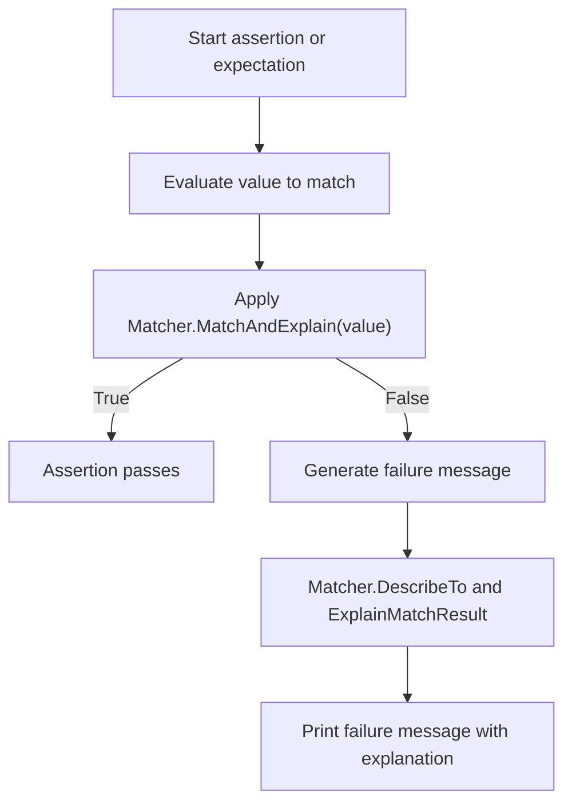

# Core and Custom Matchers

This section outlines the matcher interface as used in both GoogleTest and GoogleMock. It empowers you to compose, extend, and leverage matchers to write expressive assertions and verify arguments with precision and clarity.

---

## Overview of Matchers

Matchers are predicates that determine whether a value meets certain criteria. They are foundational to GoogleTest assertions like `EXPECT_THAT` and the argument matching system in GoogleMock's mocks.

- **Polymorphic matchers:** Can be used with many types, e.g., `Eq(value)`, `NotNull()`, `StartsWith(prefix)`.
- **Monomorphic matchers:** Bound to concrete types, provided internally via polymorphic matchers.

GoogleTest's matcher interface enables matchers to:

- Indicate whether a value matches (via `MatchAndExplain`).
- Explain the reason for a match or failure with detailed messages.
- Describe themselves clearly for error messages, including negations.

## Using Built-in Matchers

GoogleTest provides a comprehensive library of prebuilt matchers covering:

- Equality and inequality: `Eq()`, `Ne()`, `Lt()`, `Le()`, `Gt()`, `Ge()`.
- String content and pattern matching: `StartsWith()`, `EndsWith()`, `HasSubstr()`, `MatchesRegex()`, `ContainsRegex()`.
- Pointer states: `IsNull()`, `NotNull()`, `Pointee()`.
- Containers: `Contains()`, `Each()`, `ElementsAre()`, `UnorderedElementsAre()`, `Pointwise()`.
- Composite logic: `AllOf()`, `AnyOf()`, `Not()`, `Truly()` (predicate-based).

Example usage:

```cpp
#include <gmock/gmock.h>

using ::testing::StartsWith;
using ::testing::HasSubstr;
using ::testing::Gt;

EXPECT_THAT(name, StartsWith("Hello"));
EXPECT_THAT(message, HasSubstr("error"));
EXPECT_THAT(value, AllOf(Gt(5), Lt(10)));
```

## Creating Custom Matchers

For scenarios where built-in matchers don't suffice, you can write custom matchers easily using the `MATCHER` macros or by implementing the matcher interface directly.

### Using `MATCHER` Macros

- `MATCHER(Name, description_str)` defines a parameterless matcher.
- `MATCHER_P(Name, param_name, description_str)` defines a matcher with one parameter.
- Variants like `MATCHER_P2` support multiple parameters.

Inside the matcher definition, the value matched is accessible as `arg`. The matcher must return `bool` indicating success. You can also use the optional stream `result_listener` to provide detailed match explanations.

Example:

```cpp
MATCHER(IsEven, "") {
  return (arg % 2) == 0;
}

EXPECT_THAT(value, IsEven());
```

Parameterized example:

```cpp
MATCHER_P(HasAbsoluteValue, abs_val, "") {
  return std::abs(arg) == abs_val;
}

EXPECT_THAT(x, HasAbsoluteValue(10));
```

### Implementing Matcher Interfaces

Advanced users can implement the `MatcherInterface<T>` directly by defining:

- `bool MatchAndExplain(const T& x, MatchResultListener* listener) const` to perform matching and optionally provide extra explanation.
- `void DescribeTo(std::ostream* os) const` for matcher description.
- `void DescribeNegationTo(std::ostream* os) const` for negated description.

This approach offers fine-grained control but requires more work.

## Matcher Composition and Utilities

### Logical Combinators

- `AllOf(m1, m2, ...)` succeeds only if all sub-matchers succeed.
- `AnyOf(m1, m2, ...)` succeeds if any sub-matcher succeeds.
- `Not(m)` inverts the logic of a matcher.

These combinators allow building rich and expressive conditions.

### Predicate-Based Matcher

- `Truly(pred)` creates a matcher from an arbitrary unary predicate.

Example:

```cpp
EXPECT_THAT(x, Truly([](int n){ return n % 2 == 0; })); // even
```

### Matching Containers

Matchers like `Contains()`, `Each()`, `ElementsAre()`, `UnorderedElementsAre()`, and `Pointwise()` enable assertions on container contents with flexibility around order, count, and matching predicates.

For example:

```cpp
std::vector<int> v = {1, 2, 3};
EXPECT_THAT(v, Contains(2));  // Validate presence
EXPECT_THAT(v, Each(Gt(0)));  // All elements > 0
EXPECT_THAT(v, ElementsAre(1, 2, 3));  // Exact order match
```

### Field and Property Matchers

- `Field(&Class::field, matcher)` matches an object with a member field satisfying a matcher.
- `Property(&Class::property, matcher)` matches an object whose property getter matches a matcher.

Example:

```cpp
EXPECT_THAT(person, Field(&Person::age, Ge(18)));  // Person is adult
EXPECT_THAT(widget, Property(&Widget::Name, StartsWith("btn")));
```

### Pointer and Reference Matchers

- `Pointee(matcher)` matches pointers whose pointee matches.
- `Pointer(matcher)` matches pointers themselves against another matcher.
- `Ref(variable)` matches arguments that reference the same variable.

### String Matchers

Specialized string matchers provide human-friendly comparison, including ignoring case and regex matching:

- `StrEq()`, `StrNe()`, `StrCaseEq()`, `StrCaseNe()`
- `HasSubstr()`, `StartsWith()`, `EndsWith()`
- `MatchesRegex()`, `ContainsRegex()`

### Floating-Point Matchers

- `FloatEq()`, `DoubleEq()`, `FloatNear()`, `DoubleNear()` support approximate equality with ULP or absolute error tolerance.

## Matcher Explanations and Diagnostics

Matchers can provide detailed explanations on why a match succeeded or failed. This is surfaced in failure messages to help diagnose issues quickly.

- Explaining match results streams text clarifying which part of the matcher failed.
- Composite matchers report which submatcher failed and why.
- String matchers often include detailed string differences.

## Best Practices and Tips

- Use built-in matchers when possible for better readability and explanatory power.
- Apply `MATCHER` macros for quick custom matcher implementations when reusable predicate logic is needed.
- Leverage composite matchers (`AllOf`, `AnyOf`, `Not`) for complex conditions.
- Use container matchers like `Contains` and `ElementsAre` to verify collection contents precisely.
- Employ `Ref()` to assert reference identity rather than equality.
- Use string matchers rather than raw `EXPECT_EQ` on strings to get better failure outputs.

## Common Pitfalls

- Avoid using `EXPECT_EQ` on C-strings (use `EXPECT_STREQ` instead) because it compares pointers, not contents.
- Make sure matchers and predicates are compatible with the argument types.
- When overloading `MATCHER` with parameters, write clean and descriptive descriptions to aid debugging.
- Remember that matchers evaluate arguments exactly once; avoid side effects in arguments.

---

## Code Example: Custom Matcher using `MATCHER_P`

```cpp
#include <gmock/gmock.h>

// Matcher to check if an integer is divisible by a given divisor.
MATCHER_P(DivisibleBy, divisor, "") {
  *result_listener << "which is " << (arg % divisor) << " modulo " << divisor;
  return (arg % divisor) == 0;
}

TEST(CustomMatcherTest, DivisibleBy) {
  EXPECT_THAT(10, DivisibleBy(5));  // Passes
  EXPECT_THAT(10, DivisibleBy(3));  // Fails with explanation
}
```

Output on failure:

```
Value of: 10
Expected: is divisible by 3
  Actual: 10, which is 1 modulo 3
```

## Summary

This page equips you with the tools to:

- Use core GoogleTest and GoogleMock matchers effectively.
- Compose matchers for complex conditions.
- Write custom matchers that provide rich failure diagnostics.
- Leverage container, pointer, string, and numeric matchers for expressive verification.

For a detailed list of all built-in matchers, their behavior, and examples, see the [Matchers Reference](https://google.github.io/googletest/reference/matchers.html).

---

## Troubleshooting Matchers

In case your matcher doesn't work as expected:

- Confirm argument and matcher types align.
- Verify you are not accidentally comparing C-string pointers instead of string contents.
- Use `Explain()` helper to obtain detailed matcher diagnostics.
- For custom matchers, ensure `MatchAndExplain` returns accurate bool and writes key info to `result_listener`.

---

## Diagram: Matcher Workflow Overview



---

<Check>
Remember: Use matchers wherever possible for expressive, readable, and maintainable tests. Custom matchers enhance diagnostics—write them with clarity.
</Check>

<Info>
Explore related pages for deeper mastery:
- [Assertions Reference](../reference/assertions.md)
- [Mocking Reference](../reference/mocking.md)
- [Matchers Reference](matchers.md)
- [Writing New Matchers Quickly](../gmock_cook_book.md#NewMatchers)
</Info>

---