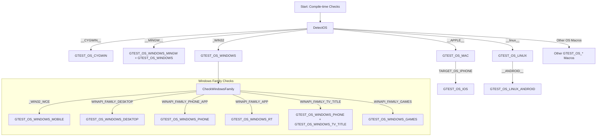

# Platform and Portability Utilities

GoogleTest is designed to seamlessly integrate and operate across diverse platforms and with various compilers. This page details the APIs, macros, and configuration options that enable portability, facilitate platform detection, and support integration with build systems. Whether you are targeting Linux, Windows, Mac, or embedded environments, understanding these utilities ensures that your tests remain robust and portable.

---

## Overview of Portability Utilities

At its core, GoogleTest includes a set of platform and portability utilities that handle cross-platform differences behind the scenes. These utilities provide:

- **Platform Detection Macros:** Auto-detection of the operating system and platform to enable platform-specific behavior.
- **Synchronization Primitives:** Thread-safe mutexes, locks, and thread-local storage abstractions that work consistently across systems.
- **File and I/O Compatibility:** Wrappers for functions like file handling, directory operations, and stream redirection that abstract platform differences.
- **Regex Engine Management:** Selection of the most appropriate regular expression engine based on platform capabilities.
- **Environment and Build Configuration Macros:** Offer options to tweak behavior based on exceptions support, threading availability, compiler features, and build options.

GoogleTest handles many of the hard portability problems so you can write tests that work across environments without rewriting platform-specific code.

---

## Platform Detection Macros

GoogleTest auto-detects platforms at compile-time through predefined macros and sets corresponding flags within the `gtest-port-arch.h` header. These macros allow conditional compilation and platform-specific adaptations.

### Key Macros To Know

| Macro Name               | Platform/OS                                                      | Usage Example                                         |
|--------------------------|-----------------------------------------------------------------|------------------------------------------------------|
| `GTEST_OS_WINDOWS`       | General Windows                                                   | Enable Windows-specific code.
| `GTEST_OS_WINDOWS_MINGW` | MinGW compiler on Windows                                          | Use MinGW optimizations.
| `GTEST_OS_LINUX`          | Linux                                                           | Linux-specific features.
| `GTEST_OS_MAC`            | Mac OS X                                                        | Mac-specific handling.
| `GTEST_OS_IOS`            | iOS (subset of Mac OS detection)                                | Mobile iOS adjustments.
| `GTEST_OS_CYGWIN`         | Cygwin environment on Windows                                    | Cygwin-specific code paths.
| `GTEST_OS_QNX`            | QNX real-time operating system                                   | Embed environment considerations.

Other macros cover environments like FreeBSD, OpenBSD, Solaris, Android, and various embedded platforms (ESP32, Esp8266, NXP, etc.).

### Using Platform Macros

These macros are defined internally and always have the value `1` if true. You should only check whether they are defined (e.g., `#if defined(GTEST_OS_LINUX)`).

```cpp
#ifdef GTEST_OS_WINDOWS
  // Windows-specific initialization
#endif

#if defined(GTEST_OS_MAC)
  // Mac-specific code
#endif
```

This conditional compilation lets you tailor test behavior or optimizations per platform.

---

## Customization and Configuration Macros

GoogleTest uses feature-indicating macros to describe capabilities and configuration options of the build environment. These empower you, as a user or integrator, to enable or disable certain features explicitly in your build system.

### Important Configuration Flags

| Macro Name                     | Purpose                                                       | Default Behavior                      |
|--------------------------------|---------------------------------------------------------------|-------------------------------------|
| `GTEST_HAS_EXCEPTIONS`          | Indicates whether C++ exceptions are enabled                 | Auto-detected by compiler features  |
| `GTEST_HAS_PTHREAD`             | Whether POSIX threads are available and used                 | Auto-detected on supported platforms|
| `GTEST_HAS_CLONE`               | Whether Linux clone(2) syscall is supported                  | Linux only, excluding Itanium        |
| `GTEST_HAS_POSIX_RE`            | Availability of POSIX regex support                          | True on most UNIX-like OSes          |
| `GTEST_HAS_STREAM_REDIRECTION` | Support for redirecting stdout and stderr streams            | Typically enabled unless targeting embedded/mobilesystems|
| `GTEST_IS_THREADSAFE`           | If GoogleTest is compiled with thread safety enabled         | Enabled if pthreads or Windows threading API available |

These macros can be defined or overridden at compile time (e.g., via compiler flags) to force-enable or disable given features based on your environment nuances or needs.

### Examples

If your environment does not correctly detect pthreads, you can force:

```bash
g++ -DGTEST_HAS_PTHREAD=1 ...
```

To disable exceptions support:

```bash
g++ -DGTEST_HAS_EXCEPTIONS=0 ...
```

By tuning these macros, you gain precise control over GoogleTest's behavior when integrating with diverse build systems.

---

## Synchronization and Thread-Local Storage APIs

GoogleTest abstracts platform-specific synchronization mechanisms with mutexes, locks, and thread-local storage to make tests thread-safe across environments.

### Key Classes and Utilities

- **Mutex / MutexLock:** Provides mutual exclusion lock semantics. Internally mapped to `pthread_mutex` on POSIX and `CRITICAL_SECTION` on Windows.
- **Notification:** A utility for blocking and notifying threads; useful in testing multi-threaded code.
- **ThreadLocal<T>:** Template class providing thread-local storage with automatic value management.
- **ThreadWithParam<T>:** Helper to run threads executing a user function with a parameter.

### Usage

```cpp
::testing::internal::Mutex mutex;
{
  ::testing::internal::MutexLock lock(&mutex);
  // Critical section code
}

// ThreadLocal example
::testing::internal::ThreadLocal<int> thread_local_int(42);
int val = thread_local_int.get();

// ThreadWithParam example
void MyThreadFunc(int* data) { (*data)++; }
int x = 0;
::testing::internal::ThreadWithParam<int*> thread(&MyThreadFunc, &x, nullptr);
thread.Join();
```

These are primarily internal utilities, but advanced users or those extending GoogleTest internals may leverage them.

---

## File System and I/O Wrappers

GoogleTest wraps common file and directory operations using platform-neutral abstractions in the `posix` namespace. These wrappers smooth over disparities between Windows, Unix, and embedded platforms.

### Common Wrappers

| Function         | Purpose                            | Platform Notes                             |
|------------------|----------------------------------|--------------------------------------------|
| `posix::FOpen`   | Open a file with flags            | Uses `_wfopen` on Windows for Unicode paths |
| `posix::FClose`  | Close file handle                 | Consistent API                             |
| `posix::Stat`    | Get file status                  | Maps to `_stat` on Windows, `stat` on Unix  |
| `posix::RmDir`   | Remove directory                 | Compatible wrappers, no-op on some embedded|
| `posix::IsDir`   | Checks if StatStruct is directory | Consistent across OSes                      |
| `posix::FileNo`  | Get underlying file descriptor   | `_fileno` on Windows, `fileno` on others    |
| `posix::IsATTY`  | Checks if fd is terminal          | NOP or 0 on some platforms                   |

### Usage Example

```cpp
FILE* file = posix::FOpen("test.txt", "r");
if (file != nullptr) {
  // Process file
  posix::FClose(file);
}

posix::StatStruct st;
if (posix::Stat("somedir", &st) == 0 && posix::IsDir(st)) {
  // Directory exists
}
```

This abstraction makes writing portable file-related tests straightforward.

---

## Regular Expression Support

GoogleTest supports multiple regex engines based on platform capabilities and dependencies:

| Regex Engine      | When Used                                       |
|-------------------|------------------------------------------------|
| RE2 (`GTEST_USES_RE2`)       | When GoogleTest is built with Abseil and RE2 dependencies |
| POSIX Extended RE (`GTEST_USES_POSIX_RE`)  | Enabled on Unix-like platforms with POSIX regex available |
| Simple internal regex (`GTEST_USES_SIMPLE_RE`) | Fallback on platforms without POSIX regex (e.g., Windows) |

### RE Class

GoogleTest internally provides an `RE` class wrapper that abstracts the regex engine. It offers methods:

- `RE::FullMatch(str, re)` - Matches entire string
- `RE::PartialMatch(str, re)` - Matches substring anywhere

This ensures consistent regex API regardless of platform.

---

## Build System Integration

GoogleTest offers direct support and best practices for integration with popular build systems.

### CMake

- Use the provided `CMakeLists.txt` to build GoogleTest standalone or as a subdirectory.
- Compiler and linker flags are automatically adjusted for each platform.
- Optionally, toggle building GoogleMock via `-DBUILD_GMOCK=ON` or `OFF`.
- Use the `gtest_force_shared_crt` flag for Visual Studio runtime compatibility.
- Requires C++17 or newer.

### Bazel

- The `BUILD.bazel` file defines targets for `gtest`, `gtest_main`, and examples.
- Platform-specific `config_setting` helps manage OS/compiler flags.
- Bazel handles dependencies and linking internally.

### Custom Macros and Defines

GoogleTest provides macros such as `GTEST_HAS_PTHREAD` and `GTEST_HAS_EXCEPTIONS` which can be defined or overridden in your build system to control conditional compilation.

---

## Practical Tips and Best Practices

- **Thread Safety**: Confirm `GTEST_IS_THREADSAFE` matches your environment if using multi-threaded tests.
- **Exception Safety**: Define `GTEST_HAS_EXCEPTIONS` appropriately to avoid build errors or runtime surprises.
- **Platform Checks**: Use the provided platform macros rather than your own to ensure compatibility.
- **Stream Capture**: Enable or disable stream redirection (`GTEST_HAS_STREAM_REDIRECTION`) to suit embedded or limited systems.
- **Custom Build Tweaks**: Use `gtest-force-shared-crt` (CMake) or define flags manually in command line to align runtimes.

---

## Troubleshooting

### Platform Detection Issues
- If a platform macro is not detected correctly, explicitly define corresponding `GTEST_OS_*` macro.

### Threading Problems
- If assertions or tests involving threads fail unpredictably, verify pthread support and thread safety macros.

### Regex Failures
- Confirm the correct regex engine is selected; missing POSIX regex or RE2 dependencies can cause failures.

### File I/O Errors
- On embedded or special platforms, some file system wrappers may be no-ops. Adjust tests accordingly.

---

## Example: Platform-Specific Conditional Compilation

```cpp
#if defined(GTEST_OS_WINDOWS)
  // Windows-specific code here
#elif defined(GTEST_OS_LINUX)
  // Linux-specific code here
#else
  // Fallback for other platforms
#endif
```

You can further condition on features:

```cpp
#if GTEST_HAS_PTHREAD
  // Code relying on pthreads
#else
  // Alternative single-threaded implementation
#endif
```

---

## References and Next Steps

- Explore [GoogleTest Primer](/googletest-guides/getting-started/primer) for foundational knowledge.
- For build integration, see [Installation Methods](/getting-started/setup-installation/installation-methods) and [Configuration & Integration](/getting-started/setup-installation/configuration-integration).
- To handle platform-specific test issues, consult [Platforms and Build Systems](/googletest-guides/integration-and-troubleshooting/platforms-and-build-systems).
- Understand synchronization and thread safety in the [Core Testing Workflows](/googletest-guides/writing-and-running-tests/core-testing-workflows).

---

## Diagram: Platform Detection Flow



---