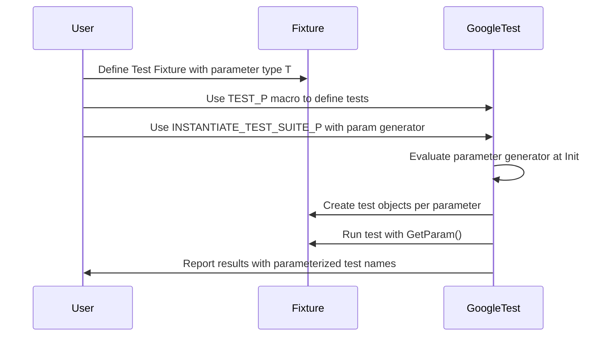

# Value and Type-Parameterized Tests

GoogleTest offers powerful features called **value-parameterized tests** and **type-parameterized tests** that enable you to write reusable, scalable tests that run the same logic over multiple inputs or types. These capabilities empower you to avoid code duplication, achieve thorough coverage of your code’s behavior, and systematically verify different scenarios and implementations.

---

## Value-Parameterized Tests

Value-parameterized tests allow you to run the same test logic with different input values without duplicating the test code. This is especially useful when:

- Your tested code behaves differently based on input data or flags.
- You want to test several implementations of the same interface.
- You want comprehensive data-driven tests.

### How to Write Value-Parameterized Tests

1. **Define a Test Fixture Class with a Parameter Type:**

Create a fixture class derived from either:

  - `testing::TestWithParam<T>`, which inherits from both `testing::Test` and `WithParamInterface<T>`, or
  - separately from `testing::Test` and `testing::WithParamInterface<T>`, if your test hierarchy is complex.

`T` is the type of the parameter to your tests and must be copyable. If it is a raw pointer, you are responsible for its lifetime.

```cpp
class FooTest : public ::testing::TestWithParam<const char*> {
  // Fixture setup, tear-down, and members
};
```


2. **Write Parameterized Test Patterns Using `TEST_P`:**

Use the `TEST_P` macro (note the '_P') to define test functions that use the parameters.

```cpp
TEST_P(FooTest, DoesBlah) {
  EXPECT_TRUE(foo.Blah(GetParam()));  // Access param with GetParam()
}

TEST_P(FooTest, HasBlahBlah) {
  // Another parameterized test
}
```

3. **Instantiate Test Suites with Parameters Using `INSTANTIATE_TEST_SUITE_P`:**

Use one of the parameter generator functions to provide sets of parameter values. GoogleTest includes several generators in the `testing` namespace:

| Generator Function      | Description |
|-------------------------|-------------|
| `Range(begin, end [, step])` | Yields a sequence of values from `begin` up to but not including `end`, stepping by `step` (default 1). |
| `Values(v1, v2, ..., vN)` | Yields an explicit list of values.
| `ValuesIn(container)` or `ValuesIn(begin, end)` | Yields values from containers or iterator ranges.
| `Bool()`                      | Yields `{false, true}` for boolean testing.
| `Combine(g1, g2, ..., gN)`   | Produces the Cartesian product of multiple generators.

Example:

```cpp
INSTANTIATE_TEST_SUITE_P(InstantiationName,
                         FooTest,
                         testing::Values("meeny", "miny", "moe"));
```

This instantiates tests from `FooTest` for each string.

You can instantiate the same test suite multiple times with different prefixes:

```cpp
const char* pets[] = {"cat", "dog"};
INSTANTIATE_TEST_SUITE_P(PetTests, FooTest, testing::ValuesIn(pets));
```

This produces test names like `InstantiationName/FooTest.DoesBlah/0` or `PetTests/FooTest.DoesBlah/1`.

### Customizing Test Names for Parameters

The optional last argument to `INSTANTIATE_TEST_SUITE_P` allows you to specify a function or functor to generate custom test suffixes based on parameter values. This improves readability when test parameters don't produce useful default names.

Example:

```cpp
INSTANTIATE_TEST_SUITE_P(
    CustomNames,
    FooTest,
    testing::Values("alpha", "beta"),
    [](const testing::TestParamInfo<FooTest::ParamType>& info) {
      std::string name = info.param;
      std::replace_if(name.begin(), name.end(),
                      [](char c) { return !std::isalnum(c); }, '_');
      return name;
    });
```

Note that test names must be ASCII alphanumeric or underscores, unique, and non-empty.

### Using `ConvertGenerator` for Custom Parameter Types

If your test fixture’s parameter type is not *directly* constructible from the parameter generator elements, you can use `ConvertGenerator<T>` to convert parameters to the desired type:

```cpp
INSTANTIATE_TEST_SUITE_P(MyInstantiation, MyTestSuite,
    ConvertGenerator<MyParamType>(testing::Combine(...)));
```

You can also provide a callable for custom casting:

```cpp
INSTANTIATE_TEST_SUITE_P(
    MyInstantiation, MyTestSuite,
    ConvertGenerator(Combine(...), [](const std::tuple<int, bool>& t){
      return MyParam(std::get<0>(t), std::get<1>(t));
    }));
```


### Practical Tips

- Always instantiate *all* tests of a test pattern you want to run. Missing instantiations trigger errors.
- Use `GTEST_ALLOW_UNINSTANTIATED_PARAMETERIZED_TEST(FooTest);` to suppress failures if a parameterized test suite intentionally has no instantiations.
- The parameter generator expression evaluates only after `InitGoogleTest()` runs, so you can initialize parameters dynamically before that.


## Type-Parameterized Tests

Type-parameterized tests let you run the same test logic over different types. This is valuable when:

- Testing multiple implementations of an interface.
- Verifying that various types conform to a concept.

### Steps to Define Type-Parameterized Tests

1. **Define a Fixture Class Template:**

Create a template class derived from `testing::Test`:

```cpp
template <typename T>
class FooTest : public testing::Test {
  // Fixture members and methods
};
```

2. **Declare the Test Suite as Type-Parameterized Using `TYPED_TEST_SUITE_P`:**

```cpp
TYPED_TEST_SUITE_P(FooTest);
```

3. **Define Typed Tests with `TYPED_TEST_P`:**

Use `TYPED_TEST_P` to define test bodies, using the special `TypeParam` to refer to the type:

```cpp
TYPED_TEST_P(FooTest, DoesBlah) {
  TypeParam value = TypeParam();
  ...
}
```

4. **Register Tests for the Type-Parameterized Test Suite:**

List all `TYPED_TEST_P` test names:

```cpp
REGISTER_TYPED_TEST_SUITE_P(FooTest, DoesBlah, HasPropertyA);
```

5. **Instantiate the Test Suite for Specific Types:**

Use `INSTANTIATE_TYPED_TEST_SUITE_P` to bind type lists:

```cpp
using MyTypes = testing::Types<int, double, std::string>;
INSTANTIATE_TYPED_TEST_SUITE_P(MyTypeList, FooTest, MyTypes);
```

### Notes

- Instantiations can be done multiple times with different sets of types.
- When the type list contains a single type, you may provide it without wrapping in `Types<>`.
- `TypeParam` is the special name inside typed tests that refers to the type parameter.


## Best Practices and Tips

- Derive your parameterized fixtures from `TestWithParam<T>` or from `Test` and `WithParamInterface`.
- Use parameter generators provided by GoogleTest for common scenarios.
- Consider defining custom parameter-to-test name mappings for clarity in test results.
- If your parameter type requires conversion, use `ConvertGenerator` to transform test parameters.
- Use `GTEST_ALLOW_UNINSTANTIATED_PARAMETERIZED_TEST` sparingly to avoid silent test omission.
- For large sets of types or values, parameterized tests are more maintainable than duplicating test code.


## Example: Value-Parameterized Test

```cpp
class MyIntTest : public testing::TestWithParam<int> {};

TEST_P(MyIntTest, IsEven) {
  int n = GetParam();
  EXPECT_EQ(0, n % 2) << n << " is not even";
}

INSTANTIATE_TEST_SUITE_P(EvenNumbers, MyIntTest, testing::Values(2, 4, 6, 8));
```

## Example: Combine Generator

When testing a function with two parameters, you can generate all combinations:

```cpp
INSTANTIATE_TEST_SUITE_P(
  AllPairs, MyTest,
  testing::Combine(testing::Values(1, 2), testing::Values('a', 'b')));
```

## Example: Type-Parameterized Test

```cpp
template <typename T>
class FooTest : public testing::Test {
 public:
  T value_;
};

TYPED_TEST_SUITE_P(FooTest);

TYPED_TEST_P(FooTest, IsDefaultConstructible) {
  TypeParam n = this->value_;
  EXPECT_TRUE(sizeof(n) > 0);
}

REGISTER_TYPED_TEST_SUITE_P(FooTest, IsDefaultConstructible);

using MyTypes = testing::Types<int, double, std::string>;
INSTANTIATE_TYPED_TEST_SUITE_P(MyTypesInst, FooTest, MyTypes);
```


## Integration Points

- See [Testing Reference](reference/testing.md) for the API of `TEST_P`, `INSTANTIATE_TEST_SUITE_P`, and `TestWithParam`.
- Review [GoogleTest Primer](docs/primer.md#value-parameterized-tests) for concepts and workflow.
- For advanced uses and tips (e.g., abstract tests), see [GoogleTest Advanced Topics](docs/advanced.md#value-parameterized-tests).


---

## Troubleshooting

- **Missing Instantiations:** Any `TEST_P` test suite must be instantiated using `INSTANTIATE_TEST_SUITE_P` or be marked with `GTEST_ALLOW_UNINSTANTIATED_PARAMETERIZED_TEST`.
- **Parameter Name Collisions:** Ensure test suite and test names do not contain underscores as GoogleTest reserves `_`.
- **Conversion Issues:** When using `ConvertGenerator`, ensure lifetimes are valid to avoid dangling references.
- **Test Suite Mixing:** A test suite must use the same fixture class for all tests, do not mix `TEST` and `TEST_F` in one suite.


## References

- [`TEST_P` Macro](reference/testing.md#TEST_P)
- [`INSTANTIATE_TEST_SUITE_P` Macro](reference/testing.md#INSTANTIATE_TEST_SUITE_P)
- [`TestWithParam<T>` Class](reference/testing.md#TestWithParam)
- [Value-Parameterized Tests Guide](docs/advanced.md#value-parameterized-tests)
- [Type-Parameterized Tests Guide](docs/advanced.md#typed-tests)


## Summary

Value and type-parameterized tests in GoogleTest are essential tools for writing flexible, reusable tests that run against multiple input values or types. They enable composable test logic, help reduce duplication, and improve test coverage substantially, particularly for data-driven and interface-based testing scenarios.

---

## Diagram: Parameterized Test Flow



