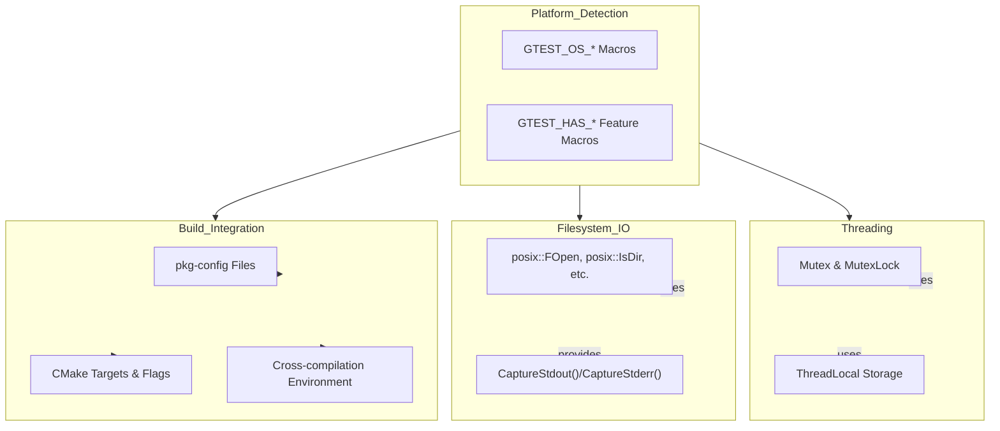

# Portability & Platform Utilities

GoogleTest offers a robust set of platform abstraction APIs and utilities designed to ensure seamless integration across a broad range of C++ compilers, operating systems, and dependency management scenarios. This page focuses on the mechanisms and macros that allow GoogleTest and GoogleMock to remain portable, configurable, and compatible with diverse environments — empowering you to write tests that work everywhere.

---

## Environment Detection & Configuration

GoogleTest uses the internal header `gtest-port.h` to detect environment capabilities and configure features accordingly. This includes automatic detection or user overrides of:

- Available platforms and operating systems (Windows, Linux, macOS, Android, embedded systems, etc.)
- Supported compiler features (C++17 compliance, RTTI, exceptions)
- Threading and synchronization primitives (pthreads, Windows mutexes)
- Support for POSIX features like `clone()`, regular expressions, and stream redirection

### Platform Macros

GoogleTest defines `GTEST_OS_*` macros for supported platforms, set to `1` if compiling on that platform. Examples:

- `GTEST_OS_LINUX`
- `GTEST_OS_WINDOWS`
- `GTEST_OS_MAC`
- `GTEST_OS_ANDROID`

You can also override or query features with macros like `GTEST_HAS_EXCEPTIONS`, `GTEST_HAS_RTTI`, `GTEST_HAS_PTHREAD`, and others, all set to `1` or `0`.

### Customizing Environment Detection

If automatic detection fails or your environment requires special handling, you can define these macros explicitly when compiling GoogleTest:

```bash
-DGTEST_HAS_EXCEPTIONS=0 \
-DGTEST_HAS_RTTI=1 \
-DGTEST_HAS_PTHREAD=1
```

This flexibility helps maintain performance and compatibility when integrating into non-standard or legacy systems.

---

## Threading & Synchronization Support

For thread-safe execution of tests, GoogleTest provides platform-adaptive synchronization utilities:

### Mutex & Locking Primitives

- On pthreads-based platforms, `Mutex` uses `pthread_mutex_t`.
- On Windows, `Mutex` is implemented with Windows Critical Sections.
- When threading support is not detected or disabled, dummy implementations allow compilation but without safety guarantees.

GoogleTest exposes `Mutex` and `MutexLock` types for scoped locking, facilitating safe concurrent test runs.

### Thread Local Storage

GoogleTest supports thread-local storage with:

- Native `thread_local` when available.
- Pthreads `pthread_key_create` methods on POSIX platforms.
- Windows TLS APIs on Windows.

This enables tests and internal state to keep thread-specific data reliably.

---

## Filesystem & IO Abstraction

To ensure file and directory operations work consistently:

- GoogleTest wraps file system calls with the `posix` namespace, e.g., `posix::FOpen()`, `posix::RmDir()`, `posix::IsDir()`.
- These wrappers abstract platform differences such as `_wfopen` on Windows vs `fopen` on Unix-like systems.
- Stream redirection utilities support capturing stdout/stderr for test verification.

---

## Character Handling Utilities

GoogleTest provides robust character classification and conversion utilities to handle differences in locales and encoding:

- Functions such as `IsAlpha()`, `IsDigit()`, `IsSpace()`, `ToLower()`, and `ToUpper()` safely cast characters before applying ctype functions.
- There is support for various character types including `char8_t`, `char16_t`, and wide character types.

These utilities help maintain consistent string and text processing in assertions and matchers.

---

## Build System Integration

GoogleTest includes `pkg-config` files and CMake utilities to simplify including it in your build system with the correct flags:

### Using pkg-config

- `.pc` files define compiler flags (`-I` paths, `-D` macros), linker flags (`-L` library paths), and required libraries (e.g., `-lgtest`, `-lpthread`).
- Example for CMake:

```cmake
find_package(PkgConfig REQUIRED)
pkg_search_module(GTEST REQUIRED gtest_main)

add_executable(mytest tests/my_test.cc)
target_compile_options(mytest PRIVATE ${GTEST_CFLAGS})
target_link_libraries(mytest PRIVATE ${GTEST_LDFLAGS})

enable_testing()
add_test(NAME MyTest COMMAND mytest)
```

### Cross-Compilation Support

- GoogleTest supports cross-compilation by properly configuring `PKG_CONFIG_PATH`, `PKG_CONFIG_SYSROOT_DIR`, and related environment variables
- This ensures that include and library paths point to the target sysroot instead of the host system.

Refer to the `docs/pkgconfig.md` for a full practical guide covering native and cross-compile scenarios.

---

## Command Line Flags & Macros

GoogleTest and GoogleMock leverage configurable command-line flags internally:

- Flags are declared using either Abseil's flag system or internal macros, offering compatibility and extensibility.
- Flag names are prefixed (e.g., `gtest_`, `gmock_`), and can be accessed or set via APIs.
- Macros allow customization of logging, checking, and flag definitions, enabling embedding environments to integrate or override behaviors.

---

## Best Practices for Portable Testing

- Always verify platform macros (`GTEST_OS_*`) if your tests are platform-dependent.
- Use GoogleTest threading and synchronization APIs (`Mutex`, `MutexLock`, `ThreadLocal`) for concurrency.
- Rely on GoogleTest's filesystem abstractions for file access.
- Prefer `InitGoogleTest()` to initialize flags and environment detection before running tests.

---

## Troubleshooting & Tips

<Tip>
If you encounter build failures due to missing threading support or environment macros, explicitly define `-DGTEST_HAS_PTHREAD=1` or `0` as appropriate.

Set `-DGTEST_HAS_EXCEPTIONS=0` if exceptions are disabled in your build.

Use the provided pkg-config files and environment variables carefully to ensure all compiler and linker flags are correctly set for your platform.

Refer to the `getting-started/prerequisites-installation/system-requirements` page for platform-specific compiler support.
</Tip>

<Warning>
Avoid calling GoogleTest or GoogleMock internal macros directly; use public API macros and functions to ensure portability.
Customizing macros should be done only via the documented injection points (`custom/gtest-port.h`, `custom/gmock-port.h`).
</Warning>

---

## See Also

- [Getting Started: System Requirements](https://github.com/google/googletest/blob/main/docs/getting-started/prerequisites-installation/system-requirements.mdx)
- [Build with pkg-config and CMake](https://github.com/google/googletest/blob/main/docs/pkgconfig.md)
- [Internal Portability Header (`gtest-port.h`)](https://github.com/google/googletest/blob/main/googletest/include/gtest/internal/gtest-port.h)
- [GoogleMock Portability (`gmock-port.h`)](https://github.com/google/googletest/blob/main/googlemock/include/gmock/internal/gmock-port.h)
- [Basic Configuration Guide](https://github.com/google/googletest/blob/main/docs/getting-started/initial-configuration-validation/basic-configuration.mdx)

---

## Diagram: GoogleTest Portability Overview



---

By leveraging GoogleTest's portable APIs and build integrations, you can confidently develop and execute robust C++ tests across diverse platforms and toolchains.
