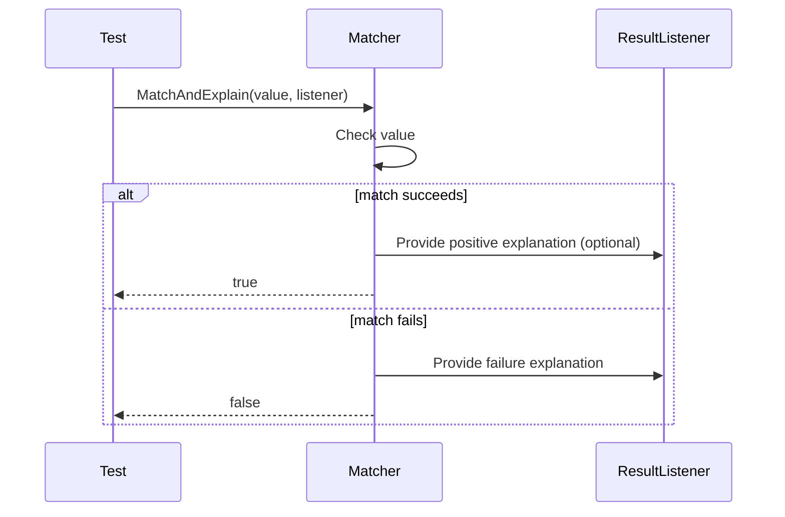

# Matchers: Built-In and Custom

GoogleTest's matcher framework provides an expressive and extensible way to specify expectations on values passed to mocks or values verified in assertions. This page documents the matcher framework and the key built-in matchers offered by GoogleTest, covering comparison, string, container, pointer, and composite matchers. It also details how to create your own custom matchers for more specialized needs.

---

## Overview of Matchers

A matcher is a unary predicate-like object that checks whether a value meets certain criteria. Matchers are central to mocking and assertion APIs like `EXPECT_CALL` and `EXPECT_THAT`, enabling expressive verification of argument values and return values.

Matchers can be:

- Polymorphic: usable against multiple types (e.g., `Eq(5)` can match ints, floats, doubles).
- Monomorphic: usable against a specific type only.

You use matchers mostly inside mock expectations or assertions, for example:

```cpp
EXPECT_CALL(mock_obj, DoSomething(Gt(5)));
EXPECT_THAT(actual_value, StartsWith("Hello"));
```

---

## Wildcard Matchers

| Matcher                  | Description                               |
| ------------------------ | ----------------------------------------- |
| `_`                      | Matches any value of the correct type.    |
| `A<T>()` or `An<T>()`    | Matches any value of type `T`.             |

The underscore matcher `_` is the simplest wildcard matcher and matches anything without constraint. `A<T>()` and `An<T>()` provide explicit type-based wildcards.

```cpp
EXPECT_CALL(foo, Bar(_));      // matches any argument
EXPECT_CALL(foo, Bar(A<int>()));  // matches any int argument
```

---

## Generic Comparison Matchers

Matchers using standard comparison semantics. They test a relation between the argument and a specified value.

| Matcher          | Semantics                 | Description                         |
| ---------------- | ------------------------- | ----------------------------------- |
| `Eq(value)` or `value` | `arg == value`           | Equals to `value`.                  |
| `Ne(value)`      | `arg != value`            | Not equals to `value`.              |
| `Lt(value)`      | `arg < value`             | Less than `value`.                  |
| `Le(value)`      | `arg <= value`            | Less than or equal to `value`.     |
| `Gt(value)`      | `arg > value`             | Greater than `value`.               |
| `Ge(value)`      | `arg >= value`            | Greater than or equal to `value`.  |
| `IsTrue()`       | `arg` converts to true   | Is true in Boolean context.         |
| `IsFalse()`      | `arg` converts to false  | Is false in Boolean context.        |
| `DistanceFrom(target, m)` | `abs(arg - target)` matches `m`  | Checks the distance.               |

### Example

```cpp
EXPECT_THAT(my_value, AllOf(Ge(0), Le(10)));  // 0 <= my_value <= 10
EXPECT_CALL(mock, Foo(Eq(42)));
```

---

## Floating-Point Matchers

To cope with the inherent imprecision of floating-point arithmetic, GoogleTest provides specialized matchers:

| Matcher                          | Description                                                                               |
| -------------------------------- | ----------------------------------------------------------------------------------------- |
| `DoubleEq(value)`                | Matches if the argument is approximately equal to `value` (double), NaNs not equal.         |
| `FloatEq(value)`                 | Matches if the argument is approximately equal to `value` (float), NaNs not equal.          |
| `NanSensitiveDoubleEq(value)`   | Approximate equality including treating NaNs as equal (double).                            |
| `NanSensitiveFloatEq(value)`    | Approximate equality including treating NaNs as equal (float).                             |
| `DoubleNear(value, max_error)`  | Matches if the double is within `max_error` of `value`, NaNs not equal.                     |
| `FloatNear(value, max_error)`   | Matches if the float is within `max_error` of `value`, NaNs not equal.                      |
| `NanSensitiveDoubleNear(value, max_error)` | Like `DoubleNear` but treats NaNs as equal.                                          |
| `NanSensitiveFloatNear(value, max_error)`  | Like `FloatNear` but treats NaNs as equal.                                            |
| `IsNan()`                       | Matches any NaN floating-point value.                                                     |

Example:

```cpp
EXPECT_CALL(mock, Compute(DoubleNear(3.14, 0.01)));
EXPECT_THAT(result, FloatEq(2.71828));
```

---

## String Matchers

These matchers work with C strings as well as `std::string` (and wide string variants when supported):

| Matcher                 | Description                                                     |
| ----------------------- | --------------------------------------------------------------- |
| `StrEq(string)`         | String equals `string` (case-sensitive).                        |
| `StrNe(string)`         | String not equals `string` (case-sensitive).                    |
| `StrCaseEq(string)`     | String equals `string` ignoring case.                           |
| `StrCaseNe(string)`     | String not equals `string` ignoring case.                       |
| `HasSubstr(string)`     | Contains the given substring.                                   |
| `StartsWith(prefix)`    | Starts with the given prefix.                                   |
| `EndsWith(suffix)`      | Ends with the given suffix.                                     |
| `IsEmpty()`             | Matches empty strings.                                          |
| `MatchesRegex(regex)`   | Matches full string regular expression.                        |
| `ContainsRegex(regex)`  | Contains matching substring for regex.                         |
| `WhenBase64Unescaped(m)` | Matches base64 escaped strings whose unescaped form matches matcher `m`. |

### Examples

```cpp
EXPECT_THAT(name, StartsWith("John"));
EXPECT_CALL(mock, Print(StrCaseEq("hello")));
EXPECT_THAT(text, MatchesRegex("^Hello.*World$"));
```

---

## Exception Matchers

Matchers designed to work on callables and verify exceptions thrown:

| Matcher                 | Description                                                  |
| ----------------------- | ------------------------------------------------------------ |
| `Throws<E>()`           | Callable throws exception of type `E`.                      |
| `Throws<E>(m)`          | Callable throws exception `E` and the exception satisfies matcher `m`. |
| `ThrowsMessage<E>(m)`   | Callable throws exception `E` with message matching matcher `m`. |

Example:

```cpp
EXPECT_THAT([] { throw std::runtime_error("err"); }, Throws<std::runtime_error>());
EXPECT_THAT([] { throw std::runtime_error("msg"); }, ThrowsMessage<std::runtime_error>(HasSubstr("msg")));
```

---

## Container Matchers

Designed for STL-style containers, native arrays, and any container supporting the iterator interface.

| Matcher                   | Description                                                                                                     |
| ------------------------- |--------------------------------------------------------------------------------------------------------------- |
| `IsEmpty()`               | Matches empty containers (via `.empty()`).                                                                     |
| `SizeIs(m)`               | Matches containers whose size matches matcher `m` (e.g. `SizeIs(2)`).                                          |
| `BeginEndDistanceIs(m)`   | Matches containers where the iterator distance between `begin()` and `end()` matches `m`.                       |
| `ContainerEq(c)`          | Matches containers equal to `c` with detailed failure info showing missing or extra elements.                  |
| `WhenSorted(m)`           | Matches containers that match `m` when sorted with `operator<`.                                               |
| `WhenSortedBy(comp, m)`   | Matches containers that match `m` when sorted by comparator `comp`.                                           |
| `ElementsAre(e0, e1, ...)`| Matches containers whose elements match each matcher/element exactly in order.                                |
| `ElementsAreArray(...)`  | Like above but accepts arrays, initializer lists, iterators, or containers as the expected sequence.           |
| `UnorderedElementsAre(e0, e1, ...)` | Matches containers with elements matching all provided matchers ignoring order.                        |
| `UnorderedElementsAreArray(...)` | Like above but for arrays, initializer lists, or iterators.                                            |
| `IsSubsetOf(...)`         | Matches if container is subset of expected elements, order ignored.                                            |
| `IsSupersetOf(...)`       | Matches if container is superset including all expected elements, order ignored.                               |
| `Contains(e)`             | Matches containers containing at least one element matching `e`.                                              |
| `Contains(e).Times(n)`    | Matches containers where exactly `n` elements match `e`.                                                      |
| `Each(e)`                 | Matches containers where *all* elements match `e`.                                                             |
| `Pointwise(m, c)`         | Matches containers with elements pairwise matching `m` with container `c`. Order matters.                      |
| `UnorderedPointwise(m, c)`| Like `Pointwise` but disregarding order.                                                                        |

### Examples

```cpp
EXPECT_THAT(vec, ElementsAre(1, Ge(2), _));
EXPECT_CALL(mock, Func(UnorderedElementsAre(3, 1, 2)));
EXPECT_THAT(set, Contains(Ge(10)));
EXPECT_THAT(map, Contains(Key(Eq(42))));
```

---

## Member Matchers

Matchers for matching the values of object fields, properties (getter methods), or unique keys.

| Matcher                         | Description                                             |
| ------------------------------- | ------------------------------------------------------- |
| `Field(&Class::field, m)`       | Matches a member field `field` of an object matching `m`. Supports pointers too. |
| `Field(name, &Class::field, m)` | Same as above but includes field name for better error messages.         |
| `Property(&Class::property, m)` | Matches the return value of a const, no-arg member function `property()` that matches `m`. |
| `Property(name, &Class::property, m)` | Same as above but with property name in error messages.       |
| `Key(m)`                       | Matches the `.first` field of a `std::pair` or map element matching `m`.        |
| `Pair(m1, m2)`                 | Matches a `std::pair` whose `.first` matches `m1` and `.second` matches `m2`.     |
| `FieldsAre(m...)`              | Matches a tuple-like or aggregate object matching each field with the given matchers piecewise. |
| `Pointee(m)`                  | Matches pointers pointing to values matching `m`. Handles null pointers by failing match. Supports raw and smart pointers. |
| `Pointer(m)`                  | Matches a pointer itself (raw or smart) against matcher `m` for the raw pointer. |
| `Address(m)`                  | Matches the address of an object against matcher `m`.                             |
| `WhenDynamicCastTo<T>(m)`     | Matches if `dynamic_cast<T>` of the argument matches `m`. Requires RTTI.          |

### Examples

```cpp
EXPECT_THAT(foo, Field(&Foo::bar, Ge(5)));
EXPECT_THAT(p, Pair(Ge(5), StartsWith("foo")));
EXPECT_CALL(mock, Func(Pointee(Ne(nullptr))));
EXPECT_THAT(map, Contains(Key(Le(100))));
```

---

## Composite Matchers

Composite matchers combine other matchers with logical operators:

| Matcher           | Behavior                                 |
| ----------------- | ---------------------------------------- |
| `AllOf(m1, m2, ...)` | Matches if all matchers `m1` to `mn` match.                          |
| `AnyOf(m1, m2, ...)` | Matches if any one matcher `m1` to `mn` matches.                      |
| `Not(m)`             | Matches if matcher `m` does *not* match.                            |
| `Conditional(cond, m1, m2)` | Matches `m1` if `cond` is true, else matches `m2`.              |

Available variants like `AllOfArray` or `AnyOfArray` accept containers or arrays of matchers.

### Example

```cpp
EXPECT_THAT(value, AllOf(Ge(5), Lt(10)));
EXPECT_THAT(ptr, Not(IsNull()));
```

---

## Adapters and Utilities

| Function               | Description                                  |
| ---------------------- | -------------------------------------------- |
| `MatcherCast<T>(m)`    | Casts matcher `m` to matcher of type `T`. Unsafe if used incorrectly. |
| `SafeMatcherCast<T>(m)`| Safe version of `MatcherCast` ensuring implicit conversions are safe. |
| `Truly(predicate)`     | Converts a unary predicate to a matcher, useful when no built-in matcher fits. |
| `Matches(m)(value)`    | Returns true if `value` matches matcher `m`, usable as predicate.
| `ExplainMatchResult(m, value, listener)` | Matches `value` against `m` and sends explanation into listener.
| `Value(value, m)`      | Tests if `value` matches `m`.

---

## Writing Custom Matchers

GoogleTest provides the `MATCHER*` family of macros that simplify authoring new matchers with minimal boilerplate.

### Using `MATCHER` Macro

Defines a custom matcher with no parameters:

```cpp
MATCHER(IsDivisibleBy7, "") {
  return (arg % 7) == 0;
}
```

Usage:

```cpp
EXPECT_CALL(mock, Func(IsDivisibleBy7()));
EXPECT_THAT(value, IsDivisibleBy7());
```

You can produce custom failure messages by streaming additional details to `*result_listener`:

```cpp
MATCHER(IsDivisibleBy7, "") {
  if ((arg % 7) == 0) return true;
  *result_listener << "where the remainder is " << (arg % 7);
  return false;
}
```

### Parameterized Matchers

Use `MATCHER_P`, `MATCHER_P2`, ... up to `MATCHER_P10` macros to define matchers that take parameters:

```cpp
MATCHER_P(HasAbsoluteValue, value, "") {
  return abs(arg) == value;
}
```

Usage:

```cpp
EXPECT_THAT(x, HasAbsoluteValue(10));
```

The description string can depend on parameters and `negation`:

```cpp
MATCHER_P2(InClosedRange, low, hi,
           negation ? "isn't" : "is" + " in range [" + PrintToString(low) + ", " + PrintToString(hi) + "]") {
  return low <= arg && arg <= hi;
}
```

### Implementing Matcher Interface

For advanced users, custom matchers can be implemented by defining a class with:

- `using is_gtest_matcher = void;`
- `bool MatchAndExplain(const T& value, MatchResultListener* listener) const;`
- `void DescribeTo(std::ostream* os) const;`
- `void DescribeNegationTo(std::ostream* os) const;`

and wrapping it in a factory function returning a `Matcher<T>`.

### Example Custom Matcher Class

```cpp
class DivisibleBy7Matcher {
 public:
  using is_gtest_matcher = void;

  bool MatchAndExplain(int n, MatchResultListener* os) const {
    int rem = n % 7;
    if (rem != 0 && os != nullptr) {
      *os << "the remainder is " << rem;
    }
    return rem == 0;
  }

  void DescribeTo(std::ostream* os) const {
    *os << "is divisible by 7";
  }

  void DescribeNegationTo(std::ostream* os) const {
    *os << "is not divisible by 7";
  }
};

Matcher<int> DivisibleBy7() {
  return DivisibleBy7Matcher();
}
```

---

## Summary

- The Matchers framework is a pivotal part of GoogleTest’s mocking and assertion capabilities.
- It provides a broad variety of built-in matchers covering wildcards, comparisons, floating-point, strings, exceptions, containers, pointers, and objects.
- Composite and adapter matchers let you combine and modify matcher behaviors.
- Custom matchers can be created quickly using `MATCHER*` macros or by implementing matcher classes when finer control or reusability is needed.

---

## Practical Tips

- Use existing built-in matchers whenever possible for clarity and good diagnostics.
- Composite matchers like `AllOf` and `AnyOf` allow precise constraints.
- Use `SafeMatcherCast` to handle type mismatches safely between argument types and matcher types.
- When matching containers, prefer `ElementsAre` and `UnorderedElementsAre` over `Eq` to get richer diagnostics.
- Use `Field` and `Property` to match specific members or getter results when whole-object matching is overspecified.
- Review match failures carefully; many matchers provide detailed explanations.

---

## See Also

- [Expectations, Actions, and Cardinalities](../api-reference/mocking-api/expectations-actions-cardinalities.md) for using matchers with mocks.
- [Assertions: Macros and Predicate Utilities](../api-reference/assertions-and-matchers/assertion-macros.md) for using matchers in assertions.
- [Writing Your First Test](../guides/getting-started/writing-your-first-test.md) for foundational practices.
- [gMock Cookbook](https://google.github.io/googletest/gmock_cook_book.html) for practical recipes.
- [Matchers Reference](../api-reference/assertions-and-matchers/core-matchers.md) (this page).


---

## Code Example: Custom Matcher Using `MATCHER_P`

```cpp
// Define a matcher HasAbsValue that checks whether the absolute value equals
// a parameter 'value'.
MATCHER_P(HasAbsValue, value, "") {
  return std::abs(arg) == value;
}

// Use in a test:
EXPECT_THAT(my_number, HasAbsValue(10));
```

This produces a readable failure message like:

```
Value of: my_number
Expected: has absolute value 10
  Actual: -9
```

## Code Example: Combining Matchers

```cpp
using ::testing::AllOf;
using ::testing::Gt;
using ::testing::Ne;

// Expect argument to be > 5 and not equal to 10.
EXPECT_CALL(mock, Foo(AllOf(Gt(5), Ne(10))));
```

## Code Example: Matching Container Elements

```cpp
using ::testing::ElementsAre;

EXPECT_CALL(mock, ProcessData(ElementsAre(1, _, Ge(3))));
```

Matches containers with 3 elements where:

- The first element is 1.
- The second element can be anything.
- The third element is greater than or equal to 3.

---

## Diagrams

The following Mermaid diagram illustrates the conceptual flow of a matcher interaction:



This captures the key concept: a matcher examines the given value and optionally streams an explanation to a listener, returning true if the match is successful.

---

## Important Notes

- Matchers must be purely functional: no side effects, and deterministic return values.
- Use `Truly()` to wrap predicates without built-in matcher support.
- Beware of implicit conversions that might cause surprising matches.
- You can compose matchers to express complex constraints succinctly.
- Matchers integrate tightly with the `EXPECT_CALL` and `EXPECT_THAT` APIs.

---

This concludes the documentation of GoogleTest's matcher framework and its built-in matchers.