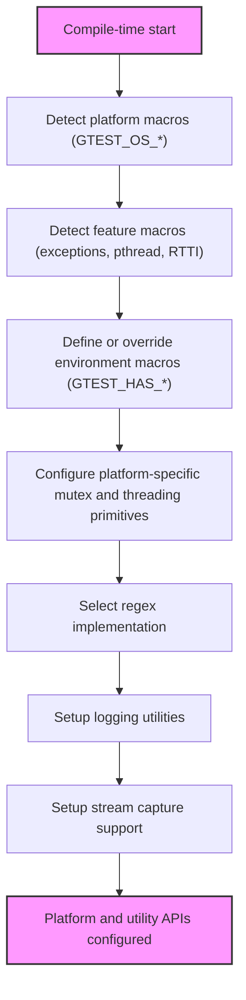

# Portability and Utility APIs Reference

This reference details the foundational low-level utility APIs and macros housed within GoogleTest's portability layer. Specifically, it documents the custom port headers, environment detection macros, synchronization primitives, regular expression utilities, and other internal helpers designed to adapt GoogleTest and GoogleMock seamlessly across diverse compilers, platforms, and runtime environments.

These tools underpin GoogleTest's platform-agnostic capabilities, ensuring consistent behavior whether on Linux, Windows, macOS, embedded systems, or less common environments. They are primarily relevant to contributors seeking to extend or maintain GoogleTest's portability and advanced maintainers customizing builds for uncommon toolchains.

---

## Environment-Describing Macros

GoogleTest adapts to a vast variety of environments by automatically detecting and exposing macros that describe key platform, compiler, and feature availability characteristics. These macros, always defined to 0 or 1, guide conditional compilation and feature enablement.

### User-Tweakable Environment Configuration

Users and maintainers may override detection by defining macros in the build system. This is useful when GoogleTest's automatic detection is insufficient or inaccurate.

#### Key Macros include:

- `GTEST_HAS_CLONE`: Whether the Linux `clone(2)` syscall is present.
- `GTEST_HAS_EXCEPTIONS`: Whether C++ exceptions are enabled.
- `GTEST_HAS_POSIX_RE`: Availability of POSIX regular expressions.
- `GTEST_HAS_PTHREAD`: Pthreads support availability.
- `GTEST_HAS_RTTI`: Whether RTTI is enabled on the compiler.
- `GTEST_HAS_STD_WSTRING`: Availability of `std::wstring` support.
- `GTEST_HAS_FILE_SYSTEM`: Whether a filesystem is present.
- `GTEST_HAS_SEH`: Support for Structured Exception Handling on Windows.
- `GTEST_HAS_STREAM_REDIRECTION`: Whether standard stream redirection is supported.
- `GTEST_LINKED_AS_SHARED_LIBRARY` and `GTEST_CREATE_SHARED_LIBRARY`: Specify shared library build/link status.

> <Tip>Maintainers: Always use `#if` to check these macros. Avoid `#ifdef` as these macros are **always** defined (1 or 0) for consistency.</Tip>

### Platform Indicators

GoogleTest defines a set of macros indicating the platform it is compiled on, such as:

- `GTEST_OS_WINDOWS`, `GTEST_OS_LINUX`, `GTEST_OS_MAC`, `GTEST_OS_CYGWIN`, `GTEST_OS_ANDROID`, `GTEST_OS_FUCHSIA`, among others.

These macros allow GoogleTest internal code to specialize platform-dependent behavior without external interference.

### Feature Indicators

GoogleTest also internally detects feature macros to control the availability of specific GoogleTest capabilities:

- `GTEST_HAS_DEATH_TEST`
- `GTEST_HAS_TYPED_TEST`
- `GTEST_IS_THREADSAFE`
- `GTEST_USES_RE2`, `GTEST_USES_POSIX_RE`, and `GTEST_USES_SIMPLE_RE` for regex implementations
- `GTEST_HAS_ABSL` indicating Abseil integration

These macros help you write conditional test code or extensions that require a particular feature.

---

## Synchronization Primitives

GoogleTest provides its own abstractions over mutexes, locks, and thread-local storage, enabling thread safety where supported.

### Mutex and MutexLock

Depending on platform capabilities:

- On Windows, uses native critical sections (`CRITICAL_SECTION`).
- On pthreads-enabled platforms, uses `pthread_mutex_t`.
- On platforms without threading support, uses dummy implementations.

**Usage**:

```cpp
// Declare a static mutex.
GTEST_DECLARE_STATIC_MUTEX_(my_mutex);

// Define it in exactly one source file.
GTEST_DEFINE_STATIC_MUTEX_(my_mutex);

MutexLock lock(&my_mutex);  // Acquires mutex, releases on destruction.
```

Mutexes support methods:
- `Lock()`
- `Unlock()`
- `AssertHeld()` (assert current thread holds the mutex)

### ThreadLocal Storage

A template `ThreadLocal<T>` provides per-thread storage. It guarantees:

- Each thread sees its own copy with a default or user-provided initial value.
- Storage is cleaned up when threads exit.
- Should be destroyed when only one thread remains accessing it.

Example:

```cpp
ThreadLocal<int> tl(100);  // Default 100 for each thread.
tl.set(150);              // Change for current thread only.
int val = tl.get();       // Gets current thread's value.
```

### Notifications

A `Notification` class allows one thread to notify others to start or continue execution. Intended mainly for internal GoogleTest testing, not for user tests.

### Thread With Param

A helper to create threads running parameterized functions, implemented differently on Windows and pthread platforms. Designed for internal use.

---

## Regular Expressions (RE)

GoogleTest internally wraps regex support behind the class `RE` to handle three cases:

- Using [RE2](https://github.com/google/re2), preferred when using Abseil.
- Using POSIX Extended Regular Expressions on supported UNIX-like systems.
- Falling back to a simplified own regex implementation otherwise.

Example usage:

```cpp
RE regex("\d+");
bool full_match = RE::FullMatch("123", regex);
bool partial_match = RE::PartialMatch("a123b", regex);
```

`RE` supports copy construction and string-based construction.

---

## Logging Utilities

GoogleTest provides scoped logging utilities via the `GTestLog` class and the `GTEST_LOG_(severity)` macro. Messages are streamed and flushed on destruction.

Severity levels include:

- `GTEST_INFO`
- `GTEST_WARNING`
- `GTEST_ERROR`
- `GTEST_FATAL` (terminates the program after logging)

Example:

```cpp
GTEST_LOG_(INFO) << "Starting test execution...";
```

---

## Stream Capturing

When supported, `CaptureStdout()` and `CaptureStderr()` allow capturing output streams during tests.

Use cases include verifying that code writes expected output to stdout or stderr.

```cpp
CaptureStdout();
// code that writes to stdout
std::string output = GetCapturedStdout();
```

---

## File Utilities

GoogleTest internal utilities include:

- `GetFileSize(FILE* file)`: returns file size in bytes.
- `ReadEntireFile(FILE* file)`: returns the file's contents as a string.

These utilities are used internally and not generally exposed to user tests.

---

## Command-Line and Environment Variable Utilities

GoogleTest provides utilities to parse environment variables and flags at runtime:

- `GetEnv(const char* name)`: safe environment variable accessor.
- `BoolFromGTestEnv()`, `Int32FromGTestEnv()`, and `StringFromGTestEnv()` for typed flag parsing.

---

## Internal Macro Utilities

GoogleTest defines numerous internal macros to support portability and compiler quirks:

- Ambiguous else-blocker to avoid warnings on some compilers.
- Feature-detection style macros for C++ attributes and compiler support.
- Attribute annotations for `printf`-style formatting, no-inline functions, and sanitizer suppressions.
- Macros to suppress MSVC warnings in specific sections.
- Safe casts (`ImplicitCast_`), and checked downcasts with RTTI verification.

> <Note>The majority of these are internal and should not be used outside GoogleTest itself.</Note>

---

## Platform Wrappers and POSIX Layer

Within the `posix` namespace, GoogleTest defines wrappers for platform-level APIs with these objectives:

- Provide consistent APIs for functions like `chdir()`, `stat()`, `remove directory`, `isatty()`, `file number retrieval`, and `string case-insensitive comparison` across Windows and Unix-like OSes.
- Work around embedded platform limitations where environment variables or file system calls may be missing.
- Manage differences such as windows using `_stat` vs `stat` or `_stricmp` vs `strcasecmp`.

Example:

```cpp
int fd = posix::FileNo(file_ptr);
bool is_tty = posix::IsATTY(fd);
```

---

## Thread Safety and Multi-threading Support

GoogleTest enables thread safety where supported, detecting capabilities at compile-time and providing thread synchronization accordingly.

If threading is unavailable, dummy implementations are used to avoid compilation errors but do not provide actual concurrency safety.

For platforms with pthreads or Windows threading, GoogleTest uses native APIs for mutexes, thread local storage, and notifications.

The `GTEST_IS_THREADSAFE` macro indicates availability of threading support.

---

## Key Usage and Contribution Notes

- These portability and utility APIs are fundamental and included in almost all GoogleTest source files.
- They abstract away compiler, OS, and environment differences to provide a consistent platform for the higher layers of GoogleTest and GoogleMock.
- Users writing tests are unlikely to interact with these directly.
- Contributors extending GoogleTest to new platforms or fixing platform-specific issues will work with these APIs.
- Custom port headers can be used by maintainers to inject platform-specific overrides.

---

## Practical Tips

- **Do not use internal macros or classes (ending in `_`) directly in tests.** They are subject to change.
- **Override environment macros only in your build system when automatic detection fails.**
- **For thread safety, check `GTEST_IS_THREADSAFE` if your test environment requires concurrency.**
- **Use the provided thread local and synchronization classes when adding concurrency features to internals.**
- **For logging in your tests, rely on the public GoogleTest APIs, not `GTestLog` directly.**
- **Capture stream output only when platform macros indicate it is supported (`GTEST_HAS_STREAM_REDIRECTION`).**

---

## Example Snippets

### Using Mutex and Lock
```cpp
// Declare and define a static mutex somewhere in your source.
GTEST_DECLARE_STATIC_MUTEX_(my_mutex);
GTEST_DEFINE_STATIC_MUTEX_(my_mutex);

void ThreadSafeFunction() {
  MutexLock lock(&my_mutex);  // Scoped lock
  // critical section code
}
```

### Using ThreadLocal Storage
```cpp
ThreadLocal<int> thread_counter(0);

void IncrementCounter() {
  int val = thread_counter.get();
  thread_counter.set(val + 1);
}
```

### Checking Exceptions Availability
```cpp
#if GTEST_HAS_EXCEPTIONS
try {
  // Code that might throw
} catch(...) {
  // Handle exceptions
}
#endif
```

---

## Troubleshooting and Common Issues

- **Build failures due to missing C++17 support**: This layer requires C++17 or later.
- **Threading support absent or inconsistent**: If `GTEST_IS_THREADSAFE` is 0, ensure your platform and build define `GTEST_HAS_PTHREAD` or equivalent.
- **Unexpected macro conflicts**: User builds should avoid redefining platform macros.
- **Regex inconsistencies**: If your platform lacks POSIX regex or RE2, GoogleTest uses a fallback but with limited features.
- **Stream capturing unavailable**: Check `GTEST_HAS_STREAM_REDIRECTION` before relying on it.

If you encounter platform-specific issues, consult the custom port header and consider submitting patches.

---

## Related Documentation

- [Supported Platforms](https://github.com/google/googletest/tree/main/docs/platforms.md) — Overview of officially supported OS and compiler environments.
- [GoogleTest Primer](reference/primer.md) — Learn the basics of writing tests.
- [Integration with Build Systems](https://github.com/google/googletest/tree/main/guides/integration-and-advanced-usage/build-integration.mdx) — How to build and link GoogleTest.
- [Mocking Reference](reference/mocking-framework/) — For related mock usage.

---

## Diagram: Platform & Feature Detection Flow


---

<Check>
This page documents GoogleTest's internal portability and utility APIs provided primarily by `gtest-port.h` and related headers. They enable seamless adaptation to differing compilers, OSes, threading models, exception support, and runtime environments. Use this as a reference when contributing or customizing GoogleTest/GoogleMock for specific environments.
</Check>
