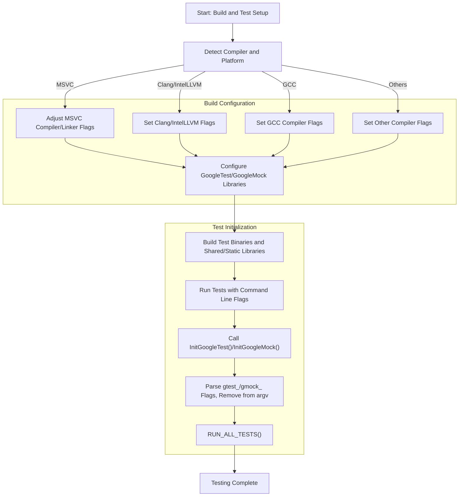

# Framework and Environment Configuration

GoogleTest and GoogleMock provide several configuration mechanisms that enable you to tailor the framework's behavior to your development environment and testing needs. This page focuses on flags, environment variables, initialization APIs, and platform-specific configurations that influence compilation, runtime behavior, and integration.

---

## 1. Initialization of GoogleTest and GoogleMock

To use GoogleTest and GoogleMock effectively, you must initialize the testing framework properly. Initialization parses command-line flags specific to both libraries and prepares the runtime environment.

### Initialization Functions

- **`testing::InitGoogleTest(int* argc, char** argv)`**
  - Parses GoogleTest-specific command line flags.
  - Removes recognized flags from `argv` and adjusts `argc` accordingly.
  - Must be called before running tests.

- **`testing::InitGoogleMock(int* argc, char** argv)`**
  - Calls `InitGoogleTest` internally since GoogleMock depends on GoogleTest.
  - Parses GoogleMock-specific flags such as verbosity and mock behavior.
  - Removes GoogleMock flags from the `argv` list.
  - Overloads exist to support `wchar_t** argv` on Windows and embedded platforms without `argc`/`argv`.

#### Example: Typical Initialization in `main()`
```c++
int main(int argc, char** argv) {
  testing::InitGoogleMock(&argc, argv); // Initializes both GoogleMock and GoogleTest
  return RUN_ALL_TESTS();
}
```

### Flag Parsing Behavior

`InitGoogleMock` and `InitGoogleTest` process the command line by removing flags they recognize (e.g., those prefixed by `--gtest_` or `--gmock_`). This ensures no conflicts or confusion in later stages of the program.

Common flag parsing tests demonstrate that unrecognized flags remain untouched, preserving user flags not belonging to GoogleTest/GoogleMock.

---

## 2. GoogleMock Flags and Customization

GoogleMock exposes several public flags to control its internal behaviors and output verbosity.

| Flag Name                 | Description                                                                               | Example Usage                       |
|---------------------------|-------------------------------------------------------------------------------------------|-----------------------------------|
| `--gmock_verbose`          | Controls output verbosity. Accepted values: `info`, `warning`, or `error`.               | `--gmock_verbose=info`             |
| `--gmock_default_mock_behavior` | Sets the default mock behavior: `0`=NiceMock, `1`=NaggyMock (default), `2`=StrictMock. | `--gmock_default_mock_behavior=2` |
| `--gmock_catch_leaked_mocks`   | If `true` (default), reports leaked mocks as test failures.                             | `--gmock_catch_leaked_mocks=false` |

These flags can be set via the command line and also queried or modified programmatically.

### Accessing Flags in Code

GoogleMock defines macros to access flags safely:

- `GMOCK_FLAG_GET(flag_name)` - retrieves the current value
- `GMOCK_FLAG_SET(flag_name, value)` - sets a new value

Example:
```c++
bool verbose = GMOCK_FLAG_GET(verbose) == "info";
GMOCK_FLAG_SET(verbose, "warning");
```

### Defining Custom Flags

If your testing infrastructure requires user-specific configuration points, GoogleMock provides a mechanism for defining and declaring flags via the header `gmock-port.h` located in the `custom` directory.

| Macro                      | Purpose                                       |
|----------------------------|-----------------------------------------------|
| `GMOCK_DEFINE_bool_(name, default_val, doc)` | Define a bool flag        |
| `GMOCK_DEFINE_int32_(name, default_val, doc)`| Define an int32 flag      |
| `GMOCK_DEFINE_string_(name, default_val, doc)`| Define a string flag      |
| `GMOCK_DECLARE_bool_(name)`    | Declare a bool flag (extern)                    |
| `GMOCK_DECLARE_int32_(name)`   | Declare an int32 flag (extern)                  |
| `GMOCK_DECLARE_string_(name)`  | Declare a string flag (extern)                  |

Use these macros to configure and extend flag controls tailored to your environment.

---

## 3. Platform and Compiler Compatibility Configuration

GoogleTest and GoogleMock require a C++17 compatible environment and support a wide variety of compilers and platforms, including Windows (MSVC), Linux (GCC, Clang), macOS, and some embedded systems.

### Compiler and Linker Flags

When building GoogleTest/GoogleMock, several compiler flags need to be carefully managed to ensure compatibility, warnings control, exception handling, runtime linkage, and encoding support.

GoogleTest provides CMake macros to configure these flags automatically:

- `fix_default_compiler_settings_()` : Adjusts defaults based on compiler (e.g., MSVC warning levels, static vs shared CRT linking).
- `config_compiler_and_linker()` : Sets up the appropriate flags including exception and RTTI settings.

#### Notable Platform-Specific Adjustments

| Platform/Compiler        | Adjustments and Notes                                                                                  |
|------------------------|------------------------------------------------------------------------------------------------------|
| MSVC                   | Replaces `/MD` with `/MT` for static CRT by default; Raises warning level to /W4; Supports UTF-8 source files with `-utf-8` flag.     |
| Clang & IntelLLVM       | Enables strict warnings like `-Wall`, `-Wshadow`, `-Wconversion`, and disables RTTI when requested.  |
| GCC                     | Uses `-Wall -Wshadow -Wundef` by default; disables errors on dangling else for newer versions.         |
| SunPro & VisualAge      | Sets feature flags specifically for exceptions and RTTI support.                                      |

### Threading Support

- GoogleTest attempts to detect pthread availability.
- On MinGW, pthreads are not supported; Windows primitives are used instead.
- Define `-DGTEST_HAS_PTHREAD=1` or `0` to forcibly enable or disable pthread support if needed.

### Shared Library Building

- GoogleTest and GoogleMock support building as static or shared libraries.
- Use the CMake `BUILD_SHARED_LIBS` option to toggle this.
- If building shared libraries, define `GTEST_CREATE_SHARED_LIBRARY=1` and link test code accordingly with `GTEST_LINKED_AS_SHARED_LIBRARY=1`.
- Be aware of runtime library mismatches on Windows. The `gtest_force_shared_crt` CMake option can fix conflicts by aligning runtime linkage.

---

## 4. Integration with Build Systems

GoogleTest and GoogleMock are designed to be integrated easily with popular build systems.

### CMake

- Supports direct project incorporation or standalone builds.
- Provides functions for compiling libraries with flags, executable targets, and tests.
- `include(FetchContent)` can be used to download GoogleTest during project configuration.
- `add_subdirectory()` enables seamless inclusion of GoogleTest and GoogleMock as subprojects.

Typical CMake example:
```cmake
include(FetchContent)
FetchContent_Declare(
  googletest
  URL https://github.com/google/googletest/archive/5376968f6948923e2411081fd9372e71a59d8e77.zip
)
set(gtest_force_shared_crt ON CACHE BOOL "" FORCE) # For Windows
FetchContent_MakeAvailable(googletest)

add_executable(my_tests test_main.cpp)
target_link_libraries(my_tests gtest_main gmock_main)
```

### pkg-config

- GoogleTest installs `.pc` files for `gtest` and `gtest_main` to support pkg-config.
- Use `pkg-config` to query compilation and linking flags.
- Cross-compilation support is aided by setting `PKG_CONFIG_SYSROOT_DIR`.

Example for pkg-config usage:
```cmake
find_package(PkgConfig)
pkg_search_module(GTEST REQUIRED gtest_main)

add_executable(testapp samples/sample3_unittest.cc)
target_link_libraries(testapp PRIVATE ${GTEST_LDFLAGS})
target_compile_options(testapp PRIVATE ${GTEST_CFLAGS})

enable_testing()
add_test(NAME testapp_run COMMAND testapp)
```

---

## 5. Best Practices for Configuration and Initialization

- Always call `InitGoogleTest` or `InitGoogleMock` before running tests.
- Prefer linking with `gtest_main` or `gmock_main` to avoid writing your own `main()` unless customization is required.
- When building for Windows, align CRT linkage (static vs dynamic) between your project and GoogleTest/GoogleMock.
- Use the provided CMake macros and functions to ensure consistent compiler and linker settings.
- Set flags via command line or environment to customize verbosity, mock behavior, and debug options.

<Check>
Failure to initialize GoogleMock properly will cause test flags to be ignored and can lead to misleading test runs or missing diagnostic information.
</Check>

---

## 6. Troubleshooting Common Pitfalls

<Warning>
**Linker errors on Windows:**
- Usually caused by mismatched runtime library settings between your project and GoogleTest.
- Use `-Dgtest_force_shared_crt=ON` with CMake or configure compiler flags to match.
</Warning>

<Warning>
**Missing or unrecognized flags:**
- Ensure flags use the correct `--gtest_` or `--gmock_` prefixes.
- Ensure initialization functions are called before test execution.
</Warning>

<Note>
**Pthreads detection issues:**
- Manually specify `-DGTEST_HAS_PTHREAD=1` or `0` if detection fails.
- GoogleTest on MinGW does not support pthread.
</Note>

---

## 7. Summary Diagram of Configuration Flow



---

## 8. Additional References

- [GoogleTest Primer](https://github.com/google/googletest/blob/main/docs/primer.md) - fundamental concepts for test writing
- [GoogleMock Introduction](https://github.com/google/googletest/blob/main/docs/gmock_cook_book.md) - mocking techniques
- [Using pkg-config with GoogleTest](https://github.com/google/googletest/blob/main/docs/pkgconfig.md) - integration guidance
- [CMake Build and Configuration](https://github.com/google/googletest/blob/main/README.md#build-with-cmake) - detailed CMake integration

---

By understanding and leveraging these configuration and environment setup options, you ensure that GoogleTest and GoogleMock operate reliably and efficiently within your build and testing workflows.