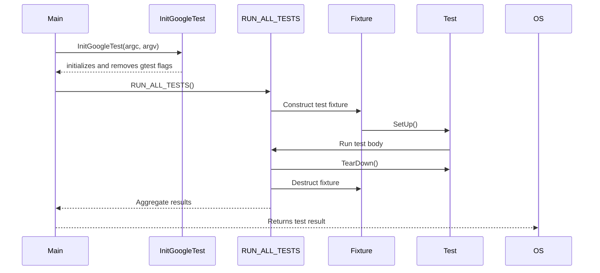

# Running and Controlling Tests

GoogleTest offers comprehensive APIs and mechanisms that empower you to discover, run, filter, and control tests programmatically. This page focuses on the core interfaces and strategies you need to drive your test execution lifecycle efficiently and flexibly, and on how the main entry point integrates your test suite into an executable.

---

## Overview

GoogleTest is designed to allow fine-grained control of test discovery and execution. Whether you want to run your full test suite, filter tests dynamically, or integrate setup logic before tests start, GoogleTest’s APIs provide that capability.

Typically, test executables use `RUN_ALL_TESTS()`, which runs all tests registered in the binary. Behind the scenes, test initialization, filtering, execution, and teardown occur in phases you can augment as needed.

This document covers:

- How to run tests from code
- How to use filtering to select tests for execution
- How to customize test runs
- The recommended main() function pattern for test binaries

---

## Initializing and Running Tests

### Basic Pattern

Every GoogleTest test binary starts with initialization and then runs tests, returning an exit code indicating success or failure:

```c++
int main(int argc, char** argv) {
  testing::InitGoogleTest(&argc, argv);  // Initializes framework and parses flags
  return RUN_ALL_TESTS();                // Runs all tests
}
```

`InitGoogleTest` parses command-line flags controlling test behavior, configures the framework accordingly, and removes tested flags from `argv`. It must be called before `RUN_ALL_TESTS()`.

`RUN_ALL_TESTS()` executes all selected tests and returns `0` if all passed, `1` otherwise.

Inside `RUN_ALL_TESTS()`, GoogleTest:

1. Creates and initializes each test fixture object
2. Executes each registered test method
3. Handles failures and skips
4. Cleans up test fixtures

> **Note:** You must **not** ignore the return value of `RUN_ALL_TESTS()` to ensure your test program exits with the correct status.


### Special Cases for Embedded or Platform-Specific Environments

On some platforms (such as Arduino or embedded systems), the entry point differs. For example, GoogleTest is initialized in an Arduino `setup()` function, and tests run repeatedly in `loop()`:

```c++
void setup() {
  testing::InitGoogleTest();
}

void loop() {
  RUN_ALL_TESTS();
}
```

This pattern allows integration with platform event loops.

---

## Controlling Which Tests Run

GoogleTest enables selective execution of tests using filters and environment variables.

### Filtering Tests via Command Line or Environment

Use the `--gtest_filter` flag or the `GTEST_FILTER` environment variable to specify which tests to run.

**Format:**

```
--gtest_filter=PositivePatterns-NegativePatterns
```

Where:

- **PositivePatterns:** Colon-separated wildcard patterns to include
- **NegativePatterns:** Colon-separated wildcard patterns to exclude

A test matches if it matches any positive pattern and none of the negative patterns.

**Examples:**

```bash
# Runs all tests
./my_test --gtest_filter=*

# Runs tests starting with "FooTest"
./my_test --gtest_filter=FooTest.*

# Runs tests containing "Null" or "Constructor"
./my_test --gtest_filter=*Null*:*Constructor*

# Runs all except those in "DeathTest" test suites
./my_test --gtest_filter=-*DeathTest.*

# Runs "FooTest" suite except "FooTest.Bar" test
./my_test --gtest_filter=FooTest.*-FooTest.Bar
```

Filtering also works with parameterized and typed tests, allowing precise test targeting.

### Listing Available Tests

Run your test executable with `--gtest_list_tests` to print all available tests without running them, helping to determine test names for filtering.

Example output:

```
MyTestSuite1.
  TestCaseA
  TestCaseB
MyTestSuite2.
  TestCaseC
```

### Disabling Tests Temporarily

Prefix test names or test suites with `DISABLED_` to exclude them from execution while keeping them compiled.

Example:

```c++
TEST(FooTest, DISABLED_BrokenTest) {
  // This test is compiled but skipped automatically.
}
```

To run these disabled tests, use `--gtest_also_run_disabled_tests` flag.

---

## Repeat, Shuffle, and Stop Options

### Repeating Tests

Use `--gtest_repeat=N` to run tests multiple times. This is useful for detecting flaky tests.

```bash
./my_test --gtest_repeat=1000
```

Use `-1` to repeat forever.

### Shuffling Test Order

Enable `--gtest_shuffle` to run tests in a randomized order. Combine with `--gtest_random_seed=SEED` to reproduce orders.

### Stop on First Failure

Set `--gtest_fail_fast` to halt test execution immediately upon first failure.

---

## Running Subsets in Distributed Environments (Sharding)

GoogleTest supports sharding to run tests in parallel across multiple machines.

Configure environment variables:

- `GTEST_TOTAL_SHARDS`: Total number of shards
- `GTEST_SHARD_INDEX`: Index of the current shard (0-based)

Each shard runs the test binary, which automatically executes a test subset.

Example:

```bash
GTEST_TOTAL_SHARDS=3 GTEST_SHARD_INDEX=0 ./my_test
GTEST_TOTAL_SHARDS=3 GTEST_SHARD_INDEX=1 ./my_test
GTEST_TOTAL_SHARDS=3 GTEST_SHARD_INDEX=2 ./my_test
```

---

## Returning Results and Exiting

GoogleTest sets the process exit code to reflect test outcomes, supporting integration with CI/CD pipelines:

- `0`: All tests passed
- `1`: One or more tests failed

You should return from your `main()` with the value of `RUN_ALL_TESTS()`.

---

## Customizing Test Runs

### Global Setup and Tear-Down

Define subclasses of `::testing::Environment` to provide setup and teardown logic that runs once per program, such as initializing shared global state.

```c++
class MyEnvironment : public ::testing::Environment {
 public:
  void SetUp() override {
    // Code run before any tests
  }
  void TearDown() override {
    // Code run after all tests
  }
};

int main(int argc, char** argv) {
  testing::InitGoogleTest(&argc, argv);
  ::testing::AddGlobalTestEnvironment(new MyEnvironment);
  return RUN_ALL_TESTS();
}
```

GoogleTest deletes the environment object after calling `TearDown()`, so do not delete it yourself.

### Event Listeners

GoogleTest allows registering event listeners to react to test events (e.g., test start, failure, end). You can append custom listeners to modify or augment output.

```c++
testing::TestEventListeners& listeners = testing::UnitTest::GetInstance()->listeners();
listeners.Append(new MyCustomListener);  // GoogleTest owns listener
```

You can also suppress the default console output by deleting the default listener.

---

## Example: A Complete Main()

```c++
#include "gtest/gtest.h"

int main(int argc, char** argv) {
  testing::InitGoogleTest(&argc, argv);

  // Optional: add global environments or event listeners here

  return RUN_ALL_TESTS();
}
```

This minimal setup fully leverages GoogleTest's features while granting flexibility for customization.

---

## Troubleshooting and Common Pitfalls

- **Ignoring RUN_ALL_TESTS()'s return**: Always return its value from `main()` to correctly reflect test results.
- **Calling RUN_ALL_TESTS() multiple times**: Not supported; call it only once.
- **Not calling InitGoogleTest() before running tests**: The framework flags won't be parsed correctly, causing unexpected behavior.
- **Filtering syntax errors**: Misuse of patterns can lead to zero tests running; verify test names using `--gtest_list_tests`.
- **Disabled tests unexpected behavior**: `DISABLED_` prefix excludes tests from normal runs; confirm if you expect those tests to run.

---

## Additional Resources

- [Writing and Running Your First Test](../getting-started/configuration-and-first-use/writing-first-test) - How to write tests and basic workflow
- [Test Structure and Lifecycle](../api-reference/core-api/test-structure) - Deep dive into test execution concepts
- [Advanced GoogleTest Topics](../docs/advanced.md) - In-depth coverage of flags and controls
- [Output Control and Reporting](../api-reference/core-api/test-runner) - Test output customization and XML/JSON report generation

---

## Diagram: Test Execution Flow



This sequence clarifies how initialization, test running, and cleanup work together.

---

Your test executable's entry point and comprehensive control of test running leverage these APIs and conventions to integrate GoogleTest seamlessly into your development and CI workflows.