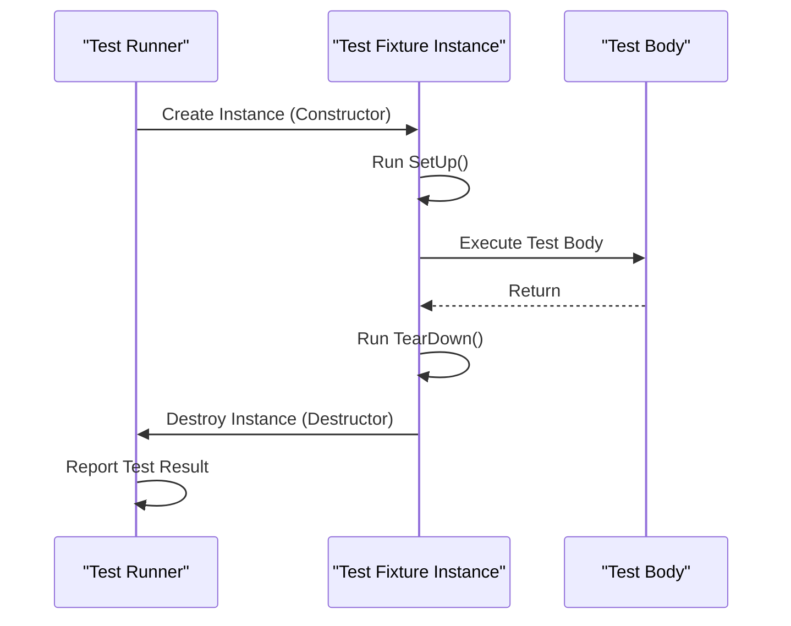

# Test Structure and Lifecycle

GoogleTest provides a robust framework for defining, organizing, and running tests in C++. Understanding the core constructs such as test cases (now commonly called test suites), tests, test fixtures, and lifecycle callbacks is essential to effectively leverage GoogleTest's capabilities and write maintainable and efficient tests.

---

## 1. Overview of Test Organization

### Test Suites and Tests
- **Test Suite (formerly Test Case)**: A collection of related tests grouped logically, sharing a common name. It reflects the structure or feature grouping of the code under test.
- **Test**: An individual executable test function inside a test suite that uses assertions to verify behavior.

Tests are typically defined using the `TEST()` macro for simple cases or `TEST_F()` when using test fixtures for sharing setup and teardown code.

### Test Fixtures
- **Purpose**: Enable sharing of common objects and reusable setup across multiple tests.
- **Definition**: A fixture is a class derived from `testing::Test` with data members and setup/teardown methods.
- **Usage**: Tests using fixtures are declared with `TEST_F()` which gives access to the fixture's members.

> Using fixtures prevents duplication and helps keep tests clean and isolated.

---

## 2. Writing Your First Test

### Defining a Simple Test
Use the `TEST()` macro to define a new test inside a test suite.

```cpp
TEST(FactorialTest, HandlesZeroInput) {
  EXPECT_EQ(Factorial(0), 1);
}
```

*Outcome:* This test checks that `Factorial(0)` returns 1. If it does, the test passes; otherwise, it fails.

### Using Test Fixtures
Create a fixture to reuse setup/teardown and state for multiple tests:

```cpp
class QueueTest : public testing::Test {
 protected:
  QueueTest() {
    q1_.Enqueue(1);
  }

  Queue<int> q0_;
  Queue<int> q1_;
};

TEST_F(QueueTest, IsEmptyInitially) {
  EXPECT_EQ(q0_.size(), 0);
}

TEST_F(QueueTest, DequeueWorks) {
  int* n = q1_.Dequeue();
  ASSERT_NE(n, nullptr);
  EXPECT_EQ(*n, 1);
  delete n;
}
```

Tests created with `TEST_F()` have access to `QueueTest` members and its setup.

---

## 3. Test Lifecycle Callbacks

GoogleTest defines a sequence of callbacks to manage the lifetime and setup of tests.

### Per-Test Lifecycle
- **Constructor:** Called before each test starts.
- **`SetUp()` method:** Called immediately after the constructor, before the test body executes.
- **Test body:** The actual test logic inside a `TEST()` or `TEST_F()`.
- **`TearDown()` method:** Called right after the test body but before destructor.
- **Destructor:** Called after each test finishes.

This sequence guarantees test isolation; each test runs on a fresh fixture object.

### Best Practices with Lifecycle
- Prefer **`SetUp()`/`TearDown()`** for resource initialization/cleanup that can fail or take time.
- Use the constructor and destructor only when logic is trivial and cannot fail.
- Always override `SetUp()` and `TearDown()` with `override` keyword to catch typos.

---

## 4. Understanding Test Execution Flow

Here's the typical workflow when GoogleTest runs your tests:

1. **Initialize testing environment:** Usually invoked via `testing::InitGoogleTest()`.
2. **Test discovery:** All `TEST` and `TEST_F` macros register tests.
3. For each test:
   - Instantiate the fixture.
   - Call the fixture constructor.
   - Call `SetUp()`.
   - Execute the test body.
   - Call `TearDown()`.
   - Call the fixture destructor.
4. **Report results:** Aggregate and output test success/failure information.

---

## 5. Lifecycle Callbacks in Detail

### Example

```cpp
class MyTest : public testing::Test {
 protected:
  MyTest() {
    // Initialization that can't fail.
  }

  void SetUp() override {
    // Setup that might fail or take longer time.
  }

  void TearDown() override {
    // Cleanup code
  }

  ~MyTest() override {
    // Destructor
  }
};

TEST_F(MyTest, FeatureWorks) {
  EXPECT_TRUE(SomeCondition());
}
```

### Common Pitfall: Misspelling `SetUp()` or `TearDown()`

Writing `Setup()` (lowercase ‘u’) instead of `SetUp()` causes the method not to be called. Using `override` in C++11+ prevents this.

---

## 6. Tips and Best Practices

- Use **unique and meaningful test suite and test names** to clearly identify what feature or behavior is tested.
- Use test fixtures to **avoid repeated initialization code** and improve test clarity.
- Keep tests **independent and isolated**: side effects in one test should not influence others.
- Use `ASSERT_*` for conditions where continuing the test would be invalid after failure.
- Use `EXPECT_*` for non-fatal checks to allow multiple checks within one test.

---

## 7. Troubleshooting

### Common Issues
- **Failure to run `SetUp()`/`TearDown()`** due to misspelling or incorrect signature.
- **Test fixture not instantiated per test:** Make sure to use `TEST_F()` for fixture-based tests, not `TEST()`.
- **Resources not released** when using complex setup — consider using `TearDown()`.

### Diagnostic Steps
- Run test binary with verbose flags (e.g., `--gtest_break_on_failure`) to isolate failures.
- Check test registration: all tests should be visible in test listing (`--gtest_list_tests`).
- Confirm proper override of lifecycle methods using compiler warnings.

---

## 8. Related Topics

- [Assertions and Test Patterns](/api-reference/core-api/assertions): Understand how to write effective assertions inside tests.
- [Writing and Running Your First Test](/guides/getting-started/your-first-test): Step-by-step tutorial for beginners.
- [Test Runner API](/api-reference/core-api/test-runner): Learn how to programmatically control test execution.
- [GoogleMock Basics](/getting-started/configuration-and-first-use/using-googlemock-basics): Extend tests with mock objects.

---

## 9. Visualizing Test Lifecycle



---

## 10. Example: Full Test with Lifecycle

```cpp
#include <gtest/gtest.h>

class CalculatorTest : public testing::Test {
 protected:
  CalculatorTest() { result_ = 0; }

  void SetUp() override { result_ = calculator_.Reset(); }
  void TearDown() override {
    // Cleanup if needed
  }

  // Fixture members
  Calculator calculator_;
  int result_;
};

TEST_F(CalculatorTest, AddsPositiveNumbers) {
  result_ = calculator_.Add(5);
  EXPECT_EQ(result_, 5);
  result_ = calculator_.Add(10);
  EXPECT_EQ(result_, 15);
}

TEST_F(CalculatorTest, AddsNegativeNumbers) {
  result_ = calculator_.Add(-5);
  EXPECT_EQ(result_, -5);
}
```

This example shows two tests sharing the `CalculatorTest` fixture, with setup to reset the calculator before each test.

---

For detailed guidance on efficient test structuring and lifecycle management, see the [GoogleTest Primer](../getting-started/configuration-and-first-use/writing-first-test) and [Core Concepts and Terminology](../overview/intro-concepts/core-concepts-terminology).