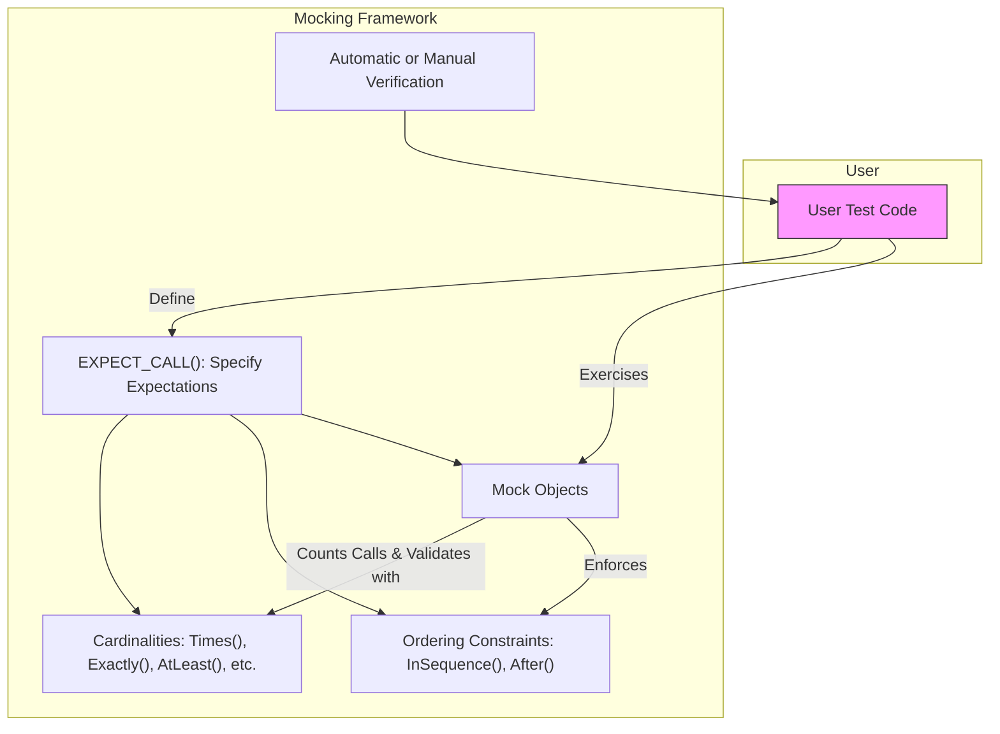

# Expectations and Cardinalities

GoogleMock provides a rich and flexible system to specify and verify *how many times* mock methods are called during tests. This is essential for validating the interaction behavior between your code under test and its dependencies.

This documentation page focuses precisely on the mechanisms and APIs related to setting *call count expectations* (called cardinalities) and establishing *call ordering constraints*. You will learn how to write expectations that express intent clearly and verify that mock objects behave exactly as specified.

---

## 1. Understanding Cardinalities: Specifying Call Counts

Cardinalities specify the allowed or expected number of times a mock function (method) should be called.

### 1.1 What is a Cardinality?

A **cardinality** is a specification of the allowed call count to a mock method. It can be exact (e.g., exactly 3 times), bounded (between 2 and 4 times), or unbounded (at least once, any number of times).

GoogleMock provides several built-in cardinalities to express common cases:

| Cardinality Function | Description                                           |
|---------------------|-------------------------------------------------------|
| `Exactly(n)`        | Expects *exactly* `n` calls.                          |
| `AtLeast(n)`        | Expects *at least* `n` calls.                         |
| `AtMost(n)`         | Expects *at most* `n` calls.                          |
| `Between(m, n)`     | Expects *between* `m` and `n` calls (inclusive).     |
| `AnyNumber()`       | Allows *any* number of calls (including zero).       |

> **Note:** `Exactly(0)` indicates the call should never happen.

### 1.2 How to Specify Cardinalities

Set the cardinality via the `.Times()` clause in an `EXPECT_CALL` statement. For example:

```cpp
using ::testing::Exactly;
using ::testing::AtLeast;
using ::testing::AnyNumber;

EXPECT_CALL(mock, Foo())
    .Times(Exactly(3));  // Foo() must be called exactly 3 times

EXPECT_CALL(mock, Bar(_))
    .Times(AtLeast(1));  // Bar() called at least once

EXPECT_CALL(mock, Baz())
    .Times(AnyNumber());  // Baz() can be called any number of times
```

### 1.3 Default Cardinality Inference

If you omit `.Times()`, GoogleMock infers the cardinality based on action clauses:

- No `WillOnce()` or `WillRepeatedly()` specified: defaults to `Exactly(1)` (called once).
- `n` `WillOnce()`s and no `WillRepeatedly()`: defaults to `Exactly(n)`.
- `n` `WillOnce()`s and a `WillRepeatedly()`: defaults to `AtLeast(n)`.

### 1.4 Cardinality Behavior Questions

- **Q:** What happens if a function is expected exactly twice but called four times?

  **A:** GoogleMock reports a failure the moment the call count exceeds the specified limit.

- **Q:** Can I specify a custom cardinality?

  **A:** Yes, implement the `CardinalityInterface` interface and use `MakeCardinality`. For typical use cases, default cardinalities suffice.

### 1.5 Human-Friendly Descriptions

GoogleMock provides human-readable messages describing expectations and call counts:

| Calls Expected                          | Description Examples            |
|---------------------------------------|--------------------------------|
| Exactly 1 call                        | "called once"                 |
| Exactly 2 calls                       | "called twice"                |
| Exactly n calls (n > 2)              | "called n times"              |
| At least n calls                     | "called at least once" / "called at least 3 times" |
| At most n calls                      | "called at most once" / "called at most 4 times"  |
| Between m and n calls                 | "called between m and n times" |
| Any number of calls (no upper bound) | "called any number of times"   |

---

## 2. Setting Expectations with Cardinalities

### 2.1 Basic Usage

Use the `EXPECT_CALL()` macro with `.Times()` specifying cardinalities to assert the expected call counts.

Example:

```cpp
using ::testing::Return;
using ::testing::_;
using ::testing::Exactly;
...
MockTurtle turtle;
EXPECT_CALL(turtle, PenDown())
    .Times(Exactly(1));  // Expect exactly one call to PenDown()

EXPECT_CALL(turtle, Forward(100))
    .Times(AtLeast(1));  // The Forward(100) call may be repeated 1 or more times
```

### 2.2 No Times Clause: Cardinality Inference

If `.Times()` is omitted, GoogleMock infers cardinality from `WillOnce()` and `WillRepeatedly()` clauses. For example:

```cpp
EXPECT_CALL(turtle, GetX())
    .WillOnce(Return(1))
    .WillOnce(Return(2));  // Implies Times(Exactly(2)) calls
```

### 2.3 Times with Zero: Verify Non-Invocation

To assert that a call **must not happen**, use:

```cpp
EXPECT_CALL(mock, Func()).Times(0);  // Fail if Func() is called
```

### 2.4 Over-Saturation Handling

If a mock method is called more times than allowed, GoogleMock immediately reports an error but still performs the default or `ON_CALL`-defined action.

---

## 3. Call Ordering: Enforcing Call Sequences

While cardinalities specify *how many times* a method is called, sometimes **order matters**.

GoogleMock provides two ways to specify ordering constraints:

### 3.1 Sequences (`Sequence` and `InSequence`)

By assigning expectations to `Sequence` objects or enclosing in an `InSequence` scope, you enforce that calls are made in the order expectations are declared.

Example:

```cpp
using ::testing::Sequence;
using ::testing::InSequence;

Sequence s1, s2;

EXPECT_CALL(mock, Reset()).InSequence(s1, s2);
EXPECT_CALL(mock, Write()).InSequence(s1);
EXPECT_CALL(mock, Read()).InSequence(s2);

// Or equivalently in an InSequence scope:
{
  InSequence seq;
  EXPECT_CALL(mock, Reset());
  EXPECT_CALL(mock, Write());
  EXPECT_CALL(mock, Read());
}
```

Here, `Reset()` must be called first, followed by `Write()` and `Read()`, but the last two can occur in any order with respect to each other unless assigned to the same sequence.

### 3.2 Partial Ordering with `.After()` Clause

When a strict sequence isn't enough, the `.After()` method allows specifying that an expectation occurs **after one or more other expectations**.

Example:

```cpp
Expectation e1 = EXPECT_CALL(mock, Init());
Expectation e2 = EXPECT_CALL(mock, Start()).After(e1);
EXPECT_CALL(mock, Stop()).After(e1, e2);
```

Here, `Start()` can only occur after `Init()`, and `Stop()` after both `Init()` and `Start()`.

### 3.3 Expectation Retirement

Expectations are **active** until satisfied or *retired*. By default, expectations remain active after saturation, causing failures if called too many times. The `.RetiresOnSaturation()` clause marks expectations as *retiring* automatically when their upper bound is reached, allowing subsequent expectations to match later calls.

Example:

```cpp
EXPECT_CALL(mock, SetValue(_))  // Expectation 1
    .Times(AnyNumber());
EXPECT_CALL(mock, SetValue(7))  // Expectation 2
    .Times(2)
    .RetiresOnSaturation();
```

The first two calls to `SetValue(7)` match Expectation 2; subsequent calls match Expectation 1.

---

## 4. Practical Examples

### 4.1 Basic Expectation with Call Count

```cpp
using ::testing::AtLeast;

MockTurtle turtle;
EXPECT_CALL(turtle, PenDown()).Times(AtLeast(1));  // PenDown() called >= 1 times
```

### 4.2 Expectations with Multiple Cardinalities

```cpp
EXPECT_CALL(turtle, Forward(50)).Times(Between(2, 4));  // Between 2 to 4 calls
```

### 4.3 Using `AnyNumber()` to Allow Calls Without Expectation

```cpp
EXPECT_CALL(turtle, PenUp()).Times(AnyNumber());  // PenUp() any number of times
```

### 4.4 Enforcing Order with Sequences

```cpp
Sequence s;
EXPECT_CALL(turtle, PenDown()).InSequence(s);
EXPECT_CALL(turtle, Forward(100)).InSequence(s);
EXPECT_CALL(turtle, PenUp()).InSequence(s);
```

Here, the calls to `PenDown()`, `Forward(100)`, and `PenUp()` must occur in that order.

### 4.5 Using `.After()` Clause

```cpp
Expectation e1 = EXPECT_CALL(turtle, PenDown());
EXPECT_CALL(turtle, Forward(100)).After(e1);
EXPECT_CALL(turtle, PenUp()).After(e1);
```

`Forward(100)` and `PenUp()` must be called after `PenDown()`, but relative order among them is not constrained.

### 4.6 Combining Cardinalities and Ordering

```cpp
Sequence s1;
EXPECT_CALL(turtle, PenDown()).Times(1).InSequence(s1);
EXPECT_CALL(turtle, Forward(_)).Times(AtLeast(2)).InSequence(s1);
EXPECT_CALL(turtle, PenUp()).Times(1).After(s1);
```

Calls to `PenDown()` and `Forward()` happen in order, with `Forward()` called at least twice, and `PenUp()` after these.

---

## 5. Common Pitfalls and Best Practices

- **Set expectations before invoking the mock method.** Failing to call `EXPECT_CALL()` before exercising the mock leads to undefined behavior and silent test errors.

- **Avoid over-specifying cardinalities.** Set call counts to what your test really requires. Too strict leads to brittle tests; too loose lets bugs slip in.

- **Use `AnyNumber()` with caution.** It avoids failures on call count but may mask unintended calls.

- **Retire expectations when appropriate.** `.RetiresOnSaturation()` helps tests where some calls should be limited, letting other calls proceed.

- **Use sequences (`Sequence`, `InSequence`) and `.After()` to clearly express required call orders or partial orders.** This aids test readability and failure diagnostics.

- **Understand inferred cardinalities.** Don't forget that `.WillOnce()` and `.WillRepeatedly()` affect how `.Times()` is inferred if omitted.

- **Use descriptive expectation messages (via `.Description()`) to make failures clearer.**

---

## 6. Debugging and Troubleshooting

### 6.1 Failures Due to Unexpected Call Count

If a test fails with a message like:

```
Expected: to be called once
Actual: called twice - over-saturated and active
```

it means the mock method was called more times than the cardinality allows. Adjust `.Times()` accordingly or fix code to call the method fewer times.

### 6.2 Failures Due to Call Order

When sequences or `.After()` constraints are violated, GoogleMock will report unexpected calls out of order. Review the ordering constraints and the code triggering calls.

### 6.3 Missing or Delayed Failures

- Verify expectations are set before exercising mocks.
- Confirm destruction of mock objects triggers expectation verification.
- Use `Mock::VerifyAndClearExpectations()` to manually verify at any point.

---

## 7. Conceptual Overview Diagram



---

## 8. Related APIs and Further Reading

- See the [Mocking Reference](../reference/mocking.md) for detailed syntax on `EXPECT_CALL`, `ON_CALL` and the modifiers.
- For a deeper understanding of call ordering, see `Sequence`, `InSequence`, and `Expectation` classes.
- Understand default actions and behavior using [`ON_CALL`](../reference/mocking.md#ON_CALL).
- Read the [gMock for Dummies](../docs/gmock_for_dummies.md) for beginner-friendly mock usage examples.
- Look into the [gMock Cookbook](../docs/gmock_cook_book.md#WritingNewCardinalities) for advanced customization including custom cardinalities.

---

[Back to Navigation](../../api-reference/core-apis/)
