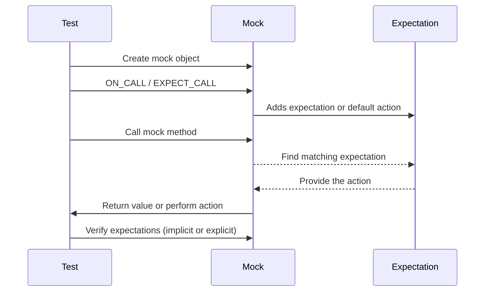

# Mocking API

This reference covers the core functionality GoogleMock provides for creating and managing mock objects in C++ tests. It includes how to define mock classes using `MOCK_METHOD`, setting default behaviors with `ON_CALL`, establishing explicit expectations with `EXPECT_CALL`, managing call cardinality, handling call ordering, and controlling mock strictness.

---

## 1. Defining Mock Methods Using `MOCK_METHOD`

The `MOCK_METHOD` macro is the primary mechanism to define mock methods inside mock classes. It replaces virtual function implementations with mockable counterparts that can have expectations set on them.

### Basic Syntax

```cpp
MOCK_METHOD(ReturnType, MethodName, (Args...), (Specs...));
```

- `ReturnType`: The return type of the method.
- `MethodName`: The name of the method.
- `Args...`: Argument types in parentheses.
- `Specs...`: Optional qualifiers (e.g., `const`, `override`, `noexcept`, call type).

### Examples

```cpp
class MockFoo : public Foo {
 public:
  MOCK_METHOD(int, GetSize, (), (const, override));
  MOCK_METHOD(std::string, Describe, (const char* name), (override));
  MOCK_METHOD(bool, Process, (Bar elem, int count), (override));
};
```

### Notes and Best Practices

- Always place `MOCK_METHOD` declarations in the `public` section even if the base method is `protected` or `private`. This ensures they can be called from the test code.
- Wrap return or argument types that contain commas (e.g., `std::pair<int, int>`) in parentheses or use type aliases to avoid parsing issues.

### Qualifiers

Specifiers accepted as the 4th argument:

| Qualifier                  | Meaning                                  |
|----------------------------|------------------------------------------|
| `const`                    | Marks method as `const`.                   |
| `override`                 | Marks method as `override` virtual.       |
| `noexcept`                 | Marks method as `noexcept`.                |
| `Calltype(convention)`     | Specifies calling convention (e.g., Windows `STDMETHODCALLTYPE`). |
| `ref(&)` / `ref(&&)`       | Reference qualifiers for methods that override ref-qualified base methods.


---

## 2. Setting Default Behavior with `ON_CALL`

`ON_CALL` defines the default action a mock method takes when called without an explicit expectation.

### Typical Workflow

1. Import gMock symbols (e.g., `using ::testing::Return;`).
2. Create mock objects.
3. Use `ON_CALL` to specify default behaviors for mock methods.

```cpp
ON_CALL(mock_object, Method(matchers...))
    .With(multi_argument_matcher)  // Optional.
    .WillByDefault(action);        // Required.
```

### Example

```cpp
using ::testing::Return;
MockFoo foo;
ON_CALL(foo, GetSize())
    .WillByDefault(Return(42));
```

**Tips:**
- Use `ON_CALL` when you want to specify behavior but don't require that the method be called.
- Default actions set by `ON_CALL` are overridden when matching `EXPECT_CALL` expectations.

---

## 3. Specifying Expectations with `EXPECT_CALL`

`EXPECT_CALL` sets explicit expectations on mock methods, including how many times they should be called, with what arguments, and what they return or do.

### Syntax

```cpp
EXPECT_CALL(mock_object, Method(matchers...))
    .With(multi_argument_matcher)  // Can be used once.
    .Times(cardinality)            // Can be used once.
    .InSequence(sequences...)      // Can be used multiple times.
    .After(expectations...)        // Can be used multiple times.
    .WillOnce(action)              // Can be used multiple times.
    .WillRepeatedly(action)        // Can be used once.
    .RetiresOnSaturation();        // Can be used once, last clause.
```

### Example

```cpp
using ::testing::Return;
EXPECT_CALL(foo, Describe(5))
    .Times(3)
    .WillRepeatedly(Return("Category 5"));
```

### Clauses Explained

- **With:** Restricts calls to those where all arguments as a tuple satisfy a matcher.
- **Times:** Controls how many invocations satisfy the expectation.
  - Use `AnyNumber()`, `AtLeast(n)`, `AtMost(n)`, `Between(m, n)`, or exact number.
- **InSequence:** Ensures calls happen in a specified order.
- **After:** Specifies calls expected only after other calls.
- **WillOnce:** Specifies actions for the next matching call.
- **WillRepeatedly:** Specifies action for all subsequent matching calls.
- **RetiresOnSaturation:** Makes an expectation inactive once saturated.

### Important Notes

- Expectations are “sticky.” They remain active after saturation unless retired explicitly.
- By default, matching expectations are searched in reverse order (newest first).
- Setting expectations must be done *before* exercising the mock.

---

## 4. Managing Mock Strictness

GoogleMock supports modifying how uninteresting calls are treated via wrapper templates:

| Wrapper Template         | Behavior on Uninteresting Calls                                |
|-------------------------|---------------------------------------------------------------|
| `NiceMock<T>`           | Suppresses warnings for unexpected calls (default for future).
| `NaggyMock<T>`          | Prints warnings on unexpected calls (current default).
| `StrictMock<T>`         | Treats unexpected calls as test failures.

### Usage

```cpp
using ::testing::NiceMock;
NiceMock<MockFoo> nice_foo;

using ::testing::StrictMock;
StrictMock<MockFoo> strict_foo;
```

- These are subclasses of the mock class and can be used anywhere the mock is expected.
- They “inherit” constructors of the base mock.

### Caution

- Only affects methods defined *directly* in the mock class via `MOCK_METHOD`.
- Nesting these wrappers is not supported.
- Virtual destructors in mocks are recommended.

---

## 5. Sequences and Call Ordering

To enforce call order, GoogleMock provides:

- `Sequence` objects: Group expectations into a sequence.

- `InSequence` scope guard: Automatically sequences expectations defined within its scope.

Example:

```cpp
using ::testing::InSequence;
{
  InSequence seq;
  EXPECT_CALL(foo, FirstCall());
  EXPECT_CALL(foo, SecondCall());
}
```

Calls to `foo`'s methods must occur in this order; out-of-order calls cause test failures.

### Partial Ordering

Partial ordering is achievable using `InSequence` with multiple sequences or the `After` clause with `Expectation` or `ExpectationSet`.

Example with partial order:

```cpp
Sequence s1, s2;
EXPECT_CALL(foo, FuncA()).InSequence(s1, s2);
EXPECT_CALL(bar, FuncB()).InSequence(s1);
EXPECT_CALL(bar, FuncC()).InSequence(s2);
```

Meaning: `FuncA()` before `FuncB()` and `FuncC()`; no order required between `FuncB()` and `FuncC()`.

---

## 6. Verifying and Resetting Mocks

Expectations on mocks are verified automatically when the mock is destructed. Alternatively, verification can be forced earlier:

```cpp
using ::testing::Mock;
...
Mock::VerifyAndClearExpectations(&mock_obj);
Mock::VerifyAndClear(&mock_obj);  // Verifies and clears all, including default actions
```

### Allowing Mocks to Leak

If you deliberately want to skip verification for a mock (usually discouraged), you can do:

```cpp
Mock::AllowLeak(&mock_obj);
```

This suppresses leaked mock warnings.

---

## 7. Example Usage

```cpp
#include <gmock/gmock.h>
#include <gtest/gtest.h>

using ::testing::Return;
using ::testing::InSequence;

class Foo {
 public:
  virtual ~Foo() {}
  virtual int GetSize() const = 0;
  virtual std::string Describe(int type) = 0;
};

class MockFoo : public Foo {
 public:
  MOCK_METHOD(int, GetSize, (), (const, override));
  MOCK_METHOD(std::string, Describe, (int type), (override));
};

TEST(FooTest, Example) {
  MockFoo mock_foo;

  ON_CALL(mock_foo, GetSize())
      .WillByDefault(Return(10));

  {
    InSequence seq;
    EXPECT_CALL(mock_foo, Describe(5)).Times(2).WillRepeatedly(Return("Five"));
    EXPECT_CALL(mock_foo, Describe(3)).WillOnce(Return("Three"));
  }

  EXPECT_EQ(10, mock_foo.GetSize());
  EXPECT_EQ("Five", mock_foo.Describe(5));
  EXPECT_EQ("Five", mock_foo.Describe(5));
  EXPECT_EQ("Three", mock_foo.Describe(3));
}
```

---

## 8. Troubleshooting Common Issues

- **Uninteresting call warnings**: Use `NiceMock` to suppress, or add `EXPECT_CALL(...).Times(AnyNumber())` for tolerance.
- **Upper bound exceeded errors**: Use `.RetiresOnSaturation()` or `.Times()` appropriately to handle repeated calls.
- **Order failures**: Use `InSequence` or `After` to specify call order.
- **Ambiguous overloads**: Specify argument matchers explicitly or use `Const()` helper for const overloads.
- **Virtual destructors**: Always ensure base classes have virtual destructors for safe mocking.

---

## 9. Additional Resources

- [gMock Cookbook](https://google.github.io/googletest/gmock_cook_book.html): Recipes for advanced mock scenarios.
- [Matchers Reference](reference/matchers.md): Matching function argument rules.
- [Actions API](api-reference/mock-actions-cardinalities/gmock-actions): Understanding actions to specify behaviors.
- [Mock Strictness Control](api-reference/core-apis/gmock-nice-strict-api): Managing Nice/Naggy/Strict mocks.

---

## 10. Internal Details

GoogleMock implements `ON_CALL` and `EXPECT_CALL` macros to associate behaviors and expectations with mock methods. Internally, `FunctionMocker` templates track expectations and default actions atomically and provide synchronization for thread safety.

- When a mock method is called, GoogleMock finds the first matching expectation by reverse order.
- For calls with no expectation, the default action from `ON_CALL` is used if set, else the type's default value.
- Uninteresting calls trigger warning or error based on strictness.

<Accordion title="Mocking Syntax Rules and Common Pitfalls">

- `MOCK_METHOD` arguments with commas must be parenthesized or aliased.
- Possible mismatches in number and order of `WillOnce` and `Times` cause warnings.
- Setting new `EXPECT_CALL` on a mock after exercising it leads to undefined behavior.
- Use `RetiresOnSaturation` to avoid sticky expectation upper bound failures.
</Accordion>

<Accordion title="Advanced Mock Control">

- Use `Sequence` and `InSequence` to enforce call orders.
- Combine `After` with `Expectation` or `ExpectationSet` to design complex call dependencies.
- Use `NiceMock` to suppress unnecessary warnings and make tests less brittle.
- `StrictMock` helps detect unexpected calls early.
</Accordion>

<Accordion title="Example of Defining a Mock Method with Calling Convention">

```cpp
MOCK_METHOD(bool, Foo, (int n), (Calltype(STDMETHODCALLTYPE), override));
```

This specifies that the method uses the `STDMETHODCALLTYPE` calling convention.
</Accordion>

---

## 11. Summary Diagram



This reflects the lifecycle from mock creation, expectation setting, method invocation, to verification.

---

**For full API usage and advanced examples, consult the [gMock Cookbook](https://google.github.io/googletest/gmock_cook_book.html) and [Matchers Reference](reference/matchers.md).**

---

## 12. References and Related Pages

- [gMock Cheat Sheet](https://google.github.io/googletest/gmock_cheat_sheet.html)
- [Mock Strictness Control API](api-reference/core-apis/gmock-nice-strict-api)
- [Actions API](api-reference/mock-actions-cardinalities/gmock-actions)
- [Matchers API](api-reference/matchers-and-assertions/gmock-matchers)
- [GoogleTest Mocking Basics Guide](guides/core-workflows/mocking-basics.mdx)