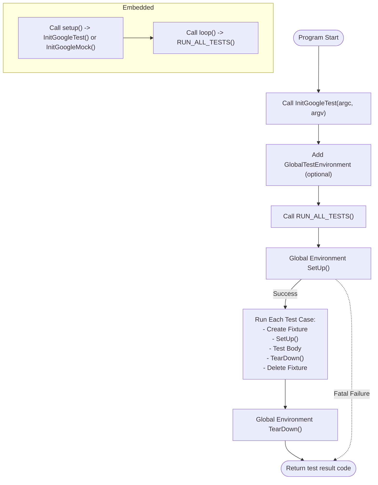

# Initialization and Main Functions

This documentation page provides authoritative guidance on setting up the execution of tests using GoogleTest and GoogleMock. It covers essential routines such as `main()` functions, initialization APIs, and custom hooks. Users will learn how test discovery, test runners, and integration entry points operate to make tests reliably execute across multiple platforms, including desktop and embedded systems.

---

## Overview

GoogleTest and GoogleMock manage test execution through a combination of initialization functions and test runner entry points. This setup is critical to ensure that all test cases and fixtures are correctly discovered, initialized, and run in a consistent manner regardless of the target platform.

Most users do not need to write their own `main()` functions, as GoogleTest and GoogleMock provide default implementations that handle initialization and invocation seamlessly. However, this page explains the underlying mechanisms and how to customize or override them when necessary.

---

## Initialization Functions

### `testing::InitGoogleTest(&argc, argv)`

- Initializes GoogleTest by parsing command-line flags related to test execution.
- Filters and removes recognized flags from `argv` so that only relevant user arguments remain.
- Must be called **before** any call to `RUN_ALL_TESTS()`.
- Supports wide-character arguments on Windows platforms.

### `testing::InitGoogleMock(&argc, argv)`

- Initializes GoogleMock and by extension GoogleTest, combining their flag parsing.
- Calls `InitGoogleTest()` internally, so separate invocation of `InitGoogleTest()` is not required.
- Handles GoogleMock-specific flags like `--gmock_verbose` and `--gmock_default_mock_behavior`.

### Custom Initialization Flow

For typical use:

```cpp
int main(int argc, char** argv) {
  testing::InitGoogleTest(&argc, argv);
  return RUN_ALL_TESTS();
}
```

For GoogleMock-enabled tests:

```cpp
int main(int argc, char** argv) {
  testing::InitGoogleMock(&argc, argv);
  return RUN_ALL_TESTS();
}
```

> **Tip:** When you need additional setup or teardown actions outside of fixtures or tests, implement them in your `main()` before or after initialization and test runner calls.

---

## The `main()` Function

### Default Provided Entry Points

- **GoogleTest:** Provides a default `main()` implementation in `gtest_main` library.
- **GoogleMock:** Provides its own `main()` in `gmock_main` that initializes both frameworks.

**Linking with these libraries allows you to skip writing a custom `main()`.**

### Custom `main()` Example

If a custom entry point is necessary, here is a minimal canonical example:

```cpp
#include <gtest/gtest.h>

int main(int argc, char** argv) {
  testing::InitGoogleTest(&argc, argv);
  return RUN_ALL_TESTS();
}
```

### Platform-Specific Cases

GoogleTest and GoogleMock provide specialized entry points for non-standard environments:

- **Embedded or Arduino-like platforms (e.g., ESP8266, ESP32):**
  - Entry points are `setup()` and `loop()` instead of `main()`.
  - `setup()` calls the appropriate initialization (`InitGoogleTest` or `InitGoogleMock`).
  - `loop()` runs tests by calling `RUN_ALL_TESTS()` repeatedly.

- **QuRT (Qualcomm Real Time OS):**
  - Uses a parameterless `main()` since `argc/argv` are not available.
  - Simply calls `InitGoogleTest()` and `RUN_ALL_TESTS()`.

These platform-specific variations ensure tests run correctly where standard `main()` is not applicable.

---

## Test Discovery and Execution Flow

1. **Test Registration:**
   - Macros like `TEST()` and `TEST_F()` register tests with the internal registry at static initialization time.

2. **Initialization:**
   - `InitGoogleTest()` parses command-line flags and prepares the framework.

3. **Running Tests:**
   - The `RUN_ALL_TESTS()` call runs all registered test cases one by one.
   - Each test runs on a fresh fixture object created and destroyed per test to isolate tests.

4. **Result Reporting:**
   - Aggregated results are returned via the exit code from `RUN_ALL_TESTS()`.
   - `0` indicates all tests passed; any non-zero signifies failures.

---

## Custom Hooks and Global Test Environments

GoogleTest allows users to register **global test environments** by subclassing `testing::Environment`.

- This mechanism lets you set up and tear down global state shared across all tests.

- Use `testing::AddGlobalTestEnvironment()` to register such an environment before `RUN_ALL_TESTS()`.

- The environment's `SetUp()` runs once before any tests, and `TearDown()` runs after all tests complete.

- Fatal failures in `SetUp()` abort test execution.

**Example:**

```cpp
class MyGlobalEnv : public testing::Environment {
 public:
  void SetUp() override {
    // Global initialization
  }

  void TearDown() override {
    // Global cleanup
  }
};

int main(int argc, char** argv) {
  testing::InitGoogleTest(&argc, argv);
  testing::AddGlobalTestEnvironment(new MyGlobalEnv);
  return RUN_ALL_TESTS();
}
```

---

## Best Practices and Troubleshooting

- **Do not ignore the return value** of `RUN_ALL_TESTS()`: it determines your test program's exit code used by CI systems.

- **Call `RUN_ALL_TESTS()` exactly once** to avoid conflicts, especially for advanced features like thread-safe death tests.

- When customizing `main()`, ensure `InitGoogleTest()` or `InitGoogleMock()` is called *before* running tests.

- If targeting embedded or non-standard platforms, use the appropriate initialization and entry point as provided or extend them based on existing platform-specific source files.

- For additional setups that can't be handled by test fixtures or global environments, place them in your `main()` before or after initialization.

- On Windows, wide-character command-line argument support is available through `InitGoogleTest`.

- Consult the troubleshooting guides if you encounter linker errors or initialization failures, especially for cross-compiling scenarios.

---

## Summary Diagram of Initialization and Test Execution Flow



---

## Further Reading and Related Pages

- [Test and Mock Interfaces](./test-and-mock-interfaces) — Understanding test case and mock definitions.
- [Writing Your First Test Guide](https://github.com/google/googletest/blob/main/docs/guides/get-started/writing-tests.mdx) — How to author and organize tests.
- [CI Integration Guide](https://github.com/google/googletest/blob/main/docs/guides/integration-scenarios/ci-integration.mdx) — Automate test execution and reporting.
- [Troubleshooting Setup Issues](https://github.com/google/googletest/blob/main/docs/getting-started/first-test-validation/troubleshooting-setup.mdx) — Resolver for common environment and build problems.

---

## References

- Source implementations:
  - [googletest/src/gtest_main.cc](https://github.com/google/googletest/blob/main/googletest/src/gtest_main.cc) — main() implementations for GoogleTest
  - [googlemock/src/gmock_main.cc](https://github.com/google/googletest/blob/main/googlemock/src/gmock_main.cc) — main() for GoogleMock

---

## Troubleshooting Common Issues

<AccordionGroup title="Common Initialization and Execution Issues">
<Accordion title="Tests Not Running or Being Discovered">
Ensure your test source files are compiled and linked correctly with GoogleTest/GoogleMock libraries. Verify your test functions use correct TEST() or TEST_F() macros, which register tests automatically at static initialization.
</Accordion>
<Accordion title="Linker Errors Related to main()">
If you see multiple definitions of main or unresolved symbols, check that you link either against `gtest_main` or provide your own `main()`. Do not link both.
</Accordion>
<Accordion title="Command-Line Flags Not Being Recognized">
Confirm that you call `InitGoogleTest()` with `&argc, argv` before `RUN_ALL_TESTS()`. Missing this call means GoogleTest will not parse test flags.
</Accordion>
<Accordion title="Embedded Platform Initialization Fails">
For Arduino-like targets, ensure use of the `setup()` and `loop()` functions respectively, since traditional `main()` entry points do not apply.
</Accordion>
</AccordionGroup>

---

## Summary

Proper initialization and test execution setup is the backbone of reliable automated testing with GoogleTest and GoogleMock. By calling the standard initialization routines and using supported entry points, tests will be discovered, run, and reported effectively across platforms. This page equips you to confidently handle default and custom test runners, platform-specific variations, and global fixtures, ensuring robust and maintainable test execution.
