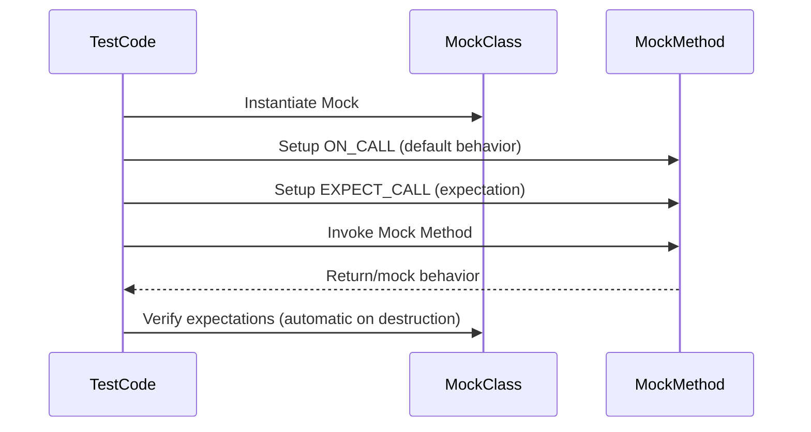

# Mocking Fundamentals

This reference page provides authoritative guidance for writing and configuring mock functions and classes using GoogleMock (gMock). It covers the core macro for generating mocks, how to handle common complexities such as method qualifiers and overloaded functions, the management of strictness levels on mocks, and structuring expectations to precisely control and verify interactions in tests.

---

## Creating Mock Classes with `MOCK_METHOD`

Mock classes in gMock are ordinary C++ classes that use the 
`MOCK_METHOD` macro to generate mock methods. This macro requires 3 or 4 parameters:

```cpp
class MyMock {
 public:
  MOCK_METHOD(ReturnType, MethodName, (Args...));
  MOCK_METHOD(ReturnType, MethodName, (Args...), (Specs...));
};
```

- The first parameter is the method's return type.
- The second is the method name.
- The third parameter is the method's argument types enclosed in parentheses.
- Optionally, a fourth parameter specifies qualifiers such as `const`, `override`, `noexcept`, or call type.

### Handling Commas in Return Types or Arguments

Unprotected commas (not surrounded by parentheses) cause parsing errors. For example:

```cpp
class MockFoo {
 public:
  MOCK_METHOD(std::pair<bool, int>, GetPair, ());  // Won't compile!
  MOCK_METHOD(bool, CheckMap, (std::map<int, double>, bool));  // Won't compile!
};
```

**Solutions:**

- Wrap the type containing commas in parentheses:

```cpp
class MockFoo {
 public:
  MOCK_METHOD((std::pair<bool, int>), GetPair, ());
  MOCK_METHOD(bool, CheckMap, ((std::map<int, double>), bool));
};
```

- Define type aliases to avoid commas:

```cpp
class MockFoo {
 public:
  using BoolAndInt = std::pair<bool, int>;
  MOCK_METHOD(BoolAndInt, GetPair, ());
  using MapIntDouble = std::map<int, double>;
  MOCK_METHOD(bool, CheckMap, (MapIntDouble, bool));
};
```

### Important Guidelines

- Always place `MOCK_METHOD` declarations in the **public:** section of your mock class, even if the original method is protected or private. This ensures `EXPECT_CALL` and `ON_CALL` can reference them.

- If you mock overloaded methods, define a mock for each overload to avoid compiler hiding warnings. Use `using` declarations in the mock class to bring in unmocked overloads.

- You can mock class templates just like any class; the syntax is the same within template definitions.

- For non-virtual methods, gMock can mock them via separate unrelated mock classes using the same method signatures, enabling high-performance dependency injection through templates.


## Mocking Method Qualifiers and Calling Conventions

The optional 4th parameter to `MOCK_METHOD` allows annotating methods with qualifiers:

- `const` for mock const methods
- `override` to mark overriding virtual methods
- `noexcept` for noexcept methods
- `Calltype(...)` to specify calling conventions (e.g., Windows `STDMETHODCALLTYPE`)
- `ref(...)` to specify reference qualifiers (e.g., `ref(&)`, `ref(&&)`)

Example:

```cpp
MOCK_METHOD(bool, Foo, (int n), (const, override));
MOCK_METHOD(int, Bar, (), (Calltype(STDMETHODCALLTYPE)));
```


## Mocking Strictness: Nice, Naggy, and Strict

By default, mocks are **naggy**: they warn on uninteresting calls (calls without expectations). gMock offers strictness wrappers that control this behavior on a per-mock basis:

- `NiceMock<T>` suppresses warnings on uninteresting calls.
- `NaggyMock<T>` (default) warns on uninteresting calls.
- `StrictMock<T>` treats uninteresting calls as test failures.

These wrappers inherit from your mock class and can be constructed with the same arguments.

### Behaviors

- **Uninteresting calls**: method calls where no `EXPECT_CALL` is set. They invoke default behavior but cause warnings (naggy), are ignored (nice), or cause failures (strict).
- **Unexpected calls**: calls that have expectations but that do not match any existing expectation. Always treated as errors.

### Usage Example

```cpp
using ::testing::NiceMock;
using ::testing::StrictMock;

NiceMock<MockFoo> nice_mock;
StrictMock<MockFoo> strict_mock;

EXPECT_CALL(nice_mock, DoThis());
EXPECT_CALL(strict_mock, DoThis());

// strict_mock fails if an unexpected or uninteresting call happens
```

### Caveats

- Strictness wrappers only affect mock methods defined **directly** in your mock class using `MOCK_METHOD`; inherited mock methods may not be affected.
- Nesting strictness wrappers (e.g., `NiceMock<StrictMock<T>>`) is **not supported**.
- Your mock class should have a virtual destructor for correct behavior.

### Best Practices

- Use **NiceMock** in most cases for maintainability and to avoid brittle warnings.
- Use **NaggyMock** during test development or debugging to get warnings.
- Use **StrictMock** sparingly, mainly to catch unintended calls.


## Structuring Mock Expectations

The core mechanism to set behavior and expectations on your mock methods is through:

- `ON_CALL(obj, Method(...))` - defines the default action without expectation.
- `EXPECT_CALL(obj, Method(...))` - sets an expectation (asserts method will be called with specified arguments and frequency).

### Key Rules and Tips

- `ON_CALL` should be used to set general default behaviors; it does *not* verify call counts.
- `EXPECT_CALL` sets both behavior and call count expectations.
- Use `Times()` to specify call counts; if omitted, inferred from actions.
- Uninteresting calls that match no `EXPECT_CALL` can trigger warnings or failures depending on mock strictness.

### Ordering Call Expectations

- Calls do not have to occur in the order expectations are set.
- To enforce call order, use:
  - `InSequence` scope for linear sequences
  - `Sequence` objects and `.InSequence()` clauses for partial orders
  - `.After()` clause to specify dependencies

Example: enforce strict call order with `InSequence`

```cpp
{
  InSequence s;
  EXPECT_CALL(mock, Init());
  EXPECT_CALL(mock, DoWork());
  EXPECT_CALL(mock, Cleanup());
}
```


### Handling Overloaded Methods

Mock all overloads to avoid hiding base class versions, or bring them into scope:

```cpp
class MockFoo : public Foo {
 public:
  using Foo::Add;  // bring in unmocked overloads
  MOCK_METHOD(int, Add, (int x), (override));
};
```

### Advanced Techniques

- Using `.RetiresOnSaturation()` to make an expectation inactive after it is satisfied
- Combining multiple actions with `DoAll()`
- Saving arguments with `SaveArg` to verify later
- Mocking side effects with actions like `SetArgPointee` or `SetArrayArgument`


## Practical Examples

### Simple Mock Method

```cpp
class MockFoo {
 public:
  MOCK_METHOD(int, GetValue, (), (const, override));
  MOCK_METHOD(void, SetValue, (int val), (override));
};
```

### Suppress Uninteresting Call Warnings

```cpp
NiceMock<MockFoo> mock_foo;
ON_CALL(mock_foo, GetValue()).WillByDefault(Return(42));
EXPECT_CALL(mock_foo, SetValue(10));
...
```

### Expect Call Order with Sequence

```cpp
Sequence seq;
EXPECT_CALL(mock_foo, Initialize()).InSequence(seq);
EXPECT_CALL(mock_foo, Process()).InSequence(seq);
```

### Use With Overloaded Functions

```cpp
EXPECT_CALL(mock_foo, GetValue()).WillOnce(Return(3));
EXPECT_CALL(Const(mock_foo), GetValue()).WillOnce(Return(4));
```

### Delegation and Default Actions

Define default behaviors using `ON_CALL` and override or verify using `EXPECT_CALL` as appropriate.


## Troubleshooting Common Pitfalls

- Ensure virtual destructors in base classes to avoid leaks or undefined behavior.
- Always place `MOCK_METHOD` macros in the `public:` section of mocks.
- Wrap template or types with commas in parentheses or use type aliases.
- Be explicit about method overloads when setting expectations or default actions.
- Avoid setting expectations after mock method invocation.
- Use strictness wrappers to manage uninteresting call handling.


---

## Related Resources

- [gMock Cookbook](https://google.github.io/googletest/gmock_cook_book.html): Practical recipes and advanced usage.
- [gMock Cheat Sheet](https://google.github.io/googletest/gmock_cheat_sheet.html): Quick reference for mocking syntax.
- [Mocking Reference](https://google.github.io/googletest/reference/mocking.md): Official detailed API reference.
- [Managing Mock Strictness: Nice, Naggy, and Strict Mocks](https://google.github.io/googletest/guides/mocking-advanced-testing/strictness-niceness.html).


---

> For authoritative examples and test cases demonstrating mock strictness and behavior, see the [gmock-nice-strict_test.cc](https://github.com/google/googletest/blob/main/googlemock/test/gmock-nice-strict_test.cc) in the GoogleTest source repository.

---

## Summary Diagram: Basic Mocking Workflow


