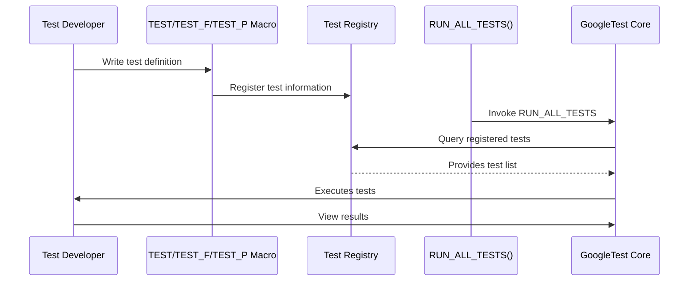

# Test Case Registration & Structure

This reference documents the APIs that allow you to define and organize your test cases and test suites in GoogleTest. It covers test macros, test fixtures, and the main entry point of your test executable. Through these APIs, you will learn the standard and scalable patterns to structure your tests for maintainability and clarity.

---

## Overview

GoogleTest structures tests as collections of individual **test cases** grouped into **test suites**. A test case typically corresponds to a class (especially when using test fixtures), and a test suite is a named grouping of related tests. This organization enables modular and scalable testing, promoting reuse and better management of setup and teardown behaviors.

Defining tests involves declaring test macros (`TEST`, `TEST_F`, `TEST_P`, etc) which register tests with the framework. The framework handles discovery, execution, and outcome reporting—all driven by this registration.

---

## Defining Tests

### `TEST` Macro

The simplest way to define a test is with the `TEST` macro:

```cpp
TEST(TestSuiteName, TestName) {
  // Your test code here
  ...
}
```

- **Purpose:** Defines a test named `TestName` within the test suite `TestSuiteName`.
- **Behavior:** Registers the test with the framework so it runs during `RUN_ALL_TESTS()`.
- **Notes:**
  - Both `TestSuiteName` and `TestName` must be valid C++ identifiers without underscores.
  - Tests in different test suites may share the same test name.

#### Example

```cpp
TEST(MathTests, Addition) {
  EXPECT_EQ(2 + 2, 4);
}
```

This defines a test `Addition` belonging to the test suite `MathTests`.

### `TEST_F` Macro

When your tests require shared setup or teardown logic, use test fixtures with the `TEST_F` macro:

```cpp
// Define the test fixture class
class MyFixture : public testing::Test {
 protected:
  void SetUp() override {
    // Setup code here
  }
  void TearDown() override {
    // Teardown code here
  }
  // Shared resources
  int* resource_;
};

// Use the fixture in a test
TEST_F(MyFixture, TestName) {
  // Test code with shared setup
  EXPECT_TRUE(resource_ != nullptr);
}
```

- **Purpose:** Defines a test using the test fixture class `MyFixture`.
- **Behavior:** Tests in the same fixture share initialization/cleanup allowing reduced duplication.
- **Notes:**
  - The fixture class must be publicly derived from `testing::Test`.
  - `SetUp()` and `TearDown()` provide per-test setup and cleanup.

### `TEST_P` and Parameterized Testing

To test code against a range of input configurations without repeating code, GoogleTest supports value-parameterized tests with `TEST_P`:

```cpp
class MyParamTest : public testing::TestWithParam<int> {
  // Optional fixture code
};

TEST_P(MyParamTest, HandlesValues) {
  int param = GetParam();
  EXPECT_TRUE(param >= 0);
}

INSTANTIATE_TEST_SUITE_P(InstantiationName, MyParamTest, testing::Values(1, 2, 3));
```

- `TEST_P` declares a parameterized test.
- `INSTANTIATE_TEST_SUITE_P` creates instances of the test with specific parameter values.
- Within the test, `GetParam()` retrieves the parameter.

Parameterized tests enable coverage of multiple data sets cleanly.

---

## Test Fixtures and Lifecycle

Using fixtures helps manage shared test environments:

- **Constructor**: Runs before each test.
- **`SetUp()`**: Called immediately after constructor.
- **Test body**: Runs the actual test code.
- **`TearDown()`**: Runs after a test finishes.
- **Destructor**: Runs last.

To share expensive setup across all tests in a fixture (e.g., open a database connection only once), use:

- `static void SetUpTestSuite()`
- `static void TearDownTestSuite()`

These are called respectively before first and after last test in the suite.

**Best Practices:**

- Keep per-test setup lightweight and isolated.
- Use fixtures to maintain readability and clear resource ownership.

---

## Main Entry Point

GoogleTest provides a main function to initialize and run tests.

Typical main function pattern:

```cpp
#include <gtest/gtest.h>

int main(int argc, char** argv) {
  ::testing::InitGoogleTest(&argc, argv);
  return RUN_ALL_TESTS();
}
```

- Initializes GoogleTest with command-line arguments.
- Runs all registered tests.
- Returns 0 on success, 1 on failure.

You may link with `gtest_main` or `gmock_main` libraries which provide this main function so you don’t need to write your own.

---

## Test Registration Details

Behind the scenes, the macros register tests with GoogleTest's global registry. All tests are discovered dynamically at runtime. You can also register tests programmatically using `testing::RegisterTest` if needed — typically useful for advanced scenarios.

```cpp
testing::RegisterTest(
  const char* test_suite_name,
  const char* test_name,
  const char* type_param, // nullable
  const char* value_param, // nullable
  const char* file,
  int line,
  Factory factory)
```

Use this if you want to generate tests dynamically but the macros cover most use cases.

---

## Common Patterns

### Organizing Tests

Use descriptive test suite names to group related tests logically.

### Naming Tests

Choose meaningful test names that describe what the test verifies.

### Avoiding Setup Duplication

Prefer test fixtures to share repeated setup steps.

### Combining Parameterized Tests

Parameterized tests cover many input variants with a single test definition.

---

## Troubleshooting

- Make sure `TEST`, `TEST_F`, and `TEST_P` macros have unique test names.
- Ensure the fixture class inherits from `testing::Test`.
- Use valid C++ identifiers without underscores in test and test suite names.
- If test discovery fails, verify tests are linked in and main is correctly initialized.

---

## Example

```cpp
#include <gtest/gtest.h>

class MathFixture : public testing::Test {
 protected:
  int value_;

  void SetUp() override {
    value_ = 42;
  }
};

TEST_F(MathFixture, IsValueSetCorrectly) {
  EXPECT_EQ(value_, 42);
}

TEST(MathTests, BasicAddition) {
  EXPECT_EQ(1 + 1, 2);
}

// Parameterized test
class IsEvenTest : public testing::TestWithParam<int> {};

TEST_P(IsEvenTest, ReturnsTrueForEvenNumbers) {
  int val = GetParam();
  EXPECT_EQ(val % 2, 0);
}

INSTANTIATE_TEST_SUITE_P(EvenValues, IsEvenTest, testing::Values(2, 4, 6, 8));

int main(int argc, char** argv) {
  ::testing::InitGoogleTest(&argc, argv);
  return RUN_ALL_TESTS();
}
```

---

## Additional References

- [GoogleTest Primer – Writing Your First Test](https://github.com/google/googletest/blob/main/docs/primer.md#writing-a-simple-test)
- [Test Fixtures and Lifecycle](../core-apis/test-fixtures-and-lifecycle)
- [Value-Parameterized Tests](../advanced.md#value-parameterized-tests)
- [Registering Tests Programmatically](../advanced.md#registering-tests-programmatically)

---

## Summary

Mastering test case registration and structuring in GoogleTest lays a foundation for robust, maintainable unit testing. By leveraging macros such as `TEST`, `TEST_F`, and `TEST_P` alongside test fixtures and the built-in test runner `RUN_ALL_TESTS()`, you ensure both modularization and ease of test discovery.

This section enables you to organize your tests effectively, share setup logic through fixtures, and scale coverage efficiently with parameterized tests.

---

## Diagram: Test Registration Flow


```

---

## Practical Tips

- Prefer `TEST_F` for tests needing shared resources or setup.
- Use `TEST` when no fixture is needed to keep tests straightforward.
- Prefer parameterized tests (`TEST_P`) over multiple similar test cases.
- Always call `InitGoogleTest()` before `RUN_ALL_TESTS()`.
- For programs embedding Googletest, link with main or provide your own main,
  ensuring the test environment initializes correctly.

---

## Troubleshooting Common Issues

- **Tests Not Running:** Check that tests are properly registered via macros and compiled in.
- **Duplicate Test Names:** Ensure unique names per suite.
- **Linker Errors:** Confirm linking `gtest` and `gtest_main` or `gmock_main` libraries.
- **Fixture Setup Not Running:** Verify inheritance from `testing::Test` and correct signature of `SetUp`/`TearDown`.

---

This documentation empowers you to define and manage your test cases and suites with precision and flexibility, fully leveraging the GoogleTest framework's capabilities.


