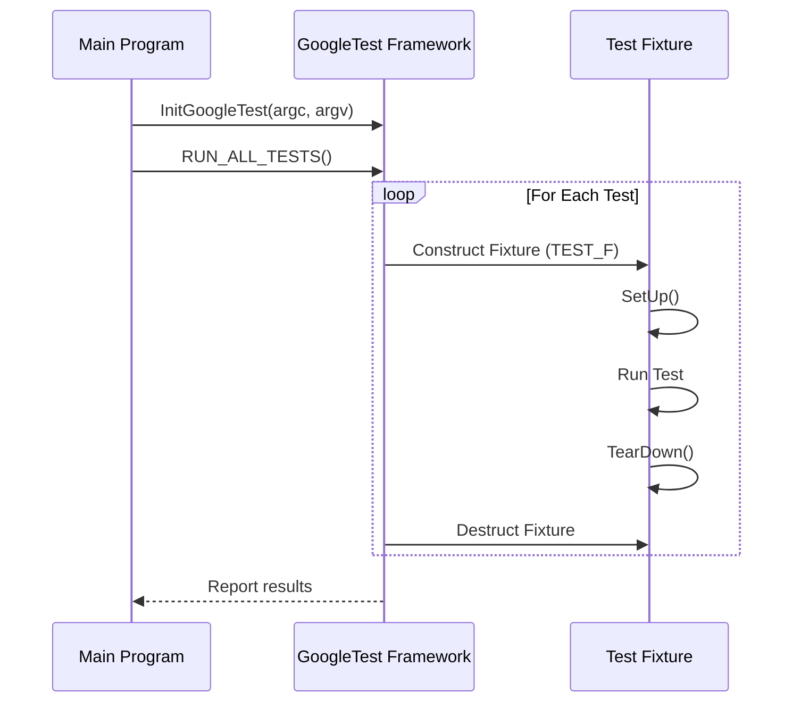

# Creating and Running Tests

GoogleTest empowers you to define, register, and execute various kinds of tests including unit tests, typed tests, and parameterized tests. This documentation focuses exclusively on how to write tests using GoogleTest, understand the mechanics behind test discovery and registration, execute them, and customize the test runner behavior for your specific testing needs.

---

## 1. Test Types and Their Basic Usage

GoogleTest supports several test styles designed to meet different testing goals and scenarios:

### 1.1 Simple Unit Tests
Use the `TEST()` macro to define a standalone test with a test suite and test name. These are basic test functions:

```cpp
TEST(FactorialTest, HandlesZeroInput) {
  EXPECT_EQ(Factorial(0), 1);
}

TEST(FactorialTest, HandlesPositiveInput) {
  EXPECT_EQ(Factorial(3), 6);
}
```

- The first argument is the *test suite* name grouping related tests.
- The second is the *test name*.
- Both names must be valid C++ identifiers without underscores.

### 1.2 Tests Using Fixtures (`TEST_F`)
Use when multiple tests share common setup or data.

```cpp
class QueueTest : public testing::Test {
 protected:
  Queue<int> queue_;

  void SetUp() override {
    queue_.Enqueue(1);
  }
};

TEST_F(QueueTest, IsNotEmptyInitially) {
  EXPECT_NE(queue_.Dequeue(), nullptr);
}
```

Fixtures allow setup/teardown, and test isolation. GoogleTest creates a new fixture object for each test to keep tests independent.

### 1.3 Value-Parameterized Tests (`TEST_P` and Instantiations)
Test the same logic across multiple input values.

Define a fixture derived from `TestWithParam<T>` or inheriting from both `Test` and `WithParamInterface<T>`.

```cpp
class MyTest : public testing::TestWithParam<int> {};

TEST_P(MyTest, IsEven) {
  int param = GetParam();
  EXPECT_EQ(param % 2, 0);
}

INSTANTIATE_TEST_SUITE_P(EvenNumbers,
                         MyTest,
                         testing::Values(2, 4, 6, 8));
```

- Tests run once per given parameter.
- Use `GetParam()` within test body to access current parameter.

### 1.4 Typed Tests (`TYPED_TEST`) and Type-Parameterized Tests (`TYPED_TEST_P`)
Verify the same test logic for multiple types.

- Typed tests require declaring a fixture template.
- Types are listed via the `Types` alias and bound with `TYPED_TEST_SUITE`.

Example:

```cpp
template <typename T>
class MyTypedTest : public testing::Test {
 public:
  T value_;
};

using TestTypes = testing::Types<int, float, double>;
TYPED_TEST_SUITE(MyTypedTest, TestTypes);

TYPED_TEST(MyTypedTest, DefaultIsZero) {
  EXPECT_EQ(this->value_, TypeParam(0));
}
```

Type-parameterized tests differ by allowing deferred type list binding and registration.

---

## 2. Test Registration and Discovery

GoogleTest registers tests automatically via macros like `TEST()`, `TEST_F()`, `TEST_P()`, and `TYPED_TEST()`. The framework organizes tests in suites and provides runtime introspection.

### 2.1 Building Tests with `RegisterTest`
For dynamic or runtime test registration scenarios, use `testing::RegisterTest()`.

```cpp
testing::RegisterTest(
    "MySuite", "MyTest", nullptr, nullptr, __FILE__, __LINE__, []() -> MyFixture* {
      return new MyFixture();
    });
```

- Avoid unless macros do not suffice.
- Must be called before `RUN_ALL_TESTS()`.
- All tests within the same suite share the fixture type.

### 2.2 Naming Rules

- Test suite and test names must be valid C++ identifiers and avoid underscores.
- Test full names are of the form `TestSuite.TestName`.
- Test names must be unique within their suite.

### 2.3 Test Discovery

GoogleTest's framework discovers all linked tests at runtime without explicit enumeration.

---

## 3. Running Tests

### 3.1 Test Runner: `RUN_ALL_TESTS()`

- Use this function in your main to run all discovered tests.
- Returns 0 if all tests pass; 1 otherwise.
- `InitGoogleTest()` must be called before this to parse flags.

```cpp
int main(int argc, char** argv) {
  testing::InitGoogleTest(&argc, argv);
  return RUN_ALL_TESTS();
}
```

### 3.2 Test Execution Flow

For each test:

- GoogleTest constructs a fresh fixture instance (for `TEST_F`).
- Calls `SetUp()`.
- Runs the test body.
- Calls `TearDown()`.
- Destructs the fixture.

This isolation ensures no test state leaks to another.

### 3.3 Filtering, Recycling, and Advanced Runner Controls

- Use `--gtest_filter` to restrict tests run.
- `--gtest_repeat` to repeat tests multiple times.
- `--gtest_shuffle` to randomize test order.
- `--gtest_fail_fast` to stop on first failure.

---

## 4. Test Macros and Customization

### 4.1 Core Test Macros

- `TEST(TestSuiteName, TestName)`: Simple test.
- `TEST_F(FixtureName, TestName)`: Uses fixture.
- `TEST_P(FixtureName, TestName)`: Value-parameterized test.
- `TYPED_TEST(SuiteName, TestName)`: Typed tests.
- `TYPED_TEST_P(SuiteName, TestName)`: Type-parameterized.

### 4.2 Instantiation Macros

- `INSTANTIATE_TEST_SUITE_P`: Instantiates value-parameterized tests from generators.
- `REGISTER_TYPED_TEST_SUITE_P`: Registers type-parameterized tests.
- `INSTANTIATE_TYPED_TEST_SUITE_P`: Instantiates type-parameterized tests.

### 4.3 The `FRIEND_TEST` Macro

Declare individual tests as friends in classes to access private members.

```cpp
class MyClass {
  FRIEND_TEST(MyClassTest, PrivateMethodWorks);
  ...
};
```

---

## 5. Examples

### 5.1 Basic Test Example

```cpp
TEST(MathTest, Addition) {
  EXPECT_EQ(2 + 2, 4);
}
```

### 5.2 Test Fixture Example

```cpp
class StackTest : public testing::Test {
 protected:
  void SetUp() override {
    stack_.Push(1);
  }

  Stack<int> stack_;
};

TEST_F(StackTest, IsNotEmptyAfterPush) {
  EXPECT_FALSE(stack_.IsEmpty());
}

TEST_F(StackTest, CanPopPushedItem) {
  EXPECT_EQ(stack_.Pop(), 1);
}
```

### 5.3 Parameterized Test Example

```cpp
class IsOddTest : public testing::TestWithParam<int> {};

TEST_P(IsOddTest, ReturnsTrueForOddNumbers) {
  EXPECT_TRUE(IsOdd(GetParam()));
}

INSTANTIATE_TEST_SUITE_P(OddNumbers, IsOddTest, testing::Values(1, 3, 5, 7));
```

### 5.4 Typed Test Example

```cpp
template <typename T>
class NumericTest : public testing::Test {
 public:
  T value_ = T();
};

using NumericTypes = testing::Types<int, float>;
TYPED_TEST_SUITE(NumericTest, NumericTypes);

TYPED_TEST(NumericTest, IsZeroByDefault) {
  EXPECT_EQ(this->value_, TypeParam(0));
}
```

---

## 6. Best Practices and Troubleshooting Tips

- Always call `testing::InitGoogleTest()` before running tests.
- Use `TEST_F()` when shared setup or teardown is needed.
- Use parameterized tests (`TEST_P`) to avoid repetitive similar tests.
- Name test suites and tests with meaningful identifiers without underscores.
- Guard against sticky expectations in mocks by using `.RetiresOnSaturation()` or sequences if mocking.
- Avoid mixing calls to `EXPECT_CALL()` and exercising the mock in the same code block.
- Remember that `RUN_ALL_TESTS()` should be called exactly once.

---

## 7. Test Runner Customization

GoogleTest lets you customize test execution and reporting through flags and event listener APIs:

- Use command-line flags like `--gtest_filter` to run subsets.
- Use listeners to override or augment test output.
- Retrieve current test info programmatically via `UnitTest::GetInstance()->current_test_info()`.

---

## 8. Related Documentation

- [Test Fixtures](../primer.md#same-data-multiple-tests) for shared setups.
- [Value-Parameterized Tests](../advanced.md#value-parameterized-tests) for parameterized tests.
- [Typed and Type-Parameterized Tests](../advanced.md#typed-tests) for generic type-based tests.
- [Registering Tests Programmatically](../advanced.md#registering-tests-programmatically) for dynamic scenarios.

---

## 9. Visual Overview of Test Flow



---

This comprehensive documentation delivers end-to-end guidance on defining, registering, running, and customizing GoogleTest tests. It highlights different test styles accordant to your use cases, their syntaxes, and provides practical examples paired with best practices to ensure smooth test development and execution.
