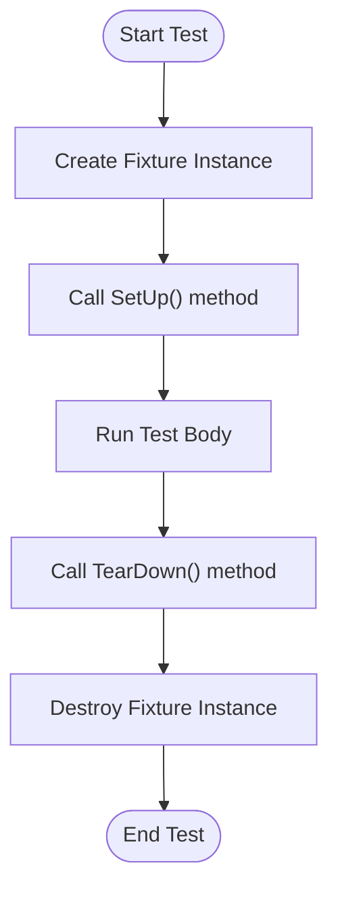

# Test Fixtures and Lifecycle

This documentation focuses on the APIs and patterns for managing test fixtures and lifecycle events in GoogleTest. It explains how to set up and tear down test environments reliably using test fixtures, manage pre/post test conditions, and maintain shared state. This guidance ensures that tests are isolated, reproducible, and that resources are properly cleaned up to prevent test pollution and flakiness.

---

## 1. Understanding Test Fixtures in GoogleTest

A **test fixture** encapsulates the common environment for a group of related tests. It typically involves setting up resources needed by those tests and cleaning them up afterward. GoogleTest provides native support for fixtures via the `TEST_F` macro and lifecycle methods.

### Why Use Fixtures?

- Avoid duplicated setup and teardown code across tests.
- Share common objects or states across several test cases.
- Ensure clean initialization for every test to prevent interference.

### How Fixtures Work

You define a fixture class derived from `::testing::Test`:

```cpp
class MyTestFixture : public ::testing::Test {
 protected:
  void SetUp() override {
    // Code here runs immediately before each test.
  }

  void TearDown() override {
    // Code here runs immediately after each test.
  }

  // Shared resources and helper functions.
};
```

Use `TEST_F` to write tests using this fixture:

```cpp
TEST_F(MyTestFixture, TestCase1) {
  // Test code that can use fixture setup.
}

TEST_F(MyTestFixture, TestCase2) {
  // Another test using the same fixture.
}
```

Each test runs in isolation, with `SetUp()` called before and `TearDown()` after.

---

## 2. Lifecycle API Details

GoogleTest defines two primary fixture lifecycle APIs:

| Method          | When Called               | Use Case                     |
|-----------------|--------------------------|------------------------------|
| `SetUp()`       | Before each test instance | Initialize resources          |
| `TearDown()`    | After each test instance  | Cleanup resources            |

### Writing Setup and Teardown Code

- Use `SetUp()` to configure dependencies, allocate memory, establish connections, or initialize data.
- Use `TearDown()` to release memory, close file handles, or reset shared state.

### Advanced Lifecycle Hooks

GoogleTest also supports:

- **Test Suite Setup/Teardown:** via static `SetUpTestSuite()` and `TearDownTestSuite()` methods. These run once before/after all tests in a fixture class.

```cpp
class MyTestFixture : public ::testing::Test {
 public:
  static void SetUpTestSuite() {
    // One-time setup for all tests in the suite.
  }

  static void TearDownTestSuite() {
    // One-time cleanup after all tests.
  }
};
```

This is useful for expensive operations that can be shared to improve test speed.

---

## 3. Using Test Fixtures to Manage Shared State

Tests often depend on shared state or external resources (databases, files, network connections). Carefully managing these with fixtures improves test reliability.

### Best Practices for Shared State with Fixtures

- Initialize shared state in `SetUp()` or `SetUpTestSuite()`.
- Clean up or reset shared state in `TearDown()` or `TearDownTestSuite()`.
- Avoid global/static mutable state that can leak across tests.
- Ensure isolation so that tests can run in any order independently.
- Use RAII patterns wrapped in fixtures to guarantee cleanup.

### Example with Shared Resource

```cpp
class DatabaseTest : public ::testing::Test {
 protected:
  static void SetUpTestSuite() {
    ConnectToTestDatabase();
  }

  static void TearDownTestSuite() {
    DisconnectDatabase();
  }

  void SetUp() override {
    BeginTransaction();
  }

  void TearDown() override {
    RollbackTransaction();
  }
};
```

In this example:
- Connection is established once per suite.
- Each test runs inside a transaction that is rolled back, leaving the DB clean.

---

## 4. Practical Tips and Common Pitfalls

- **Do not share fixture instances across tests.** Each test runs with a fresh fixture instance.
- **Avoid non-deterministic initialization.** Keep your fixture setup deterministic to avoid flaky tests.
- **Be mindful of exceptions inside fixtures.** An exception during `SetUp()` aborts the current test gracefully.
- **Reset mocks and stubs in fixtures' lifecycle methods** to ensure clean expectations for each test.
- **Use `SetUpTestSuite()` and `TearDownTestSuite()` sparingly.** Only use for truly expensive shared setup.

---

## 5. Integration with GoogleMock and Mock Lifecycles

Fixtures also often host mock objects for dependencies.

- Instantiate mocks in fixture members.
- Configure default mock behavior in `SetUp()`.
- Define expectations with `EXPECT_CALL()` inside individual tests or fixture setup.
- When tests finish, mock destructors verify expectations automatically.

### Controlling Mock Strictness

Use wrappers for mocks to control uninteresting call behavior inside fixtures:

- `NiceMock<MyMock>`: suppresses uninteresting call warnings.
- `NaggyMock<MyMock>` (default behavior): prints warnings.
- `StrictMock<MyMock>`: treats uninteresting calls as errors.

Selecting the right strictness level improves test resilience and clarity.

---

## 6. Example Workflow for Setting Up and Tearing Down Tests

<Steps>
<Step title="Define Fixture Class">
Create a subclass of `::testing::Test` that describes the environment.
</Step>
<Step title="Implement Setup and Teardown">
Override `SetUp()` and `TearDown()` to prepare and clean up resources for each test.
</Step>
<Step title="Create Tests Using Fixture">
Write tests using `TEST_F`, gaining access to fixture members and methods.
</Step>
<Step title="Manage Shared Expensive Resources">
Optionally, use `SetUpTestSuite()` and `TearDownTestSuite()` for suite-wide setup.
</Step>
</Steps>

---

## 7. Troubleshooting Common Issues

### Test Pollution and Shared State

If your tests behave inconsistently or interfere:

- Verify that each test runs with a fresh fixture instance.
- Confirm that shared state is reset properly between tests.
- Use transactions or reset mocks to prevent data leakage.

### Resource Leaks

- Ensure `TearDown()` releases allocated resources.
- Use RAII for deterministic cleanup even if exceptions occur.

### Unexpected Mock Failures

- Confirm mock expectations are set before testing logic runs.
- Reset mocks or create new mock instances per test for isolation.

---

## 8. Further Reading and Cross-References

- [GoogleTest Test Case Registration & Structure](../core-apis/test-case-registration.md) for test macros and lifecycle.
- [GoogleMock Defining Mock Methods](../mocking-framework/mock-methods.md) for integrating mocks with fixtures.
- [gMock Cookbook: Lifecycle and Expectations](https://google.github.io/googletest/gmock_cook_book.html#UseOnCall) provides advanced best practices.
- Getting Started guides on [Structuring Effective Tests](../getting-started/understanding-test-structure.md).

---

## 9. Summary

Managing your test environment lifecycle with test fixtures in GoogleTest unlocks resilient, maintainable, and scalable testing. By leveraging `SetUp`, `TearDown`, and test suite hooks, you ensure a consistent starting point and proper cleanup for each test, thus avoiding flaky, interdependent failures. Proper use of mocks inside fixtures also facilitates precise interaction testing.

---

<Info>
Need code examples or want to see how test fixtures integrate with mocks? Check the [GoogleMock Cookbook](https://google.github.io/googletest/gmock_cook_book.html) and [Test Case Registration documentation](../core-apis/test-case-registration.md).
</Info>

---

## Appendix: Minimal Test Fixture Example

```cpp
#include <gtest/gtest.h>

class MyFixture : public ::testing::Test {
 protected:
  int shared_value;

  void SetUp() override {
    shared_value = 42;
  }

  void TearDown() override {
    // Clean up if needed
  }
};

TEST_F(MyFixture, TestOne) {
  ASSERT_EQ(shared_value, 42);
  shared_value += 1;
}

TEST_F(MyFixture, TestTwo) {
  ASSERT_EQ(shared_value, 42);  // fresh state for each test
}
```

Each test runs independently with its own fixture instance, guaranteeing isolated state.

## Diagram: Test Fixture Lifecycle



This sequence repeats for each test, ensuring isolated setup and cleanup phases.


---