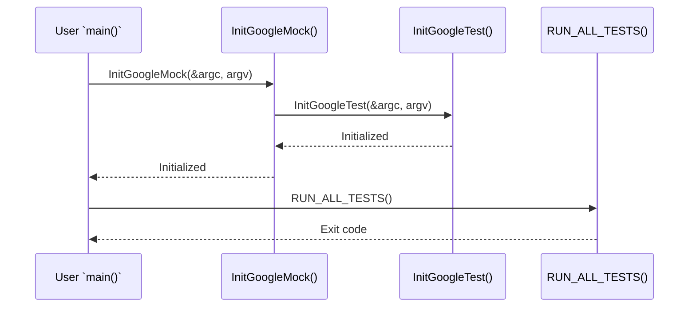

# Initialization & Main Entry Points

GoogleTest and GoogleMock require initialization before running tests in your C++ test binaries. This page explains how to properly initialize these frameworks, integrate their main functions, and set up routines that support flexible test execution environments.

---

## Why Initialization Matters

Proper initialization is crucial to enable GoogleTest and GoogleMock to parse command-line flags, register tests, and configure internal states. Without this step, your tests won't run as expected or may silently fail to report results.

Both frameworks offer initialization helpers designed to be called early in your test binary's execution — typically at the start of your `main()` function. Understanding how to use these functions ensures your tests behave consistently and can leverage available framework features such as flag parsing, verbose output control, and mock behavior setup.

---

## Basic Initialization Workflow

### Using GoogleTest

The recommended initialization for GoogleTest is to call:

```cpp
int main(int argc, char **argv) {
  testing::InitGoogleTest(&argc, argv);
  return RUN_ALL_TESTS();
}
```

- `InitGoogleTest` parses all GoogleTest-specific flags from the command line and removes them from `argv`.
- `RUN_ALL_TESTS()` runs all the registered tests and returns an exit code reflecting the success or failure.

This approach supports test filtering, output formatting, and other configured behaviors.

### Using GoogleMock

Because GoogleMock depends on GoogleTest, it provides a combined initializer:

```cpp
int main(int argc, char **argv) {
  testing::InitGoogleMock(&argc, argv);
  return RUN_ALL_TESTS();
}
```

This single call initializes both GoogleMock and GoogleTest, parsing flags relevant to mocking behavior (such as verbosity) and testing functionalities.

---

## Detailed Initialization Considerations

### The `InitGoogleMock` Function

- Parses all GoogleMock-specific flags, such as `--gmock_verbose` or `--gmock_default_mock_behavior`.
- Internally calls `InitGoogleTest` to initialize GoogleTest functionality.
- Removes recognized flags from the `argv` array, leaving unrecognized flags for your application or other frameworks.

This ensures your test binary recognizes both GoogleTest and GoogleMock command-line options.

### Flag Parsing Behavior

Unrecognized flags are preserved in command-line arguments after initialization, so you can process them separately if needed.

For example, after calling `InitGoogleMock(&argc, argv)`, you can inspect remaining arguments for custom options.

### Example Main Function Using GoogleMock

```cpp
#include "gmock/gmock.h"
#include "gtest/gtest.h"

int main(int argc, char **argv) {
  testing::InitGoogleMock(&argc, argv);
  return RUN_ALL_TESTS();
}
```

This `main()` function covers most use cases where no custom pre- or post-test setup is needed.

---

## When to Write a Custom Main Function

GoogleTest provides a `gtest_main` library, and GoogleMock provides `gmock_main`, which contain ready-made `main()` implementations. Linking against these libraries avoids the need to write your own `main` function.

However, you should write a custom `main` if:

- You need to perform setup before GoogleTest/GoogleMock initialization (e.g., configure logging, initialize your environment).
- You want to customize test execution flow, such as running additional code before or after the test suite.
- You are targeting platforms where default `main()` implementations do not apply (e.g., embedded or Arduino-like platforms).

In such cases, use the initialization functions as shown above and return the result of `RUN_ALL_TESTS()`.

---

## Embedded Platforms and Alternative Entry Points

On some embedded platforms such as Arduino or ESP8266/ESP32, the entry points differ: the `setup()` and `loop()` functions replace the traditional `main`.

For these platforms, GoogleTest/GoogleMock provides initialization hooks:

```cpp
void setup() {
  testing::InitGoogleMock();  // Initializes both testing and mocking frameworks
}

void loop() {
  RUN_ALL_TESTS();
}
```

This pattern fits well with the platform's event-driven model.

---

## Practical Tips & Best Practices

- **Always call the initializer function before `RUN_ALL_TESTS()`.** This guarantees flag parsing and test registration.
- **Use `InitGoogleMock()` if you leverage mocking features,** even if you also want GoogleTest assertions.
- **Return the value of `RUN_ALL_TESTS()` from your `main()` function.** Test runner frameworks rely on the process exit code for success/failure.
- **Avoid calling `RUN_ALL_TESTS()` multiple times.** This conflicts with advanced features like thread-safe death tests.
- **Link against `gmock_main` or `gtest_main` for convenience** when you do not require custom `main` logic.
- **Remove the deprecated `ParseGUnitFlags()`.** Use `InitGoogleTest()` or `InitGoogleMock()` instead.

---

## Integration Example: Custom `main()` with GoogleMock

Here is a robust example demonstrating integration:

```cpp
#include "gmock/gmock.h"
#include "gtest/gtest.h"
#include <cstdio>

int main(int argc, char **argv) {
  std::printf("Running main() from custom main.cpp\n");
  testing::InitGoogleMock(&argc, argv);
  int result = RUN_ALL_TESTS();
  return result;
}
```

This sets up GoogleMock with support for GoogleTest and emits an initial message.

---

## Troubleshooting Initialization Issues

- **Tests run but no output appears:** Confirm you called `InitGoogleTest()` or `InitGoogleMock()` before `RUN_ALL_TESTS()`.
- **Command-line flags ignored:** Make sure your `argv` and `argc` are passed by pointer to the initializer.
- **Linker errors for `main`:** If you included `gtest_main` or `gmock_main` but wrote your own `main`, avoid linking with these libraries to prevent duplicate symbols.
- **Flags not recognized:** Check you are calling `InitGoogleMock` if using mocks; otherwise, some mocking options will be skipped.

---

## Summary

Initializing GoogleTest and GoogleMock correctly is the foundation of a stable and flexible testing environment. Using `InitGoogleTest` for tests and `InitGoogleMock` for mocks ensures command-line flags are parsed, tests are registered, and your test binaries run consistently.

Linking against provided main libraries (`gtest_main`, `gmock_main`) reduces boilerplate unless custom setup or platform requirements demand explicit `main()` functions.

Following the patterns on this page will streamline your test execution and unlock the full potential of the GoogleTest and GoogleMock frameworks.

---

## See Also

- [GoogleTest Primer](https://github.com/google/googletest/blob/main/docs/primer.md) — for test writing basics and main function usage
- [GoogleMock README](https://github.com/google/googletest/blob/main/googlemock/README.md) — overview of mocking framework
- [gmock_main.cc Source](https://github.com/google/googletest/blob/main/googlemock/src/gmock_main.cc) — reference implementation of `main()` for GoogleMock
- [Integration & Ecosystem Compatibility](https://github.com/google/googletest/blob/main/docs/overview/architecture-features-integration/integration-and-dependencies.md) — environment integration details

---

## Diagram: Initialization Call Flow


