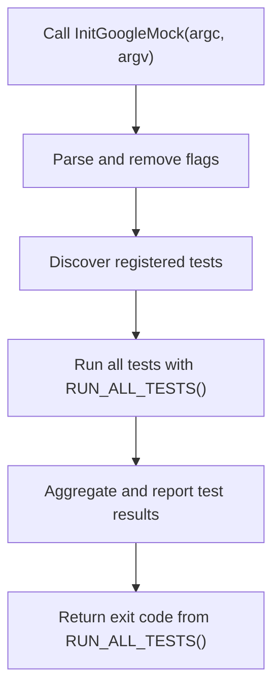

# Test Execution & Main Entry Point

This documentation page details the key mechanisms and entry points for running test suites in GoogleTest and GoogleMock. It focuses on the initialization of the testing environment, how GoogleTest integrates with platform-specific runners, the role of the `main()` function, and command-line flag handling to configure and control test execution.

---

## 1. Overview of Test Execution Flow

GoogleTest organizes tests into suites and executes them via a centralized runner. The test runner's lifecycle revolves around initialization, test discovery, execution, and result reporting, typically managed through the `RUN_ALL_TESTS()` macro and the main entry point.

### Typical Workflow for Running Tests

1. **Initialize GoogleTest/GoogleMock**: Call `InitGoogleMock()` (or `InitGoogleTest()` for GoogleTest alone) to parse command-line flags and prepare the test environment.
2. **Run All Tests**: Use `RUN_ALL_TESTS()` to execute all registered tests, aggregating results.
3. **Return Exit Status**: The return code from `RUN_ALL_TESTS()` indicates overall test success (0) or failure (nonzero).

This structure ensures consistent lifecycle management, proper flag handling, and comprehensive test outcome reporting.

---

## 2. Initialization: `InitGoogleMock()` and `InitGoogleTest()`

### Purpose

- Parses command-line flags, removing recognized flags.
- Initializes internal test framework state.
- Integrates GoogleMock with GoogleTest seamlessly.

### Usage

- Call early in `main()` before running any tests.
- Supports multiple overloads:
  - `InitGoogleMock(int* argc, char** argv);`
  - `InitGoogleMock(int* argc, wchar_t** argv);` (Windows Unicode)
  - `InitGoogleMock();` (Embedded platforms without argc/argv)

### Example
```cpp
int main(int argc, char** argv) {
  testing::InitGoogleMock(&argc, argv);
  return RUN_ALL_TESTS();
}
```

---

## 3. The Role of `main()` in GoogleTest and GoogleMock

Most users do **not** need to implement their own `main()`. Instead, link against `gtest_main` or `gmock_main` libraries, which provide a default main that:

- Calls `InitGoogleMock()` or `InitGoogleTest()`.
- Runs `RUN_ALL_TESTS()`.
- Returns resulting exit code.

### When to Write Your Own `main()`

- Custom pre-test setup beyond simple initialization.
- Special integration needs (platform-specific runners, test frameworks).
- Embedding GoogleTest/GoogleMock in larger applications.

### Minimal Custom `main()` Example
```cpp
int main(int argc, char** argv) {
  testing::InitGoogleMock(&argc, argv);
  return RUN_ALL_TESTS();
}
```

Ensure:

- `InitGoogleMock()` is called before test execution.
- The return value of `RUN_ALL_TESTS()` is returned from `main()`.

<Note>
Neglecting to call `InitGoogleMock()` or ignoring the `RUN_ALL_TESTS()` return value can lead to misconfigured environments or tests not failing as expected.
</Note>

---

## 4. Platform-Specific Integration

GoogleTest and GoogleMock accommodate various platforms including embedded systems and OS-specific peculiarities.

### Embedded and Arduino

- Use `InitGoogleMock()` with no arguments.
- Provide `setup()` and `loop()` functions instead of `main()`.

Example:
```cpp
void setup() {
  testing::InitGoogleMock();
}

void loop() {
  RUN_ALL_TESTS();
}
```

### Windows

- Unicode programs can use the wide-string overload.
- The linker bug on Windows Mobile influences use of `_tmain` vs `main`.

### Other Systems

- Regular `main(int argc, char** argv)` functions suffice.

---

## 5. Command-Line Flags and Configuration

GoogleTest and GoogleMock recognize a variety of command-line flags to control test execution behavior.

### Flag Parsing

- Flags are parsed and removed from `argv` during `InitGoogleMock()`.
- Unrecognized flags remain for other tools or frameworks.

### Common GoogleMock Flags

| Flag                               | Description                            |
|-----------------------------------|------------------------------------|
| `--gmock_verbose=LEVEL`            | Sets verbosity level (e.g., info)   |
| `--gmock_default_mock_behavior=N` | Sets default behavior for mocks      |
| `--gtest_filter=FILTER`            | Select tests by name or pattern      |

### Best Practices

- Always call `InitGoogleMock()` early to ensure flags are handled.
- Use filtering flags to run subsets of tests during development.
- Monitor verbosity for troubleshooting.

---

## 6. Example: Full Minimal Test Runner

```cpp
#include "gmock/gmock.h"

int main(int argc, char** argv) {
  // Initialize GoogleMock and GoogleTest flags.
  testing::InitGoogleMock(&argc, argv);

  // Run all registered tests.
  return RUN_ALL_TESTS();
}
```

This example provides the fastest path to getting tests discovered and executed correctly.

---

## 7. Troubleshooting Common Issues

### Tests Not Running

- Ensure `InitGoogleMock()` is called before `RUN_ALL_TESTS()`.
- Confirm all tests use `TEST()` or `TEST_F()` macros to register.

### Flags Not Taking Effect

- Verify flags are passed properly on the command line.
- Confirm that flags are recognized and removed by `InitGoogleMock()`.

### Return Code Always Zero

- Confirm `main()` returns the value from `RUN_ALL_TESTS()`.
- Ignoring this causes test runners to report success even on failures.

### Platform-Specific Execution Failures

- On embedded systems, verify use of `InitGoogleMock()` overloads.
- On Windows, ensure wide-char versions are correctly handled when building with UNICODE.

---

## 8. Diagram: Test Execution Flow



This flowchart depicts the key stages from initialization through test execution.

---

## 9. References and Further Reading

- [GoogleTest Primer](https://github.com/google/googletest/blob/main/docs/primer.md) for foundational test writing concepts.
- [Writing and Running Your First Test](https://github.com/google/googletest/blob/main/guides/getting-started/first-test.md) for practical hands-on guidance.
- [Integration with Build Systems](https://github.com/google/googletest/blob/main/overview/integration-and-getting-started/integration-with-build-systems-and-tools.md) for seamless CI/CD adoption.
- [Mocking Workflow with GoogleMock](https://github.com/google/googletest/blob/main/guides/mocking-best-practices/mocking-workflow.md) for advanced mock management.

---

By understanding and properly leveraging the main entry point and test runner lifecycle, users can efficiently structure and run tests, maximize test reliability, and integrate smoothly with diverse platforms and build environments.