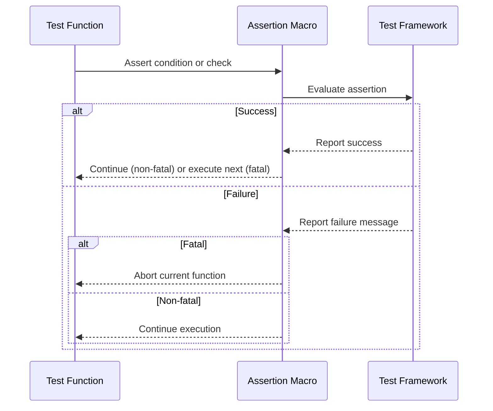

# GoogleTest Assertion Macros

This page catalogs all core assertion macros and their usage in GoogleTest. These macros enable expressive test expectations such as verifying equality, Boolean conditions, string content, exceptions, floating-point comparisons, and more. Understanding the distinction between fatal and non-fatal assertions is key to writing maintainable and robust tests.

---

## Overview of Assertion Macros

Assertion macros in GoogleTest are the fundamental way to verify code behavior during test execution. They come mostly in pairs of `EXPECT_` and `ASSERT_` variants:

- **`EXPECT_*` macros** generate _non-fatal failures_, which allow the current test function to continue running.
- **`ASSERT_*` macros** generate _fatal failures_, which abort the current test function immediately.

All assertion macros support streaming custom failure messages via the `<<` operator for detailed diagnostics.

---

## Categories of Assertions

### 1. Explicit Success and Failure

- **`SUCCEED()`**: Marks a test as succeeded at an arbitrary point. Useful for documenting successful code paths or intentionally passing milestones.

- **`FAIL()`**: Triggers a fatal failure, immediately aborting the current function. Requires a `void` return type.

- **`ADD_FAILURE()`**: Generates a non-fatal failure, allowing test execution to proceed.

- **`ADD_FAILURE_AT(file, line)`**: Like `ADD_FAILURE`, but attributes the failure to a specific source location.

### 2. Boolean Condition Assertions

- **`EXPECT_TRUE(condition)` / `ASSERT_TRUE(condition)`**: Verifies that a boolean expression is true.

- **`EXPECT_FALSE(condition)` / `ASSERT_FALSE(condition)`**: Verifies that a boolean expression is false.

### 3. Binary Comparison Assertions

Used to verify relations between two values. Arguments must be comparable with the related operator.

- `EXPECT_EQ(val1, val2)` / `ASSERT_EQ(val1, val2)` &mdash; Verify equality (`==`)
- `EXPECT_NE(val1, val2)` / `ASSERT_NE(val1, val2)` &mdash; Verify inequality (`!=`)
- `EXPECT_LT(val1, val2)` / `ASSERT_LT(val1, val2)` &mdash; Verify less than (`<`)
- `EXPECT_LE(val1, val2)` / `ASSERT_LE(val1, val2)` &mdash; Verify less or equal (`<=`)
- `EXPECT_GT(val1, val2)` / `ASSERT_GT(val1, val2)` &mdash; Verify greater than (`>`)
- `EXPECT_GE(val1, val2)` / `ASSERT_GE(val1, val2)` &mdash; Verify greater or equal (`>=`)

Important:
- For pointer comparisons, these macros compare pointer addresses, not string content.
- Use `EXPECT_STREQ` and related string assertions for C string content comparison.

### 4. String Comparison Assertions

For C-style strings (narrow and wide), these compare string content rather than addresses.

- `EXPECT_STREQ(str1, str2)` / `ASSERT_STREQ(str1, str2)` &mdash; verify strings are equal.
- `EXPECT_STRNE(str1, str2)` / `ASSERT_STRNE(str1, str2)` &mdash; verify strings are not equal.
- `EXPECT_STRCASEEQ(str1, str2)` / `ASSERT_STRCASEEQ(str1, str2)` &mdash; verify strings are equal ignoring case.
- `EXPECT_STRCASENE(str1, str2)` / `ASSERT_STRCASENE(str1, str2)` &mdash; verify strings are not equal ignoring case.

Wide strings (`wchar_t*` or `std::wstring`) are supported and converted to UTF-8 for output.

### 5. Floating-Point Comparison Assertions

Due to inherent rounding errors, direct equality on floating-point numbers is unreliable. GoogleTest provides assertions that use approximate comparisons based on Units in the Last Place (ULP).

- `EXPECT_FLOAT_EQ(val1, val2)` / `ASSERT_FLOAT_EQ(val1, val2)` &mdash; for `float`, compares values within 4 ULP.
- `EXPECT_DOUBLE_EQ(val1, val2)` / `ASSERT_DOUBLE_EQ(val1, val2)` &mdash; for `double`, compares values within 4 ULP.
- `EXPECT_NEAR(val1, val2, abs_error)` / `ASSERT_NEAR(val1, val2, abs_error)` &mdash; verifies the absolute difference between `val1` and `val2` is within `abs_error`.

### 6. Exception Assertions (Exceptions must be enabled in your build)

- `EXPECT_THROW(statement, exception_type)` / `ASSERT_THROW(statement, exception_type)` &mdash; verifies `statement` throws an exception of type `exception_type`.

- `EXPECT_ANY_THROW(statement)` / `ASSERT_ANY_THROW(statement)` &mdash; verifies `statement` throws any exception.

- `EXPECT_NO_THROW(statement)` / `ASSERT_NO_THROW(statement)` &mdash; verifies `statement` does not throw any exception.

### 7. Predicate Assertions

Enable expressing custom Boolean conditions with detailed failure messages.

- `EXPECT_PREDn(pred, val1, ..., valn)` / `ASSERT_PREDn(pred, val1, ..., valn)` &mdash; check if predicate `pred` applied to n values is true.

- `EXPECT_PRED_FORMATn(pred_formatter, val1, ..., valn)` / `ASSERT_PRED_FORMATn(pred_formatter, val1, ..., valn)` &mdash; use a custom predicate-formatter function that returns `AssertionResult` for richer failure details.

Example predicate formatter signature for 2 arguments:

```cpp
testing::AssertionResult MyPredicateFormatter(const char* expr1, const char* expr2, T1 val1, T2 val2);
```

### 8. Windows HRESULT Assertions (Windows only)

- `EXPECT_HRESULT_SUCCEEDED(expr)` / `ASSERT_HRESULT_SUCCEEDED(expr)` &mdash; verifies that the HRESULT `expr` indicates success.

- `EXPECT_HRESULT_FAILED(expr)` / `ASSERT_HRESULT_FAILED(expr)` &mdash; verifies that the HRESULT `expr` indicates failure.

### 9. Death Assertions

Verify that executing a statement causes the process to terminate as expected.

- `EXPECT_DEATH(statement, matcher)` / `ASSERT_DEATH(statement, matcher)` &mdash; verifies `statement` terminates the process with `stderr` matching `matcher`.

- `EXPECT_DEATH_IF_SUPPORTED` / `ASSERT_DEATH_IF_SUPPORTED` &mdash; run death assertions only if death tests are supported on the platform.

- `EXPECT_DEBUG_DEATH` / `ASSERT_DEBUG_DEATH` &mdash; Run death assertions only in debug mode.

- `EXPECT_EXIT(statement, predicate, matcher)` / `ASSERT_EXIT` &mdash; verifies `statement` terminates with an exit status satisfying `predicate` and `stderr` matching `matcher`.

---

## Using Assertion Macros Effectively

### Fatal vs Non-Fatal Failures

Use **`ASSERT_`** macros when continuing the test after failure makes no sense or could cause crashes. Use **`EXPECT_`** macros for softer checks that allow checking multiple conditions even if some fail.

### Adding Custom Failure Messages

All assertion macros support streaming additional failure messages using the `<<` operator:

```cpp
EXPECT_EQ(x, y) << "Custom message: x != y";
```

### Handling Null Pointer Comparisons

Use `nullptr` instead of `NULL` for clarity in pointer comparisons:

```cpp
EXPECT_EQ(ptr, nullptr);
```

### Assertion Argument Evaluation

Arguments to assertion macros are guaranteed to be evaluated exactly once.
Avoid side effects that depend on argument evaluation order.

### Asserting Complex Expressions

Leverage predicate or predicate-formatter assertions to obtain richer failure messages without manual message construction.

Example predicate AssertionResult:

```cpp
testing::AssertionResult IsEven(int n) {
  if (n % 2 == 0) return testing::AssertionSuccess();
  return testing::AssertionFailure() << n << " is odd";
}
```

Usage:

```cpp
EXPECT_TRUE(IsEven(value));
```

---

## Examples

### Simple Equality Check

```cpp
EXPECT_EQ(5, ComputeValue()) << "Value should be 5";
ASSERT_EQ(expected, actual);
```

### String Comparison

```cpp
ASSERT_STREQ("expected", actual_cstr);
EXPECT_STRCASEEQ("ABC", "abc");
```

### Floating-Point Approximate Equality

```cpp
EXPECT_FLOAT_EQ(3.14f, ComputeFloat());
ASSERT_NEAR(3.1415, ComputeDouble(), 0.0001);
```

### Exception Verification

```cpp
EXPECT_THROW({ Foo(); }, std::runtime_error);
ASSERT_NO_THROW({ Bar(); });
```

### Predicate Assertion with Custom Message

```cpp
testing::AssertionResult IsPositive(int n) {
  return n > 0 ? testing::AssertionSuccess() : testing::AssertionFailure() << n << " is not positive";
}

EXPECT_PRED1(IsPositive, value);
```

### Death Test Example

```cpp
EXPECT_DEATH({ AbortProgram(); }, "Fatal error occurred");
```

---

## Troubleshooting Common Assertion Issues

- **Fatal failures in helper functions**: Remember they _abort the current function_, not the entire test. Use `ASSERT_NO_FATAL_FAILURE()` or check `HasFatalFailure()` in the caller.

- **Using fatal assertions in non-void functions**: Fatal assertions can only be used in `void` functions. Use non-fatal assertions or restructure code.

- **Disabled tests not running**: Tests or test suites prefixed with `DISABLED_` are skipped unless the flag `--gtest_also_run_disabled_tests` is set.

- **Assertion on pointers comparing addresses vs content**: Use `EXPECT_STREQ` for C strings instead of `EXPECT_EQ`.

- **Custom types in assertions**: Teach GoogleTest how to print your types using `PrintToString()` or `AbslStringify()`.

---

## Best Practices

- Use `EXPECT_*` when you want to continue testing even after failure.
- Use `ASSERT_*` when subsequent code depends on the success of the assertion.
- Add meaningful custom messages to assertions to improve diagnosability.
- For complex conditions, prefer predicate assertions for clear failure output.
- Use `SCOPED_TRACE` to add context when multiple calls to a subroutine might fail.
- Keep assertions focused and specific to ease debugging.

---

## Related Classes and Types

- [`testing::AssertionResult`](reference/testing.md#AssertionResult): Represents success or failure of assertions with messages.
- [`testing::Test`](reference/testing.md#Test): Base class for all tests.
- [`testing::TestInfo`](reference/testing.md#TestInfo): Metadata about individual tests.
- [`testing::TestPartResult`](reference/testing.md#TestPartResult): Represents a part of a test run (e.g., an assertion).
- [`testing::ScopedTrace`](reference/testing.md#ScopedTrace): Adds tracing info to assertion failures.

---

## See Also

- [GoogleTest Primer](docs/primer.md) &mdash; Learn how to write tests
- [Assertions Reference](docs/reference/assertions.md) &mdash; Full API details
- [Advanced GoogleTest Topics](docs/advanced.md) &mdash; Deep dive into assertion design
- [Matchers in GoogleTest and GoogleMock](api-reference/core-assertions-macros/gmock-matchers) &mdash; Powerful matcher utilities
- [Mocking Reference](docs/reference/mocking.md) &mdash; Related mocking macros
- [Core Testing Workflows](googletest-guides/writing-and-running-tests/core-testing-workflows.md) &mdash; Best practices

---

## Summary Diagram: Test Assertion Flow


