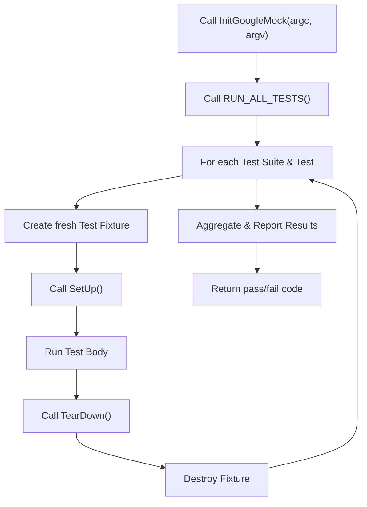

# Test Lifecycle and Main Entry Points

GoogleTest and GoogleMock, together forming an integrated testing framework for C++, provide a clear and structured lifecycle for writing, initializing, running, and tearing down tests. This page walks you through how a test run is initialized, executed, and cleaned up, emphasizing how to integrate GoogleTest and GoogleMock into your C++ projects using their main entry points across platforms.

---

## Overview of the Test Lifecycle

When developing tests with GoogleTest and GoogleMock, understanding the sequence of initialization, test execution, and cleanup is critical to effectively setting up your workflow and debugging test runs. The typical lifecycle involves:

1. **Initialization:** Parsing command-line arguments and setting flags
2. **Test Fixture Setup:** Preparing shared state or resources
3. **Test Execution:** Running defined test suites and test cases
4. **Tear-down and Reporting:** Cleaning up and generating test results

GoogleMock depends on GoogleTest's core infrastructure, and its initialization is integrated with GoogleTest initialization to harmonize flags and services.

---

## Initialization: Setting Up Before Tests Run

Before running any tests, GoogleMock requires initialization to parse its command-line flags, integrate with GoogleTest flags, and configure internal state.

### Entry Points for Initialization

- **`testing::InitGoogleMock(int* argc, char** argv)`**

  This primary function initializes GoogleMock and GoogleTest, parsing command-line flags that affect test behavior and mocking configuration. It removes recognized flags from the argument vector so that the remaining arguments can be used as needed by your program.

  It is essential to call this function early in `main()` before calling `RUN_ALL_TESTS()`.

- **`testing::InitGoogleMock(int* argc, wchar_t** argv)`**

  On Windows, this overload is provided to support wide string command-line arguments in Unicode builds.

- **`testing::InitGoogleMock()`**

  For embedded or Arduino-like environments where argc/argv parameters do not exist, this no-argument overload initializes GoogleMock appropriately.

### Purpose and Effects of Initialization

- **Flag parsing and removal:** Flags specific to GoogleMock (e.g., `--gmock_verbose`) and GoogleTest are parsed and removed from `argv`. This ensures your application’s main routine receives only relevant arguments.
- **Flag variable setup:** Flags parsed affect internal global variables such as `GMOCK_FLAG(verbose)` that configure mocking output verbosity.
- **GoogleTest initialization:** Since GoogleMock depends on GoogleTest, this call also initializes GoogleTest’s components.

### Example: Custom `main()` Function

```c++
#include "gtest/gtest.h"
#include "gmock/gmock.h"

int main(int argc, char** argv) {
  testing::InitGoogleMock(&argc, argv);  // Parses flags and does setup
  return RUN_ALL_TESTS();                 // Runs all tests
}
```

### Platform-Specific Notes

- On **Windows** with Unicode builds, use the wide-character overload supporting `wchar_t** argv`.
- On **Arduino/Embedded** platforms without traditional `argc` and `argv`, use the no-argument `InitGoogleMock()`.
- Some embedded platforms (e.g., ESP8266, ESP32, NRF52) require using `setup()` and `loop()` instead of `main()`. The GoogleMock `gmock_main.cc` file provides adapted setup for this pattern.

<Tip>
Always call `InitGoogleMock()` before `RUN_ALL_TESTS()`. Failure to do so means flags won't be parsed, and internal state may not be correctly set.
</Tip>

---

## Running Tests: The `RUN_ALL_TESTS()` Macro

After initializing, the common practice is to run all registered tests using the `RUN_ALL_TESTS()` macro. This automatically executes all test cases and fixtures you've defined, reporting aggregated results.

### What Happens When You Call `RUN_ALL_TESTS()`?

- GoogleTest discovers all registered test suites and test cases.
- For each test:
  - A fresh test fixture instance is created (if applicable).
  - `SetUp()` is called (if defined).
  - Test body runs.
  - `TearDown()` is called.
  - Test fixture is destroyed.
- Results are collected and reported.

The return value is 0 if all tests pass, or non-zero if any fail.

### Typical Workflow Diagram



---

## Writing Your Own `main()` Function

While the recommended approach is to link against the provided `gtest_main` or `gmock_main` libraries that supply a default `main()`, there are cases where you need a custom `main()`:

- To set up environment variables or customize logging before tests run.
- To handle signals or integrate with external test harnesses.
- To execute pre-test logic in your test program.

### Sample Boilerplate for Custom `main()`

```c++
#include "gtest/gtest.h"
#include "gmock/gmock.h"

int main(int argc, char **argv) {
  testing::InitGoogleMock(&argc, argv);   // Initialize GoogleMock & GoogleTest

  // Your custom setup code here, if necessary.

  return RUN_ALL_TESTS();                  // Run all tests and return the status
}
```

### Important Considerations

- You **must** return the value of `RUN_ALL_TESTS()` from `main()`. This value determines the exit status for CI systems or scripts.
- Do **not** call `RUN_ALL_TESTS()` multiple times in the same program run.
- Avoid invoking `InitGoogleMock()` more than once; it may cause conflicts.

---

## Integration with Embedded and Platform-Specific Environments

GoogleTest and GoogleMock support various platforms, some with non-standard entry points.

### Arduino/Embedded Patterns

For platforms like [ESP8266](https://github.com/esp8266/Arduino), [ESP32](https://github.com/espressif/arduino-esp32), or Arm NRF52 where main loops are replaced by `setup()` and `loop()`, `gmock_main.cc` includes helpers:

```c++
void setup() {
  testing::InitGoogleMock();  // No argc/argv available
}

void loop() {
  RUN_ALL_TESTS();
}
```

### Windows Unicode

On Windows, Unicode builds require calling the wide-character overload:

```c++
int wmain(int argc, wchar_t** argv) {
  testing::InitGoogleMock(&argc, argv);
  return RUN_ALL_TESTS();
}
```

GoogleMock's main entry point implementation accounts for the platform nuances.

---

## Best Practices and Troubleshooting

<AccordionGroup title="Best Practices and Common Pitfalls">
<Accordion title="Always Initialize Before Running Tests">
Ensure you call `InitGoogleMock()` at the beginning of your test `main()` function.
Calling `RUN_ALL_TESTS()` before initialization leads to uninitialized behavior or ignored flags.
</Accordion>
<Accordion title="Return the Result of RUN_ALL_TESTS()">
Your `main()` should return the result of `RUN_ALL_TESTS()`. This is essential for CI systems to detect test failures correctly.
</Accordion>
<Accordion title="Avoid Multiple RUN_ALL_TESTS() Calls">
Calling `RUN_ALL_TESTS()` more than once is unsupported and can cause unexpected errors.
</Accordion>
<Accordion title="Passing Command-Line Flags">
Pass GoogleMock/GoogleTest command-line flags to control verbosity and test selection.
Example: `--gmock_verbose=info` to get detailed mocking logs.
Unknown flags are left in argv for your program.
</Accordion>
<Accordion title="Unicode and Embedded Platforms">
Use the appropriate `InitGoogleMock` overload based on your platform.
For embedded platforms, use the no-argument version.
</Accordion>
</AccordionGroup>

<Check>
If you omit to call `InitGoogleMock()`, or call it improperly, tests won’t run as expected, and flags won’t be parsed.
</Check>

---

## Related Resources

- [GoogleTest Primer](https://google.github.io/googletest/primer.html): Learn how to write tests, use assertions, and understand the testing framework’s core concepts.
- [gMock README](https://github.com/google/googletest/tree/main/googlemock#readme): Overview of GoogleMock’s features and goals.
- [Example Test Program](https://github.com/google/googletest/blob/main/googlemock/test/gmock_test.cc): Shows practical use of `InitGoogleMock()` and test setup.
- [Integration & Ecosystem Compatibility](../overview/architecture-and-concepts/integration-and-extension.md): How GoogleTest and GoogleMock fit into build systems and tools.

---

## Summary

This page detailed the lifecycle stages of a test run for both GoogleTest and GoogleMock, with a strong focus on the essential initialization function `InitGoogleMock()` and running tests through `RUN_ALL_TESTS()`. It highlights the importance of correct setup ordering, platform-specific entry points, and best practices to achieve reliable, maintainable test executions.

By following these guidelines, users will unlock the robust test harness provided by GoogleTest and GoogleMock, ensuring scalability and clarity throughout their testing workflows.

---

<Note>
For further advancement consider exploring guides on writing effective tests, mocks, and advanced mocking patterns, all covered in other parts of this documentation.
</Note>
