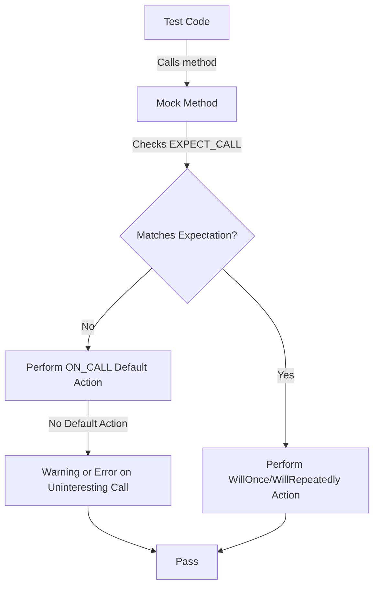

# Defining Mock Methods and Classes

GoogleMock (`gMock`) provides powerful macros and templates to define mock classes and their methods easily and effectively. This page details how to declare and implement mock methods and classes using the core `MOCK_METHOD` macro family, enabling you to create flexible and finely tuned test doubles in C++.

---

## Overview

Mock classes simulate interfaces or abstract classes that your production code depends on, letting you verify interactions and stub behaviors. Creating a mock class involves deriving from a real or interface class and adding mock methods.

The `MOCK_METHOD` macro generates mock method implementations, handling various method qualifiers (like `const` and `override`), noexcept specifications, and calling conventions. It supports handling overloaded methods and template classes transparently.

---

## Defining Mock Methods

### MOCK_METHOD Syntax

```cpp
MOCK_METHOD(ReturnType, MethodName, (Args...), (Qualifiers));
```

- `ReturnType`: The return type of the method.
- `MethodName`: Name of the method to mock.
- `(Args...)`: Parenthesized list of argument types.
- `(Qualifiers)`: Optional parenthesized list of qualifiers like `const`, `override`, `noexcept`, calling convention etc.

**Example:**

```cpp
class MockFoo {
 public:
  MOCK_METHOD(void, DoThis, (), (override));
  MOCK_METHOD(int, GetValue, (int x, int y), (const, noexcept, override));
};
```

---

### Important Details

- **Must be inside `public:` section**: Regardless of the base class' method visibility (`private`, `protected`, or `public`), put `MOCK_METHOD` declarations in the `public` section to allow `EXPECT_CALL` and `ON_CALL` to work.

- **Handling Commas in Types:**
  - Return types or arguments that include commas (e.g., `std::pair<int, int>`) must be enclosed in additional parentheses.

  Example:

  ```cpp
  // Won't compile:
  MOCK_METHOD(std::pair<int, int>, GetPair, ());
  
  // Wrap return type in parentheses:
  MOCK_METHOD((std::pair<int, int>), GetPair, ());

  // Or define type alias:
  using IntPair = std::pair<int, int>;
  MOCK_METHOD(IntPair, GetPair, ());
  ```

- **Qualifiers:** Common qualifiers include:
  - `const`
  - `override` (recommended for overridden virtual methods)
  - `noexcept` (for noexcept methods)
  - `Calltype(STDMETHODCALLTYPE)` for Windows call conventions
  - Reference qualifiers `ref(&)` or `ref(&&)` for methods qualified on `&` or `&&`.

- **Overloaded Methods:** You can mock all overloaded variants by declaring them separately. If you omit an overload, the compiler will warn about hidden base class methods. Use `using BaseClass::Method;` to fix this if needed.

- **Mocking Template Classes:** You can mock template classes just like regular classes by defining a mock template class and using `MOCK_METHOD` inside.

```cpp
template <typename T>
class MockStack : public StackInterface<T> {
 public:
   MOCK_METHOD(int, GetSize, (), (const, override));
   MOCK_METHOD(void, Push, (const T& x), (override));
};
```

---

## Using `NiceMock`, `NaggyMock`, and `StrictMock`

These class templates wrap your mock class to adjust behavior on *uninteresting calls* (calls to methods without an explicit expectation).

- **NaggyMock**: The default; issues warnings for uninteresting calls.
- **NiceMock**: Suppresses warnings for uninteresting calls, making tests less noisy.
- **StrictMock**: Treats uninteresting calls as errors, enforcing strict interaction verification.

### Usage

```cpp
using ::testing::NiceMock;
using ::testing::NaggyMock;
using ::testing::StrictMock;

NiceMock<MockFoo> nice_mock;
NaggyMock<MockFoo> naggy_mock;
StrictMock<MockFoo> strict_mock;
```

These types inherit all constructors of your mock, so if your mock constructor takes arguments, you can pass them through directly:

```cpp
NiceMock<MockFoo> nice_mock(arg1, arg2);
```

### Known Caveats

- `NiceMock`, `NaggyMock`, and `StrictMock` only affect mock methods declared *directly* in the mock class using `MOCK_METHOD`. They may not affect mock methods inherited from base classes.
- Nesting these wrappers (e.g., `NiceMock<StrictMock<MockFoo>>`) is not supported.
- They behave slightly differently with non-virtual destructors and may not work perfectly if your mock base class lacks a virtual destructor.

<Note>
If your mock base class has non-virtual destructor, be cautious using these wrappers, as it may affect their correctness.
</Note>

---

## Practical Patterns

### Defining a Mock Method That Uses Comma-Containing Types

```cpp
class MockFoo {
 public:
  MOCK_METHOD((std::pair<bool, int>), GetPair, ());
  MOCK_METHOD(bool, CheckMap, ((std::map<int, double>), bool));
};
```

Or equivalently:

```cpp
using BoolAndInt = std::pair<bool, int>;
using MapIntDouble = std::map<int, double>;
class MockFoo {
 public:
  MOCK_METHOD(BoolAndInt, GetPair, ());
  MOCK_METHOD(bool, CheckMap, (MapIntDouble, bool));
};
```

### Mocking Overloaded Methods

Provide mock methods for *all* overloads you want to support.

```cpp
class Foo {
 public:
  virtual int Add(int x);
  virtual int Add(double y) const;
};

class MockFoo : public Foo {
 public:
  MOCK_METHOD(int, Add, (int x), (override));
  MOCK_METHOD(int, Add, (double y), (const, override));
};
```

If you don't want to mock all overloads, bring the others into scope with `using`:

```cpp
class MockFoo : public Foo {
 public:
  using Foo::Add;
  MOCK_METHOD(int, Add, (int x), (override));
};
```

### Mocking Non-Virtual Methods for High-Perf Injection

Define a mock class *without* inheriting the real class, duplicating the method signatures:

```cpp
class Concrete {
 public:
  void AppendPacket(Packet*);
  const Packet* GetPacket(size_t) const;
};

class MockConcrete {
 public:
  MOCK_METHOD(void, AppendPacket, (Packet*));
  MOCK_METHOD(const Packet*, GetPacket, (size_t), (const));
};
```

Use template arguments or compile-time polymorphism to select which to use in production vs. testing.

### Simplifying Complex Interfaces

When a method has many arguments but only a few are important, you can forward the actual method to a new mock method with a simplified signature:

```cpp
class LogSink {
 public:
  virtual void send(LogSeverity severity, const char* full_filename,
                    const char* base_filename, int line, const tm* tm_time,
                    const char* message, size_t message_len) = 0;
};

class ScopedMockLog : public LogSink {
 public:
  void send(...) override {
    Log(severity, full_filename, std::string(message, message_len));
  }

  MOCK_METHOD(void, Log,
              (LogSeverity severity, const std::string& file_path,
               const std::string& message));
};
```

This approach makes your mocks easier to use in tests.

### Delegating Calls to a Fake or Real Object

You may want to have your mock call a backing fake or real object for default behavior:

```cpp
class MockFoo : public Foo {
 public:
  MOCK_METHOD(char, DoThis, (int n), (override));

  void DelegateToFake() {
    ON_CALL(*this, DoThis).WillByDefault([this](int n) {
      return fake_.DoThis(n);
    });
  }

 private:
  FakeFoo fake_;
};
```

This preserves realistic behavior while allowing expectations.

---

## Common Pitfalls

- **Expectations must be set BEFORE calls**: Setting expectations after mock methods have been invoked leads to undefined behavior.
- **Not all methods need to be mocked**: Only mock what your tests need.
- **Unprotected commas cause compilation errors in `MOCK_METHOD`**: Always wrap such types in parentheses or typedefs.
- **Beware of sticky expectations**: By default, expectations are "sticky" and remain active even after their upper bound is reached, which can cause errors for repeated calls.
- **Use `RetiresOnSaturation()` or sequences to manage multiple expectations**.
- **Mock destructors cannot be mocked with `MOCK_METHOD`**: To observe destruction timing, define a separate mock method and call it from the destructor.

---

## Summary of Steps to Define Mocks

1. Derive your mock class from the interface or concrete class to be mocked.
2. For each method to be mocked, use `MOCK_METHOD` in the public section.
3. Handle qualifiers accurately.
4. If needed, wrap your mock with `NiceMock`, `NaggyMock`, or `StrictMock` to control uninteresting call warnings.
5. Use mock instances in tests with `EXPECT_CALL` and `ON_CALL` to specify behavior and verify interactions.

---

## Additional Guidance

- For details on setting call expectations, cardinalities, and action specifications, refer to the [Setting Call Expectations and Cardinalities](https://google.github.io/googletest/reference/mocking.html#EXPECT_CALL) documentation.
- For best mocking practices and advanced usage, consult the [gMock Cookbook](https://google.github.io/googletest/gmock_cook_book.html).
- To understand differences between uninteresting and unexpected calls, see the section on the Nice, Naggy, and Strict mocks in the Cookbook.
- When mocking move-only types, pay special attention to return value semantics as covered in the Cookbook.

---

## Code Example: Mock Class with Constructors

GoogleMock wraps your mock and inherits constructors seamlessly:

```cpp
class MockBar {
 public:
  explicit MockBar(const std::string& s) : str_(s) {}

  MOCK_METHOD(int, This, (), ());
  MOCK_METHOD(std::string, That, (int, bool), ());

 private:
  std::string str_;
};

// Usage with NiceMock to suppress unwanted warnings:
NiceMock<MockBar> nice_bar("hello");
EXPECT_CALL(nice_bar, This());
nice_bar.This();
```

---

## Troubleshooting Tips

- **Compiler errors related to argument parsing:** Make sure to wrap types containing commas with parentheses or `using` aliases.
- **Uninteresting call warnings:** Use `NiceMock` to suppress or add explicit `EXPECT_CALL(...).Times(AnyNumber())`.
- **Unexpected call failures:** Check that expectations are set prior to exercising mocks and are matching the right method signatures and arguments.
- **Issues with strict/naggy/nice mocks not having the correct effect:** Verify that mock methods are defined directly in the mock class.
- **Mock class not destroying properly:** Ensure base classes have virtual destructors.

---

## Sample Mermaid Diagram: Mock Method Call Flow


```

This flow shows how a mock method call checks expectations and default actions.

---

## See Also

- [gMock Cookbook](https://google.github.io/googletest/gmock_cook_book.html) — practical recipes
- [Mocking Reference](https://google.github.io/googletest/reference/mocking.html) — in-depth API details
- [gMock Cheat Sheet](https://google.github.io/googletest/gmock_cheat_sheet.html) — quick syntax reference
- [Setting Call Expectations and Cardinalities API](https://google.github.io/googletest/reference/mocking.html#EXPECT_CALL)
- [Custom Actions and Matchers](https://google.github.io/googletest/guides/integration-advanced-optimization/custom-actions-and-matchers.html)

---

This documentation fits in the API Reference for the Core Mocking API, focusing exclusively on defining mock methods and classes.

