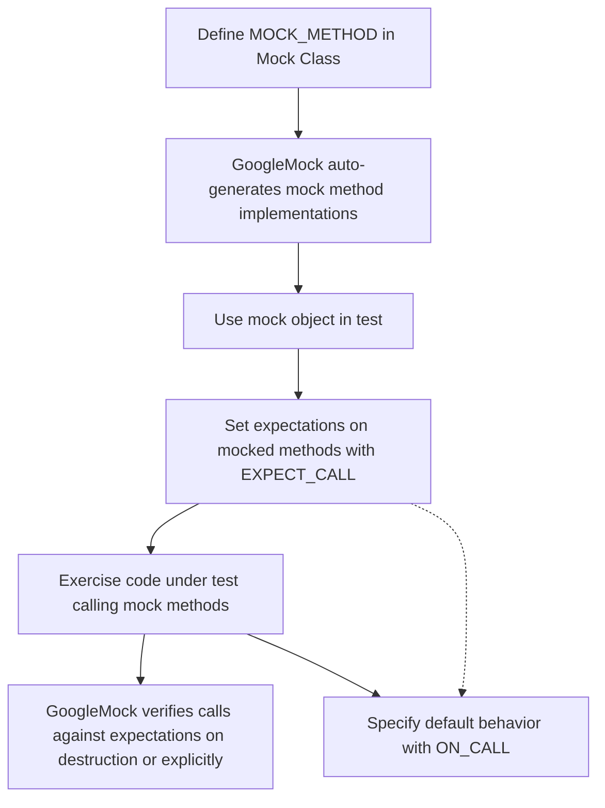

# MOCK_METHOD Macro

The `MOCK_METHOD` macro is the fundamental tool in GoogleMock for declaring mocked methods in your test doubles. It enables you to define mock methods with precise signatures, including qualifiers and calling conventions, that replicate the interfaces your code depends on, allowing you to verify interactions and control behavior in your unit tests.

---

## Overview

`MOCK_METHOD` injects a mock method declaration inside your mock class. It automatically generates method definitions that integrate with GoogleMock’s expectation-setting and verification mechanisms.

By using `MOCK_METHOD`, you do not have to hand-write mock implementations, which are typically error-prone and tedious. Instead, you express the mocked method’s interface, and GoogleMock handles the rest.

---

## Syntax

```cpp
MOCK_METHOD(ReturnType, MethodName, (Args...), (Qualifiers...));
```

- **ReturnType**: The return type of the method.
- **MethodName**: The name of the mocked method.
- **Args...**: The argument types, enclosed in parentheses.
- **Qualifiers...** (optional): Method qualifiers such as `const`, `override`, `noexcept`, calling conventions, or reference qualifiers.

> Note: When your method signature contains commas inside the return type or in arguments (e.g., `std::pair<int, double>`), wrap that type in an extra pair of parentheses to ensure correct parsing.

Example with parentheses wrapping for complex return type:

```cpp
MOCK_METHOD((std::pair<bool, int>), GetPair, ());
```

---

## Qualifiers Supported

You can specify the following qualifiers in the optional fourth parameter:

| Qualifier            | Description                                                                                 |
|----------------------|---------------------------------------------------------------------------------------------|
| `const`              | Marks the method as a `const` method; required if overriding a `const` base method.         |
| `override`           | Marks the method with `override`; recommended to ensure signature matches base class.       |
| `noexcept`           | Marks the method with `noexcept`; required if overriding a `noexcept` method.               |
| `Calltype(convention)` | Specifies the calling convention (e.g., `STDMETHODCALLTYPE`); useful on Windows platforms. |
| `ref(&)` / `ref(&&)` | Marks the method with reference qualifiers (lvalue/rvalue); required if overriding methods with reference qualifiers. |

These qualifiers should be passed as a comma-separated list inside the fourth parameter’s parentheses.

Example:

```cpp
MOCK_METHOD(void, Foo, (int x), (const, override, noexcept));
```

---

## Usage Guidelines

### Where to Declare `MOCK_METHOD`
- Declare all mock methods inside the `public:` section of your mock class. This enables GoogleMock macros like `ON_CALL` and `EXPECT_CALL` to access the mocks even if the base class method is protected or private.

### Mocking Virtual Methods
- Only virtual (or pure virtual) methods can be mocked. GoogleMock relies on the virtual dispatch mechanism.
- Ensure that destructors in your interfaces are virtual if you intend to mock them.

### Mocking Overloaded Methods
- You can mock overloaded methods just like any other method.
- If not all overloads are mocked, you may get compiler warnings about hidden base class methods. Use `using Base::MethodName;` inside your mock class to bring hidden methods into scope.

Example:

```cpp
class Foo {
 public:
  virtual int Add(int x);
  virtual int Add(int x, int y);
};

class MockFoo : public Foo {
 public:
  using Foo::Add;  // Bring other overloads into scope.
  MOCK_METHOD(int, Add, (int x), (override));
  MOCK_METHOD(int, Add, (int x, int y), (override));
};
```

### Mocking Class Templates
- Use `MOCK_METHOD` inside templated mock classes as usual, just make sure template parameters are respected.

```cpp
template <typename T>
class MockStack : public StackInterface<T> {
 public:
  MOCK_METHOD(int, GetSize, (), (const, override));
  MOCK_METHOD(void, Push, (const T& x), (override));
};
```

### Dealing with Methods with No Arguments or Omitted Argument Matchers
- When setting expectations with `EXPECT_CALL`, you can omit the arguments entirely for non-overloaded methods to match calls regardless of arguments.
- For overloaded methods, argument matchers must be specified explicitly.

---

## Practical Examples

### Mocking a Simple Interface

Suppose you have an interface:

```cpp
class Turtle {
 public:
  virtual ~Turtle() {}
  virtual void PenUp() = 0;
  virtual void PenDown() = 0;
  virtual void Forward(int distance) = 0;
  virtual int GetX() const = 0;
};
```

You can mock it like this:

```cpp
class MockTurtle : public Turtle {
 public:
  MOCK_METHOD(void, PenUp, (), (override));
  MOCK_METHOD(void, PenDown, (), (override));
  MOCK_METHOD(void, Forward, (int distance), (override));
  MOCK_METHOD(int, GetX, (), (const, override));
};
```

No need to implement these methods separately; GoogleMock auto-generates the definitions.

### Mocking a Method with Complex Return Type

```cpp
class MockClass {
 public:
  MOCK_METHOD((std::pair<bool, int>), GetPair, ());
};
```

### Mocking with Calling Conventions on Windows

```cpp
MOCK_METHOD(bool, Foo, (int n), (Calltype(STDMETHODCALLTYPE)));
```

### Mocking Methods with Reference Qualifiers

```cpp
class MyClass {
 public:
  virtual int DoSomething() & = 0;
  virtual int DoSomething() && = 0;
};

class MockMyClass : public MyClass {
 public:
  MOCK_METHOD(int, DoSomething, (), (ref(&), override));
  MOCK_METHOD(int, DoSomething, (), (ref(&&), override));
};
```

---

## Common Pitfalls & Best Practices

- **Don’t forget `override` or method qualifiers**
  - These ensure your mock method truly overrides the base’s virtual function.
- **Handle commas in complex types properly**
  - Use extra parentheses or type aliases to avoid parsing errors.
- **Always put mock methods in the `public:` section**
  - This is necessary for GoogleMock to work correctly.
- **Do not mock non-virtual methods unless using template tricks**
  - Standard mocking only applies to virtual methods.
- **For overloaded methods**, explicitly disambiguate if necessary using `using` declarations or typed matchers.

---

## Integration with Expectations and Actions

Once your mock method is declared with `MOCK_METHOD`, you can set expectations with `EXPECT_CALL` and default behaviors with `ON_CALL`.

Example:

```cpp
MockTurtle mock_turtle;
ON_CALL(mock_turtle, GetX()).WillByDefault(Return(100));
EXPECT_CALL(mock_turtle, Forward(10)).Times(2);
```

---

## Summary

The `MOCK_METHOD` macro is your gateway to mocking methods in GoogleMock. It simplifies interface mocking by automatically generating method implementations matching your interface, ensuring seamless integration with expectations and behaviors.

Use it with proper qualifiers and syntax to mock virtual (and only virtual) methods accurately.

---

## Additional Resources

- [Mocking Reference — MOCK_METHOD](../reference/mocking.md#MOCK_METHOD)
- [gMock for Dummies — Writing the Mock Class](https://google.github.io/googletest/gmock_for_dummies.html#writing-the-mock-class)
- [gMock Cookbook — Creating Mock Classes](https://google.github.io/googletest/gmock_cook_book.html#creating-mock-classes)
- [Setting Expectations with EXPECT_CALL](../reference/mocking.md#EXPECT_CALL)
- [GoogleMock Overview](https://github.com/google/googletest/blob/main/googlemock/README.md)

---

## Troubleshooting

- **Warnings about overridden methods differ by `const` qualifiers?**
  - This can be a compiler bug. For parameters, top-level `const` in parameter types is ignored; consider removing them.
- **Compilation errors when mocking methods with comma-containing types?**
  - Wrap those types in extra parentheses or define type aliases.
- **Issues mocking overloaded methods?**
  - Use `using` declarations to bring hidden base class overloads into scope.
- **Mock methods not called or expectations not met?**
  - Check that mocked methods are indeed virtual and signatures match.

---

## Frequently Asked Questions

- **Can I mock non-virtual methods?**
  - Not traditionally; GoogleMock requires virtual methods. For non-virtual, advanced techniques involve templates but are out of scope here.
- **Can I mock destructors?**
  - No, destructors cannot be mocked directly. Use the pattern of adding a mockable `Die()` method and call it in the destructor.
- **How to mock move-only types method signatures?**
  - Use `MOCK_METHOD` normally; some additional handling may be necessary in actions or expectations.

---

This documentation is focused on the `MOCK_METHOD` macro and assumes familiarity with GoogleMock’s broader concepts such as `EXPECT_CALL`, `ON_CALL`, matchers, and actions for full mocking workflows.

---

# Example Mock Class Using `MOCK_METHOD`

```cpp
#include <gmock/gmock.h>

class MockTurtle : public Turtle {
 public:
  MOCK_METHOD(void, PenUp, (), (override));
  MOCK_METHOD(void, PenDown, (), (override));
  MOCK_METHOD(void, Forward, (int distance), (override));
  MOCK_METHOD(int, GetX, (), (const, override));
};
```

This mock class allows you to easily set expectations such as:

```cpp
using ::testing::Return;
EXPECT_CALL(mock_turtle, GetX())
    .WillOnce(Return(10))
    .WillRepeatedly(Return(20));
```

You can then verify whether the class under test interacts with the `Turtle` interface as expected.

---

# Summary Diagram of Mock Method Flow



---

# Tips

- Wrap argument types with commas in extra parentheses.
- Use the optional qualifier parameter to precisely replicate your interface methods.
- Always declare your mock methods as `public:`.
- Use `override` to catch signature mismatches at compile time.
- Combine `MOCK_METHOD` with `EXPECT_CALL` and `ON_CALL` to fully control mock method behavior.
- For overloaded methods, use explicit typing and `using` declarations for clarity and to avoid hiding base methods.

---

# Troubleshooting Common Errors

- **Method not mocked but calls real method:** Ensure the method is virtual.
- **Parsing errors with complex signatures:** Confirm you correctly wrap types with commas.
- **Redefinition or ambiguity errors in overloaded mocks:** Use scoped `using` declarations to avoid hiding.

<Check>
Ensure all specifications in the `MOCK_METHOD` macro mirror the original method's declaration precisely to guarantee proper overriding and mocking.
</Check>

---

# Related Documentation

- [Setting Expectations with EXPECT_CALL](../api-reference/core-mocking-apis/call-expectations.md)
- [Argument Matchers](../api-reference/matchers-and-actions/argument-matchers.md)
- [Mock Actions](../api-reference/matchers-and-actions/mock-actions.md)
- [GoogleMock Tutorial (gMock for Dummies)](../gmock_for_dummies.md)

---

# Reference Links

- GoogleMock GitHub: https://github.com/google/googletest
- GoogleTest Primer: /guides/getting-started/primer-basics
- Mocking Reference overview: /docs/reference/mocking.md

---