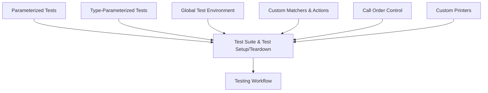

# Advanced API & Extension Points

This page outlines the advanced features and extension mechanisms of GoogleTest designed to support more complex testing workflows and platform adaptations. Here you will find detailed guidance on parameterized and type-parameterized tests, environment setup and teardown hooks, and the portable customization points GoogleTest provides to tailor test behavior.

---

## 1. Parameterized Tests

Parameterized tests allow you to run the same test logic with different input data, promoting code reuse and simplifying comprehensive test coverage.

### 1.1 Defining Parameterized Tests

Start by deriving your test fixture from

```cpp
::testing::TestWithParam<ParamType>
```

where `ParamType` is the type of the parameter your test accepts.

Then, use the `TEST_P` macro to define parameterized test cases:

```cpp
class MyTest : public ::testing::TestWithParam<int> {
  // Optional setup/teardown
};

TEST_P(MyTest, CheckIfEven) {
  int value = GetParam();
  EXPECT_EQ(value % 2, 0);
}
```

### 1.2 Instantiating Parameterized Tests

Choose your test inputs with `INSTANTIATE_TEST_SUITE_P`: 

```cpp
INSTANTIATE_TEST_SUITE_P(EvenNumbers,
                         MyTest,
                         ::testing::Values(2, 4, 6, 8));
```

This will run `MyTest.CheckIfEven` with each value provided.

### 1.3 Using Parameter Generators

GoogleTest supports many built-in generators:

- `Values(...)` – list of values
- `Range(start, end, step)` – integer ranges
- `Bool()` – values `true` and `false`
- `Combine(...)` – Cartesian product of multiple parameter sequences

Example with combine:

```cpp
INSTANTIATE_TEST_SUITE_P(Combos, MyTest,
                         ::testing::Combine(::testing::Values(1,2),
                                            ::testing::Bool()));
```

---

## 2. Type-Parameterized Tests

Type-parameterized tests let you reuse test logic for different types.

### 2.1 Defining Type-Parameterized Tests

Derive your fixture from `::testing::Test` as usual, then use `TYPED_TEST_SUITE` and `TYPED_TEST` macros.

```cpp
template <typename T>
class MyTypeTest : public ::testing::Test {
  // ...
};

using MyTypes = ::testing::Types<int, float, double>;
TYPED_TEST_SUITE(MyTypeTest, MyTypes);

TYPED_TEST(MyTypeTest, IsDefaultConstructible) {
  TypeParam obj{};
  EXPECT_NO_THROW(TypeParam{});
}
```

### 2.2 Notes

- The test case and test names are shared across all types.
- Use `TypeParam` inside the test body to refer to the current type.

---

## 3. Environment Setup and Teardown

GoogleTest provides global hooks to manage shared setups and teardowns across tests.

### 3.1 Defining a Test Environment

Derive from `::testing::Environment` and override `SetUp()` and `TearDown()`:

```cpp
class MyEnvironment : public ::testing::Environment {
 public:
  void SetUp() override {
    // global setup code
  }

  void TearDown() override {
    // global cleanup code
  }
};
```

### 3.2 Register and Use

Register the environment before running tests:

```cpp
::testing::AddGlobalTestEnvironment(new MyEnvironment);
```

`SetUp()` executes before all tests, `TearDown()` after all tests finish.

### 3.3 Use Cases

- Initialize shared database connections
- Set global configuration
- Manage external resources

---

## 4. Portable Customization Points

For adapting GoogleTest behavior to various systems, use these hooks and interfaces.

### 4.1 Platform-Specific Configuration

GoogleTest supports compile-time macros and flags to handle system differences such as threading, file system details, or signal handling.

### 4.2 Custom Printers

To improve output readability, teach GoogleTest how to print your specific types by specializing `PrintTo` in the `testing` namespace:

```cpp
namespace testing {
void PrintTo(const MyType& value, std::ostream* os) {
  *os << "MyType(" << value.some_field << ")";
}
}
```

### 4.3 Extending Matchers and Actions

Leverage the macros `MATCHER()`, `MATCHER_P()`, and the polymorphic matcher helpers to write custom matchers for asserting complex data.

Similarly, define custom actions with `ACTION()`, `ACTION_P()`, or by creating classes implementing `ActionInterface`.

### 4.4 Hooks for Test Lifecycle

- Override `Test::SetUpTestSuite()` and `Test::TearDownTestSuite()` for per-test suite setup and cleanup.
- Use `Test::SetUp()` and `Test::TearDown()` for per-test initialization and cleanup.

### 4.5 Controlling Test Order and Dependencies

Use `::testing::Sequence` and in-sequence expectations (`InSequence`) to enforce call ordering.

Use `EXPECT_CALL(...).After(...)` to establish dependencies between expectations.

---

## 5. Practical Tips and Best Practices

- Prefer parameterized and type-parameterized tests to reduce code duplication and improve coverage.
- Use environment setup hooks to manage global state and shared resources in tests.
- Write custom matchers and actions that express intent clearly and provide informative failure messages.
- Respect GoogleTest's threading and lifecycle constraints when extending or integrating.

---

## 6. Troubleshooting Common Extensions Issues

- Ensure your mock classes have virtual destructors to avoid leaks.
- Use `NiceMock` or `StrictMock` variants to control expected and unexpected call warnings.
- Avoid mocking non-virtual functions directly; instead, use interfaces or template-based injection.
- When overloading methods, assist the compiler by using `Const()` or explicit matcher casts to select the correct overload.

---

## 7. Summary Diagram of Extension Points



---

For comprehensive guidance, refer to the [gMock Cookbook](https://google.github.io/googletest/gmock_cook_book.html), [Mocking Reference](https://google.github.io/googletest/reference/mocking.html), and [Matchers Reference](https://google.github.io/googletest/reference/matchers.html).

---

This page fits into the API Reference tab under GoogleTest Core API and complements other guides on test definition, assertions, and mocking.

For next steps, explore the Core Workflows guide on [Parameterized and Type-Parameterized Tests](../guides/core-workflows/parameterized-and-typed-tests) and the [Mocking Techniques and Patterns](../guides/core-workflows/mocking-techniques-and-patterns) guide.
