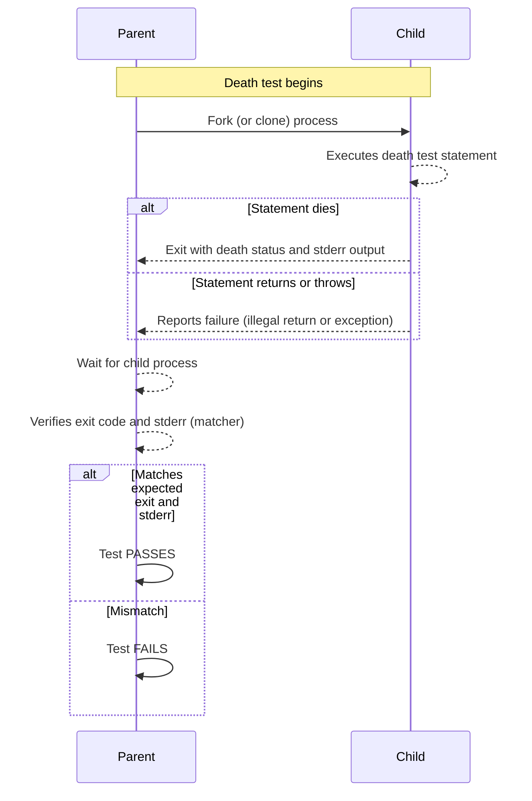

# Death Test API

This documentation page explains how to write and use *death tests* in GoogleTest—a special kind of test designed to verify that code intentionally terminates, crashes, or exits as expected. It introduces the key macros, matchers, test styles, and best practices to ensure reliable and maintainable death tests.

---

## Understanding Death Tests

Death tests verify that a piece of code terminates abnormally (e.g., via `abort()`, process exit with error, or signal), which is essential for testing assertions or fatal error conditions that crash the program intentionally.

### What Is a Death Test?
- A death test checks that a statement or function call causes the process to die (i.e., exit nonzero, abort, or be killed by a signal).
- It does not include exceptions because those can be caught and handled, so death test scope excludes exception verification.

### Why Use Death Tests?
- To validate that critical failure conditions actually lead to program termination.
- To ensure assertions, fatal checks, and precondition failures behave as designed.

---

## Death Test Macros

GoogleTest provides several macros tailored for death tests. Use them inside tests (either plain tests or test fixtures) where you want to verify abnormal termination.

### Basic Macros

| Macro              | Description                                                                   | Behavior on Failure                      |
|--------------------|-------------------------------------------------------------------------------|-----------------------------------------|
| `ASSERT_DEATH`     | Verifies that statement causes process to die with stderr matching regex/matcher. Aborts current function on failure. | Fatal failure, aborts test function.    |
| `EXPECT_DEATH`     | Like ASSERT_DEATH, but nonfatal—test continues after failure.                 | Nonfatal failure, continues test.       |
| `ASSERT_EXIT`      | Verifies that statement causes process to exit with an exit status matching a predicate and stderr output matching regex/matcher. | Fatal failure, aborts test function.    |
| `EXPECT_EXIT`      | Like ASSERT_EXIT, nonfatal variant.                                           | Nonfatal failure, continues test.       |
| `EXPECT_DEATH_IF_SUPPORTED` / `ASSERT_DEATH_IF_SUPPORTED` | Use these macros to write death tests that only run if the platform supports them. Otherwise, they issue harmless warnings.

---

### Debug Mode Specific Macros

- `EXPECT_DEBUG_DEATH` and `ASSERT_DEBUG_DEATH` assert death only in debug builds. In optimized builds, statements execute normally (with observable side effects).

---

## Writing Death Tests

1. Use `ASSERT_DEATH` or `EXPECT_DEATH` to wrap the statement expected to terminate.
2. Provide a matcher (usually a regex string) specifying expected stderr output.
3. For `ASSERT_EXIT` and `EXPECT_EXIT`, provide a predicate to check the exit code or signal.

Example:

```cpp
TEST(MyDeathTest, Foo) {
  // Compound statement supported via braces.
  ASSERT_DEATH({
    int n = 5;
    Foo(&n);
  }, "Error on line .* of Foo()");
}

TEST(MyDeathTest, ExpectNormalExit) {
  EXPECT_EXIT(NormalExit(), testing::ExitedWithCode(0), "Success");
}

TEST(MyDeathTest, ExpectKillBySignal) {
  EXPECT_EXIT(KillProcess(), testing::KilledBySignal(SIGKILL),
              "Sending myself unblockable signal");
}
```

---

## Matchers and Predicates

- The matcher argument can be a regex string or a GoogleTest matcher (e.g., `ContainsRegex`, `Eq`). Plain strings are interpreted as `ContainsRegex` for legacy support.
- For exit status in `ASSERT_EXIT` and `EXPECT_EXIT`, GoogleTest provides predicate classes:
  - `ExitedWithCode(int exit_code)` verifies normal exit with specific code.
  - `KilledBySignal(int signal_number)` (POSIX only) verifies the process was terminated by a specific signal.

### Regular Expression Support

- On POSIX, POSIX Extended Regex syntax is supported.
- On Windows and Mac, a simpler regex engine is used, supporting:
  - Basic characters, digit classes (`\d`), whitespace (`\s`), word chars (`\w`), repetition (`*`, `+`, `?`), anchors (`^`, `$`), and escaped punctuation.
  - Unsupported features include alternation (`|`), groups, brackets, and repetition counts.

---

## Death Test Styles

GoogleTest supports two styles of death tests distinguished by the `--gtest_death_test_style` flag (default: `fast`):

| Style       | Description                                                                                     | Use Case & Notes                            |
|-------------|------------------------------------------------------------------------------------------------|---------------------------------------------|
| `fast`      | The child process forks and immediately runs the death test code after forking.                 | Faster, but unsafe in multithreaded environments. | 
| `threadsafe`| The child process forks then *re-executes* the test binary, running only the death test.       | Safer for multi-threaded apps, but slower.

---

## How Death Tests Work Internally

- Death tests execute in a new child process to isolate termination.
- The parent process monitors the child’s termination status and stderr output.
- The child signals death reasons, exit statuses, or failure to die via pipes.
- In `threadsafe` style, the child re-executes the test binary, running only the targeted death test.
- If the death test statement finishes without dying, or returns normally, the test fails.

---

## Best Practices and Recommendations

- **Use a test suite name ending with "DeathTest"** for tests containing death tests. This convention enables GoogleTest to run them early and serially, improving thread-safety.

- **Avoid multiple death test assertions on the same source line.** This causes compilation failures due to macro expansion restrictions.

- **Avoid `return` or exception throwing in death test statements.** They cause the death test to fail because death test macros expect to terminate the process.

- **Be mindful of side effects in the death test statement.** The statement runs in the child process, so side effects are not visible in the parent.

- **Ensure the child process’s current directory is in a valid state.** Death tests may fail if working directory changes interfere with launching child processes.

- **If mocking is used in death tests, permit leak allowance** on mocks that may otherwise trigger leak errors due to process termination.

---

## Common Error Patterns

- **Death test fails due to no process death:** The statement executed did not terminate as expected.
- **Output doesn’t match the matcher:** The stderr output differs from the expected regex or matcher.
- **Multiple threads are active when forking:** `fast` death test style is unsafe; prefer `threadsafe` style or run tests single-threaded.
- **Multiple death tests on the same source line cause compile-time errors.** Place death tests on separate lines.
- **Unexpected `return` or exceptions in death test statements cause failures.** Avoid or refactor accordingly.

---

## Advanced Topics

### Using Death Test Macros in Subroutines

- You can place death tests inside helper functions or methods.
- These functions must adhere to the constraints of death tests (no returning or throwing).

### Thread Safety

- Death tests use `fork()` and may deadlock if many threads exist.
- The `threadsafe` style mitigates this by spawning new processes via exec; choose it when multithreading is unavoidable.

### Debug Build Differences

- `EXPECT_DEBUG_DEATH` only asserts death in debug builds; in optimized builds, the death test statement executes normally, preserving side effects.

### Catching Exceptions in Death Tests

- If exceptions throw from death test statements, they are treated as failures.
- GoogleTest catches and reports exceptions inside death tests unless disabled with the `catch_exceptions` flag.

---

## Example Death Test

```cpp
#include <gtest/gtest.h>

void CauseCrash() {
  // Intentionally cause a crash
  abort();
}

TEST(MyDeathTest, AbortCausesDeath) {
  // Expect that CauseCrash() terminates the process with output matching 'Aborted'
  ASSERT_DEATH(CauseCrash(), "Aborted");
}

TEST(MyDeathTest, ExitWithZeroCode) {
  EXPECT_EXIT(_Exit(0), testing::ExitedWithCode(0), "");
}

// Using a custom predicate to check exit status
bool IsExitCodeOne(int status) {
  return WIFEXITED(status) && WEXITSTATUS(status) == 1;
}

TEST(MyDeathTest, CustomExitPredicate) {
  ASSERT_EXIT(_Exit(1), IsExitCodeOne, "");
}
```

---

## Troubleshooting

### Death Test Not Dying as Expected
- Verify the statement actually triggers termination.
- Confirm no early `return` or exception blocks termination.
- Use verbose debug output or logging to trace execution.

### Regex Match Fails
- Ensure the regex syntax conforms to GoogleTest's supported regex flavor.
- Test regex independently against expected error output.

### Multithreading Issues
- Switch `--gtest_death_test_style=threadsafe` to run death tests more safely.
- Avoid creating threads before death tests if possible.

### Compilation Errors
- Place death tests on separate lines; do not use multiple death assertions on one line.

### Mocks and Leaks
- Use `Mock::AllowLeak()` to prevent mock leak detector issues in death tests with mocks.

---

## References and Further Reading

- [Death Assertions in the Assertions Reference](reference/assertions.md#death)
- [Regular Expression Syntax](docs/advanced.md#regular-expression-syntax)
- [Death Tests and Threads](docs/advanced.md#death-tests-and-threads)
- [GoogleTest Primer: Assertions](docs/primer.md#assertions)
- [Advanced Topics: Exceptions and Debug Death](docs/advanced.md#more-assertions)

---

## Summary

Death tests are a powerful feature in GoogleTest for verifying that code terminates as expected in fatal error conditions. By leveraging macros like `ASSERT_DEATH`, `EXPECT_DEATH`, `ASSERT_EXIT`, and `EXPECT_EXIT`, along with appropriate matchers and predicates, you can write robust tests for your program’s failure pathways. Choosing the appropriate death test style (`fast` or `threadsafe`) and following recommended patterns will ensure reliable, maintainable tests.

---

## Related Pages

- [Assertions Reference](reference/assertions.md#death)
- [Advanced Guide: Death Tests](docs/advanced.md#death-tests)
- [Primer: Writing Tests](docs/primer.md)
- [Matchers Reference](reference/matchers.md)
- [Mocking with GoogleMock](guides/core-workflows/mocking-with-gmock.mdx)

---

# Visual Diagram for Death Test Flow



---

## Additional Tips

- Always test your death test regexes thoroughly; false positives and negatives cause flaky tests.
- When debug and optimized builds behave differently, consider `EXPECT_DEBUG_DEATH` macro.
- Use the recommended naming convention for death test suites (`*DeathTest`) for better ordering and thread safety.
- Capture additional diagnostic information by streaming messages into death test macros.

---

For more information, see the [GoogleTest Primer](docs/primer.md), [Assertions Reference](reference/assertions.md), and [Advanced GoogleTest Topics](docs/advanced.md).
