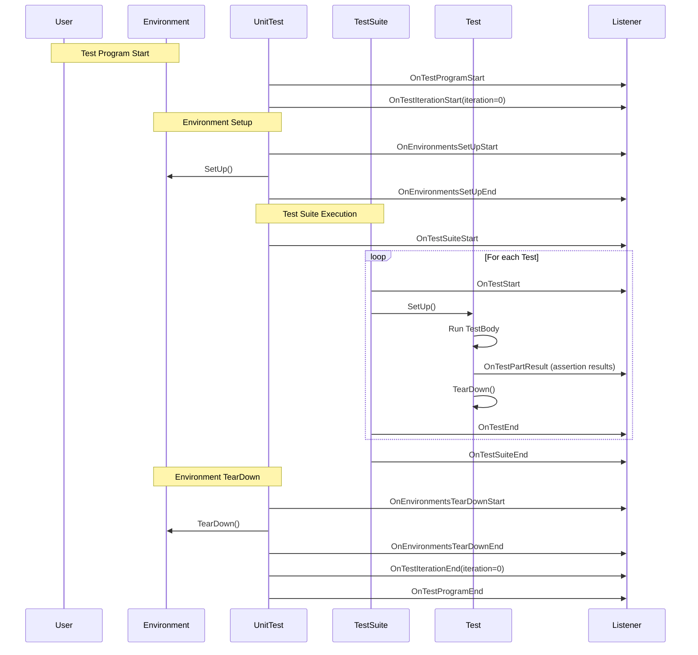

# Test Lifecycle and Environment Control

Manage the runtime lifecycle of tests in GoogleTest through a powerful API that provides hooks for test event listeners, environment setup and teardown, and extension points for advanced test management.

---

## Overview

GoogleTest orchestrates your test runtime through a defined lifecycle that spans from global environment setup to individual test execution and final teardown. This document focuses on the APIs that let you control these phases, observe test progress, and customize test behavior beyond just writing test assertions.

The key elements covered here include:

- Global and per-test environment management
- Test event listeners for observing test lifecycle events
- Extension points for customizing environment and listener behavior

Understanding and leveraging these APIs empower you to write reliable, maintainable tests that integrate cleanly with complex test workflows and infrastructure.


## 1. Test Environment Management

Test environments allow you to establish and clean up global state necessary for your tests before and after all tests run. This might include initializing databases, configuring global resources, or other one-time setup tasks.

### Creating a Custom Environment

To define an environment, subclass `testing::Environment` and override:

- `SetUp()` — Runs once before any test starts (for all test iterations).
- `TearDown()` — Runs once after all tests finish.

Example:

```cpp
class MyEnvironment : public testing::Environment {
 public:
  void SetUp() override {
    // Prepare global resources
  }

  void TearDown() override {
    // Clean up resources
  }
};
```

### Registering an Environment

Use `AddGlobalTestEnvironment()` to register your environment in your `main()` before running the tests:

```cpp
int main(int argc, char** argv) {
  testing::InitGoogleTest(&argc, argv);

  testing::AddGlobalTestEnvironment(new MyEnvironment());

  return RUN_ALL_TESTS();
}
```

GoogleTest will call `SetUp()` before any test runs and `TearDown()` after all tests complete. You can register multiple environments; they will be set up in registration order and torn down in reverse.

### Environment Behavior on Test Repeats

When running tests repeatedly (using `--gtest_repeat`), you can control whether environments are recreated for each iteration with the flag `--gtest_recreate_environments_when_repeating`. If true (default), environments are torn down and set up for each iteration; otherwise, they persist across iterations.


## 2. Test Event Listeners

GoogleTest provides an event listener API to observe the lifecycle of tests at different granularity levels: test program, test iteration, test suite, individual tests, and test assertions.

This API is key for integrating custom reporting, logging, and test management tools.

### Defining a Listener

Subclass `testing::TestEventListener` and override the lifecycle callback methods you want to handle. Each method corresponds to an event in the test run.

Example skeleton:

```cpp
class MyListener : public testing::TestEventListener {
 public:
  void OnTestProgramStart(const testing::UnitTest& unit_test) override {
    // Called before anything else
  }
  void OnTestIterationStart(const testing::UnitTest& unit_test, int iteration) override {
    // Called before each test iteration
  }
  void OnTestSuiteStart(const testing::TestSuite& test_suite) override {
    // Called before each test suite
  }
  void OnTestStart(const testing::TestInfo& test_info) override {
    // Called before each test
  }
  void OnTestPartResult(const testing::TestPartResult& result) override {
    // Called after each test assertion
  }
  void OnTestEnd(const testing::TestInfo& test_info) override {
    // Called after each test
  }
  void OnTestSuiteEnd(const testing::TestSuite& test_suite) override {
    // Called after each test suite
  }
  void OnTestIterationEnd(const testing::UnitTest& unit_test, int iteration) override {
    // Called after each iteration
  }
  void OnTestProgramEnd(const testing::UnitTest& unit_test) override {
    // Called after all tests finish
  }
  
  // You may override other methods as needed
};
```

### Using Your Listener

Add your listener to the event listener list before running tests:

```cpp
int main(int argc, char** argv) {
  testing::InitGoogleTest(&argc, argv);
  auto& listeners = testing::UnitTest::GetInstance()->listeners();

  // Remove default printer if you want custom output
  delete listeners.Release(listeners.default_result_printer());

  listeners.Append(new MyListener());

  return RUN_ALL_TESTS();
}
```

### Listener Event Delivery Order

Listeners receive events in the order they were registered for `On*Start` events, and in reverse order for `On*End` events. This allows layered listeners to control framing of output.

### Listener Best Practices and Restrictions

- Do not generate failures inside `OnTestPartResult()`. It may cause recursive calls.
- Place listeners that handle `OnTestPartResult()` before those that generate failures to ensure correct attribution.


## 3. Advanced Test Lifecycle Controls

### Per-Test-Suite Setup and Teardown

Within your test fixture class, you can implement static methods:

- `static void SetUpTestSuite()` — Called once before any tests in the suite execute.
- `static void TearDownTestSuite()` — Called once after all tests in the suite finish.

Example:

```cpp
class MyTest : public testing::Test {
public:
  static void SetUpTestSuite() {
    // Allocate shared expensive resources
  }
  static void TearDownTestSuite() {
    // Free shared resources
  }

  void SetUp() override {
    // Per-test setup
  }

  void TearDown() override {
    // Per-test teardown
  }
};
```

This approach is essential for optimizing tests that share heavy global state and ensures tests are independent while keeping runtime manageable.

### Skipping Tests Dynamically

By invoking the `GTEST_SKIP()` macro within a test or setup method, you can skip running a test with a meaningful message. For example:

```cpp
TEST(MyTestSuite, TestToSkip) {
  GTEST_SKIP() << "Skipping due to unmet conditions";
}
```

Skipping can also be performed in test environment `SetUp()` or fixture `SetUp()` methods to conditionally disable multiple tests.

### Recording Custom Properties

Tests and test suites can attach key-value properties for richer reporting via `::testing::Test::RecordProperty()`.

```cpp
TEST(MyTestSuite, MyTest) {
  ::testing::Test::RecordProperty("Performance", "Fast");
}
```

Properties are embedded in XML or JSON reports, enabling downstream tools to consume additional metadata.


## 4. Typical User Flow: Enhancing Test Control

### Step 1: Define and Register Environments

Create environments for global state and register them before running tests.

### Step 2: Implement Listeners for Custom Reporting

Create customized event listeners if you need alternative or extended output beyond standard console and XML.

### Step 3: Use Test Suite Setup for Shared Resources

Optimize your tests by defining static `SetUpTestSuite()` and `TearDownTestSuite()` in your fixtures.

### Step 4: Record Rich Metadata

Add custom test properties to your tests for enhanced diagnostics and reporting.

### Step 5: Handle Test Skips Dynamically

Apply `GTEST_SKIP()` in runtime situations where preconditions fail, to keep test runs meaningful.


## 5. Troubleshooting Common Issues

### Environment Setup Not Called?

- Ensure `AddGlobalTestEnvironment()` is called **before** `RUN_ALL_TESTS()`.
- Confirm no premature skips or fatal failures occur before environment setup.

### Listener Not Receiving Events?

- Verify the listener is appended before tests run.
- Check if the default result printer was removed if output conflicts occur.

### Test Suite Setup/TearDown Not Executed?

- Confirm these methods are **static** and correctly named (`SetUpTestSuite`, not `SetupTestSuite`).
- Validate no fatal failures or skips abort the lifecycle early.

### Failures in Listener Cause Recursion

- Avoid generating assertion failures inside `OnTestPartResult()`.
- Place failure-generating listeners after listeners handling test part results.


## 6. References and Next Steps

- [GoogleTest Primer](primer.md) — foundational concepts of tests and fixtures.
- [Testing Reference](docs/reference/testing.md) — detailed API documentation including event listeners and environment APIs.
- [Advanced Topics](docs/advanced.md#Extending-GoogleTest-by-Handling-Test-Events) — extending GoogleTest via listeners.
- [Basic Test Macros](api-reference/core-test-api/test-macros-and-fixtures.md) — writing simple tests and fixtures.


## Diagram: Test Runtime Lifecycle Events



---