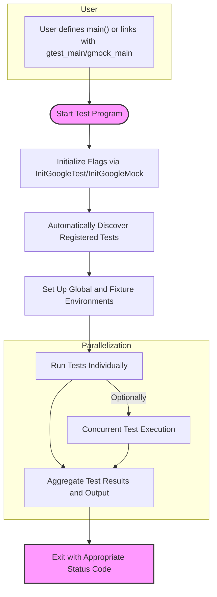

# Test Execution, Options, and Environment

This document guides you through running tests in GoogleTest and GoogleMock, controlling test discovery, customizing test environments, and integrating advanced test types such as death tests and parameterized tests. It focuses on the primary entry points and environment configurations that empower you to efficiently execute and manage your test suites.

---

## 1. Running Tests: Main Entry Points

GoogleTest and GoogleMock provide straightforward interfaces for running tests while supporting flexible environment setup.

### Using `RUN_ALL_TESTS()`

This is the main function you call to run all tests discovered and registered in the program. It executes each test or test fixture independently, accumulating the overall pass/fail result.

```cpp
#include <gtest/gtest.h>

int main(int argc, char** argv) {
  ::testing::InitGoogleTest(&argc, argv);
  return RUN_ALL_TESTS();
}
```

- `::testing::InitGoogleTest(&argc, argv)` parses GoogleTest and GoogleMock specific flags, removing recognized flags from the command line.
- `RUN_ALL_TESTS()` runs all registered test suites and returns 0 if all tests succeed, or 1 (or another non-zero) if any test fails.

> **Important**: You **must** use the return value of `RUN_ALL_TESTS()` as the process exit code to reflect test success status properly.

### Using `testing::InitGoogleMock()`

For tests that use GoogleMock mocks, invoke `InitGoogleMock` instead of `InitGoogleTest`. It automatically initializes both GoogleMock and GoogleTest.

```cpp
#include "gmock/gmock.h"

int main(int argc, char** argv) {
  testing::InitGoogleMock(&argc, argv);  
  return RUN_ALL_TESTS();
}
```

On special platforms like Arduino or ESP, you provide `setup()` and `loop()` functions instead of `main()`:

```cpp
void setup() {
  testing::InitGoogleMock();
}

void loop() {
  RUN_ALL_TESTS();
}
```

## 2. Test Discovery and Options

GoogleTest automatically discovers all tests declared via `TEST()`, `TEST_F()`, `TEST_P()`, and other macros within linked binaries. You do not need to manually enumerate tests.

### Controlling Test Execution via Command-Line Flags

You can customize test execution by passing flags to your test binary. Some important flags (recognized by `InitGoogleTest`/`InitGoogleMock`) include:

- `--gtest_filter`: Specifies which tests to run, based on test suite and test name patterns.
- `--gtest_repeat`: Repeats tests the specified number of times.
- `--gtest_break_on_failure`: Breaks into the debugger on a test failure.

For GoogleMock-specific options, pass:

- `--gmock_verbose={info|warning|error|none}`: Controls the verbosity of GoogleMock output.
- `--gmock_catch_leaked_mocks`: Controls detection of leaked mock objects.

Unrecognized flags are preserved and passed through, allowing integration with other systems.

### Flag Parsing Behavior

The framework parses and removes all recognized GoogleTest and GoogleMock flags during initialization, enabling user code to operate without interference from command-line arguments.

## 3. Customizing the Test Environment

Control the setup and teardown routines to prepare the testing context.

### Test Fixtures and Environment Setup

- Use fixtures (`TEST_F()`) to share setup and teardown for groups of related tests.
- For global environment setup, override classes derived from `testing::Environment` and register with `testing::AddGlobalTestEnvironment()`.

```cpp
class MyEnvironment : public testing::Environment {
 public:
  void SetUp() override {
    // Initialization code here
  }
  void TearDown() override {
    // Cleanup code here
  }
};

testing::AddGlobalTestEnvironment(new MyEnvironment);
```

### Controlling Thread Safety

GoogleTest is thread-safe on most systems with pthreads support but may have limitations on other platforms.

## 4. Advanced Test Features

### Death Tests

Special tests that verify a program terminates in expected ways (e.g., crashes) are supported via `ASSERT_DEATH` macros. They run in a subprocess and verify expected exit conditions.

### Parameterized Tests

Write tests that run the same logic across different parameter sets using `TEST_P()` and `INSTANTIATE_TEST_SUITE_P()` macros, enhancing test coverage without repetitive code.

### Integration with Continuous Integration (CI)

GoogleTest test binaries can be integrated into CI pipelines by:
- Parsing command line flags to customize test execution and output.
- Producing machine-readable output formats with `--gtest_output` flag.

## 5. Practical Tips and Best Practices

- Always call `InitGoogleTest` or `InitGoogleMock` before running tests to ensure flags are correctly processed.
- Use `RUN_ALL_TESTS()` return value as your program exit code to allow automated tools to interpret results correctly.
- Leverage fixtures and global environments to isolate resource management and setup logic.
- Use GoogleMock verbosity flags (`--gmock_verbose`) to troubleshoot unexpected mock interactions.

## 6. Common Pitfalls and Troubleshooting

<Accordion title="Common Issues with Test Execution and Environment">

**Tests Not Discovered:** Make sure your tests are linked into the binary and use recognized macros like `TEST()` or `TEST_F()`.

**Flags Not Processed:** Ensure `InitGoogleTest` or `InitGoogleMock` is called early in `main` with the correct argc and argv.

**Unexpected Test Failures:** Use `--gmock_verbose=info` to get detailed mock call logs and diagnose issues.

**Leaked Mocks Detected:** Enable `--gmock_catch_leaked_mocks` to catch mock objects that were not properly deleted.

</Accordion>

## 7. Diagram: Test Execution and Environment Workflow



---

## 8. Additional Resources

- [GoogleTest Primer](https://google.github.io/googletest/primer.html): Learn foundational concepts of test writing.
- [Using Assertions and Matchers](../guides/core-testing-patterns/using-assertions-and-matchers.md): Master assertions and expressive matching.
- [Integrating with CI Workflows](../guides/real-world-practices/ci-integration.md): Best practices for automated testing pipelines.
- [Parameterized Tests Guide](../guides/core-testing-patterns/parameterized-and-type-parameterized-tests.md): Write tests with varying parameters.

---

## 9. Summary

This page provided comprehensive guidance on executing tests with GoogleTest and GoogleMock, focusing on the essential entry points like `RUN_ALL_TESTS()`, how to control test execution through command-line flags, setting up test environments, and leveraging advanced features such as death and parameterized tests. It also included practical tips for troubleshooting and optimizing your test runs.

For a complete testing experience, users should combine the information here with documentation on writing tests, assertions, and mocking provided elsewhere in the GoogleTest ecosystem.