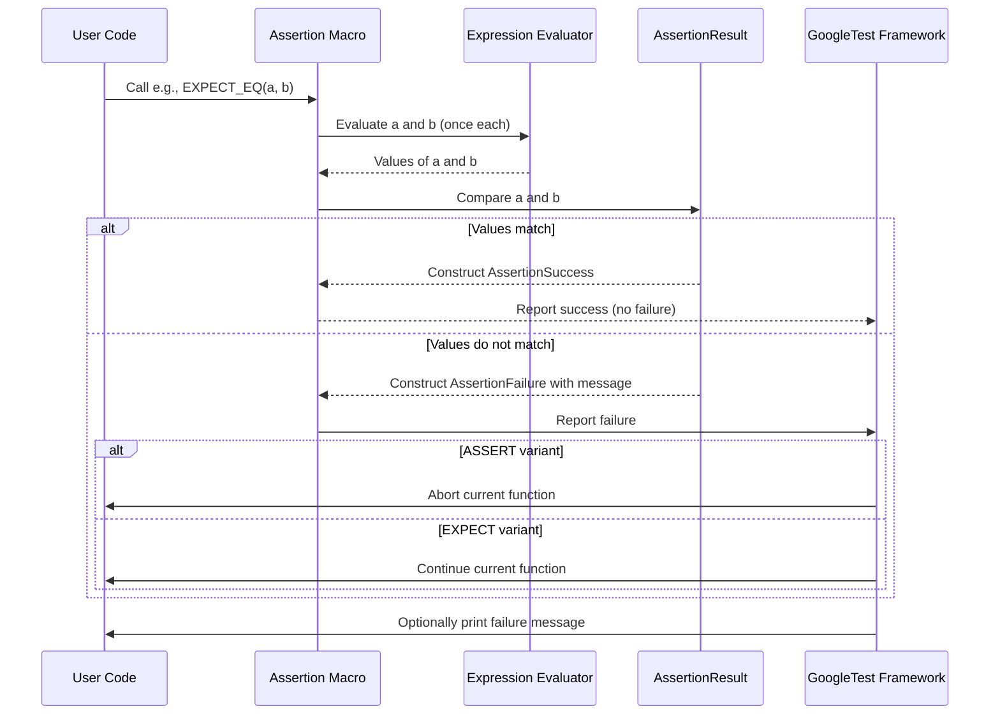

# Assertions Reference

This page provides a comprehensive catalog of GoogleTest assertion macros, their signatures, intended usage, result semantics including whether failures are fatal or non-fatal, and practical code examples for common and advanced scenarios. Assertions allow you to verify your program’s correctness by expressing expectations in your test code.

---

## Overview of Assertions

GoogleTest assertion macros come mainly in pairs:

- **`EXPECT_` macros**: Generate non-fatal failures. When they fail, the current function continues running, enabling multiple failures to be reported in a single test.
- **`ASSERT_` macros**: Generate fatal failures. Upon failure, they abort the current function immediately.

All assertions support streaming a custom failure message via the `<<` operator, which is appended to the default failure explanation.

```cpp
EXPECT_TRUE(condition) << "Why this condition must be true";
ASSERT_EQ(x, y) << "x and y should be equal";
```

Wide strings (`wchar_t*`) streamed into assertions are automatically converted to UTF-8 for printing.


## Detailed Assertion Categories

### 1. Explicit Success and Failure

These macros allow you to mark a test as explicitly succeeded or failed without evaluating any condition.

#### SUCCEED

```cpp
SUCCEED();
```

Generates a success assertion. This does not cause the test to pass by itself, but can be used to document that the test reached a particular point.

#### FAIL

```cpp
FAIL();
```

Generates a fatal failure and aborts the current function.

#### ADD_FAILURE

```cpp
ADD_FAILURE();
```

Generates a non-fatal failure and continues running the current function.

#### ADD_FAILURE_AT

```cpp
ADD_FAILURE_AT("file.cc", 42);
```

Generates a non-fatal failure at the specified file and line number.

---

### 2. Boolean Conditions

These assertions check a condition for truth or falsity.

#### EXPECT_TRUE / ASSERT_TRUE

```cpp
EXPECT_TRUE(condition);
ASSERT_TRUE(condition);
```

Verifies the condition is true.

#### EXPECT_FALSE / ASSERT_FALSE

```cpp
EXPECT_FALSE(condition);
ASSERT_FALSE(condition);
```

Verifies the condition is false.

---

### 3. Binary Comparison

These macros verify comparisons between two values, using standard C++ operators. They print both the expressions and their evaluated values upon failure.

- `EXPECT_EQ` / `ASSERT_EQ`: checks equality (`==`)
- `EXPECT_NE` / `ASSERT_NE`: checks inequality (`!=`)
- `EXPECT_LT` / `ASSERT_LT`: checks less than (`<`)
- `EXPECT_LE` / `ASSERT_LE`: checks less than or equal (`<=`)
- `EXPECT_GT` / `ASSERT_GT`: checks greater than (`>`)
- `EXPECT_GE` / `ASSERT_GE`: checks greater than or equal (`>=`)

**Important:**
- When used on pointers, these macros compare addresses, *not* string contents. For comparing C-string contents, use string comparison assertions.
- Arguments are evaluated exactly once.

Example:

```cpp
EXPECT_EQ(expected_value, actual_value) << "Values must match";
ASSERT_LT(value, max_value);
```

---

### 4. String Comparisons

For comparing **C strings**, GoogleTest provides specialized assertions that compare string contents, not addresses.

- `EXPECT_STREQ` / `ASSERT_STREQ`: strings are equal
- `EXPECT_STRNE` / `ASSERT_STRNE`: strings are not equal
- `EXPECT_STRCASEEQ` / `ASSERT_STRCASEEQ`: equal ignoring case
- `EXPECT_STRCASENE` / `ASSERT_STRCASENE`: not equal ignoring case

They work with narrow and wide strings, with wide strings printed as UTF-8.

Example:

```cpp
EXPECT_STREQ("hello", actual_c_str);
ASSERT_STRCASEEQ("Hello", actual_c_str);
```

---

### 5. Floating-Point Comparison

Direct equality comparison on floating-point numbers is unreliable due to rounding errors. GoogleTest provides:

- `EXPECT_FLOAT_EQ` / `ASSERT_FLOAT_EQ`: verifies two `float`s are approximately equal within 4 Units in Last Place (ULPs).
- `EXPECT_DOUBLE_EQ` / `ASSERT_DOUBLE_EQ`: same as above for `double`.
- `EXPECT_NEAR` / `ASSERT_NEAR`: verifies absolute difference between two numbers does not exceed a user-specified bound.

These macros understand special cases like infinity and NaN.

Example:

```cpp
EXPECT_FLOAT_EQ(3.14f, calculated_value);
ASSERT_NEAR(expected, actual, 0.001);
```

### Floating Point Predicate-Format Functions

GoogleTest provides predicate-format functions for floating-point comparisons usable with `EXPECT_PRED_FORMAT2`:

- `FloatLE(expr1, expr2, val1, val2)` — verifies `val1 <= val2` or approximately equal
- `DoubleLE(expr1, expr2, val1, val2)` — same for doubles

Example:

```cpp
EXPECT_PRED_FORMAT2(FloatLE, value1, value2);
```

---

### 6. Exception Assertions

Require exceptions enabled in build environment.

- `EXPECT_THROW(statement, exception_type)` / `ASSERT_THROW` — checks statement throws the specified exception type.
- `EXPECT_ANY_THROW` / `ASSERT_ANY_THROW` — checks statement throws any exception.
- `EXPECT_NO_THROW` / `ASSERT_NO_THROW` — checks statement does not throw.

The statement can be a compound statement.

Example:

```cpp
EXPECT_THROW(FunctionThatThrows(), std::runtime_error);
EXPECT_NO_THROW(FunctionThatDoesNotThrow());
```

---

### 7. Predicate Assertions

Useful for complex conditions where default assertion messages are insufficient.

#### EXPECT_PRED*

```cpp
EXPECT_PRED1(pred, val1);
EXPECT_PRED2(pred, val1, val2);
... up to 5 arguments
```

Checks that predicate `pred` returns true for the given argument(s). Prints detailed values on failure.

Example:

```cpp
bool IsEven(int n) { return n % 2 == 0; }
EXPECT_PRED1(IsEven, 4);  // passes
EXPECT_PRED1(IsEven, 3);  // fails with arguments printed
```

For overloaded or templated predicates, explicit casts or template arguments may be required.

#### EXPECT_PRED_FORMAT*

These accept a *predicate-formatter* which returns `AssertionResult`, for fully customized messages.

Signature:

```cpp
testing::AssertionResult PredicateFormatter(const char* expr1, ..., T1 val1, ...);
```

Example:

```cpp
testing::AssertionResult AssertIsEven(const char* expr, int n) {
  if (n % 2 == 0) return testing::AssertionSuccess();
  return testing::AssertionFailure() << n << " is odd";
}
EXPECT_PRED_FORMAT1(AssertIsEven, 3);  // fails with message "3 is odd"
```

---

### 8. Windows HRESULT Assertions

Only available on Windows:

- `EXPECT_HRESULT_SUCCEEDED(expr)` / `ASSERT_HRESULT_SUCCEEDED(expr)`: verifies expr returns a success HRESULT code.
- `EXPECT_HRESULT_FAILED(expr)` / `ASSERT_HRESULT_FAILED(expr)`: verifies expr returns failure HRESULT.

Example:

```cpp
EXPECT_HRESULT_SUCCEEDED(CoCreateInstance(...));
```

Failures include error code and human-readable error message.

---

### 9. Death Assertions

Death tests check that code causes the process to terminate.

- `EXPECT_DEATH(statement, matcher)` / `ASSERT_DEATH`: asserts statement causes process termination with stderr output matching matcher (regex or string matcher).
- `EXPECT_DEATH_IF_SUPPORTED`: runs death assertion only if death tests are supported.
- `EXPECT_DEBUG_DEATH`: runs death assertion only in debug builds.
- `EXPECT_EXIT(statement, predicate, matcher)` / `ASSERT_EXIT`: checks that statement terminates with exit status satisfying predicate and with stderr matching matcher.

Example:

```cpp
ASSERT_DEATH({ do_something(); }, ".*error message.*");
EXPECT_EXIT(std::exit(0), ::testing::ExitedWithCode(0), "Success");
```

---

## Code Examples

### Equality Assertion Example

```cpp
TEST(MyTestSuite, ExampleAssertion) {
  int a = 5;
  int b = 6;
  EXPECT_EQ(a, b) << "a and b should be equal here";
}
```

This will fail, printing both the code expressions and their values.

### Floating Point Approximate Comparison

```cpp
float x = 0.1f * 7;
float y = 0.7f;
ASSERT_FLOAT_EQ(x, y) << "x should be approximately equal to y";
```

### Exception Assertion

```cpp
ASSERT_THROW({ throw std::runtime_error("error"); }, std::runtime_error);
```

### Predicate Assertion

```cpp
bool IsPrime(int n);
EXPECT_PRED1(IsPrime, 11);
```


## Best Practices and Common Pitfalls

- Prefer `EXPECT_*` for tests that should continue on failure, and `ASSERT_*` where continuation after failure is invalid.
- When comparing C strings, do not use `EXPECT_EQ`; instead use `EXPECT_STREQ` / `EXPECT_STRNE`.
- Stream meaningful messages into assertions to capture context.
- Use predicate assertions for complex expressions to gain informative failure messages.
- Use floating-point assertions tailored for approximate equality.
- For death tests, understand they run in child processes; side effects do not propagate to parent.

## Troubleshooting

- Arguments to assertions are evaluated exactly once; avoid side effects if not intended.
- Be careful with pointer comparisons and string comparisons.
- Death tests may fail or behave unexpectedly if threads exist before the fork/spawn.
- `ASSERT_*` macros can only be used in `void` return functions due to control flow constraints.

## Related Documentation

- For comprehensive usage guidance, see the [Assertions in Practice guide](../guides/core-testing-workflows/assertions-in-practice.md).
- For extended usage such as predicate assertions, floating-point assertions, and death tests, see [Advanced GoogleTest Topics](../guides/advanced-and-mocking-guides/advanced.md).
- To learn about test organization and fixtures, see the [Test Case Structure and Parameterization](../api-reference/core-test-apis/test-structure-parameterization.md).
- For a full list of matchers and exception handling, see the [Matchers Reference](../api-reference/mocking-framework/matchers.md) and [Exception Assertions](../docs/reference/assertions.md#exceptions).

---

## Mermaid Diagram: GoogleTest Assertion Macro Flow



---

## Quick Reference Table of Core Assertions

| Assertion Macro Pair | Description                                   | Failure Type |
|---------------------|-----------------------------------------------|--------------|
| `EXPECT_TRUE`, `ASSERT_TRUE` | Check if expression is true                   | Non-fatal/fatal|
| `EXPECT_FALSE`, `ASSERT_FALSE` | Check if expression is false                  | Non-fatal/fatal|
| `EXPECT_EQ`, `ASSERT_EQ` | Check if two values are equal                 | Non-fatal/fatal|
| `EXPECT_NE`, `ASSERT_NE` | Check if two values are not equal             | Non-fatal/fatal|
| `EXPECT_LT`, `ASSERT_LT` | Check if less than                            | Non-fatal/fatal|
| `EXPECT_LE`, `ASSERT_LE` | Check if less or equal                        | Non-fatal/fatal|
| `EXPECT_GT`, `ASSERT_GT` | Check if greater than                         | Non-fatal/fatal|
| `EXPECT_GE`, `ASSERT_GE` | Check if greater or equal                     | Non-fatal/fatal|
| `EXPECT_STREQ`, `ASSERT_STREQ` | Compare C string equality                      | Non-fatal/fatal|
| `EXPECT_STRNE`, `ASSERT_STRNE` | Compare C string inequality                    | Non-fatal/fatal|
| `EXPECT_STRCASEEQ`, `ASSERT_STRCASEEQ` | Compare C strings equal ignoring case          | Non-fatal/fatal|
| `EXPECT_STRCASENE`, `ASSERT_STRCASENE` | Compare C strings inequal ignoring case        | Non-fatal/fatal|
| `EXPECT_FLOAT_EQ`, `ASSERT_FLOAT_EQ` | Compare float values within floating point margin | Non-fatal/fatal|
| `EXPECT_DOUBLE_EQ`, `ASSERT_DOUBLE_EQ` | Compare double values within floating point margin| Non-fatal/fatal|
| `EXPECT_NEAR`, `ASSERT_NEAR` | Compare two values with absolute error bound  | Non-fatal/fatal|
| `EXPECT_THROW`, `ASSERT_THROW` | Check that statement throws a given exception | Non-fatal/fatal|
| `EXPECT_ANY_THROW`, `ASSERT_ANY_THROW` | Check that statement throws any exception      | Non-fatal/fatal|
| `EXPECT_NO_THROW`, `ASSERT_NO_THROW` | Check that statement does not throw            | Non-fatal/fatal|
| `EXPECT_DEATH`, `ASSERT_DEATH` | Check that the statement terminates the process | Non-fatal/fatal|

---

For the full list of assertion macros, their usage nuances, and examples, see the [Official GoogleTest Assertions Reference](https://github.com/google/googletest/blob/main/docs/reference/assertions.md).

---