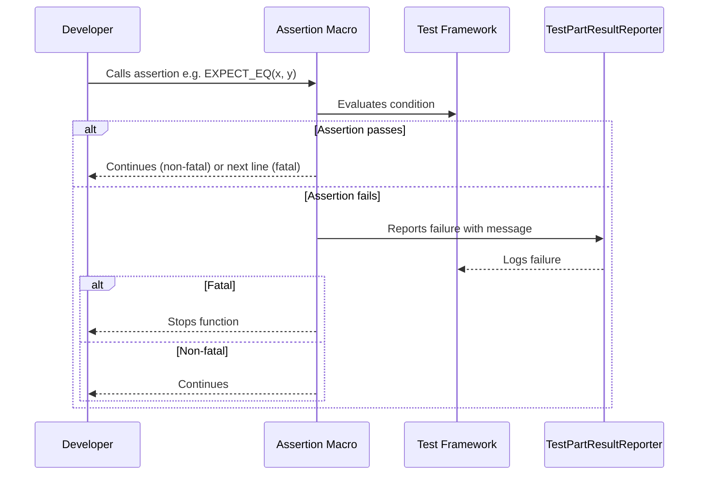

# Assertions and Failure Handling

A foundational pillar of GoogleTest is its rich system of assertions that empower you to verify your code's correctness while receiving clear, actionable feedback when things go wrong. This documentation provides a detailed reference to *assertion macros*—including `EXPECT_*`, `ASSERT_*`, and custom predicate assertions—along with the underlying mechanisms for result reporting. It explains the distinction between fatal and non-fatal failures, the various assertion result types, and the messaging utilities that enable expressive test feedback.

---

## Assertion Macros Overview

GoogleTest offers a comprehensive set of macros to assert conditions, compare values, verify exceptions, and report failures. Each macro has two variants:

- **`EXPECT_` variant**: Generates *non-fatal failures* on assertions that fail, allowing the test function to continue executing.
- **`ASSERT_` variant**: Generates *fatal failures* that immediately abort the current function.

Examples:

```cpp
EXPECT_TRUE(condition) << "Custom failure message";
ASSERT_EQ(val1, val2);
```

You can stream additional output to any assertion using the `<<` operator. This output will be shown only if the assertion fails.

## Fatal vs. Non-Fatal Failures

- **Fatal failures (e.g., `ASSERT_*`, `FAIL()`):** Stop the invoking function immediately. Use these when continuing after failure makes no sense.
- **Non-fatal failures (e.g., `EXPECT_*`, `ADD_FAILURE()`):** Let the test continue. Use when you want to gather all failures in one test run.


<Note>
Fatal assertions must only be used in functions returning `void`, as aborting a function returning a value produces compilation errors. Use non-fatal assertions if your function returns a value.
</Note>

## Basic Assertion Categories

### Boolean Conditions

- `EXPECT_TRUE(condition)` / `ASSERT_TRUE(condition)` — Verifies the condition is true.
- `EXPECT_FALSE(condition)` / `ASSERT_FALSE(condition)` — Verifies the condition is false.

On failure, prints the condition's value, helping you quickly spot the unexpected result.

### Binary Comparisons

Compare two values using operators like `==`, `!=`, `<`, `<=`, `>`, and `>=`. Arguments are evaluated exactly once (important when they have side effects).

Examples:

```cpp
EXPECT_EQ(val1, val2);      // val1 == val2
ASSERT_NE(val1, val2);      // val1 != val2
EXPECT_LT(val1, val2);      // val1 <  val2
ASSERT_LE(val1, val2);      // val1 <= val2
EXPECT_GT(val1, val2);      // val1 >  val2
ASSERT_GE(val1, val2);      // val1 >= val2
```

For comparing strings or floating-point numbers, GoogleTest provides dedicated assertions (see following sections).

### String Comparisons

For **C strings (`char*`, `const char*`)** and **wide C strings (`wchar_t*`)**, GoogleTest offers specialized macros that compare the contents instead of pointer addresses:

| Macro       | Compares                          | Description                             |
|-------------|----------------------------------|---------------------------------------|
| `EXPECT_STREQ` / `ASSERT_STREQ`       | Contents equals                     | Checks strings equal                  |
| `EXPECT_STRNE` / `ASSERT_STRNE`       | Contents not equal                  | Checks strings differ                 |
| `EXPECT_STRCASEEQ` / `ASSERT_STRCASEEQ` | Contents equal, ignoring case        | Case-insensitive equality            |
| `EXPECT_STRCASENE` / `ASSERT_STRCASENE` | Contents differ, ignoring case       | Case-insensitive inequality          |

Use these whenever you want to compare null-terminated strings rather than addresses.

### Floating-Point Comparisons

Due to rounding and precision issues, direct equality is rarely suitable for floating-point types. GoogleTest offers specialized assertions to verify approximate equality within a tolerance:

- `EXPECT_FLOAT_EQ` / `ASSERT_FLOAT_EQ`: Checks two `float` values are approximately equal within 4 Units in the Last Place (ULPs).
- `EXPECT_DOUBLE_EQ` / `ASSERT_DOUBLE_EQ`: Same as above for `double`.
- `EXPECT_NEAR(val1, val2, abs_error)` / `ASSERT_NEAR(val1, val2, abs_error)`: Checks the absolute difference does not exceed `abs_error`.

You can also use predicate-format assertions `FloatLE` and `DoubleLE` to check value ordering within floating-point tolerances.

## Exception Assertions

Use these to verify that code throws or does not throw exceptions:

- `EXPECT_THROW(statement, exception_type)` / `ASSERT_THROW(statement, exception_type)`: Verifies `statement` throws the specified exception type.
- `EXPECT_ANY_THROW(statement)` / `ASSERT_ANY_THROW(statement)`: Verifies `statement` throws any exception.
- `EXPECT_NO_THROW(statement)` / `ASSERT_NO_THROW(statement)`: Verifies `statement` does not throw any exception.

Exceptions must be enabled in your build environment for these to work properly.

## Predicate Assertions for Enhanced Diagnostics

When checking complex or custom conditions, predicate assertions improve readability and diagnostics beyond plain Boolean assertions.

### Using Predicates Returning `bool`

The `EXPECT_PREDn` / `ASSERT_PREDn` macros take a predicate function or functor of arity `n` returning `bool`. If the predicate returns `false`, a failure message shows which arguments made it fail.

Example:

```cpp
bool MutuallyPrime(int m, int n) { ... }
...
EXPECT_PRED2(MutuallyPrime, a, b);  // Passes if a and b are mutually prime
EXPECT_PRED2(MutuallyPrime, b, c);  // Failure with diagnostic output
```

### Using Predicates Returning `AssertionResult`

For richer messages, write predicates returning `AssertionResult` which carries success/failure states and associated messages:

```cpp
testing::AssertionResult IsEven(int n) {
  if (n % 2 == 0)
    return testing::AssertionSuccess() << n << " is even";
  else
    return testing::AssertionFailure() << n << " is odd";
}
EXPECT_TRUE(IsEven(value));
```

This provides detailed failure output when conditions fail.

### Using Predicate-Format Assertions

If you want full control over failure message formatting or need to handle arguments not printable to streams, use predicate-format assertions:

- `EXPECT_PRED_FORMATn(pred_formatter, val1, ..., valn)`
- `ASSERT_PRED_FORMATn(pred_formatter, val1, ..., valn)`

The `pred_formatter` is a function or functor with signature:

```cpp
testing::AssertionResult PredicateFormatter(const char* expr1, ..., const char* exprn, T1 val1, ..., Tn valn);
```

It receives the expressions as strings and actual values, and returns an `AssertionResult` combining success/failure and messages.

Example:

```cpp
testing::AssertionResult AssertMutuallyPrime(const char* m_expr, const char* n_expr, int m, int n) {
  if (MutuallyPrime(m, n)) return testing::AssertionSuccess();
  return testing::AssertionFailure() << m_expr << " and " << n_expr << " (" << m << " and " << n << ") are not mutually prime";
}
EXPECT_PRED_FORMAT2(AssertMutuallyPrime, a, b);
```

## Explicit Success and Failure

Sometimes you want to explicitly mark a success, failure, or skip independently of any condition.

- `SUCCEED()`: Explicitly generates a success (note: does *not* cause the test to succeed by itself).
- `FAIL()`: Generates a fatal failure that aborts the current void-returning function.
- `ADD_FAILURE()`: Generates a non-fatal failure allowing the test to continue.
- `ADD_FAILURE_AT(file, line)`: Generates a non-fatal failure at specified source location.

## Skipping Test Execution

Use `GTEST_SKIP()` to skip tests dynamically at runtime with an optional message.

```cpp
TEST(MyTest, SkipTest) {
  GTEST_SKIP() << "Skipping this test temporarily.";
  FAIL();  // This line won't execute.
}
```

Skip works in tests and also in `SetUp()` for test fixtures or global test environments.

## Assertion Result Types

Each assertion produces a `TestPartResult` describing its state:

| Type               | Description                                    |
|--------------------|------------------------------------------------|
| `kSuccess`         | Assertion succeeded without failure.          |
| `kNonFatalFailure` | Assertion failed, but test can continue.      |
| `kFatalFailure`    | Assertion failed, abort the function immediately. |
| `kSkip`            | Test or test part skipped.                     |

You can inspect these results programmatically, for example via the test listener or results APIs.

## Failure Messaging Utilities

GoogleTest leverages the `Message` class to build human-readable messages for failures. You can stream arbitrary data types to assertion macros for richer diagnostic messages.

A key utility function `AppendUserMessage()` appends your streamed message to internally generated assertion messages, ensuring that your meaningful context is preserved.

## Advanced Assertion Support

### Floating-Point Internals

GoogleTest implements precise floating-point comparisons based on the IEEE floating-point format using the `FloatingPoint` template class. It accounts for rounding errors, NaNs, infinities, and ULP differences.

### Equality Assertions with Diffs

When equality assertions on strings or printable types fail, GoogleTest shows a unified diff highlighting differences, aiding quick problem identification.

### Predicate Format Helpers

Built-in helpers like `DoubleLE` and `FloatLE` allow predicate-style assertions using approximate floating-point comparison, enabling fine control with clear failure messages.

## Using Assertion Macros Safely

- Evaluate macro arguments only once to avoid unexpected side effects.
- Stream messages after the assertion for optional, context-rich diagnostics.
- Use `EXPECT_*` when you want your test to continue after failure, `ASSERT_*` when you want to abort.
- Fatal assertions require the containing function to return `void`.

## Catching Failures for Testing GoogleTest Utilities

You can use specialized testing macros (from `gtest-spi.h`) like `EXPECT_FATAL_FAILURE` and `EXPECT_NONFATAL_FAILURE` to verify that your test assertions or testing helpers trigger expected failures with appropriate messages.

For example:

```cpp
EXPECT_FATAL_FAILURE(ASSERT_TRUE(false), "Expected failure message substring");
EXPECT_NONFATAL_FAILURE(EXPECT_EQ(5, 3), "Expected equality of these values");
```

These macros intercept failures on the current thread or all threads depending on variant.

---

## Tips and Best Practices

- Prefer specific assertions (e.g., `EXPECT_EQ`, `EXPECT_STREQ`, `EXPECT_THROW`) over general `EXPECT_TRUE` for clearer failure messages.
- Use predicate assertions for complex conditions to get informative diagnostics.
- When comparing floating-point values, use `EXPECT_FLOAT_EQ`, `EXPECT_DOUBLE_EQ`, or `EXPECT_NEAR` with appropriate tolerances.
- Use `SCOPED_TRACE` or `ScopedTrace` to add contextual traces for failures inside helper functions.
- Avoid fatal assertions in constructors or non-void-returning functions; prefer `SetUp`/`TearDown` or non-fatal assertions.
- Use `GTEST_SKIP()` to skip tests dynamically with explanations.
- Record custom test properties with `RecordProperty()` for richer test reports.

---

## Summary

This page serves as your go-to reference for GoogleTest's assertion macros and their failure handling, emphasizing user-friendly diagnostics and robust testing workflows.

---

## Example: Custom Predicate Formatter

```cpp
// Define a predicate-formatter to check if a number is even.
testing::AssertionResult AssertIsEven(const char* expr, int n) {
  if ((n % 2) == 0) {
    return testing::AssertionSuccess();
  }
  return testing::AssertionFailure() << expr << " evaluates to " << n << ", which is not even.";
}

TEST(EvenTest, CheckEvenness) {
  int val = 3;
  EXPECT_PRED_FORMAT1(AssertIsEven, val);  // Will print a failure message.
}
```

---

## Interaction Flow Diagram



---