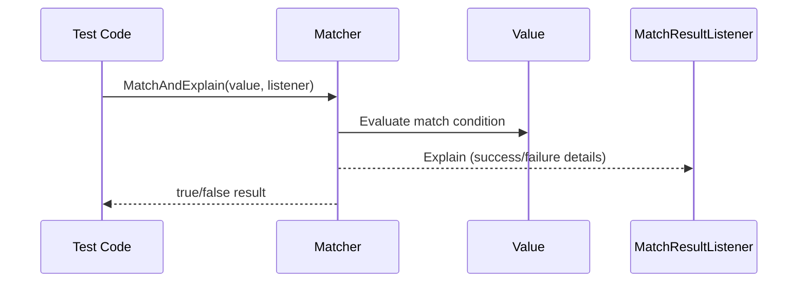

# Assertions and Matchers Reference

GoogleTest offers a powerful and expressive suite of assertions and matchers that allow you to verify your code's behavior precisely and write tests that are both clear and maintainable. This reference covers built-in assertion macros, the matcher framework, extending GoogleTest with custom assertions and matchers, and practical guidance on their usage.

---

## 1. Introduction to Assertions

GoogleTest assertions come in pairs: `EXPECT_` for nonfatal failures and `ASSERT_` for fatal failures. Assertions verify code behavior and report successes or failures.

- **Fatal assertions (`ASSERT_`)** abort the current function on failure.
- **Nonfatal assertions (`EXPECT_`)** record failure but allow the test to continue.

Assertions support streaming custom failure messages with the `<<` operator for richer diagnostics.

### 1.1 Direct Success & Failure

- `SUCCEED()` signals a success explicitly.
- `FAIL()` generates a fatal failure and returns immediately.
- `ADD_FAILURE()` produces a nonfatal failure.
- `ADD_FAILURE_AT(file, line)` reports a nonfatal failure at specific source location.

Use these when control flow dictates test success or failure rather than expressions.

## 2. Generalized Assertions Using Matchers

### 2.1 `EXPECT_THAT` and `ASSERT_THAT`

These assertions combine GoogleTest's power with the matcher system:

```cpp
EXPECT_THAT(value, matcher);
ASSERT_THAT(value, matcher);
```

They succeed if `value` matches the given `matcher`. Matchers express complex conditions in readable, English-like syntax.

Example:

```cpp
EXPECT_THAT(value1, StartsWith("Hello"));
EXPECT_THAT(value2, MatchesRegex("Line \\d+"));
ASSERT_THAT(value3, AllOf(Gt(5), Lt(10)));
```

If the assertion fails, the failure message reports the actual and expected conditions clearly.

Refer to the complete [Matchers Reference](matchers.md) for built-in matchers and their combinators.

## 3. Standard Assertion Macros for Common Conditions

### 3.1 Boolean Assertions

- `EXPECT_TRUE(condition) / ASSERT_TRUE(condition)` verifies the condition is true.
- `EXPECT_FALSE(condition) / ASSERT_FALSE(condition)` verifies the condition is false.

### 3.2 Binary Comparisons

- `EXPECT_EQ(val1, val2) / ASSERT_EQ(val1, val2)` verifies equality.
- `EXPECT_NE(val1, val2) / ASSERT_NE(val1, val2)` verifies inequality.
- `EXPECT_LT(val1, val2) / ASSERT_LT(val1, val2)` verifies less-than.
- `EXPECT_LE(val1, val2) / ASSERT_LE(val1, val2)` verifies less-than or equal.
- `EXPECT_GT(val1, val2) / ASSERT_GT(val1, val2)` verifies greater-than.
- `EXPECT_GE(val1, val2) / ASSERT_GE(val1, val2)` verifies greater-than or equal.

Note: For C strings (`const char*`), use string comparison assertions like `EXPECT_STREQ` to compare contents rather than pointers.

### 3.3 String Comparisons

Used specifically for C strings (including wide characters):

- `EXPECT_STREQ(str1, str2) / ASSERT_STREQ(str1, str2)` - equal contents.
- `EXPECT_STRNE(str1, str2) / ASSERT_STRNE(str1, str2)` - not equal contents.
- `EXPECT_STRCASEEQ(str1, str2) / ASSERT_STRCASEEQ(str1, str2)` - equal, ignoring case.
- `EXPECT_STRCASENE(str1, str2) / ASSERT_STRCASENE(str1, str2)` - not equal, ignoring case.

### 3.4 Floating-Point Comparisons

Floating-point numbers require tolerance due to rounding:

- `EXPECT_FLOAT_EQ(val1, val2)/ASSERT_FLOAT_EQ(val1, val2)` approx equal floats (4 ULPs tolerance).
- `EXPECT_DOUBLE_EQ(val1, val2)/ASSERT_DOUBLE_EQ(val1, val2)` approx equal doubles (4 ULPs tolerance).
- `EXPECT_NEAR(val1, val2, abs_error)/ASSERT_NEAR(val1, val2, abs_error)` compares difference to an absolute error bound.

### 3.5 Exception Assertions

Verify exception throwing behavior:

- `EXPECT_THROW(statement, exception_type) / ASSERT_THROW` expects `statement` to throw specified exception.
- `EXPECT_ANY_THROW(statement) / ASSERT_ANY_THROW` expects any exception thrown.
- `EXPECT_NO_THROW(statement) / ASSERT_NO_THROW` expects no exceptions thrown.

### 3.6 Predicate Assertions

Allow verifying complex conditions via predicates:

- `EXPECT_PRED*` and `ASSERT_PRED*` macros verify predicates returning `bool` with 1 to 5 arguments.
- `EXPECT_PRED_FORMAT*` and `ASSERT_PRED_FORMAT*` use predicate-formatters returning detailed results.

Example:

```cpp
bool MutuallyPrime(int m, int n) { ... }
EXPECT_PRED2(MutuallyPrime, a, b);
```

## 4. Matchers: Expressive Argument Matching

Matchers are reusable predicate objects that test whether a value satisfies certain conditions. They enhance test readability, provide rich failure messages, and are the core of flexible mock expectations.

### 4.1 Built-in Matchers

Some key examples include:

- `_` — matches anything (wildcard).
- `Eq(value)` — equals value.
- `Ne(value)` — not equal.
- `Lt(value)`, `Le(value)`, `Gt(value)`, `Ge(value)` — relational matchers.
- String matchers like `StartsWith(prefix)`, `EndsWith(suffix)`, `HasSubstr(substring)`.
- Container matchers:
  - `ElementsAre(...)` — matches container by elements in order.
  - `UnorderedElementsAre(...)` — matches container by elements in any order.
  - `Contains(matcher)` — container contains at least one element matching `matcher`.

### 4.2 Combining Matchers

Matchers can be combined to build expressive constraints:

- `AllOf(m1, m2, ...)` — matches if all matchers match.
- `AnyOf(m1, m2, ...)` — matches if any matcher matches.
- `Not(m)` — negates matcher m.

Example:

```cpp
EXPECT_CALL(foo, Bar(AllOf(Gt(5), Ne(10))));
```

### 4.3 Parameterized and Polymorphic Matchers

Many matchers are polymorphic: they work seamlessly with a variety of compatible types (e.g., `Eq(5)` works with int, long, uint32, etc.).

Matchers can be parameterized with values or other matchers, enabling rich constraints.

### 4.4 Advanced Container Matchers

Matchers for containers allow precise checks over sequences, sets, or associative containers:

- `ElementsAreArray(array_or_container)` checks elements match an external sequence exactly.
- `Contains(Key(matcher))` matches map-like containers based on keys.
- `Pair(m1, m2)` matches pairs (e.g. key-value pairs).
- `Pointwise(tuple_matcher, container)` checks element-wise matches using tuple matchers.

### 4.5 Member and Property Matchers

To verify specific fields or properties of complex objects:

- `Field(&Class::member, matcher)` matches objects whose member matches `matcher`.
- `Property(&Class::method, matcher)` matches objects whose method result matches `matcher`.

Allows fine-grained matching inside mock expectations or assertions.

### 4.6 Pointer and Optional Matchers

- `Pointee(m)` matches pointers whose pointee satisfies matcher `m`.
- `IsNull()` and `NotNull()` match null and non-null pointers.
- `Optional(matcher)` matches optional types with a value matching `matcher`.

### 4.7 Creating Custom Matchers

GoogleMock offers a family of macros and patterns to define custom matchers quickly.

#### 4.7.1 The `MATCHER` Macro

```cpp
MATCHER(Name, "description") {
  return /* condition on arg */;
}
```

Defines a polymorphic matcher `Name()` where `arg` is the value being matched. The `description` is the failure message template and can reference `negation` for positive/negative descriptions.

Example:

```cpp
MATCHER(IsEven, "") { return (arg % 2) == 0; }
EXPECT_THAT(x, IsEven());
```

Failure message:

```
Value of: x
Expected: is even
  Actual: 3
```

#### 4.7.2 The `MATCHER_P` Family

Defines parameterized matchers:

```cpp
MATCHER_P(Name, param, "description") { ... } 
```

Allows accessing `param` and referencing it in description strings for detailed messages.

Example:

```cpp
MATCHER_P(IsMultipleOf, n, "") { return (arg % n) == 0; }
EXPECT_THAT(x, IsMultipleOf(5));
```

Generates messages including parameter values.

## 5. Using Assertions and Matchers in Tests

A typical test asserts expected outcomes using assertions and matchers:

```cpp
using ::testing::Eq;
using ::testing::StartsWith;
using ::testing::Not;

EXPECT_THAT(value, StartsWith("prefix"));
EXPECT_THAT(value, Not(Eq("unexpected")));
EXPECT_TRUE(condition);
EXPECT_EQ(expected, actual);
```

Matchers also power mock expectations:

```cpp
EXPECT_CALL(mock, Method(Eq(42), _));
EXPECT_CALL(mock, Func(StartsWith("Hello")));
```

Use `EXPECT_THAT` to combine rich matchers with assertions for detailed validation.

## 6. Troubleshooting and Best Practices

- Define expectations **before** exercising mocks.
- Use `ON_CALL` for default action setup, prefer `EXPECT_CALL` for mandatory checks.
- Manage matcher and action side effects carefully; matchers should be pure.
- Use `RetiresOnSaturation` to ensure expectations do not linger past their usage.
- Prefer `NiceMock` to suppress noisy warnings unless strictness is required.
- Share complex matchers or actions by storing in variables.
- Override `DescribeTo` and `DescribeNegationTo` in custom matchers for clearer diagnostics.

## 7. Summary

GoogleTest's assertions combined with matchers provide an expressive testing language for verifying your code’s correctness, from simple boolean checks to rich, parameterized, and composable conditions, including custom user-defined ones. This enables highly readable tests with actionable failure reports, empowering developers to write concise, robust tests.

---

## Additional Resources

- [GoogleTest Assertions Reference](docs/reference/assertions.md)
- [GoogleMock Matchers Reference](reference/matchers.md)
- [gMock Quickstart and Cookbook guides](guides/getting_started/googlemock-quickstart.mdx)
- [Defining Custom Assertions and Actions](guides/advanced_and_best_practices/custom-assertions-actions.mdx)
- [EXPECT_CALL and Mocking Reference](docs/reference/mocking.md)


---

## Code Examples

### Custom Matcher using MATCHER

```cpp
MATCHER(IsDivisibleBy7, "") {
  if (arg % 7 == 0) return true;
  *result_listener << "the remainder is " << (arg % 7);
  return false;
}

// Usage:
EXPECT_THAT(value, IsDivisibleBy7());
```

### Using Parameterized Matcher

```cpp
MATCHER_P(InClosedRange, low, hi, "") {
  return low <= arg && arg <= hi;
}

EXPECT_THAT(number, InClosedRange(4, 6));
```

### Using Matchers in EXPECT_CALL for mocks

```cpp
EXPECT_CALL(mock_object, DoSomething(Ge(10), StartsWith("test")));
```

### Using Matcher Combinators

```cpp
EXPECT_THAT(value, AllOf(Gt(5), Ne(10)));
EXPECT_THAT(value, Not(HasSubstr("bad")));
```

### Matching Containers

```cpp
EXPECT_THAT(vec, ElementsAre(1, Gt(0), _, 5));
EXPECT_THAT(map, UnorderedElementsAre(Pair("key1", 100), Pair("key2", 200)));
```

### Using Field and Property to Match Object Members

```cpp
EXPECT_THAT(obj, Field(&MyClass::count, Ge(10)));
EXPECT_THAT(obj, Property(&MyClass::GetName, StartsWith("John")));
```

## Diagram: How Matchers Work in a Test Assertion



---

## Common Pitfalls

- **Overusing strict expectations** — causes brittle tests. Use `ON_CALL` for default behavior.
- **Uninitialized expectations** — always set expectations before calling mock methods.
- **Matcher side effects** — matchers must be pure functions; avoid mutating state.
- **Incorrect mocking of non-virtual methods** — only virtual methods can be mocked directly.
- **Pointer equality vs. value equality** — for C strings use string matchers like `StrEq` instead of `Eq`.

---

For more details, refer to [GoogleTest Assertions Reference](docs/reference/assertions.md), [Matchers Reference](reference/matchers.md), and the [gMock Cookbook](docs/gmock_cook_book.md).


