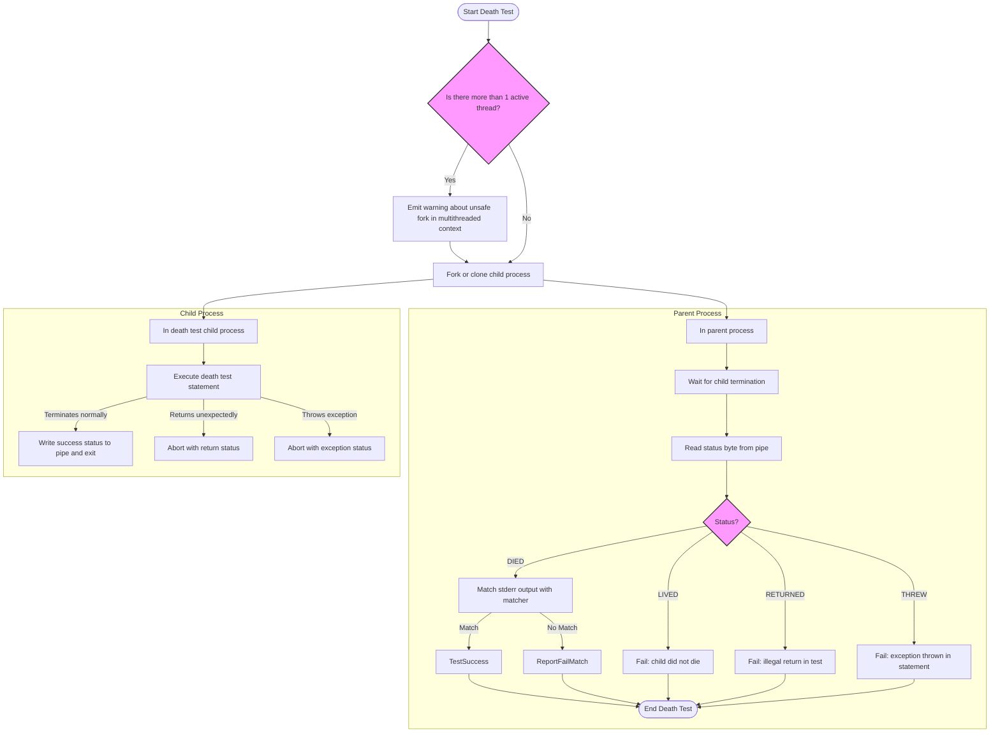

# Death Tests API Reference

GoogleTest's Death Tests API empowers developers to verify that specific code paths terminate the program as expected. This is essential for testing error handling scenarios, assertions, or any condition where the program must abort or crash safely. By running death tests in isolated child processes, GoogleTest ensures that test failures do not crash the entire test suite, providing a robust mechanism for validating abnormal program termination.

---

## Overview of Death Tests

Death tests are specialized tests that assert a piece of code causes the program to terminate, typically due to assertion failures or fatal errors. They ensure that critical error conditions result in controlled termination.

Key points:
- Death tests run *in a child process* separate from the main test runner.
- Verification includes the exit status and matching error messages.
- GoogleTest provides several macros to write death tests easily.

## Death Test Styles

GoogleTest supports two death test styles controlled by the `--gtest_death_test_style` flag or by setting the flag programmatically via `GTEST_FLAG_SET(death_test_style, <style>)`:

- **fast** (default on some platforms)
  - The child process runs the death test immediately after forking.
  - Lower overhead but unsafe in multi-threaded environments.

- **threadsafe**
  - The child process *re-executes* the test binary from the start, running only the death test of interest.
  - Avoids thread-safety issues but has higher execution cost.


> **Best Practice**: Use the "threadsafe" style in multi-threaded environments to avoid flaky or hanging death tests.

## Important Death Test Macros

GoogleTest exposes death test assertions as pairs of macros—`ASSERT_*` variants that abort the test on failure and `EXPECT_*` variants that continue testing after failure.

### ASSERT_DEATH and EXPECT_DEATH

```cpp
// Asserts Expect the statement to cause termination with stderr matching matcher.
ASSERT_DEATH(statement, matcher);
EXPECT_DEATH(statement, matcher);
```
- `statement`: Any C++ statement or compound block expected to cause termination.
- `matcher`: Either a regex string or a gMock matcher matching the standard error output from the child process.


### ASSERT_EXIT and EXPECT_EXIT

```cpp
ASSERT_EXIT(statement, predicate, matcher);
EXPECT_EXIT(statement, predicate, matcher);
```
- `predicate`: A callable which receives the exit status integer; tests if the exit status meets expectations.
- This allows verification, for example, of specific non-zero exit codes or termination by a signal.

### Common Predicates Provided

- **ExitedWithCode(int)**: Checks normal process exit with the specified exit code.
- **KilledBySignal(int)** (POSIX only): Checks if the process was terminated by a specific signal.


### ASSERT_DEBUG_DEATH and EXPECT_DEBUG_DEATH

Used for code that should die in debug builds but not necessarily in release builds.

- In debug mode, they behave like `ASSERT_DEATH` and `EXPECT_DEATH`.
- In release mode, statements execute without terminating.


### Conditional Supported Death Tests

Macros such as `EXPECT_DEATH_IF_SUPPORTED` and `ASSERT_DEATH_IF_SUPPORTED` compile on all platforms but only run if death tests are supported on the system. Otherwise, they emit warnings.

## Writing Death Tests

Death tests can be simple or complex. You can pass single function calls, compound statements, or loops inside the death test macros.

### Example: Simple Death Test

```cpp
ASSERT_DEATH(server.SendMessage(56, "Hello"), "Invalid port number");
```

### Example: Loop with Death Tests

```cpp
for (int i = 0; i < 5; i++) {
  EXPECT_DEATH(server.ProcessRequest(i), "Invalid request .* in ProcessRequest()")
             << "Failed to die on request " << i;
}
```

### Example: Exit Status with Matcher

```cpp
ASSERT_EXIT(server.ExitNow(), ::testing::ExitedWithCode(0), "Exiting");

bool KilledBySIGHUP(int exit_code) {
  return WIFSIGNALED(exit_code) && WTERMSIG(exit_code) == SIGHUP;
}

ASSERT_EXIT(client.HangUpServer(), KilledBySIGHUP, "Hanging up!");
```

## Matcher Syntax for Death Tests

- On POSIX systems, the regex syntax aligns with POSIX Extended Regular Expression syntax.
- On Windows and Mac, a limited regex syntax is supported, omitting advanced features like grouping, unions, and repetition counts.

Supported simple constructs include:
- Literals: `c` matches character `c`
- Escape sequences like `\d` (digit), `\s` (whitespace), `\w` (word character)
- Quantifiers: `*` (zero or more), `+` (one or more), and `?` (optional)
- Anchors: `^` for beginning and `$` for end of the string
- Concatenation: `xy` matches `x` followed by `y`

If a regex exceeds these capabilities, the death test will fail at runtime.

## How Death Tests Work Internally

GoogleTest forks or clones the process to run the death test in a child process. The parent process then:

1. Monitors the child process termination.
2. Captures and matches the child's standard error output against the provided matcher.
3. Verifies the exit code or signal with the predicate (if applicable).

If all conditions pass, the death test succeeds; else, it fails indicating why (did not die, wrong exit code, output mismatch).

## Best Practices and Caveats

- **Avoid multiple threads running in the parent process at death test time** to prevent unpredictable behavior.
- **Use the "threadsafe" death test style for multithreaded programs.**
- Death test **side effects on memory or global state in the child process will not propagate back to the parent process**.
- Avoid placing multiple death assertions on the same line to prevent compilation errors.
- Death test statements must *not* contain `return` or throw exceptions out of the death test; these cause test failures.
- If mocks are used within death tests, use `Mock::AllowLeak` for any involved mocks to avoid errors on process exit.

## Troubleshooting Death Tests

### Death Test Hangs or Does Not Observe Expected Termination

- Check that the death test statement actually terminates the process.
- Confirm that the matcher string is correct and matches the program's stderr output.
- Switch to the "threadsafe" mode if race conditions or thread issues exist.
- Avoid spawning threads before the death test, if possible.

### Unrecognized Death Test Style

Ensure the flag `--gtest_death_test_style` is set to either "fast" or "threadsafe".

### Death Test Output Misaligned or Not Visible

Death test output is printed only on failure to keep logs cleaner. Temporarily change the matcher to one that purposely fails to inspect output.

## Platform Considerations

- On **Linux and most POSIX systems**, GoogleTest uses `fork` or `clone` to spawn a child.
- On **Windows**, GoogleTest always re-invokes the binary to run death tests in the child process for thread safety.
- On **Fuchsia**, specialized spawning with channels and sockets handles stderr capturing.

## Advanced Usage

### EXPECT_DEBUG_DEATH

Runs death checks only in debug builds; in release builds, side effects run but the program is not expected to crash.

### ASSERT_EXIT and EXPECT_EXIT with Complex Predicates

You can supply custom predicates which receive the exit status and assess it based on your logic.

```cpp
bool ExitedSuccessfully(int status) { return WIFEXITED(status) && WEXITSTATUS(status) == 0; }
EXPECT_EXIT(SomeFunction(), ExitedSuccessfully, "exit message regex");
```

### Streaming a Custom Failure Message

Death test macros support streaming additional messages for richer diagnostics.

```cpp
EXPECT_DEATH(DoSomething(), "expected failure") << "Additional explanation";
```

## Summary

Death tests are critical for verifying that your program terminates correctly during fatal errors. GoogleTest's API provides a robust, flexible interface allowing precise assertions on termination conditions while shielding your test suite from crashes.

---

## Example: Complete Death Test

```cpp
#include <gtest/gtest.h>

TEST(ServerDeathTest, InvalidPort) {
  Server server;

  ASSERT_DEATH(server.SendMessage(56, "Hello"), "Invalid port number");
}

TEST(ServerDeathTest, ExitsCleanly) {
  Server server;
  EXPECT_EXIT(server.ExitNow(), testing::ExitedWithCode(0), "Exiting");
}

bool TerminatedBySIGHUP(int exit_code) {
  return WIFSIGNALED(exit_code) && WTERMSIG(exit_code) == SIGHUP;
}

TEST(ClientDeathTest, HangsUp) {
  Client client;
  ASSERT_EXIT(client.HangUpServer(), TerminatedBySIGHUP, "Hanging up!");
}
```

## Reference: Death Test Macros

| Macro                     | Description                                                  |
|---------------------------|--------------------------------------------------------------|
| `ASSERT_DEATH(statement, matcher)` | Asserts the statement causes the process to die with stderr matching `matcher`. Fails fatally. |
| `EXPECT_DEATH(statement, matcher)` | Same as above but non-fatal failure.
| `ASSERT_EXIT(statement, predicate, matcher)` | Asserts process exit status satisfies `predicate` and stderr matches `matcher`. |
| `EXPECT_EXIT(statement, predicate, matcher)` | Non-fatal variant of `ASSERT_EXIT`.
| `ASSERT_DEBUG_DEATH(statement, matcher)` | Like `ASSERT_DEATH` but only active in debug builds.
| `EXPECT_DEBUG_DEATH(statement, matcher)` | Like `EXPECT_DEATH` but only active in debug builds.
| `ASSERT_DEATH_IF_SUPPORTED(statement, matcher)` | Runs death test if supported, otherwise a warning.
| `EXPECT_DEATH_IF_SUPPORTED(statement, matcher)` | Non-fatal variant of above.

## How to Choose Matcher Strings

- Use raw string regex patterns compatible with platform limitations.
- Prefer simple, clear error text matching.
- Use gMock matchers for more complex expectations.

Example:  `EXPECT_DEATH(Foo(), "Error on line .* at Foo()")`

## Additional Tips

- Use the recommended naming convention: name test suites containing death tests with a suffix `DeathTest` to ensure proper test ordering.
- Avoid side effects in death test statements as their effects won't propagate back.
- Isolate death test code carefully and be aware of threading implications.


---

# Mermaid diagram: Death Test Execution Flow



---

## Related Documentation

* [Assertions Reference](reference/assertions.md#death) — Details on assertion macros related to death tests.
* [Advanced Guide: Death Tests](guides/advanced-and-best-practices/death-tests.md) — Deep dive into writing and troubleshooting death tests.
* [GoogleTest FAQ](docs/faq.md) — Common questions about death tests and platform support.
* [Test Definition & Execution API](api-reference/core-testing-api/test-definition-execution.md) — General test lifecycle knowledge.

## External Resources

* [GoogleTest GitHub Repository](https://github.com/google/googletest) — Source code for deeper exploration.
* [Regular Expression Syntax for Death Tests](https://github.com/google/googletest/blob/main/docs/reference/assertions.md#death) — Regex syntax limitations and recommendations.

---

This API reference enables you to write reliable death tests that assert your programs correctly handle fatal errors by terminating as expected, while preserving the stability and continuity of your test suite.

---

<Tip>
Always prefer the threadsafe death test style when writing tests running alongside multiple threads, to avoid intermittent failures caused by underlying OS and runtime thread interaction behaviors.
</Tip>

<Warning>
Writing death tests requires careful consideration: side effects in the tested statement will not affect the parent process, and statements should never contain returns or uncaught exceptions.
</Warning>

---

**End of Death Tests API Reference**
