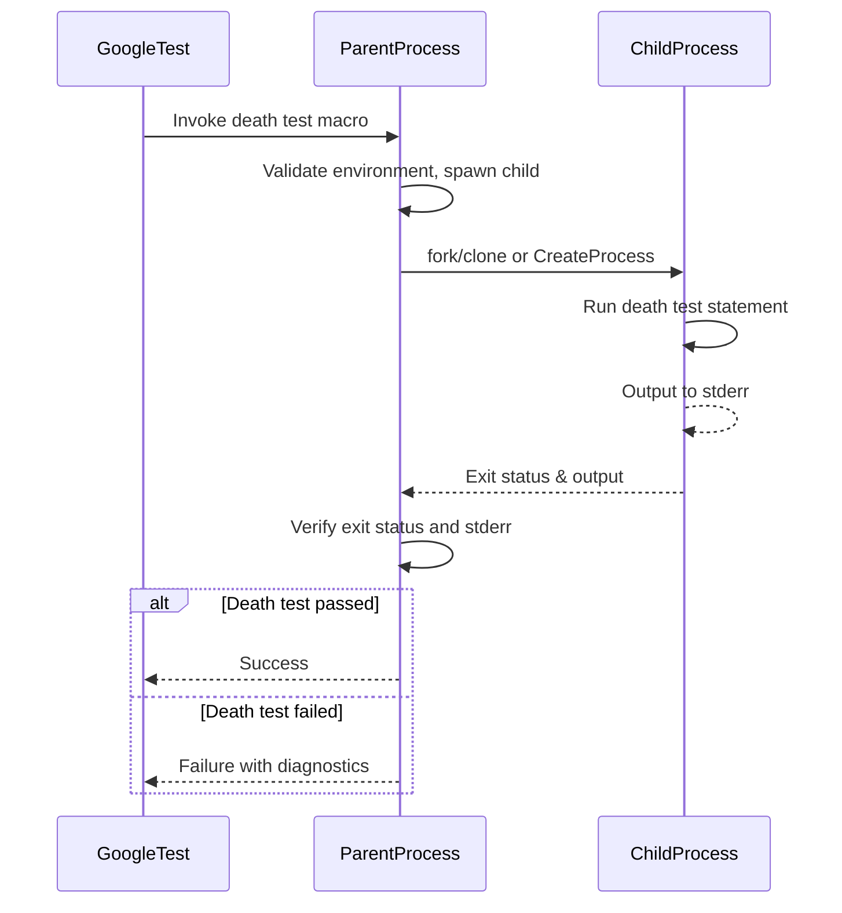

# Death Tests

Comprehensive guide to writing and verifying death tests—tests that confirm code fails or terminates under controlled conditions. Includes API reference and best practices.

---

## Overview

Death tests confirm that a specific piece of code causes your program to terminate or fail as expected. They are essential for verifying critical consistency checks, assertions, or failure modes that *must* halt execution immediately to avoid corrupting program state.

Unlike ordinary tests, death tests spawn a child process in which the statement under test executes. The test then verifies if this child exited (or was killed) in a manner matching the test expectations, including matching the expected error message output.

Death tests are vital when your code contains assertions or fatal failure mechanisms and you want to ensure these conditions actually result in immediate termination.

---

## Writing Death Tests

GoogleTest provides specialized macros to write death tests within your test functions:

- `EXPECT_DEATH(statement, matcher)`
- `ASSERT_DEATH(statement, matcher)`
- `EXPECT_EXIT(statement, predicate, matcher)`
- `ASSERT_EXIT(statement, predicate, matcher)`
- Variants like `EXPECT_DEATH_IF_SUPPORTED` and `EXPECT_DEBUG_DEATH` (debug-only death checks)

### How Death Test Macros Work

When you invoke a death test macro:

1. The test framework forks/clones a child process (or creates a new process on Windows).
2. The child runs the statement provided.
3. The framework waits for the child to terminate.
4. The framework checks:
   - Did the child process exit or get killed as expected?
   - Did the child's `stderr` output match the expected regular expression or matcher?

If the child didn't die, exited with an unexpected code, or did not output the expected error message, the death test fails.

### Basic Examples

```cpp
// Checks that calling Foo(42) causes the process to abort with message matching "Fatal error"
EXPECT_DEATH(Foo(42), "Fatal error");

// Checks that NormalExit() exits with status 0 and outputs "Success" to stderr
EXPECT_EXIT(NormalExit(), ::testing::ExitedWithCode(0), "Success");

// Checks that KillProcess kills the process with signal SIGKILL and outputs a message
EXPECT_EXIT(KillProcess(), ::testing::KilledBySignal(SIGKILL), "unblockable signal");
```

### Matcher Parameter

The second argument to death test macros is either a matcher (from GoogleTest/GoogleMock) or a regular expression string that matches the child's stderr output. When a bare string is provided, it is interpreted as a regular expression matching substring (i.e., `ContainsRegex`).

Supported regex syntax varies by platform:

- On POSIX systems, POSIX extended regular expressions are used.
- On Windows and other systems, a simplified regex syntax is supported (supports literals, '.', '?', '*', '+', '^', '$' and escape sequences, but not grouping or alternation).

### Important Considerations

- Side effects within death test statements only affect the child process and do not impact the parent.
- Avoid multiple death tests on the same source code line (causes compile errors).
- Death tests should not invoke any code that returns from the death test statement or throws exceptions; doing so causes failures.
- The code under death test runs in a separate process, so shared global state changes are not visible outside the death test.

---

## Death Test Styles

GoogleTest supports two styles of running death tests, controlled by the `--gtest_death_test_style` flag or `GTEST_FLAG_SET(death_test_style, ...)`:

### Fast Style (default on some platforms)

- The child process is forked and executes the death test statement immediately.
- Faster, but less safe in multi-threaded environments.
- Appropriate when your program only has one thread active during death tests.

### Threadsafe Style

- The child process is forked (or new process is launched) but then re-executes the test binary with flags to run only the current death test.
- Safer and more robust in multi-threaded environments.
- Useful when threads cannot be easily stopped before death tests.

You can set the style programmatically or via the command line. For example:

```cpp
GTEST_FLAG_SET(death_test_style, "threadsafe");
```

---

## Death Test Predicates

GoogleTest provides useful predicates to verify the _exit status_ of the death test child process when using `EXPECT_EXIT`/`ASSERT_EXIT`:

- `::testing::ExitedWithCode(exit_code)`: verifies the child exited normally with the specified exit code.
- `::testing::KilledBySignal(signal_number)`: verifies the child was killed by the given signal (not supported on Windows).

Example:

```cpp
EXPECT_EXIT(Foo(), ::testing::ExitedWithCode(0), "Success");
EXPECT_EXIT(RaiseSegfault(), ::testing::KilledBySignal(SIGSEGV), "Segfault");
```

For `EXPECT_DEATH` and `ASSERT_DEATH`, the child's exit status must be non-zero (unsuccessful).

---

## Advanced Usage and Notes

### Compound Statements

You can wrap multiple statements inside braces `{ ... }` as the statement argument.

```cpp
EXPECT_DEATH({ SetupCrash(); CrashNow(); }, "Crash message");
```

### Avoiding Side Effects

Death tests execute the statement in a separate process; side effects (e.g., memory allocations, global variables) are discarded when the child exits.

### Threading Warnings

GoogleTest issues warnings if it detects multiple active threads when running death tests, due to the dangers of forking in multi-threaded contexts.

### Simulator and Debugger Notes

`EXPECT_DEBUG_DEATH` runs the death test in debug builds and executes the statement normally in release builds.

---

## Common Pitfalls

- **Multiple death tests on the same line**: Causes compilation errors. Always place death tests on unique lines.
- **Return or throwing exceptions in death test statement**: Causes death test failure.
- **Expecting mocks to be cleaned up on exit**: Mock objects leaked during death tests must be explicitly allowed using `Mock::AllowLeak()`.
- **Regular expression incompatibilities**: Use only supported regex syntax.

---

## API Reference

### Death Test Macros

| Macro                        | Description                                                   |
|------------------------------|---------------------------------------------------------------|
| `EXPECT_DEATH(stmt, regex)`   | Expects `stmt` to cause process death and `stderr` to match regex. Nonfatal failure if test fails. |
| `ASSERT_DEATH(stmt, regex)`   | Same as `EXPECT_DEATH`, but aborts current function on failure (fatal failure). |
| `EXPECT_EXIT(stmt, pred, regex)` | Expects `stmt` to cause process death with exit status matching `pred` and `stderr` matching regex. |
| `ASSERT_EXIT(stmt, pred, regex)` | Fatal variant of `EXPECT_EXIT`. |
| `EXPECT_DEATH_IF_SUPPORTED` / `ASSERT_DEATH_IF_SUPPORTED` | Conditional macros that run death tests only if platform supports them. |
| `EXPECT_DEBUG_DEATH` / `ASSERT_DEBUG_DEATH` | Death tests executed only in debug builds; run statement normally in release.

### Predicates

- `ExitedWithCode(int exit_code)`
- `KilledBySignal(int signal)` (POSIX only)

### Example Usage

```cpp
TEST(MyDeathTest, DeathOnInvalidInput) {
  ASSERT_DEATH(Process(-1), "Invalid input");
}

TEST(MyDeathTest, ExitWithZeroOnCleanup) {
  EXPECT_EXIT(CleanUp(), testing::ExitedWithCode(0), "Cleaning completed");
}
```

---

## Best Practices

- Name test suites containing death tests with a suffix `DeathTest` for clarity and to enable ordering.
- Use `ASSERT_DEATH` when subsequent code depends on death test success.
- Surround complex statements in braces `{}` in death tests to group operations.
- Beware of multi-threading; prefer the "threadsafe" death test style.
- Leverage `EXPECT_DEATH_IF_SUPPORTED` to gracefully handle platforms without death test support.

---

## Troubleshooting

### Death Test Fails to Detect Expected Crash

- Check that your test statement really aborts or exits with a failure code.
- Ensure the death test regex matches the error output; check supported regex syntax.
- Confirm only one death test macro invocation per line.

### Compilation Errors with Multiple Death Tests on Same Line

- Move each death test macro to its own unique source line.

### Side Effects Not Visible

Remember that death tests run in a separate process; memory changes or state modifications are discarded afterward.

### Mock Objects Leaked

Use `Mock::AllowLeak()` for mock objects created during death tests to prevent false leak reports.

---

## Related Documentation

- [Assertions Reference](reference/assertions.md#death)
- [Writing Effective Assertions](guides/core-testing-workflows/writing-effective-assertions)
- [Death Tests Concept Overview](concepts/scalability-and-advanced-testing/death-tests-concept)
- [Advanced Topics on Death Tests](docs/advanced.md#death-tests)

---

## Diagram: Death Test Execution Flow


