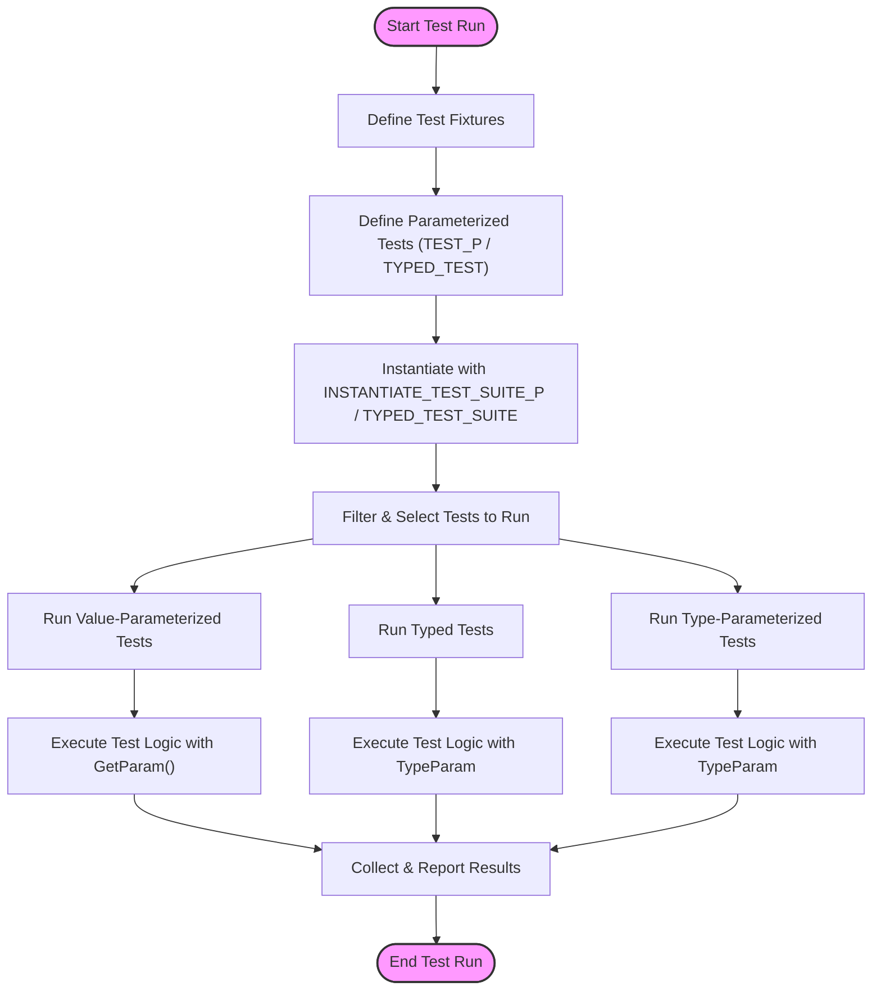

# Parameterized & Type-Parameterized Tests

This page details the APIs and usage patterns for parameterized and type-parameterized tests in GoogleTest. It helps you apply the same test logic over different sets of input data or types, enabling data-driven and type-driven testing with minimal duplication of code. You will learn how to write and instantiate these tests, customize test names, and understand extension points.

---

## Value-Parameterized Tests

Value-parameterized tests let you run the same test logic multiple times with different values as parameters. This is ideal when you want to validate your code against a variety of data inputs without rewriting the test.

### Defining Value-Parameterized Tests

1. **Create a Test Fixture** that inherits from `::testing::TestWithParam<T>`, where `T` is the parameter type.

```cpp
class MyParamTest : public ::testing::TestWithParam<int> {};
```

2. **Define tests** using the macro `TEST_P` instead of `TEST` or `TEST_F`. Within the test body, use `GetParam()` to access the parameter.

```cpp
TEST_P(MyParamTest, IsEven) {
  int x = GetParam();
  EXPECT_EQ(x % 2, 0);
}
```

3. **Instantiate the test suite** with various parameter values using `INSTANTIATE_TEST_SUITE_P` and one of GoogleTest's parameter generators such as `Values()`, `Range()`, or `Combine()`.

```cpp
INSTANTIATE_TEST_SUITE_P(EvenNumbers, MyParamTest, ::testing::Values(2, 4, 6));
```

This will run the test `IsEven` three times with parameters `2`, `4`, and `6`.

### Parameter Generators

GoogleTest supports several built-in parameter generators:

| Generator                              | Description                                                      |
|--------------------------------------|------------------------------------------------------------------|
| `Range(begin, end [, step])`          | Generates a sequence from `begin` to `end - 1` stepping by `step` (default 1). |
| `Values(v1, v2, ..., vN)`             | Generates exact values `v1` through `vN`.                         |
| `ValuesIn(container)`                  | Generates values from any STL container, C-style array or iterator range. |
| `Bool()`                             | Generates the boolean values `false` and `true`.                 |
| `Combine(g1, g2, ..., gN)`            | Cartesian product of test parameters from multiple generators, yielding tuples. |
| `ConvertGenerator<T>(g)`              | Converts the values produced by generator `g` to type `T`. Can be used with a callable to customize conversion. |

### Customizing Test Names

By default, test names for parameterized tests include the instantiation prefix, suite name, test name, and a numeric parameter index. You can generate meaningful names with an optional *name generator* function or functor passed as the fourth argument to `INSTANTIATE_TEST_SUITE_P`.

```cpp
INSTANTIATE_TEST_SUITE_P(
    CustomNames, MyParamTest, ::testing::Values(1, 2, 3),
    [](const ::testing::TestParamInfo<int>& info) {
      return "Param_" + std::to_string(info.param);
    });
```

Names must be unique, non-empty, and can only contain alphanumeric characters.

### Defining Abstract Parameterized Tests

If you want to define parameterized tests that will be instantiated multiple times or across source files, define your fixture and `TEST_P` in a header/source file pair and let users instantiate using `INSTANTIATE_TEST_SUITE_P` later.

This design helps test common interfaces or implementations without repeating test logic.

---

## Typed Tests

Typed tests let you run the same test logic over multiple types. This is suitable for cases where you want to ensure various implementations or type specializations behave consistently.

### Defining Typed Tests

1. **Create a class template fixture inheriting from `::testing::Test`.**

```cpp
template <typename T>
class FooTest : public ::testing::Test {
 public:
  T value_{};
  static T shared_;
};
```

2. **Define a type list alias using `::testing::Types`.**

```cpp
using MyTypes = ::testing::Types<int, double, std::string>;
```

3. **Use `TYPED_TEST_SUITE` to associate the fixture and the type list.**

```cpp
TYPED_TEST_SUITE(FooTest, MyTypes);
```

4. **Write tests using `TYPED_TEST`. Use `TypeParam` to refer to the current type parameter, and `TestFixture` to refer to the fixture.**

```cpp
TYPED_TEST(FooTest, IsDefaultConstructible) {
  TypeParam val = this->value_;
  EXPECT_TRUE(true);  // Your test logic here
}
```

Each `TYPED_TEST` will be instantiated and run for every type in `MyTypes`.

### Custom Type Names

You can define a `NameGenerator` class with a template static function `GetName(int index)` returning a `std::string`. Provide it as an optional third argument to `TYPED_TEST_SUITE` to customize type-based test suffixes.

Example:

```cpp
class MyTypeNames {
 public:
  template <typename T>
  static std::string GetName(int) {
    if constexpr (std::is_same_v<T, int>) return "Int";
    if constexpr (std::is_same_v<T, double>) return "Double";
    return "Unknown";
  }
};

TYPED_TEST_SUITE(FooTest, MyTypes, MyTypeNames);
```

---

## Type-Parameterized Tests

Type-parameterized tests are similar to typed tests but with more flexibility: you define the tests without knowing the list of types beforehand and instantiate them multiple times in different places if needed. This is useful for interface or concept testing.

### Defining Type-Parameterized Tests

1. **Define a class template fixture inheriting from `::testing::Test`.**

```cpp
template <typename T>
class MyTypeParamTest : public ::testing::Test {};
```

2. **Declare the test suite name as type-parameterized using `TYPED_TEST_SUITE_P`.**

```cpp
TYPED_TEST_SUITE_P(MyTypeParamTest);
```

3. **Define tests using `TYPED_TEST_P`, same as typed tests but for the pattern.**

```cpp
TYPED_TEST_P(MyTypeParamTest, DoesSomething) {
  TypeParam val{};
  EXPECT_TRUE(true);  // Your test code
}
```

4. **Register the tests in the suite using `REGISTER_TYPED_TEST_SUITE_P`.**

```cpp
REGISTER_TYPED_TEST_SUITE_P(MyTypeParamTest, DoesSomething);
```

5. **Instantiate the test suite with a list of types using `INSTANTIATE_TYPED_TEST_SUITE_P`.**

```cpp
using MyTypes = ::testing::Types<int, double>;
INSTANTIATE_TYPED_TEST_SUITE_P(MyInstance, MyTypeParamTest, MyTypes);
```

You can instantiate multiple times with different type lists and prefixes.

### Custom Name Generation

Like typed tests, you can provide a name generator as the optional fourth argument in `INSTANTIATE_TYPED_TEST_SUITE_P`.

### Notes

- Type-parameterized test suites can be defined and instantiated across multiple translation units.
- You must register all tests before instantiating.

---

## Best Practices & Common Pitfalls

- **Always give meaningful names** to your parameterized and typed test instantiations to keep outputs readable and manageable.
- **Avoid underscores in test and suite names** as they may interfere with test class naming conventions.
- **Declare `SetUpTestSuite()` and `TearDownTestSuite()` as `public` when used with `TEST_P` to avoid linkage and instantiation issues.**
- **Use `GetParam()` only inside tests defined by `TEST_P`.**
- **Parameterized tests create a fresh instance for each parameter**, so do not attempt cross-parameter data sharing unless static.
- **Typed and type-parameterized tests give type info in their names**, which helps identify which type caused a failure.

---

## Examples

### Value-Parameterized Test Example

```cpp
class IntParamTest : public ::testing::TestWithParam<int> {};

TEST_P(IntParamTest, IsPositive) {
  EXPECT_GT(GetParam(), 0);
}

INSTANTIATE_TEST_SUITE_P(
    PositiveValues, IntParamTest, ::testing::Values(1, 2, 3, 10));
```

This runs the `IsPositive` test 4 times, each with values 1, 2, 3, and 10.

### Typed Test Example

```cpp
template <typename T>
class MyTypedTest : public ::testing::Test {
 public:
  T value = 0;
};

using MyTypes = ::testing::Types<int, double, float>;
TYPED_TEST_SUITE(MyTypedTest, MyTypes);

TYPED_TEST(MyTypedTest, IsZeroInitially) {
  TypeParam x = this->value;
  EXPECT_EQ(x, 0);
}
```

### Type-Parameterized Test Example

```cpp
template <typename T>
class MyTypeParamTest : public ::testing::Test {};

TYPED_TEST_SUITE_P(MyTypeParamTest);

TYPED_TEST_P(MyTypeParamTest, IsDefaultConstructible) {
  TypeParam x{};
  (void)x;
  SUCCEED();
}

REGISTER_TYPED_TEST_SUITE_P(MyTypeParamTest, IsDefaultConstructible);

using TypesToTest = ::testing::Types<int, std::string>;
INSTANTIATE_TYPED_TEST_SUITE_P(MyInstance, MyTypeParamTest, TypesToTest);
```

---

## Troubleshooting

- If your parameterized tests don’t run, verify you have paired `TEST_P` with `INSTANTIATE_TEST_SUITE_P`.
- If your typed or type-parameterized tests show duplicate test suite names or fail to compile, ensure test suite names and type names don’t contain underscores.
- Custom test name generators must return valid, unique, and non-empty test suffixes.
- When using `ConvertGenerator`, be careful with lifetime issues (especially with string types and implicit conversions).
- Remember to declare `SetUpTestSuite()` and `TearDownTestSuite()` as `public` in parameterized fixtures.

---

## Related APIs

For more detail on APIs and usage, see [Testing Reference](../reference/testing.md#TEST_P), [Typed Tests](../advanced.md#typed-tests), and [Value-Parameterized Tests](../advanced.md#value-parameterized-tests).

---

## Mermaid Diagram: Test Flow for Parameterized and Typed Tests



---

## References
- [Value-Parameterized Tests](../advanced.md#value-parameterized-tests)
- [Typed Tests](../advanced.md#typed-tests)
- [Type-Parameterized Tests](../advanced.md#type-parameterized-tests)
- [Parameterized & Typed Tests in Testing Reference](../reference/testing.md#TEST_P)
- [GoogleTest Primer](../primer.md)

---

For comprehensive guides on test writing and mocking, see the Getting Started section and guides on mocking at:
- [Writing Your First Test](../../guides/getting-started/writing-first-test)
- [Using GoogleMock Basics](../../getting_started/first_test_and_validation/using_googlemock_basics)

Next steps: explore [Mocking Patterns](../../guides/core-workflows/mocking-patterns) and [Test Lifecycle & Execution](../../api-reference/core-testing-api/test-lifecycle-and-execution) for deeper mastery.
