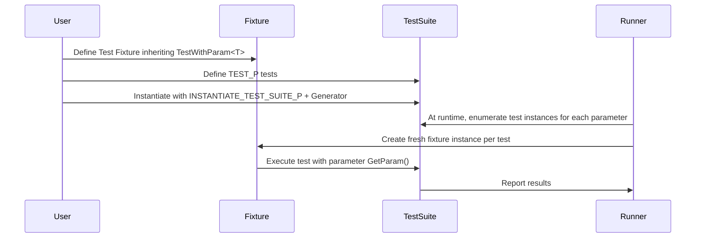

# Value- and Type-Parameterized Tests

GoogleTest empowers you to write tests that run repeatedly over varying data inputs and type parameters, enabling robust, maintainable, and scalable testing workflows. Whether you want to verify your code’s behavior across multiple values or across a range of types, these parameterized testing patterns allow you to write your test logic once and execute it many times with variations automatically.

---

## 1. Value-Parameterized Tests

Value-parameterized tests let you run the same test logic against a series of data values, improving test coverage while reducing code duplication.

### 1.1 Defining Parameterized Fixtures

To create a value-parameterized test you must:

- Define a fixture class deriving from `::testing::TestWithParam<T>`, where `T` is the parameter type.

```cpp
class MyParamTest : public ::testing::TestWithParam<int> {
  // Custom setup or helpers as needed
};
```
  
This fixture behaves like a regular test class but provides access to a test parameter via the `GetParam()` method.

### 1.2 Writing Parameterized Tests with `TEST_P`

Define individual parameterized tests with the macro `TEST_P(FixtureName, TestName)`:

```cpp
TEST_P(MyParamTest, HandlesValueCorrectly) {
  int value = GetParam();
  EXPECT_TRUE(MyFunction(value));
}
```

Inside the test body, retrieve the current parameter with `GetParam()`.

### 1.3 Instantiating Parameterized Test Suites

To run your parameterized tests with specific values, instantiate the test suite using macros and generators:

```cpp
INSTANTIATE_TEST_SUITE_P(
    Integers, MyParamTest,
    ::testing::Values(1, 2, 3, 42));
```

- The first argument is the instantiation name, used as a prefix in test reporting.
- The second is the test fixture.
- The third is a **parameter generator**, such as:
  - `Values(v1, v2, ..., vN)`: explicit values
  - `Range(start, end [, step])`: number sequences
  - `ValuesIn(container)`: values from collections
  - `Bool()`: boolean sequence `{false, true}`
  - `Combine(g1, g2, ..., gN)`: Cartesian product of generators

#### Example: Combining Generators

You can test all combinations of parameters easily:

```cpp
INSTANTIATE_TEST_SUITE_P(
    FlagTests, MyFlagTest,
    ::testing::Combine(::testing::Bool(), ::testing::Values(0, 1, 2)));
```

Here the test runs for all `bool x int` pairs.

### 1.4 Customizing Parameter Names

To generate human-readable test names based on parameters, provide a **name generator** function or functor as an optional last argument:

```cpp
INSTANTIATE_TEST_SUITE_P(
    CustomNames, MyParamTest,
    ::testing::Values("small", "medium", "large"),
    [](const testing::TestParamInfo<MyParamTest::ParamType>& info) {
      // Return a valid test suffix string
      return "Size_" + info.param;
    });
```

The returned names must include only alphanumeric characters and underscores.

### 1.5 Accessing Parameter Information

Within your tests, refer to the parameter using `GetParam()`. For example:

```cpp
TEST_P(MyParamTest, CheckParameter) {
  auto param = GetParam();
  // ... test with param ...
}
```

### 1.6 Allowing Uninstantiated Tests

By default, failing instantiations are detected. If a parameterized test suite is not instantiated, use:

```cpp
GTEST_ALLOW_UNINSTANTIATED_PARAMETERIZED_TEST(MyParamTest);
```

This avoids compiler or runtime errors if instantiation is intentionally omitted.

---

## 2. Typed Tests

Typed tests run the same test logic against different **types** rather than data values. This is useful for testing templated code or type-dependent behavior.

### 2.1 Defining Typed Test Suites

Define a class template derived from `testing::Test` with a type parameter:

```cpp
template <typename T>
class MyTypedTest : public ::testing::Test {
 public:
  T value;
};
```

Specify the list of types to test with a type list:

```cpp
using MyTypes = ::testing::Types<int, double, std::string>;
TYPED_TEST_SUITE(MyTypedTest, MyTypes);
```

### 2.2 Writing Typed Tests with `TYPED_TEST`

Define tests using `TYPED_TEST(FixtureName, TestName)`:

```cpp
TYPED_TEST(MyTypedTest, IsDefaultConstructible) {
  TypeParam value = this->value;  // Use TypeParam for the current type
  EXPECT_NO_THROW(TypeParam());
}
```

- `TypeParam` refers to the current testing type.
- Use `TestFixture::` or `this->` to access fixture members or typedefs.

### 2.3 Type Name Customization

Optionally provide a name generator class that maps types to strings for better test reporting:

```cpp
class TypeNames {
 public:
  template <typename T>
  static std::string GetName(int) {
    if constexpr (std::is_same_v<T, int>) return "Int";
    if constexpr (std::is_same_v<T, double>) return "Double";
    if constexpr (std::is_same_v<T, std::string>) return "String";
  }
};

TYPED_TEST_SUITE(MyTypedTest, MyTypes, TypeNames);
```

---

## 3. Type-Parameterized Tests

Type-parameterized tests provide an advanced pattern where tests are defined without knowing the specific types in advance. They enable reusable, abstract test definitions instantiable with arbitrary type lists.

### 3.1 Defining Type-Parameterized Test Suites

Define your fixture as a template and declare it with `TYPED_TEST_SUITE_P`:

```cpp
template <typename T>
class MyTypeParamTest : public ::testing::Test {};

TYPED_TEST_SUITE_P(MyTypeParamTest);
```

### 3.2 Defining Test Patterns

Define test patterns with `TYPED_TEST_P`:

```cpp
TYPED_TEST_P(MyTypeParamTest, DoesSomething) {
  TypeParam value{};
  EXPECT_TRUE(Foo(value));
}

TYPED_TEST_P(MyTypeParamTest, CanDoAnotherThing) {
  TypeParam value{};
  EXPECT_NO_THROW(Bar(value));
}
```

### 3.3 Registering Tests

After defining tests, register their names:

```cpp
REGISTER_TYPED_TEST_SUITE_P(MyTypeParamTest, DoesSomething, CanDoAnotherThing);
```

### 3.4 Instantiating Test Suites

Instantiate the suite for various types using `INSTANTIATE_TYPED_TEST_SUITE_P`:

```cpp
using MyTypes = ::testing::Types<int, double>;
INSTANTIATE_TYPED_TEST_SUITE_P(MyInstance, MyTypeParamTest, MyTypes);
```

- `MyInstance` prefixes the test suite names for differentiation.

---

## 4. Parameter Generators

GoogleTest provides several built-in generators to create parameter sequences efficiently:

| Generator Function         | Description                                                                                      |
|----------------------------|------------------------------------------------------------------------------------------------|
| `Range(begin, end [, step])` | Produces sequential values `[begin, begin+step, …)` excluding `end`                              |
| `Values(v1, v2, ..., vN)`  | Produces the explicitly listed values                                                           |
| `ValuesIn(container)`       | Yields elements from arrays, STL containers, or iterator ranges                                 |
| `Bool()`                   | Produces `{false, true}` for boolean testing                                                    |
| `Combine(g1, g2, ..., gN)` | Produces tuples representing the Cartesian product of all input generator values                |
| `ConvertGenerator<T>(g)`   | Converts generator values to type `T`, optionally using a conversion function                   |

Generators can be combined in powerful ways to cover a rich test space.

### Example: Using Combine and ConvertGenerator

```cpp
INSTANTIATE_TEST_SUITE_P(
    ComplexTests, MyParamTest,
    ConvertGenerator<ParamType>(
        Combine(Values(1, 2), Bool()),
        [](const std::tuple<int, bool>& val) {
          return ParamType(std::get<0>(val), std::get<1>(val));
        }));
```

---

## 5. Practical Tips and Best Practices

- **Avoid underscores in test suite and test names.** This prevents internal naming collisions ([More info](../faq.md#why-should-test-suite-names-and-test-names-not-contain-underscore)).
- **Use clear, distinct instantiation names** for better test filtering and reporting.
- **When creating typed tests, ensure your type list is meaningful** and covers all relevant cases.
- **Provide custom name generators** to improve readability of parameterized test outputs.
- **Use `GTEST_ALLOW_UNINSTANTIATED_PARAMETERIZED_TEST`** when tests are intentionally not instantiated.
- **Use `ConvertGenerator`** to adapt generated types to complex parameter structures.
- **Keep your parameter types copyable** as GoogleTest requires.

---

## 6. Common Pitfalls and Troubleshooting

- Tests may fail to run if suite and fixture names mismatch or have underscores.
- Not instantiating parameterized test suites leads to all tests being skipped or errors.
- Naming collisions can arise if multiple types or test parameters generate identical test names.
- Dangling references in generator lambdas can cause subtle runtime issues; specifying types explicitly can prevent this.
- For value-parameterized tests, make sure parameters are valid and properly copyable.

---

## 7. Summary Diagram: Parameterized Test Flow



---

## 8. References and Further Reading

- [GoogleTest Testing Reference](docs/reference/testing.md#INSTANTIATE_TEST_SUITE_P)
- [google/googletest GitHub Repository](https://github.com/google/googletest)
- [GoogleTest FAQ on Parameterized Tests](docs/faq.md#my-death-test-modifies-some-state-but-the-change-seems-lost-after-the-death-test-finishes-why)
- Guides: [Parameterized and Typed Tests](../guides/core-testing-workflows/parameterized-and-typed-tests.md)

---

This comprehensive reference arms you with everything you need to design and execute both value-driven and type-driven testing scenarios efficiently with GoogleTest.